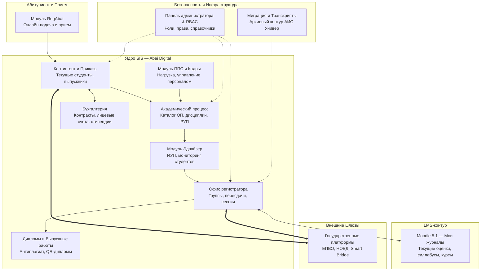

# Архитектурный паспорт: Интегрированная автоматизированная система «Цифровая платформа Abai Digital»

> **Правовой статус и основание:**  
> Разработано в соответствии с государственным стандартом **СТ РК 34.015-2002** «Информационная технология. Комплекс стандартов на автоматизированные системы. Техническое задание на создание автоматизированной системы».  
> Утверждено Ректором-Председателем Правления НАО «Казахский национальный педагогический университет имени Абая» Тлеп Б. А. для прохождения испытаний и аттестации в **АО «Государственная техническая служба» (ГТС)** в соответствии с ЕТИКТ и ИБ (ПП РК № 832) и Приказом МЦРИАП РК № 153/НҚ.

---

## 1. Назначение и концепция платформы

**Интегрированная автоматизированная система «Цифровая платформа Abai Digital»** (условное обозначение — **Abai Digital**) является ключевой корпоративной студенческой информационной системой (Student Information System, SIS) и средой управления академическим процессом Университета. 

Платформа разработана как импортонезависимое решение собственной университетской разработки, полностью заменившее устаревшую платформу предыдущего поколения (АИС «Универ»).

### Ключевые цели создания Abai Digital:
1. **Сквозная цифровизация жизненного цикла обучающегося:** от подачи онлайн-заявления абитуриента в модуле **RegAbai** до выдачи диплома государственного образца с QR-верификацией.
2. **Бесшовная интеграция с LMS Moodle 5.1:** объединение административных функций Офиса регистратора с современной средой дистанционного и смешанного обучения.
3. **Соответствие требованиям кибербезопасности и ЕТИКТ:** аттестация архитектуры в АО «ГТС» и реализация строгой ролевой модели разграничения доступа (RBAC).
4. **Автоматическая синхронизация с государственными платформами:** шлюз интеграции с ИС ЕПВО и НОБД Министерства науки и высшего образования РК.

---

## 2. Модульная архитектура платформы (22 функциональные подсистемы)

Комплекс технической документации Abai Digital включает 22 детально регламентированных модуля с описанием бизнес-логики, экранных форм, API-эндпоинтов и структур баз данных:

---

### Детальная спецификация ключевых подсистем

#### 1. Модуль «RegAbai» (Приемная кампания)
- **Назначение:** Личный кабинет абитуриента, онлайн-подача документов, верификация сертификатов ЕНТ, автоматизированное распределение грантов и формирование договоров на платное обучение.
- **Взаимодействие:** Автоматическая передача данных поступивших в подсистему «Контингент — Текущие студенты».

#### 2. Подсистема «Академический процесс» (`АД.ТЗ.ACADEMIC-01`)
- **Назначение:** Ведение каталога образовательных программ (ОП) бакалавриата, магистратуры и докторантуры; формирование каталогов дисциплин (КЭД), рабочих учебных планов (РУП) и академического календаря.
- **Экранные формы и API:** Управление циклами дисциплин (ООД, БД, ПД), пререквизитами и постреквизитами, ECTS-трудоемкостью.

#### 3. Модуль «Эдвайзер» (`АД.ТЗ.ADVISER-01`)
- **Назначение:** Рабочее место академического консультанта (эдвайзера).
- **Функционал:** Согласование индивидуальных учебных планов (ИУП) студентов, контроль академической задолженности, мониторинг успеваемости курируемых групп, формирование направлений на пересдачи и летний семестр.

#### 4. Подсистема «Офис регистратора»
- **Комплекс модулей:**
  - *Группы студентов:* Формирование академических потоков и групп.
  - *Назначение ППС:* Закрепление преподавателей за дисциплинами и потоками в соответствии с утвержденной педнагрузкой.
  - *Итоговая аттестация и экзамены:* Формирование расписания сессий, электронных ведомостей и протоколов ГАК.
  - *Пересдачи и ликвидация задолженностей:* Оформление допусков на повторное прохождение дисциплин (Retake) и FX-пересдачи.
  - *Практика:* Учет распределения студентов по базам практик (школы, гимназии, лицеи) и регистрация отчетности.
  - *Летний семестр:* Сбор заявок обучающихся, расчет калькуляции кредитов и формирование групп летней школы.

#### 5. LMS-компонент: Развертывание и интеграция Moodle 5.1 (`АД.ТЗ.MOODLE-01`)
- **Назначение:** Ведение электронного журнала успеваемости, размещение цифровых силлабусов и учебно-методических комплексов дисциплин (УМКД), проведение онлайн-тестирований.
- **Архитектурная связь с SIS:** Единая точка входа (SSO) через корпоративную учетную запись; расписание и контингент групп синхронизируются из Abai Digital, а текущие и рубежные баллы (Р1, Р2) транслируются обратно в сводную экзаменационную ведомость Abai Digital.

#### 6. Подсистемы «Контингент», «Приказы» и «Бухгалтерия»
- **Контингент:** Учет движения обучающихся (зачисление, перевод, восстановление, отчисление, академический отпуск).
- **Бизнес-логика видов приказов:** Электронный конструктор и автоматическое проведение приказов по контингенту с мгновенным изменением академического и финансового статуса студента.
- **Бухгалтерия:** Персональные лицевые счета, интеграция с банковскими шлюзами (Kaspi, Halyk) для приема оплаты, контроль задолженностей и списки на выплату государственных стипендий по Приказу № 116.

#### 7. Выпускные работы, Антиплагиат и Дипломы
- **Выпускные квалификационные работы:** Загрузка текстов дипломных работ и магистерских диссертаций, обязательная автоматическая проверка на заимствования через API сервиса Антиплагиат.
- **Дипломы:** Автоматическая генерация уникальных серий и номеров дипломов государственного образца, нанесение защитных QR-кодов для мгновенной верификации подлинности и выгрузка в ЕПВО МНВО РК.

#### 8. Администрирование, безопасность (RBAC) и архивный контур
- **Ролевая модель доступа (RBAC):** Гранулярное разграничение прав (студент, эдвайзер, преподаватель, заведующий кафедрой, декан, сотрудник Офиса регистратора, бухгалтер, системный администратор, офицер по безопасности).
- **Аудит безопасности:** Ведение журнала событий (кто, когда и какие персональные данные просматривал/изменял) в соответствии с Приказом МЦРИАП № 396/НҚ.
- **Модули «Миграция» и «Транскрипты Универ»:** Выгрузка, трансформация и архивное хранение исторических данных контингента и архивных транскриптов выпускников прошлых лет из унаследованной АИС «Универ».

---

## 3. Матрица связей платформы Abai Digital с внутренними нормативными актами (ВНД)

| Модуль Abai Digital | Регулирующий внутренний акт Университета | Ответственное подразделение / должность |
| :--- | :--- | :--- |
| **ACADEMIC-01**, **ADVISER-01** | Академическая политика Университета, СОП формирования ИУП | Департамент по академическим вопросам (ДАВ), эдвайзеры |
| **Офис регистратора** (все блоки) | Положение об Офисе регистратора (`registrar_regulation.md`) | Руководитель Офиса регистратора, регистраторы |
| **Moodle 5.1 (Журналы, УМКД)** | Должностная инструкция ППС (`jd_faculty_model.md`), СОП ДО | Профессорско-преподавательский состав (ППС), кафедры |
| **RegAbai** | Положение о Приемной комиссии, Правила приема | Ответственный секретарь Приемной комиссии |
| **Выпускные работы / Антиплагиат** | Регламент проверки на заимствования, Академическая честность | Заведующие кафедрами, Комиссия по акад. честности |
| **Дипломы (QR-генерация)** | Инструкция по выдаче документов строгой отчетности | Офис регистратора, архив |
| **RBAC, Администрирование, ГТС** | Положение о Департаменте цифровизации (`digitalization_department_regulation.md`), Политика ИБ | Руководитель Управления цифровизации, DPO, инженер ИБ |
| **Интеграция с ЕПВО/НОБД** | СОП интеграции ИС с ЕПВО и НОБД (`sop_epvo_nobd_integration.md`) | Системный архитектор, администратор баз данных |

---

## 4. Требования к аттестации и информационной безопасности (ГТС / МЦРИАП)

В рамках прохождения обязательной аттестации АО «ГТС» в соответствии с Приказом МЦРИАП РК № 153/НҚ и ЕТИКТ и ИБ:
1. Исходный код и архитектурная документация платформы Abai Digital передаются на статический и динамический анализ защищенности (SAST/DAST).
2. Базы данных платформы размещаются в изолированном серверном контуре Университета с реализацией многофакторной аутентификации (2FA) для административных пользователей.
3. Процедуры обработки персональных данных обучающихся внутри платформы строго соответствуют **СОП «Сбор, обработка, хранение и защита персональных данных»** (`sop_personal_data_protection.md`).
