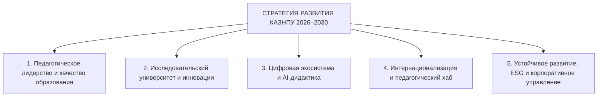
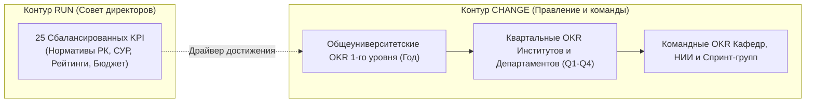

# АРХИТЕКТУРНЫЙ ПАСПОРТ: СТРАТЕГИЯ РАЗВИТИЯ НАО «КАЗНПУ ИМЕНИ АБАЯ» (2026–2030 гг.)
## Модель стратегических направлений, системы сбалансированных KPI и каскадирования целей

---

### 1. СТРАТЕГИЧЕСКИЙ ПРОФИЛЬ УНИВЕРСИТЕТА

```text
┌────────────────────────────────────────────────────────────────────────────────────────┐
│                                 МИССИЯ УНИВЕРСИТЕТА                                    │
│   Формирование педагогов-исследователей нового поколения, создание опережающих знаний │
│   и развитие доказательной педагогики для устойчивого социально-гуманитарного прогресса│
└────────────────────────────────────────────────────────────────────────────────────────┘
                                           │
                                           ▼
┌────────────────────────────────────────────────────────────────────────────────────────┐
│                                  ВИДЕНИЕ 2030 ГОДА                                     │
│  Ведущий национальный педагогический исследовательский университет Центральной Азии,  │
│      входящий в Топ-400 QS World University Rankings, драйвер цифровой дидактики       │
│                            и этичного лидерства                                        │
└────────────────────────────────────────────────────────────────────────────────────────┘
```

---

### 2. ПЯТЬ СТРАТЕГИЧЕСКИХ НАПРАВЛЕНИЙ ТРАНСФОРМАЦИИ



#### Направление 1. Педагогическое лидерство и опережающая подготовка кадров:
- Модернизация 100% педагогических образовательных программ на основе профессионального стандарта «Педагог» и междисциплинарных микроквалификаций (Minor).
- Внедрение практико-ориентированной дуальной модели подготовки с обязательным педагогическим интернатом в базовых школах.
- Формирование надпрофессиональных навыков (Soft Skills, критическое мышление, эмоциональный интеллект, инклюзивные компетенции).

#### Направление 2. Исследовательский университет и доказательная педагогика:
- Трансформация традиционной модели вуза в исследовательский университет с приоритетом фундаментальных и прикладных исследований в области педагогических наук.
- Развитие научно-исследовательских институтов (НИИ), междисциплинарных лабораторий нейродидактики и когнитивных исследований.
- Коммерциализация педагогических стартапов, учебных тренажеров и методических продуктов через Офис коммерциализации.

#### Направление 3. Интеллектуальная цифровая экосистема и AI-дидактика:
- Развитие Цифровой платформы Abai Digital и LMS Moodle 5.1 как ядра гибридного образовательного процесса.
- Внедрение адаптивного обучения и генеративного ИИ в педагогический процесс с соблюдением этических рамок.
- 100% цифровизация студенческих сервисов, электронного документооборота и сквозной аналитики контингента.

#### Направление 4. Интернационализация и педагогический хаб Центральной Азии:
- Вхождение и закрепление в группе **Топ-400 мирового рейтинга QS WUR** и топ-100 по предметному рейтингу «Education & Training».
- Реализация совместных и двудипломных программ с ведущими мировыми педагогическими центрами.
- Привлечение зарубежных профессоров, постдокторантов и увеличение доли иностранных обучающихся.

#### Направление 5. Устойчивое развитие, ESG и эффективный менеджмент:
- Реализация принципов устойчивого развития (SDG 4 «Качественное образование», SDG 5 «Гендерное равенство», SDG 10 «Уменьшение неравенства»).
- Диверсификация источников доходов, развитие Фонда целевого капитала (Endowment Fund).
- Высокие стандарты корпоративной добропорядочности, антикоррупционного комплаенса и открытого управления (Shared Governance).

---

### 3. СБАЛАНСИРОВАННАЯ КАРТА 25 КЛЮЧЕВЫХ ПОКАЗАТЕЛЕЙ (KPI)

| № | Наименование показателя (KPI) | База (2025) | План 2028 | Цель 2030 | Ответственный проректор |
|:---|:---|:---:|:---:|:---:|:---|
| **D1.1** | Доля аккредитованных образовательных программ в международных агентствах | 78% | 90% | **100%** | Проректор по АД |
| **D1.2** | Уровень трудоустройства выпускников в первый год после окончания (ГЦВП) | 84% | 90% | **95%** | Проректор по АД |
| **D1.3** | Доля образовательных программ с дуальным / интернатным обучением | 25% | 50% | **70%** | Проректор по АД |
| **D1.4** | Доля выпускных работ, защищенных в инновационных форматах (Startup Track / Case-study) | 8% | 20% | **35%** | Проректор по АД |
| **D1.5** | Удовлетворенность работодателей качеством подготовки педагогов | 86% | 92% | **96%** | Проректор по АД |
| **D2.1** | Доля ППС с учеными степенями (остепененность по Домену 01 СУР) | 54% | 62% | **70%** | Проректор по науке |
| **D2.2** | Количество публикаций в базах Scopus/Web of Science на 100 ППС | 32 | 55 | **80** | Проректор по науке |
| **D2.3** | Объем финансирования НИОКР из внешних источников (ГФ, ПЦФ, хоздоговоры), млн тенге | 850 | 1 600 | **2 500** | Проректор по науке |
| **D2.4** | Количество действующих патентов, авторских свидетельств и ноу-хау | 45 | 90 | **150** | Проректор по науке |
| **D2.5** | Доля коммерциализированных прикладных разработок и спин-офф проектов | 5% | 15% | **25%** | Проректор по науке |
| **D3.1** | Уровень доступности и отказоустойчивости сервисов платформы Abai Digital (SLA) | 98.2% | 99.5% | **99.9%** | Проректор по цифровизации |
| **D3.2** | Доля сертифицированных цифровых онлайн-курсов в LMS Moodle от общего числа дисциплин | 30% | 65% | **100%** | Проректор по цифровизации |
| **D3.3** | Доля автоматизированных студенческих и кадровых услуг (self-service) | 75% | 92% | **100%** | Проректор по цифровизации |
| **D3.4** | Доля дисциплин с применением верифицированных инструментов генеративного ИИ | 10% | 40% | **75%** | Проректор по цифровизации |
| **D3.5** | Индекс цифровой грамотности ППС и сотрудников (DigCompEdu) | 68% | 85% | **95%** | Проректор по цифровизации |
| **D4.1** | Позиция Университета в мировом академическом рейтинге QS WUR | 651-700 | 450-500 | **Топ-400** | Проректор по стратегии |
| **D4.2** | Позиция в предметном рейтинге QS by Subject «Education & Training» | Топ-300 | Топ-150 | **Топ-100** | Проректор по стратегии |
| **D4.3** | Доля иностранных студентов в общем контингенте обучающихся | 4.2% | 8.0% | **12.0%** | Проректор по стратегии |
| **D4.4** | Доля обучающихся, прошедших семестровую академическую мобильность за рубежом | 2.5% | 6.0% | **10.0%** | Проректор по стратегии |
| **D4.5** | Количество действующих совместных и двудипломных образовательных программ | 6 | 15 | **25** | Проректор по стратегии |
| **D5.1** | Доля внебюджетных доходов в общем консолидированном бюджете Университета | 18% | 28% | **38%** | Руководитель аппарата / Проректор |
| **D5.2** | Размер сформированного Фонда целевого капитала (Endowment Fund), млн тенге | 120 | 500 | **1 200** | Проректор по развитию |
| **D5.3** | Индекс прозрачности и антикоррупционной добропорядочности (по ВАКР) | 82% | 92% | **98%** | Комплаенс-офицер |
| **D5.4** | Доля учебных корпусов и общежитий, модернизированных по стандартам «Зеленый кампус» | 35% | 70% | **100%** | Проректор по инфраструктуре |
| **D5.5** | Средняя заработная плата ППС по отношению к среднемесячной зарплате в регионе | 140% | 180% | **220%** | Член Правления по финансам |

---

### 4. МЕТОДИКА РАСЧЕТА ИНТЕГРАЛЬНОГО ИНДЕКСА СТРАТЕГИИ ($I_{strat}$)

Степень реализации Стратегии оценивается ежегодно по формуле взвешенного исполнения:

$$I_{strat} = \sum_{i=1}^{25} w_i \times \min\left(1.20, \frac{KPI_i^{fact}}{KPI_i^{plan}}\right) \times 100\%$$

Где:
- $w_i$ — весовой коэффициент $i$-го показателя (сумма всех весов $\sum w_i = 1.0$);
- $KPI_i^{fact}$ — фактически достигнутое значение за отчетный год;
- $KPI_i^{plan}$ — целевое плановое значение показателя на отчетный год;
- Ограничение $1.20$ исключает дисбаланс интегрального индекса за счет гиперперевыполнения одного показателя при провале других.

**Градация успешности выполнения Стратегии:**
- **$I_{strat} \ge 95\%$:** Стратегия реализуется на **отличном уровне** (эффективное управление, премирование проектных команд);
- **$85\% \le I_{strat} < 95\%$:** Стратегия реализуется на **удовлетворительном уровне** (плановый режим, точечные корректировки);
- **$I_{strat} < 85\%$:** **Критический уровень** (обязательное рассмотрение Советом директоров, служебная проверка причин отставания, кадровые и бюджетные выводы).

---

---

### 5. ГИБРИДНАЯ МОДЕЛЬ СТРАТЕГИЧЕСКОГО УПРАВЛЕНИЯ: RUN (KPI) vs CHANGE (OKR)

Стратегическое управление Университетом строится на гармоничном сочетании двух контуров:
1. **Контур «Run the University» (25 сбалансированных KPI):**
   - Утверждается Советом директоров НАО «КазНПУ имени Абая» на 5-летний период с годовой декомпозицией;
   - Фиксирует обязательные законодательные требования РК (Закон об АО, Закон о госимуществе, СУР ОВПО № 166/116);
   - Измеряет стабильность академического процесса, безопасность, финансовую устойчивость и базовые нормативы.
2. **Контур «Change the University» (Квартальные OKR):**
   - Утверждается Правлением Университета и инициируется институтами, кафедрами и проектными командами;
   - Направлен на прорывные качественные изменения, инновации и преодоление межведомственных барьеров;
   - Реализуется ритмичными 90-дневными спринтами со шкалой скоринга 0.0–1.0 (Google/Doerr Model).



---

### 6. ОБЩЕУНИВЕРСИТЕТСКИЕ OKR 1-ГО УРОВНЯ (UNIVERSITY-LEVEL OKRS) ПО 5 НАПРАВЛЕНИЯМ

```text
┌────────────────────────────────────────────────────────────────────────────────────────┐
│               НАПРАВЛЕНИЕ 1. ПЕДАГОГИЧЕСКОЕ ЛИДЕРСТВО И КАЧЕСТВО ОБРАЗОВАНИЯ           │
├────────────────────────────────────────────────────────────────────────────────────────┤
│ OBJECTIVE 1 (O1): Сформировать опережающую модель подготовки педагогов-исследователей │
│ на основе доказательной педагогики, междисциплинарности и ранней школьной интернатуры │
│   • KR 1.1: Модернизировать и валидировать с работодателями 20 флагманских ОП бакалавриата │
│     и магистратуры на основе стандарта «Педагог» с включением дуального интерната.    │
│   • KR 1.2: Довести долю выпускных работ, защищенных в формате стартапов и практических │
│     кейсов для школ (Startup/Case Track), с 8% до 25%.                                │
│   • KR 1.3: Обеспечить уровень подтвержденного трудоустройства выпускников первого года │
│     в ведущих организациях среднего и дошкольного образования не ниже 92% (ГЦВП).      │
└────────────────────────────────────────────────────────────────────────────────────────┘
```

```text
┌────────────────────────────────────────────────────────────────────────────────────────┐
│               НАПРАВЛЕНИЕ 2. ИССЛЕДОВАТЕЛЬСКИЙ УНИВЕРСИТЕТ И ИННОВАЦИИ                 │
├────────────────────────────────────────────────────────────────────────────────────────┤
│ OBJECTIVE 2 (O2): Превратить Университет в признанный региональный исследовательский  │
│ центр доказательной педагогики и коммерциализации научно-методических разработок       │
│   • KR 2.1: Привлечь не менее 1.8 млрд тенге внешнего финансирования НИОКР (ГФ, ПЦФ,    │
│     международные фонды и хоздоговоры с региональными управлениями образования).      │
│   • KR 2.2: Обеспечить темп публикационной активности не менее 60 статей в журналах   │
│     квартилей Q1–Q2 (Scopus / Web of Science) на 100 ППС с ненулевым цитированием.    │
│   • KR 2.3: Запустить и вывести на стадию MVP не менее 8 инновационных педагогических  │
│     стартапов через Офис коммерциализации с оформлением исключительных прав НАО.       │
└────────────────────────────────────────────────────────────────────────────────────────┘
```

```text
┌────────────────────────────────────────────────────────────────────────────────────────┐
│               НАПРАВЛЕНИЕ 3. ЦИФРОВАЯ ЭКОСИСТЕМА И AI-ДИДАКТИКА                        │
├────────────────────────────────────────────────────────────────────────────────────────┤
│ OBJECTIVE 3 (O3): Создать бесшовную цифровую образовательную среду с интеграцией ИИ    │
│ и полной ликвидацией рутинного бумажного документооборота                              │
│   • KR 3.1: Внедрить верифицированные инструменты генеративного ИИ и адаптивного      │
│     обучения в дидактический процесс 60 базовых университетских дисциплин.             │
│   • KR 3.2: Обеспечить доступность платформы Abai Digital на уровне SLA 99.9% при     │
│     нулевом числе критических инцидентов ИБ и полной защите ПДн.                       │
│   • KR 3.3: Довести долю студенческих и кадровых обращений, обрабатываемых           │
│     автоматически (Zero-Paper Self-Service), до 95% в мобильном приложении.           │
└────────────────────────────────────────────────────────────────────────────────────────┘
```

```text
┌────────────────────────────────────────────────────────────────────────────────────────┐
│               НАПРАВЛЕНИЕ 4. ИНТЕРНАЦИОНАЛИЗАЦИЯ И ПЕДАГОГИЧЕСКИЙ ХАБ                  │
├────────────────────────────────────────────────────────────────────────────────────────┤
│ OBJECTIVE 4 (O4): Позиционировать КазНПУ имени Абая как главный научно-образовательный│
│ педагогический хаб Центральной Азии с устойчивым признанием в мировых рейтингах       │
│   • KR 4.1: Обеспечить вхождение в группу Топ-400 QS WUR и Топ-100 рейтинга           │
│     QS by Subject «Education & Training».                                             │
│   • KR 4.2: Увеличить контингент иностранных обучающихся до 8.0% от общего числа      │
│     студентов за счет целевого набора в странах Центральной Азии, Китая и Кавказа.     │
│   • KR 4.3: Развернуть не менее 15 действующих программ двойного диплома и семестровой│
│     мобильности с педагогическими университетами из Топ-300 мировых рейтингов.         │
└────────────────────────────────────────────────────────────────────────────────────────┘
```

```text
┌────────────────────────────────────────────────────────────────────────────────────────┐
│               НАПРАВЛЕНИЕ 5. УСТОЙЧИВОЕ РАЗВИТИЕ, ESG И ЭФФЕКТИВНЫЙ МЕНЕДЖМЕНТ          │
├────────────────────────────────────────────────────────────────────────────────────────┤
│ OBJECTIVE 5 (O5): Достичь финансовой устойчивости, высоких стандартов ESG-развития    │
│ и сформировать культуру прозрачного подотчетного университетского лидерства           │
│   • KR 5.1: Увеличить объем средств Фонда целевого капитала (Endowment Fund)          │
│     до 600 млн тенге с привлечением индустриальных и меценатских вкладов.              │
│   • KR 5.2: Обеспечить рост доли внебюджетных доходов до 30% в структуре бюджета НАО.  │
│   • KR 5.3: Достичь индекса доверия и добропорядочности коллектива не менее 95%        │
│     по результатам независимого аудита комплаенс-контроля и ВАКР.                      │
└────────────────────────────────────────────────────────────────────────────────────────┘
```

---

### 7. МАТРИЦА КАСКАДИРОВАНИЯ И СИНХРОНИЗАЦИИ ЦЕЛЕЙ

```text
УРОВЕНЬ 1: СОВЕТ ДИРЕКТОРОВ НАО
└── Стратегия развития 2026–2030 (25 общеуниверситетских KPI: годовой контур RUN)
      │
      ▼
УРОВЕНЬ 2: ПРАВЛЕНИЕ И РЕКТОР
└── Общеуниверситетские OKR (University-level OKRs: годовой и квартальный контур CHANGE)
      │
      ├─────────────────────────────────────────────┐
      ▼ (50% Top-Down)                              ▼ (50% Bottom-Up)
УРОВЕНЬ 3: ИНСТИТУТЫ И ДЕПАРТАМЕНТЫ
└── Квартальные OKR институтов и управлений (Q1–Q4, еженедельные чек-ины, скоринг 0.0–1.0)
      │
      ▼
УРОВЕНЬ 4: КАФЕДРЫ, НИИ И ПРОЕКТНЫЕ ОФИСЫ
└── Командные OKR кафедр, лабораторий и междисциплинарных команд ОП
```

---

### 8. ПРИМЕЧАНИЯ И СВЯЗАННЫЕ АРТЕФАКТЫ

Настоящий Архитектурный паспорт является ядром стратегического контура Университета:
1. **Регламентирующие акты:**
   - [`docs/internal_acts/sops_and_rules/sop_okr_framework_and_scoring.md`](file:///g:/Мой%20диск/Google%20AI%20Studio/Abai%20Unviersity%20Transformation/docs/internal_acts/sops_and_rules/sop_okr_framework_and_scoring.md) — Регламент применения методологии OKR и скоринга результативности.
   - [`docs/internal_acts/sops_and_rules/sop_university_development_strategy.md`](file:///g:/Мой%20диск/Google%20AI%20Studio/Abai%20Unviersity%20Transformation/docs/internal_acts/sops_and_rules/sop_university_development_strategy.md) — Регламент разработки, актуализации и мониторинга Стратегии.
2. **Организационная поддержка:**
   - [`docs/internal_acts/regulations/strategic_development_department_regulation.md`](file:///g:/Мой%20диск/Google%20AI%20Studio/Abai%20Unviersity%20Transformation/docs/internal_acts/regulations/strategic_development_department_regulation.md) — Положение о Департаменте стратегического развития (функции OKR PMO).
3. **Контур доказательств TFW v3.4.0:**
   - [`workspace/ABAI_20260915-160000_OKR_STRAT/evidence/EV__OKR_STRAT.md`](file:///g:/Мой%20диск/Google%20AI%20Studio/Abai%20Unviersity%20Transformation/workspace/ABAI_20260915-160000_OKR_STRAT/evidence/EV__OKR_STRAT.md) — Протокол верификации доказательств задачи ABAI-8.

