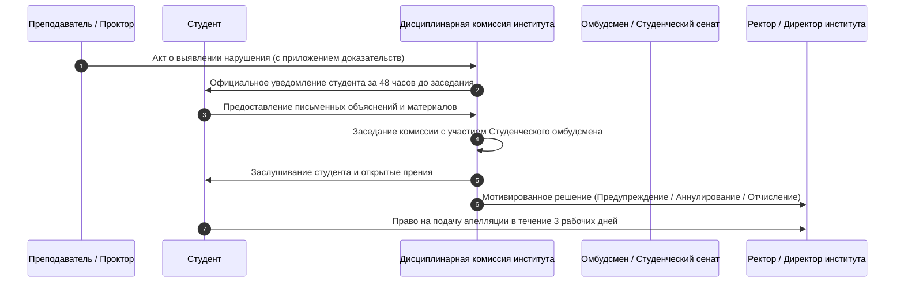

# ПОЛИТИКА АКАДЕМИЧЕСКОЙ ЧЕСТНОСТИ И РЕГЛАМЕНТ ДИСЦИПЛИНАРНОЙ КОМИССИИ
## [V_LEGAL_FORM] «[V_UNIVERSITY_FULL_NAME]»

---

### 1. ОБЩИЕ ПОЛОЖЕНИЯ И ПРИНЦИПЫ

1.1. Настоящая Политика определяет основополагающие стандарты, принципы, процедуры предотвращения нарушений и регламент состязательного разбора случаев академической нечестности среди обучающихся и профессорско-преподавательского состава [V_LEGAL_FORM] «[V_UNIVERSITY_FULL_NAME]» (далее — Университет).  
1.2. Университет придерживается принципов **Лиги академической честности Республики Казахстан** и европейских стандартов ESG:
- **Честность:** открытое, добросовестное выполнение всех видов учебных и исследовательских заданий;
- **Доверие:** создание образовательной среды, свободной от обмана и фальсификаций;
- **Справедливость:** объективное оценивание знаний на основе прозрачных критериев;
- **Взаимное уважение:** признание авторства и интеллектуального труда других лиц;
- **Персональная ответственность:** осознание неотвратимости мер дисциплинарного воздействия за допущенные нарушения.

---

### 2. ФОРМЫ НАРУШЕНИЙ АКАДЕМИЧЕСКОЙ ЧЕСТНОСТИ

В Университете категорически запрещены и признаются академическими правонарушениями:
2.1. **Плагиат:** умышленное или неумышленное присвоение авторства чужого текста, идеи, данных, программного кода или иллюстраций без надлежащего оформления цитирования и ссылки на первоисточник.  
2.2. **Списывание (Cheating):** использование любых несанкционированных вспомогательных материалов, шпаргалок, электронных устройств, смартфонов или микронаушников во время экзаменов, тестирования или контрольных мероприятий.  
2.3. **Подлог (Impersonation):** сдача экзамена, зачета или рубежного контроля за другого обучающегося либо привлечение третьих лиц к выполнению своих заданий.  
2.4. **Фальсификация (Fabrication):** подделка результатов лабораторных экспериментов, эмпирических данных педагогических исследований, отзывов научных руководителей, печатей или подписей в академических документах.  
2.5. **Несанкционированное использование искусственного интеллекта (AI Fraud):** представление сгенерированного нейросетями (ChatGPT и др.) текста в качестве собственной аналитической или творческой работы без указания промпта и авторского анализа.  
2.6. **Сговор (Collusion):** передача своих выполненных индивидуальных заданий другим студентам для сдачи под их именем.

---

### 3. НОРМАТИВНЫЕ ПОРОГИ ОРИГИНАЛЬНОСТИ СИСТЕМЫ «АНТИПЛАГИАТ»

Все письменные и квалификационные работы подлежат обязательной автоматизированной проверке в лицензионной системе «Антиплагиат-ВУЗ» до момента их защиты/оценивания.

Устанавливаются следующие минимальные нормативные пороги оригинальности текста:

| Категория письменной работы | Минимальный порог оригинальности текста | Допустимый объем корректного цитирования | Максимальный процент самоцитирования |
|:---|:---:|:---:|:---:|
| Курсовая работа / проект (бакалавриат) | **Не менее 60%** | До 30% (со ссылками) | Не более 10% |
| Дипломная работа / проект (бакалавриат) | **Не менее 70%** | До 25% (со ссылками) | Не более 10% |
| Дипломный стартап (Startup Track, ТЗ) | **Не менее 65%** | До 30% (со ссылками) | Не более 15% |
| Магистерская диссертация / проект | **Не менее 75%** | До 20% (со ссылками) | Не более 15% |
| Докторская диссертация (PhD) | **Не менее 80%** | До 15% (со ссылками) | Не более 20% (свои статьи) |

> **Примечание:** Попытки технического обхода системы «Антиплагиат» (замена букв латиницей, скрытый текст, микросимволы, спецскрипты) приравниваются к грубому подлогу и влекут автоматическое аннулирование работы без права повторной сдачи в текущем семестре.

---

### 4. РЕГЛАМЕНТ РАБОТЫ ДИСЦИПЛИНАРНОЙ КОМИССИИ И ПРОЦЕДУРА СОСТЯЗАТЕЛЬНОГО РАЗБОРА

В целях исключения предвзятости, субъективизма и обеспечения прав студентов разбор нарушений осуществляется в состязательном порядке:

4.1. При фиксации нарушения (прокторингом, преподавателем или системой «Антиплагиат») составляется двусторонний **Акт о нарушении академической честности**.  
4.2. Дело передается в Дисциплинарную комиссию института. Заседание проводится с обязательным участием представителя Студенческого сената (Студенческого омбудсмена).  
4.3. Обучающийся имеет право ознакомиться со всеми материалами проверки, лично присутствовать на заседании комиссии, давать устные и письменные пояснения и привлекать свидетелей.  
4.4. **Градация дисциплинарных мер воздействия:**
- **При первом незначительном нарушении:** предупреждение с аннулированием оценки за задание и правом однократной пересдачи с максимальной оценкой «C» (удовлетворительно);
- **При грубом нарушении (списывание на экзамене, подлог, покупка работы):** выставление итоговой оценки «F» (0 баллов) за дисциплину с направлением на платный повторный курс (Retake) в летнем семестре;
- **При повторном грубом нарушении либо фальсификации ВКР/диссертации:** отчисление из Университета за нарушение Кодекса чести и Устава.  
4.5. Студент вправе обжаловать решение комиссии в течение **3 рабочих дней** в Общеуниверситетскую комиссию по академической этике при [V_CHANCELLOR_TITLE].

---

### 5. ЦИФРОВОЙ КОНТУР И ЗАЩИТА НЕИЗМЕНЯЕМОСТИ ДАННЫХ В УИС («[V_PRIMARY_EDTECH_PLATFORM]»)

5.1. **Обязательная цифровая проверка работ на плагиат:**
- 100% курсовых, выпускных квалификационных работ (дипломных проектов), магистерских диссертаций и научных статей сотрудников подлежат обязательной загрузке в модуль **«Выпускные работы и Антиплагиат»** цифровой платформы Университета;
- Допуск к защите осуществляется исключительно при наличии автоматически сформированного в УИС Электронного сертификата оригинальности с QR-кодом (пороговые значения оригинальности: бакалавриат — не менее 70%, магистратура — не менее 75%, докторантура PhD — не менее 80%);
- Использование систем генеративного искусственного интеллекта (GenAI) допускается исключительно как вспомогательный инструмент с обязательным декларированием промптов и алгоритмов в соответствии с академической политикой.  
5.2. **Неизменяемость экзаменационных ведомостей и системный журнал аудита (Audit Trail):**
- Все экзаменационные ведомости после истечения 24-часового регламентного срока подлежат автоматической системной блокировке на уровне СУБД;
- Любая попытка несанкционированного изменения академических записей, баллов или статусов фиксируется в неизменяемом системном логе аудита с регистрацией логина, IP-адреса, хэш-суммы записи и точного времени транзакции;
- Изменение заблокированной оценки технически возможно только на основании приказа [V_CHANCELLOR_TITLE] и официального протокола Апелляционной комиссии с обязательным согласованием Антикоррупционным комплаенс-офицером.  
5.3. Преподаватели и сотрудники, уличенные в передаче своих учетных данных третьим лицам, фальсификации оценок в УИС или сокрытии фактов плагиата, подлежат немедленному расторжению трудового договора по инициативе работодателя в соответствии со **статьей 52 Трудового кодекса РК** и привлечению к установленной законом ответственности.
