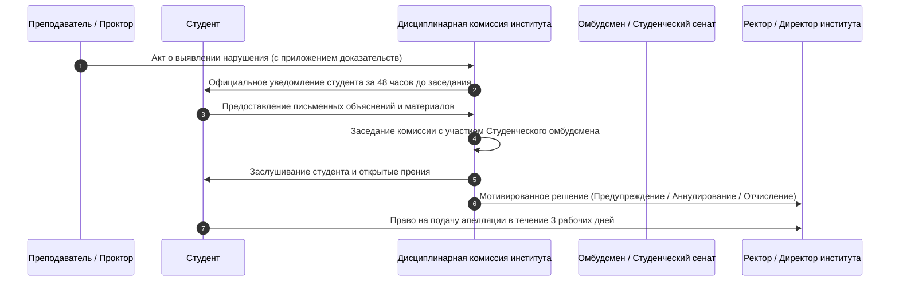

# ПОЛИТИКА АКАДЕМИЧЕСКОЙ ЧЕСТНОСТИ И РЕГЛАМЕНТ ДИСЦИПЛИНАРНОЙ КОМИССИИ
## [V_LEGAL_FORM] «[V_UNIVERSITY_FULL_NAME]»

---

### 1. ОБЩИЕ ПОЛОЖЕНИЯ И ПРИНЦИПЫ

1.1. Настоящая Политика определяет основополагающие стандарты, принципы, процедуры предотвращения нарушений и регламент состязательного разбора случаев академической нечестности среди обучающихся и профессорско-преподавательского состава [V_LEGAL_FORM] «[V_UNIVERSITY_FULL_NAME]» (далее — Университет).  
1.2. Университет придерживается принципов **Лиги академической честности Республики Казахстан** и европейских стандартов ESG:
- **Честность:** открытое, добросовестное выполнение всех видов учебных и исследовательских заданий;
- **Доверие:** создание образовательной среды, свободной от обмана и фальсификаций;
- **Справедливость:** объективное оценивание знаний на основе прозрачных критериев;
- **Взаимное уважение:** признание авторства и интеллектуального труда других лиц;
- **Персональная ответственность:** осознание неотвратимости мер дисциплинарного воздействия за допущенные нарушения.

---

### 2. ФОРМЫ НАРУШЕНИЙ АКАДЕМИЧЕСКОЙ ЧЕСТНОСТИ

В Университете категорически запрещены и признаются академическими правонарушениями:
2.1. **Плагиат:** умышленное или неумышленное присвоение авторства чужого текста, идеи, данных, программного кода или иллюстраций без надлежащего оформления цитирования и ссылки на первоисточник.  
2.2. **Списывание (Cheating):** использование любых несанкционированных вспомогательных материалов, шпаргалок, электронных устройств, смартфонов или микронаушников во время экзаменов, тестирования или контрольных мероприятий.  
2.3. **Подлог (Impersonation):** сдача экзамена, зачета или рубежного контроля за другого обучающегося либо привлечение третьих лиц к выполнению своих заданий.  
2.4. **Фальсификация (Fabrication):** подделка результатов лабораторных экспериментов, эмпирических данных педагогических исследований, отзывов научных руководителей, печатей или подписей в академических документах.  
2.5. **Генеративное мошенничество (AI Ghostwriting & Fraud):** представление сгенерированного нейросетями (ChatGPT, Claude и др.) текста, программного кода или проектных решений в качестве собственного авторского интеллектуального труда без надлежащего открытого декларирования в соответствии с Институциональной политикой `POL-AI-INTEGRITY-001` и без приложения Декларации `AI Statement Form`. Правомерное использование ИИ в рамках разрешенных Уровней 1–3 по силлабусу дисциплины академическим правонарушением не является.  
2.6. **Сговор (Collusion):** передача своих выполненных индивидуальных заданий другим студентам для сдачи под их именем.

---

### 3. НОРМАТИВНЫЕ ПОРОГИ ОРИГИНАЛЬНОСТИ СИСТЕМЫ «АНТИПЛАГИАТ»

Все письменные и квалификационные работы подлежат обязательной автоматизированной проверке в лицензионной системе «Антиплагиат-ВУЗ» до момента их защиты/оценивания.

Устанавливаются следующие минимальные нормативные пороги оригинальности текста:

| Категория письменной работы | Минимальный порог оригинальности текста | Допустимый объем корректного цитирования | Максимальный процент самоцитирования |
|:---|:---:|:---:|:---:|
| Курсовая работа / проект (бакалавриат) | **Не менее 60%** | До 30% (со ссылками) | Не более 10% |
| Дипломная работа / проект (бакалавриат) | **Не менее 70%** | До 25% (со ссылками) | Не более 10% |
| Дипломный стартап (Startup Track, ТЗ) | **Не менее 65%** | До 30% (со ссылками) | Не более 15% |
| Магистерская диссертация / проект | **Не менее 75%** | До 20% (со ссылками) | Не более 15% |
| Докторская диссертация (PhD) | **Не менее 80%** | До 15% (со ссылками) | Не более 20% (свои статьи) |

> **Примечание:** Попытки технического обхода системы «Антиплагиат» (замена букв латиницей, скрытый текст, микросимволы, спецскрипты) приравниваются к грубому подлогу и влекут автоматическое аннулирование работы без права повторной сдачи в текущем семестре.

---

### 3.1. ПРАВОВОЙ СТАТУС AI-ДЕТЕКТОРОВ И ПРЕЗУМПЦИЯ НЕВИНОВНОСТИ ОБУЧАЮЩЕГОСЯ

3.1.1. Университет официально исходит из того, что программные детекторы искусственного интеллекта («Антиплагиат», Turnitin, GPTZero и аналоги) функционируют на базе вероятностных статистических метрик перплексивности (Perplexity) и неравномерности (Burstiness) и подвержены систематическим ошибкам первого рода (False Positive до 20–30%), особенно на не-английских корпусах (включая тексты на государственном казахском языке) и при анализе нормативных/шаблонных конструкций.  
3.1.2. **Презумпция невиновности обучающегося:**  
- Любой числовой процент индикации ИИ в отчете системы проверки на заимствования признается **исключительно сигналом для экспертного внимания преподавателя**, но **не является юридическим доказательством факта списывания**;  
- Категорически запрещается выставление неудовлетворительной оценки («F» / 0 баллов), недопуск к защите или инициирование дисциплинарного взыскания исключительно на основе процента детектора ИИ;  
- Все сомнения в самостоятельном авторстве работы трактуются в пользу обучающегося вплоть до проведения квалификационного собеседования.

---

### 3.2. РЕГЛАМЕНТ КВАЛИФИКАЦИОННОГО СОБЕСЕДОВАНИЯ И ЗАЩИТЫ АВТОРСТВА (VIVA VOCE)

3.2.1. При превышении порога подозрения детектора ИИ (более 20%) либо при наличии у преподавателя мотивированных сомнений в авторстве работы назначается процедура **квалификационного собеседования (Viva Voce / Устная защита авторства)**.  
3.2.2. Собеседование проводится в течение **3 рабочих дней** очно либо через видеоконференцсвязь УИС «[V_SIS_SYSTEM_NAME]» с фиксацией видеозаписи. В состав комиссии входят: преподаватель дисциплины, заведующий кафедрой (или представитель методбюро). Обучающийся имеет безусловное право на участие Студенческого омбудсмена или представителя Студенческого сената.  
3.2.3. В ходе собеседования обучающемуся задаются контрольные вопросы по структуре работы, терминологическому аппарату, источникам данных, логике математических формул или архитектуре программного кода, а также предлагается решить контрольное микро-задание аналогичной сложности.  
3.2.4. **Оформление результатов собеседования:**
- **Вариант А (Авторство подтверждено):** Если студент свободно ориентируется в материале, объясняет логику и отвечает на контрольные вопросы — подозрение аннулируется со статусом *«Ложное срабатывание детектора (False Positive)»*, работа допускается к штатному оцениванию, а в УИС вносится соответствующая отметка;
- **Вариант Б (Авторство не подтверждено):** Если студент не в состоянии объяснить базовые положения работы, не ориентируется в выводах и коде — оформляется Акт о нарушении академической честности, и материал передается в Дисциплинарную комиссию института.

---

### 3.3. РЕГЛАМЕНТ ПОВТОРНЫХ ПРОВЕРОК В СИСТЕМЕ «АНТИПЛАГИАТ» ПРИ ДОРАБОТКЕ РАБОТ

3.3.1. В случае недобора установленного нормативного порога оригинальности текста (раздел 3 настоящей Политики) обучающемуся предоставляется право на доработку текста работы с целью устранения некорректных заимствований и расширения авторского аналитического содержания.  
3.3.2. **Допустимое количество повторных проверок:**
- Для курсовых работ (проектов): **не более 1 (одной) повторной проверки**;
- Для выпускных квалификационных работ (дипломных работ/проектов бакалавриата): **не более 2 (двух) повторных проверок**;
- Для магистерских диссертаций (проектов): **не более 2 (двух) повторных проверок**;
- Для докторских диссертаций (PhD): порядок повторной экспертизы регулируется регламентом АО «НЦГНТЭ» и Типовым положением о диссертационном совете (Приказ МНВО РК № 126).  
3.3.3. **Временной интервал и порядок повторной загрузки:**
- Категорически запрещается немедленная повторная загрузка текста в систему «Антиплагиат» с целью механического перебора слов и обхода алгоритмов («подгонка процента»);
- Минимальный регламентный срок на содержательную доработку текста между проверками составляет: для курсовых работ — **не менее 3 рабочих дней**, для ВКР и магистерских диссертаций — **не менее 5 рабочих дней**;
- Каждая повторная загрузка в УИС «[V_SIS_SYSTEM_NAME]» открывается только после согласования с научным руководителем и прикрепления краткой справки о внесенных изменениях (с указанием устраненных заимствований).  
3.3.4. **Последствия исчерпания лимита повторных проверок:**
- Если после второй повторной доработки работа не достигает минимального нормативного порога оригинальности, она **не допускается к защите в текущем семестре / академическом году**;
- Обучающийся имеет право на прохождение повторной процедуры подготовки и защиты работы в установленном порядке в следующем академическом периоде;
- Решение о недопуске оформляется распоряжением заведующего кафедрой и утверждается Деканом факультета / Директором института.

---

### 4. РЕГЛАМЕНТ РАБОТЫ ДИСЦИПЛИНАРНОЙ КОМИССИИ И ПРОЦЕДУРА СОСТЯЗАТЕЛЬНОГО РАЗБОРА

В целях исключения предвзятости, субъективизма и обеспечения прав студентов разбор нарушений осуществляется в состязательном порядке:

4.1. При фиксации нарушения (прокторингом, преподавателем или системой «Антиплагиат») составляется двусторонний **Акт о нарушении академической честности**.  
4.2. Дело передается в Дисциплинарную комиссию института. Заседание проводится с обязательным участием представителя Студенческого сената (Студенческого омбудсмена).  
4.3. Обучающийся имеет право ознакомиться со всеми материалами проверки, лично присутствовать на заседании комиссии, давать устные и письменные пояснения и привлекать свидетелей.  
4.4. **Градация дисциплинарных мер воздействия:**
- **При первом незначительном нарушении:** предупреждение с аннулированием оценки за задание и правом однократной пересдачи с максимальной оценкой «C» (удовлетворительно);
- **При грубом нарушении (списывание на экзамене, подлог, покупка работы):** выставление итоговой оценки «F» (0 баллов) за дисциплину с направлением на платный повторный курс (Retake) в летнем семестре;
- **При повторном грубом нарушении либо фальсификации ВКР/диссертации:** отчисление из Университета за нарушение Кодекса чести и Устава.  
4.5. Студент вправе обжаловать решение комиссии в течение **3 рабочих дней** в Общеуниверситетскую комиссию по академической этике при [V_CHANCELLOR_TITLE].

---

### 5. ЦИФРОВОЙ КОНТУР И ЗАЩИТА НЕИЗМЕНЯЕМОСТИ ДАННЫХ В УИС («[V_PRIMARY_EDTECH_PLATFORM]»)

5.1. **Обязательная цифровая проверка работ на плагиат:**
- 100% курсовых, выпускных квалификационных работ (дипломных проектов), магистерских диссертаций и научных статей сотрудников подлежат обязательной загрузке в модуль **«Выпускные работы и Антиплагиат»** цифровой платформы Университета;
- Допуск к защите осуществляется исключительно при наличии автоматически сформированного в УИС Электронного сертификата оригинальности с QR-кодом (пороговые значения оригинальности: бакалавриат — не менее 70%, магистратура — не менее 75%, докторантура PhD — не менее 80%);
- Использование систем генеративного искусственного интеллекта (GenAI) допускается исключительно как вспомогательный инструмент с обязательным декларированием промптов и алгоритмов в соответствии с академической политикой.  
5.2. **Неизменяемость экзаменационных ведомостей и системный журнал аудита (Audit Trail):**
- Все экзаменационные ведомости после истечения 24-часового регламентного срока подлежат автоматической системной блокировке на уровне СУБД;
- Любая попытка несанкционированного изменения академических записей, баллов или статусов фиксируется в неизменяемом системном логе аудита с регистрацией логина, IP-адреса, хэш-суммы записи и точного времени транзакции;
- Изменение заблокированной оценки технически возможно только на основании приказа [V_CHANCELLOR_TITLE] и официального протокола Апелляционной комиссии с обязательным согласованием Антикоррупционным комплаенс-офицером.  
5.3. Преподаватели и сотрудники, уличенные в передаче своих учетных данных третьим лицам, фальсификации оценок в УИС или сокрытии фактов плагиата, подлежат немедленному расторжению трудового договора по инициативе работодателя в соответствии со **статьей 52 Трудового кодекса РК** и привлечению к установленной законом ответственности.

---

### 6. ПРИМЕЧАНИЯ И СВЯЗАННЫЕ АРТЕФАКТЫ

1. **Регламентирующие акты Университета:**
   - Институциональная политика этичного использования искусственного интеллекта и генеративных моделей в ОВПО РК (`POL-AI-INTEGRITY-001`, `docs/internal_acts/sops_and_rules/ai_governance_and_integrity_policy.md`);
   - Типовой формуляр Декларации об использовании технологий ИИ (`docs/internal_acts/sops_and_rules/ai_usage_statement_form.md`);
   - Положение о Департаменте по академическим вопросам (`docs/internal_acts/regulations/dav_regulation.md`);
   - Положение об Офисе регистратора (`docs/internal_acts/regulations/registrar_regulation.md`).
2. **Внешние нормативные правовые акты:**
   - Постановление Правительства РК № 604 от 24.07.2024 (Концепция развития ИИ, код `MDIAI-06`);
   - Закон РК «Об образовании» (ст. 43-1, 47);
   - Рекомендации ЮНЕСКО по этике ИИ (2021);
   - Позиция Комитета по публикационной этике COPE (2024).
3. **Контрольный артефакт TFW:**
   - Task Directory: `workspace/ABAI_20260923-151500_AI_POLICY/`;
   - Technical Specification: [TS Phase A](file:///g:/Мой%20диск/Google%20AI%20Studio/Abai%20Unviersity%20Transformation/workspace/ABAI_20260923-151500_AI_POLICY/TS.md);
   - Evidence Protocol: [EV_PHASE_A.md](file:///g:/Мой%20диск/Google%20AI%20Studio/Abai%20Unviersity%20Transformation/workspace/ABAI_20260923-151500_AI_POLICY/evidence/EV_PHASE_A.md).
