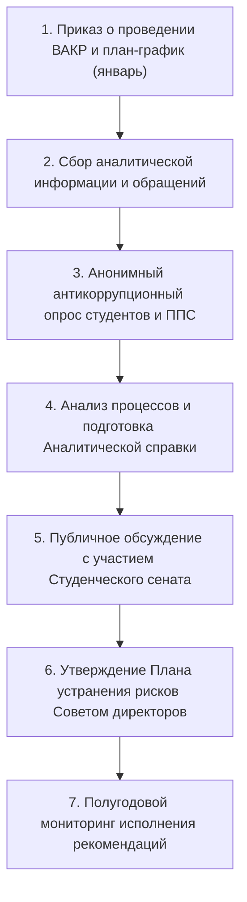

# РЕГЛАМЕНТ ПРОВЕДЕНИЯ ВНУТРЕННЕГО АНАЛИЗА КОРРУПЦИОННЫХ РИСКОВ (ВАКР)
## [V_LEGAL_FORM] «[V_UNIVERSITY_FULL_NAME]»

---

### 1. ОБЩИЕ ПОЛОЖЕНИЯ

1.1. Настоящий Регламент разработан в соответствии со статьей 8 Закона Республики Казахстан «О противодействии коррупции», Типовыми правилами проведения внутреннего анализа коррупционных рисков, утвержденными Агентством РК по противодействию коррупции, и определяет порядок выявления, оценки и устранения коррупционных рисков в деятельности структурных подразделений [V_LEGAL_FORM] «[V_UNIVERSITY_FULL_NAME]» (далее — Университет).  
1.2. Внутренний анализ коррупционных рисков (далее — ВАКР) является обязательным ежегодным профилактическим инструментом обеспечения прозрачности, академической честности и добропорядочности всех процессов Университета.  
1.3. Координацию, организационное обеспечение и методическое руководство проведением ВАКР осуществляет Антикоррупционная комплаенс-служба Университета.

---

### 2. НАПРАВЛЕНИЯ И ОБЪЕКТЫ АНАЛИЗА

ВАКР проводится по двум обязательным взаимосвязанным направлениям:

#### 2.1. Выявление коррупционных рисков во внутренних нормативных актах (ВНД):
- Экспертиза действующих положений о подразделениях, правил, регламентов и должностных инструкций на наличие дискреционных норм (размытых формулировок «вправе», «может по своему усмотрению», отсутствие четких сроков принятия решений, дублирование полномочий).

#### 2.2. Выявление коррупционных рисков в организационно-управленческой деятельности по критическим зонам:
1. **Государственные закупки:** формирование технических спецификаций, исключение аффилированности, мониторинг закупок из одного источника, объективность актов приема-передачи товаров и услуг.
2. **Приемная кампания и гранты:** распределение государственных образовательных грантов, квот, ректорских скидок, перевод и восстановление студентов.
3. **Промежуточная и итоговая аттестация:** экзаменационные сессии, пересдачи (Appeal), защита выпускных квалификационных работ, допуск к защитам в диссертационных советах.
4. **Управление студенческим жильем:** распределение и заселение мест в общежитиях, исключение незаконного подселения посторонних лиц.
5. **Кадровая работа и начисление надбавок:** проведение конкурсов на должности ППС (Приказ № 230), начисление стимулирующих надбавок, премий и установление учебной нагрузки.

---

### 3. ЭТАПЫ, СРОКИ И СХЕМА ПРОВЕДЕНИЯ ВАКР

ВАКР проводится ежегодно рабочей группой, утверждаемой приказом Председателя Правления – Ректора по представлению Комплаенс-офицера:

#### Пошаговый график проведения ВАКР:

| Этап | Содержание процедур | Сроки исполнения | Ответственные лица | Выходной документ |
|:---|:---|:---:|:---|:---|
| **1. Организационный** | Издание приказа Ректора о проведении ВАКР, утверждение персонального состава рабочей группы и графика | До 15 января | Комплаенс-офицер, Ректор | Приказ Ректора |
| **2. Сбор информации** | Запрос документов, локальных актов, договоров госзакупок, жалоб, анализ аудиторских логов [V_SIS_SYSTEM_NAME] | 10 рабочих дней | Рабочая группа, руководители подразделений | Сводный реестр первичных данных |
| **3. Соцопрос** | Проведение анонимного анкетирования обучающихся и ППС через цифровую платформу [V_SIS_SYSTEM_NAME] | 7 рабочих дней | Комплаенс-служба, Студенческий сенат | Аналитический отчет анкетирования |
| **4. Аналитический** | Систематизация выявленных факторов риска, формулирование рекомендаций по устранению дискреционных норм | 10 рабочих дней | Рабочая группа | Проект Аналитической справки ВАКР |
| **5. Публичное обсуждение** | Презентация итогов анализа на открытом заседании с участием Студсената и общественных экспертов | 3 рабочих дня | Комплаенс-офицер, Студсенат | Протокол публичного обсуждения |
| **6. Утверждение мер** | Рассмотрение результатов и утверждение Плана мероприятий по устранению причин коррупционных рисков | Февраль | Совет директоров Университета | Постановление СД, План мероприятий |
| **7. Мониторинг** | Контроль своевременного и полного исполнения пунктов Плана подразделениями | Ежеквартально | Комплаенс-служба | Мониторинговый отчет Совету директоров |

3.1. Общий срок проведения ВАКР составляет не более **30 рабочих дней** с даты издания приказа.  
3.2. В состав рабочей группы включаются: Комплаенс-офицер (руководитель), корпоративный юрисконсульт, представители Службы внутреннего аудита, представитель Студенческого сената и независимый эксперт из числа общественных организаций.

---

### 4. МАТРИЦА РАСПРЕДЕЛЕНИЯ ОТВЕТСТВЕННОСТИ (RACI)

| Процесс проведения ВАКР | Комплаенс-офицер | Рабочая группа | Совет директоров | Правление / Ректор | Руководители подразделений | Студенческий сенат |
|:---|:---:|:---:|:---:|:---:|:---:|:---:|
| Формирование графика и состава рабочей группы | **A** | C | I | C (согласование) | I | I |
| Предоставление первичных данных и договоров | C | **A** | I | I | R (исполнение) | I |
| Организация анонимного анкетирования | **A** | R | I | I | I | C (содействие) |
| Подготовка Аналитической справки ВАКР | **A** | R | I | C | I | C |
| Утверждение Плана мероприятий по рискам | C | C | **A** | R (соисполнение) | R (исполнение) | I |
| Контроль исполнения Плана мероприятий | **A** | R | I | C | R (отчеты) | I |

> **Пояснение модели и обозначений RACI:**  
> Модель RACI определяет матричное распределение зон ответственности участников процесса ВАКР:  
> - **R (Responsible / Исполнитель)** — выполняет конкретные аналитические задачи, готовит информацию или исполняет пункты плана;  
> - **A (Accountable / Подотчетный)** — полномочный владелец процесса, несущий персональную ответственность за общий результат и объективность выводов (строго один **A** на процесс);  
> - **C (Consulted / Консультант)** — эксперт или согласующая сторона, привлекаемая для предварительной оценки;  
> - **I (Informed / Информируемый)** — лицо или орган управления, уведомляемый об итогах анализа и утвержденных мерах.

---

### 5. ОФОРМЛЕНИЕ РЕЗУЛЬТАТОВ И УСТРАНЕНИЕ РИСКОВ

5.1. По итогам анализа рабочая группа формирует **Аналитическую справку по результатам ВАКР**, содержащую:
- Перечень выявленных коррупционных факторов и уязвимостей в разрезе структурных подразделений;
- Оценку вероятности и тяжести последствий коррупционных проявлений;
- Конкретные рекомендации по их устранению (пересмотр ВНД, автоматизация процесса в цифровой платформе [V_SIS_SYSTEM_NAME], ротация кадров).  
5.2. На основе Аналитической справки разрабатывается **План мероприятий по устранению причин и условий, способствующих совершению коррупционных правонарушений**, утверждаемый Советом директоров [V_UNIVERSITY_SHORT_NAME].  
5.3. Руководители структурных подразделений несут персональную дисциплинарную ответственность за своевременное и полное исполнение пунктов Плана мероприятий.

---

### 6. ПРИМЕЧАНИЯ И СВЯЗАННЫЕ АРТЕФАКТЫ

Настоящий Регламент разработан в рамках системы антикоррупционного комплаенс-контроля Университета (TFW v3.4.0):
1. **Внешние НПА РК:**
   - [`docs/regulations/external_npa_registry.md`](file:///g:/Мой%20диск/Google%20AI%20Studio/Abai%20Unviersity%20Transformation/docs/regulations/external_npa_registry.md) — Закон РК «О противодействии коррупции» (`NPA-045`), Типовые правила проведения внутреннего анализа коррупционных рисков Агентства РК по противодействию коррупции (`NPA-046`).
2. **Связанные внутренние акты:**
   - [`docs/internal_acts/regulations/compliance_service_regulation.md`](file:///g:/Мой%20диск/Google%20AI%20Studio/Abai%20Unviersity%20Transformation/docs/internal_acts/regulations/compliance_service_regulation.md) — Положение об Антикоррупционной комплаенс-службе.
   - [`docs/internal_acts/job_descriptions/jd_compliance_officer.md`](file:///g:/Мой%20диск/Google%20AI%20Studio/Abai%20Unviersity%20Transformation/docs/internal_acts/job_descriptions/jd_compliance_officer.md) — Должностная инструкция Антикоррупционного комплаенс-офицера.
3. **Цифровой контур:**
   - [`docs/internal_acts/blueprints/abai_digital_platform_architecture.md`](file:///g:/Мой%20диск/Google%20AI%20Studio/Abai%20Unviersity%20Transformation/docs/internal_acts/blueprints/abai_digital_platform_architecture.md) — Модуль «Логирование и аудит безопасности» (Audit Trail в ведомостях, пересдачах и контингенте).
4. **Контур доказательств и база знаний:**
   - [`workspace/ABAI_20260914-192000_COMP/evidence/EV__COMP.md`](file:///g:/Мой%20диск/Google%20AI%20Studio/Abai%20Unviersity%20Transformation/workspace/ABAI_20260914-192000_COMP/evidence/EV__COMP.md) — Артефакт доказательств антикоррупционного контура.
   - [`KNOWLEDGE.md`](file:///g:/Мой%20диск/Google%20AI%20Studio/Abai%20Unviersity%20Transformation/KNOWLEDGE.md) — Верифицированные факты `FACT-004`, `FACT-012`, `FACT-016`.
