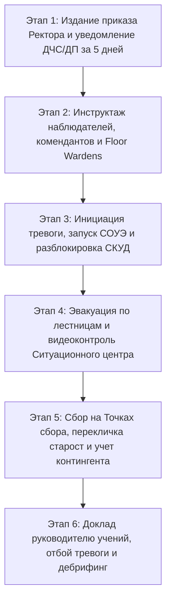

# СТАНДАРТНАЯ ОПЕРАЦИОННАЯ ПРОЦЕДУРА: ОРГАНИЗАЦИЯ И ПРОВЕДЕНИЕ ОБЪЕКТОВЫХ И ЭВАКУАЦИОННЫХ ТРЕНИРОВОК ПРИ ЧРЕЗВЫЧАЙНЫХ СИТУАЦИЯХ
## [V_LEGAL_FORM] «[V_UNIVERSITY_FULL_NAME]»

> **Код документа:** `SOP-EMERG-EVAC-001`  
> **Версия:** 1.0  
> **Статус:** ДЕЙСТВУЕТ  
> **Область применения:** Все учебные корпуса, институты, кафедры, научно-исследовательские лаборатории, научная библиотека, студенческие общежития и спортивные комплексы Университета  
> **Владельцы процесса:** Начальник Отдела ГО и ЧС (ведущий организатор), Начальник Службы физической безопасности и режима (посты и антитеррор), Руководитель Службы охраны труда (безопасность персонала), Начальник Ситуационного центра (видеоконтроль и телеметрия)  

---

### 1. НАЗНАЧЕНИЕ И НОРМАТИВНЫЕ ОСНОВАНИЯ

1.1. Настоящая Стандартная операционная процедура (СОП) устанавливает алгоритм подготовки, проведения, хронометража, видеоконтроля и разбора результатов плановых и внеплановых тренировок по экстренной эвакуации обучающихся, профессорско-преподавательского состава (ППС) и персонала Университета.  
1.2. Процедура разработана в строгом соответствии с:
- Законом Республики Казахстан «О гражданской защите» № 188-V;
- Законом Республики Казахстан «О противодействии терроризму» № 416-I;
- Правилами пожарной безопасности (Приказ МЧС РК от 21.02.2022 № 55, пп. 12, 18, 24);
- Инструкцией по организации антитеррористической защиты объектов образования и науки, уязвимых в террористическом отношении (Приказ Министра науки и высшего образования РК от 04.10.2024 № 476, МЮ РК № 35218);
- Правилами организации и ведения гражданской обороны (Приказ МЧС РК от 21.10.2020 № 268);
- Техническим регламентом «Общие требования к пожарной безопасности» (Приказ МЧС РК от 17.08.2021 № 405);
- Отраслевым стандартом `STD-RK-012-SECURITY-BIOT-SITCENTER`.

---

### 2. ПЕРИОДИЧНОСТЬ И СРОКИ ПРОВЕДЕНИЯ

2.1. Во всех учебных корпусах и административных зданиях Университета объектовые тренировки по эвакуации проводятся **не реже 2 (двух) раз в год**:
- **Осенний семестр:** сентябрь – октябрь (обязательно с охватом вновь поступивших студентов 1 курса и новых сотрудников);
- **Весенний семестр:** март – апрель (отработка действий в условиях весеннего паводкового или сейсмоопасного периода).  
2.2. В студенческих общежитиях Университета тренировки проводятся:
- плановые дневные — 2 раза в год;
- **внеплановые вечерние (ночные)** в интервале с 20:00 до 22:00 — не реже 1 раза в год для отработки быстрой эвакуации проживающих в условиях сна и ограниченной видимости.  
2.3. Внеплановые объектовые тренировки назначаются приказом Ректора при изменении уровня террористической опасности («желтый», «оранжевый», «красный») либо по предписанию органов ДЧС/ДП.

---

### 3. ТИПОВЫЕ СЦЕНАРИИ ТРЕНИРОВОК

Тренировки проводятся по трем базовым сценариям:

#### Сценарий «А»: Пожарная эвакуация при задымлении/возгорании
- Имитируется очаг возгорания на одном из этажей (генератором безопасного театрального дыма);
- Срабатывание адресно-аналогового дымового извещателя АПС, передача сигнала тревоги на пульт Ситуационного центра;
- Автоматический запуск СОУЭ (световые табло «Выход», сирены, речевое оповещение на казахском и русском языках);
- Срабатывание сигнала «Антипаника» СКУД (разблокировка всех турникетов, магнитных замков дверей эвакуационных выходов);
- Эвакуация контингента по лестничным клеткам с выходом на безопасные открытые площадки.

#### Сценарий «Б»: Сейсмическая тренировка при землетрясении
- Подача сигнала «Внимание всем!» (прерывистые гудки, звонки, громкоговорящая связь СЦ);
- **Фаза 1 (первые 30–40 секунд — действие толчков):** правило «Укройся — Защити голову — Держись!» (занять безопасные места у внутренних капитальных стен, в дверных проемах, под прочными столами; категорически запрещено пользоваться лифтами и выбегать на лестницы в момент ударов);
- **Фаза 2 (после прекращения толчков):** организованный выход по лестницам на безопасные расстояния от зданий (не ближе $1/2$ высоты здания) на Точки безопасного сбора.

#### Сценарий «В»: Антитеррористическая тренировка (Приказ МНВО РК № 476)
- **Вариант В.1 (Вооруженное нападение / Active Shooter):** передача кодового сигнала экстренного оповещения, нажатие КТС; реализация протокола «Lockdown / Баррикадирование»: прекращение занятий, запирание дверей аудиторий на замок, баррикадирование мебелью, отключение звука телефонов, укрытие в мертвых зонах вне поля видимости дверных и оконных проемов до прибытия спецподразделений полиции (ДП);
- **Вариант В.2 (Обнаружение бесхозного предмета / угроза взрыва):** немедленное оцепление зоны силами Службы безопасности на дистанции $\ge 50$ метров, запрет использования радиостанций и сотовой связи вблизи предмета, скрытная эвакуация людей без создания паники.

---

### 4. РОЛЬ И ФУНКЦИИ СИТУАЦИОННОГО ЦЕНТРА (24/7) В ХОДЕ ТРЕНИРОВОК

4.1. В период проведения тренировки Ситуационный центр переводится в режим повышенной готовности:
- На видеостене СЦ выводятся экраны путей эвакуации, коридоров, лестничных маршей и уличных периметров корпуса;
- Дежурный оператор СЦ ведет непрерывный видеоконтроль движения людских потоков через PTZ-камеры с фиксацией плотности потока;
- Оператор СЦ немедленно фиксирует на видео факты блокировки дверей, захламления проходов, скопления людей («бутылочные горлышки») и передает координаты инспекторам безопасности по рации;
- Оператор СЦ включает электронный секундомер в момент активации тревоги и фиксирует точное время выхода последнего человека из здания;
- СЦ осуществляет цифровую видеозапись процесса эвакуации с архивацией фрагментов на срок не менее 6 месяцев для последующего методического анализа.

---

### 5. ЭТАПЫ ПОДГОТОВКИ И ПРОВЕДЕНИЯ ЭВАКУАЦИОННОЙ ТРЕНИРОВКИ



#### 5.1. Этап 1: Организационная подготовка (за 5–7 рабочих дней)
- Издается приказ Ректора о проведении тренировки с указанием даты, времени, объекта, руководителя учений и состава штаба;
- Начальник Отдела Гражданской обороны и ЧС направляет официальное уведомительное письмо в территориальное подразделение ДЧС и Управление полиции для исключения выезда экстренных служб по ложной тревоге;
- Проверяется исправность систем АПС, СОУЭ, аварийного освещения и механизмов автоматического отпирания запасных выходов.

#### 5.2. Этап 2: Инструктаж посредников и наблюдателей (за 1 день)
- Назначенные наблюдатели (из числа сотрудников Службы БиОТ, СБ и комендантов) распределяются по этажам и лестничным клеткам;
- Каждому наблюдателю выдаются секундомер, светоотражающий жилет и Оценочный лист эвакуации (Приложение 2).

#### 5.3. Этап 3: Инициация и активная эвакуация
- По команде руководителя тренировки производится имитация сигнала тревоги либо подача реального сигнала через дымовой извещатель;
- Дежурный оператор Ситуационного центра подтверждает прохождение сигнала, запускает оповещение СОУЭ и переводит турникеты СКУД в режим свободного прохода;
- Преподаватели прекращают занятия, требуют от студентов оставить тяжелые вещи (взяв только документы и верхнюю одежду по сезону), организуют колонну и ведут группу по указателям эвакуации к ближайшему запасному выходу;
- Коменданты этажей (Floor Wardens) проверяют туалетные комнаты, подсобные помещения и лаборатории на предмет оставшихся людей, закрывают окна и двери (не запирая на замок) для ограничения доступа кислорода.

#### 5.4. Этап 4: Сбор и построение на Точках безопасного сбора
- Эвакуированные направляются на заранее закрепленные Точки безопасного сбора (стадион, сквер, широкая открытая парковка вне зоны возможного обрушения конструкций);
- Старосты учебных групп и руководители отделов проводят быструю перекличку по спискам контингента;
- Сведения о наличии людей и возможных оставшихся/отставших незамедлительно передаются Начальнику Отдела Гражданской обороны и ЧС на командный пункт.

#### 5.5. Этап 5: Подведение итогов и оформление акта (Дебрифинг)
- Руководитель учений дает команду «Отбой тревоги», контингент возвращается к учебному процессу;
- В течение 2 часов проводится оперативное совещание штаба учений с участием наблюдателей и операторов Ситуационного центра;
- Просматриваются видеозаписи эвакуации, фиксируются допущенные ошибки (паника, задержки из-за личных вещей, использование заблокированных выходов);
- Составляется и утверждается Ректором итоговый Акт проведения эвакуационной тренировки (Приложение 3).

---

### 6. НОРМАТИВНЫЕ ПОКАЗАТЕЛИ ВРЕМЕНИ ЭВАКУАЦИИ

| Тип здания / Объекта | Высотность | Нормативное время полной эвакуации | Критическое время (неудовлетворительно) |
|---|:---:|:---:|:---:|
| **Учебный корпус (малый / средний)** | до 4 этажей | $\le 3,5$ минут | $> 5,0$ минут |
| **Главный учебный корпус (высотный)** | 5–9 этажей | $\le 5,0$ минут | $> 7,0$ минут |
| **Студенческое общежитие (дневная)** | 5–9 этажей | $\le 4,5$ минут | $> 6,5$ минут |
| **Студенческое общежитие (вечерняя/ночная)** | 5–9 этажей | $\le 6,0$ минут | $> 8,5$ минут |
| **Научная библиотека / Актовый зал** | Большое скопление людей | $\le 4,0$ минут | $> 5,5$ минут |

---

### 7. ТИПОВЫЕ ОШИБКИ И МЕРЫ ПО ИХ ИСКЛЮЧЕНИЮ

1. **Использование лифтов во время тревоги:** Категорически запрещено. Лифты должны автоматически опускаться на 1 этаж, открывать двери и обесточиваться при сигнале пожарной тревоги.
2. **Запертые эвакуационные выходы:** Все эвакуационные двери должны быть оборудованы электромагнитными замками, отпираемыми автоматически по сигналу пожарной сигнализации, а также механическими ручками «Антипаника» (Push-bar) изнутри.
3. **Задержка преподавателями занятий:** Недопустимо игнорирование тревоги со словами «допишем лекцию». Любое срабатывание системы расценивается как реальная угроза до отбоя.
4. **Возвращение за оставленными вещами:** Наблюдатели на входах строго пресекают любые попытки обратного проникновения в здание до официального объявления отбоя.

---

### ПРИЛОЖЕНИЕ 1: ЧЕК-ЛИСТ ДЕЖУРНОГО ПО ЭТАЖУ (FLOOR WARDEN)

- [ ] Получил сигнал тревоги (СОУЭ / громкая связь);
- [ ] Оповестил голосом все прилегающие учебные аудитории и кабинеты этажа;
- [ ] Осмотрел санузлы, курительные зоны, лестничные площадки и бытовые помещения;
- [ ] Убедился в отсутствии оставшихся людей;
- [ ] Закрыл окна и входные двери помещений (без запирания на ключ);
- [ ] Направил людской поток по свободной эвакуационной лестнице;
- [ ] Покинул этаж последним, зафиксировал время освобождения этажа;
- [ ] Доложил Начальнику Отдела Гражданской обороны и ЧС на точке сбора.

---

### ПРИЛОЖЕНИЕ 2: ОЦЕНОЧНЫЙ ЛИСТ НАБЛЮДАТЕЛЯ ТРЕНИРОВКИ

* **Дата проведения:** «____» ____________ 202__ г.
* **Объект (корпус / общежитие):** _______________________________________
* **Пост наблюдения (этаж, лестничный марш №):** _________________________
* **Ф.И.О. наблюдателя:** ________________________________________________

| № | Контрольный параметр | Оценка (Да / Нет / Частично) | Примечание / Выявленный дефект |
|---|---|:---:|---|
| 1 | Четкость и слышимость речевого оповещения СОУЭ | | |
| 2 | Своевременность открытия эвакуационных дверей | | |
| 3 | Отсутствие давки, паники и заторов на лестнице | | |
| 4 | Организованность действий ППС и старост групп | | |
| 5 | Отсутствие фактов использования лифтов | | |
| 6 | Свободность эвакуационных путей от мусора и мебели | | |
| 7 | Время прохождения основного потока людей (мин, сек) | | |

---

### ПРИЛОЖЕНИЕ 3: ТИПОВОЙ АКТ ПРОВЕДЕНИЯ ЭВАКУАЦИОННОЙ ТРЕНИРОВКИ

```text
УТВЕРЖДАЮ:
Председатель Правления – Ректор
[V_LEGAL_FORM] «[V_UNIVERSITY_FULL_NAME]»
__________________ [Ф.И.О.]
«____» _______________ 202__ г.

АКТ
проведения практической тренировки по экстренной эвакуации

1. Дата и время проведения: «___» ________ 202__ г., с ____:____ по ____:____
2. Место проведения: Учебный корпус № ____, расположенный по адресу: ____________________
3. Тема тренировки: «Действия персонала и обучающихся при возникновении пожара / угрозе ЧС»
4. Состав участников: профессорско-преподавательский состав — _____ чел., учебно-вспомогательный персонал — _____ чел., студенты — _____ чел. Всего эвакуировано: _____ чел.
5. Время от момента включения сигнала оповещения до выхода последнего человека: _____ мин. _____ сек.
6. Оценка систем безопасности:
   - АПС и СОУЭ: сработали в штатном режиме / замечания: _______________________
   - СКУД (разблокировка турникетов и эваковыходов): разблокированы автоматически за ___ сек.
   - Ситуационный центр: видеоконтроль обеспечен в полном объеме, хронометраж зафиксирован.
7. Выводы и оценка тренировки: цели тренировки ДОСТИГНУТЫ. Действия контингента оцениваются на «ХОРОШО» / «УДОВЛЕТВОРИТЕЛЬНО».
8. Замечания и предписания по устранению недостатков:
   1) ___________________________________________________ Срок: до «___» ________ 202__ г.
   2) ___________________________________________________ Срок: до «___» ________ 202__ г.

Начальник Отдела Гражданской обороны и ЧС:    ______________ [Ф.И.О.]
Руководитель Службы охраны труда (БиОТ):      ______________ [Ф.И.О.]
Начальник Службы безопасности и режима:       ______________ [Ф.И.О.]
Начальник Ситуационного центра:               ______________ [Ф.И.О.]
Представитель УЧС ДЧС:                        ______________ [Ф.И.О.]
```
