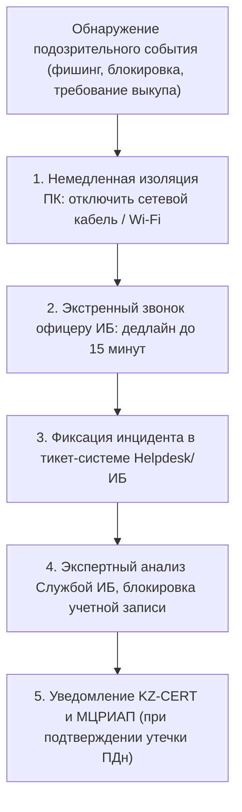

# РЕГЛАМЕНТ ОБЯЗАТЕЛЬНОГО ОБУЧЕНИЯ, ИНСТРУКТАЖА ПО КИБЕРБЕЗОПАСНОСТИ И СОБЛЮДЕНИЯ ТРЕБОВАНИЙ ИНФОРМАЦИОННОЙ БЕЗОПАСНОСТИ РАБОТНИКАМИ
## [V_LEGAL_FORM] «[V_UNIVERSITY_FULL_NAME]»

---

### 1. ОБЩИЕ ПОЛОЖЕНИЯ И ИНТЕГРАЦИЯ С ОХРАНОЙ ТРУДА

1.1. Настоящий Регламент разработан в соответствии с Трудовым кодексом Республики Казахстан (ст. 22, 23, 52, 64, 120, 123, 181, 182), Едиными требованиями в области информационно-коммуникационных технологий и обеспечения информационной безопасности (Постановление Правительства РК № 832 — ЕТИКТ и ИБ) и стандартами СТ РК ISO/IEC 27001.  
1.2. **Приравнивание к безопасности и охране труда (БиОТ):** В соответствии с трудовым законодательством Республики Казахстан, обеспечение кибербезопасности, соблюдение правил кибергигиены и защита цифровой инфраструктуры на рабочем месте официально интегрированы в единую систему требований по безопасности и охране труда Университета.  
1.3. Требования настоящего Регламента являются обязательными для всех работников Университета — профессорско-преподавательского состава, научных сотрудников, административно-управленческого, вспомогательного и учебно-производственного персонала — вне зависимости от формы занятости и типа выполняемых работ.  
1.4. Обеспечение информационной безопасности основывается на принципе взаимной и разделенной ответственности: Университет создает технически защищенную цифровую среду и организует регулярное обучение, а работник несет персональную юридическую ответственность за соблюдение правил кибергигиены и сохранность вверенных данных.

---

### 2. ВЗАИМНЫЕ ОБЯЗАННОСТИ СТОРОН ТРУДОВОГО ДОГОВОРА

#### 2.1. Обязанности Университета (Работодателя):
- Обеспечивать рабочие места лицензионным программным обеспечением, централизованными средствами антивирусной защиты, сегментированным сетевым доступом и сертифицированными средствами шифрования.
- Организовывать за счет работодателя обязательное обучение, вводный и периодический инструктажи всех сотрудников по кибербезопасности и противодействию методам социальной инженерии.
- Включать обязательства по соблюдению информационной безопасности и конфиденциальности в трудовые договоры и должностные инструкции.
- Обеспечивать функционирование самостоятельной Службы информационной безопасности (Офицера ИБ / CISO), непосредственно подчиненной Ректору Университета.

#### 2.2. Обязанности Работника:
- Проходить обязательный вводный инструктаж по кибербезопасности при приеме на работу и регулярную ежегодную проверку знаний.
- Строго соблюдать правила работы с информационными системами (АИС «[V_SIS_SYSTEM_NAME]», LMS Moodle, корпоративная электронная почта).
- Обеспечивать конфиденциальность индивидуальных учетных данных: категорически запрещается передача логинов, паролей, одноразовых SMS-кодов (OTP), токенов и закрытых ключей электронной цифровой подписи (ЭЦП НУЦ РК) любым третьим лицам, включая коллег и непосредственных руководителей.
- Соблюдать правила «чистого стола» и «чистого экрана» (блокировать экран компьютера при покидании рабочего места клавишами `Win + L`).
- Незамедлительно (в течение не более 15 минут) сообщать в Службу информационной безопасности обо всех инцидентах, подозрительных письмах (фишинге), попытках несанкционированного доступа или телефонного мошенничества (вишинга).

---

### 3. ПОРЯДОК ПРОВЕДЕНИЯ ВВОДНОГО ИНСТРУКТАЖА ПО КИБЕРБЕЗОПАСНОСТИ

3.1. Вводный инструктаж по кибербезопасности проводится Департаментом управления человеческими ресурсами (HR) совместно со Службой информационной безопасности при оформлении трудового договора **до момента предоставления доступа к корпоративной сети и информационным системам**.  
3.2. В программу вводного инструктажа входят:
- Обзор законодательства РК по защите персональных данных, кибербезопасности и ответственности по ТК, КоАП и УК РК;
- Правила создания сложных паролей (не менее 10 символов, буквы разных регистров, цифры и спецсимволы, смена каждые 90 дней);
- Идентификация фишинговых писем, вредоносных вложений и поддельных доменных имен;
- Регламент использования корпоративной почты (`@abai.kz`) исключительно в служебных целях;
- Запрет на подключение к служебным компьютерам неавторизованных внешних съемных носителей (USB-флешек, внешних жестких дисков) без предварительной антивирусной проверки.  
3.3. Факт прохождения инструктажа фиксируется личной подписью работника в **Журнале учета инструктажей по кибербезопасности и кибергигиене** (Приложение 1). Работник, не прошедший вводный инструктаж, **к работе в информационных системах не допускается**.

---

### 4. ОБЯЗАТЕЛЬНОЕ ЕЖЕГОДНОЕ ОБУЧЕНИЕ И ТРЕНИРОВКИ (КИБЕРГИГИЕНА)

4.1. Все сотрудники Университета обязаны **не реже одного раза в год** проходить обязательный обучающий курс по кибергигиене в LMS Moodle с последующим итоговым тестированием.  
4.2. Служба информационной безопасности на регулярной основе (не реже 1 раза в квартал) проводит контролируемые симуляции фишинговых атак для практической оценки бдительности персонала.  
4.3. Сотрудники, допустившие переход по фишинговой ссылке в ходе учебной симуляции либо не сдавшие итоговое тестирование, направляются на повторное обязательное внеплановое обучение в течение 5 рабочих дней.

---

### 5. ИНЦИДЕНТ-МЕНЕДЖМЕНТ И РЕГЛАМЕНТ ЭКСТРЕННОГО ОПОВЕЩЕНИЯ



5.1. При обнаружении любого из следующих признаков работник обязан **немедленно физически отключить сетевой кабель или Wi-Fi-соединение на компьютере, не выключая питание**, и связаться со Службой ИБ:
- Появление окна вымогательства, блокировки файлов или несанкционированного шифрования;
- Получение электронного письма с запросом учетных данных от имени руководства или банка;
- Совершение ошибочного ввода логина/пароля на подозрительном внешнем ресурсе;
- Звонок от третьих лиц под видом сотрудников службы безопасности, правоохранительных органов или IT-поддержки с требованием назвать одноразовый пароль или код из SMS.

---

### 6. ДИСЦИПЛИНАРНАЯ И МАТЕРИАЛЬНАЯ ОТВЕТСТВЕННОСТЬ РАБОТНИКА

6.1. Нарушение положений настоящего Регламента квалифицируется как нарушение трудовой дисциплины и правил безопасности и охраны труда (БиОТ по ст. 181, 182 Трудового кодекса РК).  
6.2. В соответствии со статьями 52 и 64 Трудового кодекса РК, к работнику могут применяться следующие меры дисциплинарного взыскания:
- Замечание;
- Выговор;
- Строгий выговор;
- **Расторжение трудового договора по инициативе работодателя:**
  - на основании **пп. 12) п. 1 ст. 52 ТК РК** — за разглашение служебной тайны, персональных данных обучающихся или сотрудников, паролей и аутентификационных данных, ставших известными работнику в связи с выполнением трудовых обязанностей;
  - на основании **пп. 16) п. 1 ст. 52 ТК РК** — за повторное неисполнение или повторное ненадлежащее исполнение без уважительных причин правил кибербезопасности и регламентов УИС «[V_PRIMARY_EDTECH_PLATFORM]» работником, имеющим дисциплинарное взыскание;
  - на основании **пп. 18) п. 1 ст. 52 ТК РК** — за нарушение правил безопасности и охраны труда (БиОТ в цифровой среде), которое повлекло или могло повлечь тяжкие последствия (умышленный запуск вредоносного ПО, компрометация серверной инфраструктуры, создание критических сетевых уязвимостей).  
6.3. В соответствии со статьями 120 и 123 ТК РК, работник несет **полную материальную ответственность** за прямой действительный ущерб, причиненный Университету в результате умышленного разглашения информации, передачи аутентификационных данных третьим лицам или виновного нарушения правил кибербезопасности, повлекшего наложение административных штрафов регуляторами (МЦРИАП РК по ст. 79 КоАП РК, ГТС) либо финансовые потери.

---

### 7. МАТРИЦА РАСПРЕДЕЛЕНИЯ ОТВЕТСТВЕННОСТИ (RACI)

| Процесс обеспечения кибербезопасности персонала | Служба ИБ (CISO) | Департамент HR | Руководители институтов / кафедр | Работники (ППС / персонал) | Юридический департамент |
|:---|:---:|:---:|:---:|:---:|:---:|
| Разработка программы обучения и инструктажей по кибергигиене | **A** | C | C | I | C |
| Проведение вводного инструктажа при приеме на работу | C (материалы) | **A** (фиксация) | I | R (прохождение) | I |
| Организация ежегодного тестирования по кибербезопасности | **A** | R (контроль явки) | R (обеспечение участия) | R (сдача теста) | I |
| Проведение учебных фишинг-симуляций | **A** | I | I | R (участие) | I |
| Экстренное реагирование на инциденты ИБ | **A** | I | C | R (доклад за 15 мин) | C |
| Привлечение к дисциплинарной и материальной ответственности | C (акт расследования) | **A** (приказ) | C (представление) | I | R (правовая экспертиза) |

> **Пояснение модели и обозначений RACI:**  
> Модель RACI закрепляет распределение обязанностей по кибербезопасности персонала:  
> - **R (Responsible / Исполнитель)** — должностное лицо или работник, непосредственно проходящий инструктаж, выполняющий требования кибергигиены или готовящий проект приказа;  
> - **A (Accountable / Подотчетный)** — единственный полномочный владелец процесса, несущий персональную ответственность за общий результат и соблюдение сроков (строго один **A** на процесс);  
> - **C (Consulted / Консультант)** — эксперт или орган, привлекаемый для согласования регламентов или актов расследования инцидентов;  
> - **I (Informed / Информируемый)** — лицо или орган, уведомляемый об итогах обучения или принятых решениях.

---

### 8. ПРИЛОЖЕНИЕ 1: ТИПОВАЯ ФОРМА ЖУРНАЛА УЧЕТА ИНСТРУКТАЖЕЙ ПО КИБЕРБЕЗОПАСНОСТИ

```text
ЖУРНАЛ УЧЕТА ИНСТРУКТАЖЕЙ ПО КИБЕРБЕЗОПАСНОСТИ И ОХРАНЕ ТРУДА
[V_LEGAL_FORM] «[V_UNIVERSITY_FULL_NAME]»

┌───┬──────────────┬──────────────────────────┬────────────────────────┬────────────────┬───────────────────────────┬─────────────────────────┐
│ № │ Дата         │ Ф.И.О. инструктируемого  │ Должность, институт/   │ Вид инструктажа│ Подпись инструктируемого  │ Подпись лица,           │
│   │ инструктажа  │ работника                │ подразделение          │ (вводный/план.)│ работника                 │ проводившего инструктаж │
├───┼──────────────┼──────────────────────────┼────────────────────────┼────────────────┼───────────────────────────┼─────────────────────────┤
│ 1 │              │                          │                        │                │                           │                         │
│ 2 │              │                          │                        │                │                           │                         │
└───┴──────────────┴──────────────────────────┴────────────────────────┴────────────────┴───────────────────────────┴─────────────────────────┘
```

---

### 9. ПРИМЕЧАНИЯ И СВЯЗАННЫЕ АРТЕФАКТЫ

Настоящий Регламент разработан и верифицирован в рамках правового и кадрового контура Университета (TFW v3.4.0):
1. **Законодательная база РК:** Трудовой кодекс Республики Казахстан (ст. 22, 23, 52, 120, 123, 181, 182), Кодекс РК об административных правонарушениях (ст. 79), Постановление Правительства РК № 832 (ЕТИКТ и ИБ), Закон РК «О персональных данных и их защите».
2. **Связанные внутренние акты:** [`docs/internal_acts/regulations/is_4level_security_registry.md`](file:///g:/Мой%20диск/Google%20AI%20Studio/Abai%20Unviersity%20Transformation/docs/internal_acts/regulations/is_4level_security_registry.md), [`docs/internal_acts/sops_and_rules/sop_personal_data_protection.md`](file:///g:/Мой%20диск/Google%20AI%20Studio/Abai%20Unviersity%20Transformation/docs/internal_acts/sops_and_rules/sop_personal_data_protection.md).
3. **Контур доказательств и база знаний:** [`KNOWLEDGE.md`](file:///g:/Мой%20диск/Google%20AI%20Studio/Abai%20Unviersity%20Transformation/KNOWLEDGE.md) (`FACT-015`, `FACT-025`, `FACT-027`), [`workspace/ABAI_20260915-133000_CYBER_TK/evidence/EV__CYBER_TK.md`](file:///g:/Мой%20диск/Google%20AI%20Studio/Abai%20Unviersity%20Transformation/workspace/ABAI_20260915-133000_CYBER_TK/evidence/EV__CYBER_TK.md).

