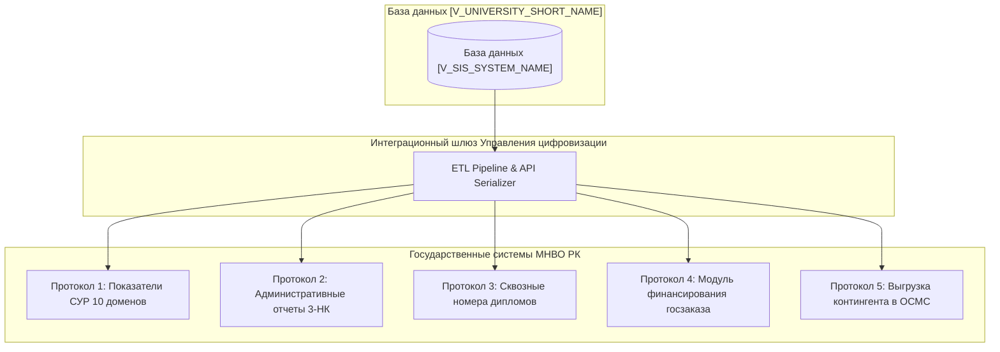

# РЕГЛАМЕНТ ИНТЕГРАЦИИ И ОБМЕНА ДАННЫМИ С ГОСУДАРСТВЕННЫМИ ИНФОРМАЦИОННЫМИ СИСТЕМАМИ (ЕПВО И НОБД)
## Нормативный стандарт [V_UNIVERSITY_SHORT_NAME] (Ликвидация регуляторного долга DEBT-003)

---

### 1. ОБЩИЕ ПОЛОЖЕНИЯ И ЦЕЛЬ

1.1. Настоящий Регламент устанавливает порядок сбора, валидации, формирования структур данных и автоматизированной передачи сведений из базы данных [V_LEGAL_FORM] «[V_UNIVERSITY_FULL_NAME]» (далее — Университет) в государственные информационные системы Министерства науки и высшего образования Республики Казахстан:
- **Единую платформу высшего образования (ИС ЕПВО)**;
- **Национальную образовательную базу данных (НОБД)**.  
1.2. Регламент полностью устраняет регуляторный и технологический долг **`DEBT-003`** («Отсутствие формализованного внутреннего регламента передачи данных между ИС Университета и ИС МНВО РК»), предотвращая риски наложения штрафных санкций и предписаний КОКСНВО при искажении показателей Системы управления рисками (СУР) и движения контингента.  
1.3. В своей деятельности участники регламента руководствуются Законом РК «Об образовании», Законом РК «Об информатизации», Законом РК «О персональных данных и их защите», Едиными требованиями в области ИКТ и обеспечения ИБ (ПП РК № 832), Методикой и правилами проведения испытаний на соответствие требованиям информационной безопасности (Приказ МЦРИАП № 111/НҚ, `MDIAI-07`), техническими требованиями API ЕПВО v3.0.1 и настоящим Регламентом.

---

### 2. ПЯТЬ ОТРАСЛЕВЫХ ПРОТОКОЛОВ СИНХРОНИЗАЦИИ

Интеграционный шлюз Университета обеспечивает сквозной автоматизированный обмен данными по **5 утвержденным отраслевым протоколам МНВО РК**:

#### Протокол 1. Модуль Системы управления рисками (СУР):
- **Передаваемые данные:** Сводные количественные и качественные показатели деятельности ОВПО по 10 направлениям риска (остепененность ППС, книгообеспеченность, площади помещений, аккредитационный статус ОП, оснащенность лабораторий, научные гранты).
- **Периодичность:** Ежеквартально (до 10 числа месяца, следующего за отчетным кварталом) и по официальному запросу КОКСНВО.

#### Протокол 2. Модуль административной и статистической отчетности:
- **Передаваемые данные:** Сведения по форме 3-НК, движение контингента обучающихся (зачисление, перевод, восстановление, отчисление, академические отпуска) с привязкой к ИИН и номерам приказов.
- **Периодичность:** Ежемесячно (до 5 числа) и ежегодно на начало учебного года (к 1 октября).

#### Протокол 3. Модуль сквозной генерации и учета номеров дипломов:
- **Передаваемые данные:** Персональные данные выпускников, выполнивших академический план (ИИН, ФИО, направление подготовки, тема ВКР, GPA), для валидации и присвоения уникального идентификационного номера государственного/собственного образца с QR-кодом.
- **Периодичность:** В период работы ГАК (июнь–июль, январь).

#### Протокол 4. Модуль государственного образовательного заказа и финансирования:
- **Передаваемые данные:** Пофамильные списки студентов, обучающихся по государственным образовательным грантам, сельской квоте, грантам акиматов, расчет подушевого финансирования, подтверждение начисления академических стипендий.
- **Периодичность:** Ежемесячно для закрытия актов оказанных образовательных услуг с АО «Финансовый центр».

#### Протокол 5. Модуль интеграции с Фондом социального медицинского страхования (ОСМС):
- **Передаваемые данные:** Реестр обучающихся очной формы обучения (ИИН, статус обучения) для обеспечения права студентов на бесплатное медицинское обслуживание за счет государства.
- **Периодичность:** Еженедельно (автоматический delta-sync изменений контингента).

---

### 3. РАСПРЕДЕЛЕНИЕ ОБЯЗАННОСТЕЙ И RACI-МАТРИЦА

| Этап интеграционного процесса | Управление цифровизации | Офис регистратора | Департамент кадров (HR) | Финансовый департамент | Институты |
|:---|:---:|:---:|:---:|:---:|:---:|
| Техническая поддержка API-шлюза и сериализации данных | **A** | I | I | I | I |
| Верификация и выверка контингента студентов | C | **A** | I | I | R |
| Выверка данных по остепененности и квалификации ППС | C | I | **A** | I | R |
| Согласование финансовых расчетов подушевого заказа | I | C | I | **A** | I |
| Генерация номеров дипломов через шлюз ЕПВО | R (техвыгрузка) | **A** | I | I | C |
| Устранение ошибок валидации со стороны сервисов МНВО | **A** | R (исправление) | R (исправление) | I | I |

> **Пояснение модели и обозначений RACI:**  
> Модель RACI определяет распределение ответственности при сквозной интеграции информационных систем:  
> - **R (Responsible / Исполнитель)** — профильное подразделение, непосредственно формирующее, проверяющее или корректирующее пакеты первичных данных;  
> - **A (Accountable / Подотчетный)** — полномочный владелец интеграционного процесса, несущий персональную ответственность за работоспособность шлюзов или достоверность выгрузки (строго один **A** на процесс);  
> - **C (Consulted / Консультант)** — экспертная служба, привлекаемая для методологической выверки формата данных;  
> - **I (Informed / Информируемый)** — заинтересованная сторона, уведомляемая об успешной передаче данных или системных предупреждениях.  
>  
> **Институциональное распределение ответственности:**  
> - **Управление цифровизации** единолично отвечает за техническую работоспособность шлюзов, шифрование и бесперебойность API-обмена;  
> - **Офис регистратора, Департамент кадров и Бухгалтерия** несут персональную ответственность за 100% достоверность и своевременность ввода первичных данных в цифровую платформу [V_SIS_SYSTEM_NAME].

---

### 4. РЕГЛАМЕНТ РЕАГИРОВАНИЯ НА ОШИБКИ, SLA И СИНХРОНИЗАЦИЯ ЗЕРКАЛ

4.1. Архитектура интеграции реализуется по схеме **Buffer-Mirror Sync** (буферная верификация перед прямой трансляцией в зеркало ЕПВО), гарантирующей целостность транзакций и нулевое расхождение данных между локальной СУБД Университета и государственными регистрами.  
4.2. Пакетная синхронизация delta-изменений (движение студентов, смена статусов, начисление стипендий) выполняется в автоматическом режиме **ежедневно во внепиковые часы (в 03:00 UTC+5)** с обязательным формированием отчета о сверке зеркал.  
4.3. При возникновении ошибок валидации со стороны серверов ЕПВО (отклонение пакетов данных из-за некорректных ИИН, несовпадения специальностей с Классификатором ОВПО) интеграционный сервис формирует **Лог ошибок валидации**.  
4.4. Лог ошибок незамедлительно (в течение **не более 4 часов**) направляется в HelpDesk ответственному лицу Офиса регистратора, Департамента кадров или Центра карьеры.  
4.5. Ответственное профильное подразделение обязано исправить ошибочные данные в УИС «[V_PRIMARY_EDTECH_PLATFORM]» в течение **24 часов** с момента получения уведомления. Повторная отправка скорректированного пакета данных осуществляется автоматически в следующий цикл синхронизации.  
4.6. **Соответствие требованиям информационной безопасности (Испытания ГТС):** Интеграционные шлюзы и API-сервисы передачи данных в ЕПВО/НОБД допускаются к промышленной эксплуатации исключительно при наличии положительного протокола испытаний РГП «Государственная техническая служба» КНБ РК в соответствии с **Приказом МЦРИАП РК № 111/НҚ (MDIAI-07)** по 5 обязательным направлениям (анализ исходного кода, функции ИБ, сеть, процессы ИБ, нагрузочное тестирование).

---

### 5. ПЕРСОНАЛЬНАЯ И ДИСЦИПЛИНАРНАЯ ОТВЕТСТВЕННОСТЬ

5.1. Срыв регламентных сроков передачи сведений в ИС ЕПВО и НОБД, повлекший искажение показателей Системы управления рисками (СУР), задержку финансирования государственного образовательного заказа, срыв выдачи дипломов с государственными QR-кодами либо блокировку статуса студентов в системе ОСМС, признается грубым нарушением трудовых обязанностей.  
5.2. Должностные лица Офиса регистратора, Департамента кадров, Финансового департамента и Управления цифровизации привлекаются к дисциплинарной ответственности (замечание, выговор, строгий выговор), а при повторном нарушении работником, имеющим дисциплинарное взыскание, — к расторжению трудового договора по инициативе работодателя на основании **пп. 16) п. 1 ст. 52 Трудового кодекса РК**.  
5.3. Передача или разглашение персональных данных обучающихся и ППС через незащищенные внешние каналы в обход утвержденных протоколов влекут расторжение трудового договора по **пп. 12) п. 1 ст. 52 ТК РК** и административную ответственность по **ст. 79 КоАП РК**.

---

### 6. ПРИМЕЧАНИЯ И СВЯЗАННЫЕ АРТЕФАКТЫ

Настоящий Регламент разработан в соответствии с техническими стандартами и архитектурой TFW v3.4.0:
1. **Нормативная база:** Закон РК «Об образовании» (`NPA-001`), Трудовой кодекс РК (ст. 22, 52), КоАП РК (ст. 79), Закон РК «Об информатизации» (`NPA-048`), Приказ МЦРИАП РК № 111/НҚ (`MDIAI-07`), ПП РК № 832 (`MDIAI-03`), Спецификация API ЕПВО v3.0.1.
2. **Связанные акты:** [`docs/internal_acts/regulations/digitalization_department_regulation.md`](file:///g:/Мой%20диск/Google%20AI%20Studio/Abai%20Unviersity%20Transformation/docs/internal_acts/regulations/digitalization_department_regulation.md), [`docs/internal_acts/regulations/registrar_regulation.md`](file:///g:/Мой%20диск/Google%20AI%20Studio/Abai%20Unviersity%20Transformation/docs/internal_acts/regulations/registrar_regulation.md).
3. **Архитектура платформы:** [`docs/internal_acts/blueprints/abai_digital_platform_architecture.md`](file:///g:/Мой%20диск/Google%20AI%20Studio/Abai%20Unviersity%20Transformation/docs/internal_acts/blueprints/abai_digital_platform_architecture.md) — Спецификация 22 модулей УИС «[V_PRIMARY_EDTECH_PLATFORM]».
4. **База знаний:** [`KNOWLEDGE.md`](file:///g:/Мой%20диск/Google%20AI%20Studio/Abai%20Unviersity%20Transformation/KNOWLEDGE.md) — Факты `FACT-007`, `FACT-008`, `FACT-015`, `FACT-016`, `FACT-025`, `FACT-027`.

