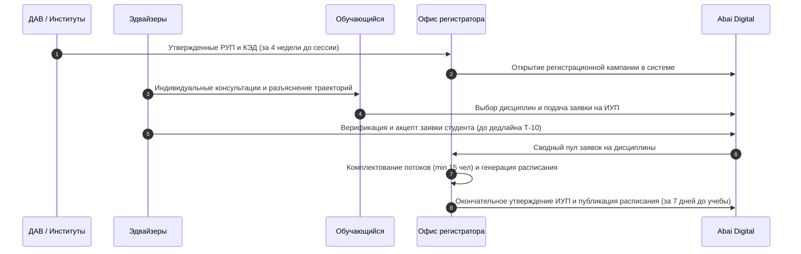

# РЕГЛАМЕНТ ВЗАИМОДЕЙСТВИЯ ОФИСА РЕГИСТРАТОРА, ДЕКАНАТОВ ИНСТИТУТОВ И ЭДВАЙЗЕРОВ ПРИ ФОРМИРОВАНИИ ИНДИВИДУАЛЬНЫХ УЧЕБНЫХ ПЛАНОВ (ИУП) И СОСТАВЛЕНИИ РАСПИСАНИЯ
## Регуляторный нормативный стандарт НАО «КазНПУ имени Абая» (Ликвидация разрыва DEBT-001)

---

### 1. НАЗНАЧЕНИЕ И ОБЛАСТЬ ПРИМЕНЕНИЯ

1.1. Настоящий Регламент устанавливает четкий порядок межуровневого взаимодействия между Офисом регистратора (ОР), деканатами институтов, кафедрами, академическими эдвайзерами и обучающимися НАО «КазНПУ имени Абая» (далее — Университет) при планировании и реализации индивидуальных траекторий обучения.  
1.2. Регламент устраняет нормативный и процессный разрыв **DEBT-001** («Нечеткое разграничение полномочий между ОР и институтами при формировании ИУП»), исключая дублирование функций, коллизии пререквизитов, срывы формирования академических потоков и расписания занятий.  
1.3. Регламент разработан в соответствии с Правилами организации учебного процесса по кредитной технологии обучения (Приказ МОН РК № 152) и Типовыми правилами деятельности ОВПО (Приказ МОН РК № 595).

---

### 2. СУБЪЕКТЫ ПРОЦЕССА И РАСПРЕДЕЛЕНИЕ ПОЛНОМОЧИЙ

| Субъект процесса | Закрепленная сфера исключительной ответственности (Accountable) |
|:---|:---|
| **Офис регистратора (ОР)** | - Техническое открытие и администрирование регистрационной кампании в цифровой платформе Abai Digital. - Контроль соблюдения лимитов кредитов (до 30 ECTS в семестр). - Автоматизированная проверка пререквизитов и постреквизитов. - Формирование академических потоков/групп и общеуниверситетского расписания. - Окончательное системное утверждение ИУП. |
| **Деканат Института** | - Своевременное назначение академических эдвайзеров приказом Директора Института. - Контроль 100% охвата контингента регистрацией на предстоящий семестр. - Рассмотрение спорных академических заявлений студентов (превышение кредитов, повторы). |
| **Академический эдвайзер** | - Персональное консультирование студентов по выбору элективных дисциплин, миноров и треков. - Проверка соответствия выбранных дисциплин каталогу (КЭД) и образовательной программе. - Подписание электронного листа согласования ИУП в модуле «Эдвайзер» (АД.ТЗ.ADVISER-01) платформы Abai Digital. |
| **Кафедра** | - Предоставление в ОР списка лекторов, ассистентов и языковых отделений дисциплин до начала формирования расписания. |
| **Обучающийся** | - Самостоятельный выбор дисциплин и преподавателей в личном кабинете цифровой платформы Abai Digital в установленные сроки Add/Drop. |

---

### 3. ПОШАГОВЫЙ ТАЙМЛАЙН ФОРМИРОВАНИЯ ИУП И РАСПИСАНИЯ

#### Этап 1. Подготовительный (за 4 недели до начала экзаменационной сессии предшествующего семестра):
- ДАВ и институты передают в Офис регистратора утвержденные Каталоги элективных дисциплин (КЭД) и Рабочие учебные планы (РУП).
- Офис регистратора загружает дисциплины и требования по пререквизитам в базу данных цифровой платформы Abai Digital.
- Директораты институтов закрепляют приказом персональных эдвайзеров за группами обучающихся (норматив: не более 100–120 студентов на одного эдвайзера).

#### Этап 2. Консультационный и заявочный (за 3–2 недели до окончания семестра):
- ОР публикует график кампании регистрации (Registration Period) в цифровой платформе Abai Digital.
- Эдвайзеры проводят обязательные установочные сессии с обучающимися (очно или онлайн).
- Обучающиеся через личный кабинет осуществляют выбор элективных дисциплин на следующий академический период.

#### Этап 3. Согласование и верификация (период Add/Drop — за 10 дней до окончания семестра):
- Эдвайзер проверяет сформированный студентом предварительный ИУП:
  - Проверяет освоение обязательных пререквизитов;
  - Проверяет суммарную трудоемкость (не более 30 ECTS для обычного семестра);
  - В случае соответствия — нажимает в LMS статус «Согласовано эдвайзером»;
  - В случае ошибки — отклоняет заявку с указанием причины и возвращает студенту на доработку (срок исправления — 48 часов).

#### Этап 4. Формирование групп, потоков и расписания (Офис регистратора):
- По окончании кампании регистрации ОР производит аудит наполняемости групп:
  - Минимальная наполняемость группы по элективным дисциплинам бакалавриата — не менее **15 обучающихся** (для магистратуры — не менее **5**, докторантуры — не менее **2**).
  - При недоборе группы дисциплина аннулируется, а записавшимся студентам через эдвайзера предоставляется 3 рабочих дня для выбора альтернативного курса (Re-registration).
- Сектор расписания ОР формирует общеуниверситетское расписание занятий на основе укомплектованных групп и аудиторного фонда.
- **Дедлайн публикации расписания:** не позднее, чем за **7 календарных дней** до начала учебных занятий семестра.

#### Этап 5. Финальное утверждение и блокировка ИУП:
- В первый день начала академического семестра Офис регистратора блокирует внесение любых несанкционированных правок в ИУП.
- ИУП приобретает статус официального юридического документа, определяющего академические и финансовые обязательства сторон.
- Дополнительный период корректировки (Late Add/Drop) допускается исключительно в течение первых 5 учебных дней семестра по личному заявлению обучающегося, согласованному с Директором Института и ОР.

---

### 4. МЕХАНИЗМ РАЗРЕШЕНИЯ СПОРНЫХ СИТУАЦИЙ (ARBITRATION)

4.1. В случае разногласий между студентом, эдвайзером и институтом относительно выбора дисциплины или пререквизитов, окончательное нормативное решение принимает **Академическая комиссия института** под председательством заместителя директора по академической работе.  
4.2. В случае возникновения межфакультетских (межинститутских) коллизий по расписанию аудиторного фонда или потоков решение Офиса регистратора является окончательным и обязательным к исполнению всеми институтами и кафедрами.  
4.3. Категорически запрещается ручное добавление студентов преподавателями в журналы занятий вне утвержденного в цифровой платформе Abai Digital контингента потока. Оценки студентов, не зарегистрированных в официальной ведомости ОР, признаются недействительными.

---

### 5. МАТРИЦА RACI РЕГЛАМЕНТА ИУП

| Операция регламента | Офис регистратора | Деканат Института | Эдвайзер | Преподаватель | Студент |
|:---|:---:|:---:|:---:|:---:|:---:|
| Назначение эдвайзеров | I | **A** | R | I | I |
| Загрузка КЭД и пререквизитов в LMS | **A** | C | I | I | I |
| Индивидуальный выбор дисциплин в LMS | I | I | C | I | **A** |
| Валидация пререквизитов и акцепт ИУП | C | I | **A** | I | I |
| Расформирование малокомплектных потоков | **A** | C | R | I | I |
| Формирование сетки расписания занятий | **A** | C | I | C | I |
| Утверждение и системная блокировка ИУП | **A** | I | I | I | I |
| Корректировка в период Late Add/Drop (5 дней) | **A** | C | R | I | R |

> **Пояснение модели и обозначений RACI:**  
> Модель RACI регулирует операционное взаимодействие участников регламента ИУП:  
> - **R (Responsible / Исполнитель)** — участник процесса (студент, эдвайзер, диспетчер), выполняющий конкретную операцию выбора, проверки или корректировки;  
> - **A (Accountable / Подотчетный)** — единственный полномочный владелец процесса (Руководитель Офиса регистратора / Директор института), несущий персональную ответственность за соблюдение дедлайна и утверждение итогового решения (строго один **A** на процесс);  
> - **C (Consulted / Консультант)** — привлекаемая сторона, проводящая предварительное согласование или консультацию;  
> - **I (Informed / Информируемый)** — лицо или подразделение, автоматически уведомляемое системой о статусе заявки/ИУП.  
>  
> **Нормативное резюме:** Разрыв `DEBT-001` полностью нивелирован: исключены спорные зоны ответственности между ОР и деканатами, закреплены жесткие дедлайны для каждого этапа.
