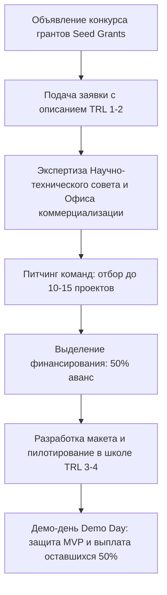

# РЕГЛАМЕНТ РАЗРАБОТКИ MINIMAL VALUABLE PRODUCT (MVP) В НИР И ПРЕДОСТАВЛЕНИЯ ВНУТРЕННИХ ПОСЕВНЫХ ГРАНТОВ (SEED GRANTS)
## Нормативный стандарт [V_UNIVERSITY_SHORT_NAME] на основе лучших практик AITU

---

### 1. ЦЕЛЬ И ОБЛАСТЬ ПРИМЕНЕНИЯ

1.1. Настоящий Регламент устанавливает порядок перевода научно-исследовательских работ кафедр, лабораторий и проектных групп [V_UNIVERSITY_SHORT_NAME] (далее — Университет) с теоретической отчетности на создание практико-ориентированных продуктов — **минимально жизнеспособных продуктов (Minimal Valuable Product — MVP)**.  
1.2. Регламент определяет критерии оценки технологической готовности продуктов по шкале **TRL (Technology Readiness Level) 1–4**, порядок выделения внутриуниверситетских посевных грантов (University Seed Grants) и процедуру обязательной апробации разработок в организациях образования.  
1.3. Действие настоящего Регламента распространяется на профессорско-преподавательский состав, научных сотрудников, докторантов, магистрантов и студентов Университета.

---

### 2. КЛАССИФИКАЦИЯ И ШКАЛА ГОТОВНОСТИ НАУЧНЫХ MVP ДЛЯ АБАЙ УНИВЕРСИТЕТА

Ввиду специфики педагогического исследовательского университета шкала TRL 1–4 адаптирована под научно-образовательные и цифровые продукты:

| Уровень TRL | Стадия зрелости продукта | Что признается подтвержденным результатом в [V_UNIVERSITY_SHORT_NAME] |
|:---:|:---|:---|
| **TRL 1** | Фундаментальная концепция | Опубликованная научная статья в базе Scopus/WoS с теоретическим обоснованием новой педагогической модели, алгоритма или метода. |
| **TRL 2** | Формулирование концепции применения | Разработанная архитектура продукта, техническое задание (ТЗ), структура авторского УМК, дизайн цифровой платформы или протокола эксперимента. |
| **TRL 3** | Экспериментальное подтверждение концепции (Proof of Concept) | Лабораторный прототип программы, альфа-версия цифрового тренажера, черновой вариант интерактивного учебного пособия с первичным тестированием на фокус-группе (15–20 обучающихся). |
| **TRL 4** | Валидация компонента/макета в реальных условиях (MVP) | **Минимально жизнеспособный продукт (MVP):** бета-версия цифрового сервиса / платформы, авторский учебно-методический комплекс или методика инклюзивного обучения, **успешно прошедшие пилотную апробацию в базовой школе-партнере с оформлением двустороннего Акта внедрения**. |

---

### 3. ПОРЯДОК ВЫДЕЛЕНИЯ ВНУТРЕННИХ ПОСЕВНЫХ ГРАНТОВ (SEED GRANTS)

3.1. Для финансирования сборки MVP Университет ежегодно формирует целевой фонд посевных грантов (Seed Grants) в размере не менее 5% от объема собственных средств Университета от научной деятельности и коммерциализации.  
3.2. Размер одного посевного гранта составляет от **1 000 000 до 3 000 000 тенге** со сроком реализации от 6 до 12 месяцев.  
3.3. **Требования к проектной команде:**
- Междисциплинарный состав: не менее 1 научного руководителя (ППС с PhD) и не менее 2–3 обучающихся (докторант, магистрант, студент);
- Обязательное привлечение внешнего стейкхолдера (школы, колледжа, EdTech-компании) в качестве со-заказчика пилота.

#### Этапы конкурса Seed Grants:

---

### 4. КРИТЕРИИ ПРИЕМКИ И ОТЧЕТНОСТЬ ПО MVP

4.1. Проект считается успешно завершенным исключительно при предоставлении:
1. **Действующего образца MVP** (работающая ссылка на веб-сервис/приложение, доступ к цифровому тренажеру или тираж методического комплекса);
2. **Акта пилотной апробации**, подписанного руководителем базовой школы / организации образования и скрепленного печатью;
3. **Охранного документа** (свидетельства о государственной регистрации авторского права на ПО/методику или заявки на патент полезной модели), оформленного через Офис коммерциализации на имя Университета.  
4.2. Проекты, достигшие TRL 4, получают право льготного входа в университетский акселератор и рекомендацию на конкурсы грантов коммерциализации Фонда «Наука» (до 300 млн тенге).
