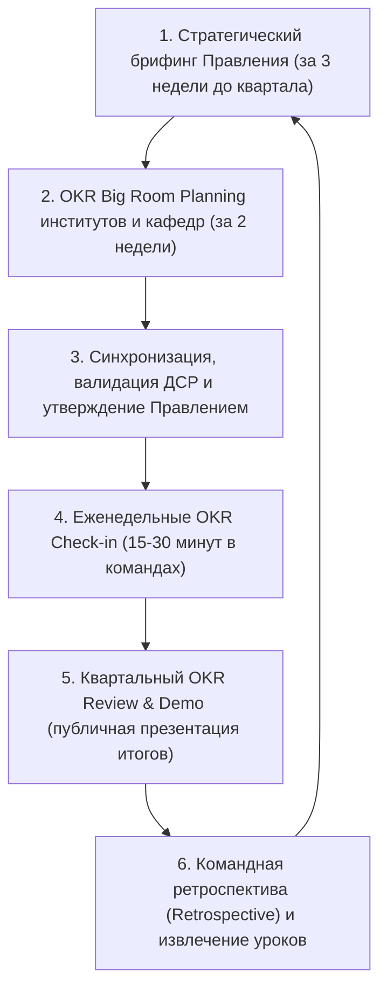

# РЕГЛАМЕНТ ПРИМЕНЕНИЯ МЕТОДОЛОГИИ OKR (OBJECTIVES AND KEY RESULTS) И СКОРИНГА РЕЗУЛЬТАТИВНОСТИ
## Некоммерческого акционерного общества «Казахский национальный педагогический университет имени Абая»

---

### 1. ОБЩИЕ ПОЛОЖЕНИЯ И ЦЕЛИ РЕГЛАМЕНТА

1.1. Настоящий Регламент устанавливает единый стандартизированный порядок разработки, согласования, утверждения, ритмичного еженедельного сопровождения, квартального подведения итогов и скоринга в рамках методологии **OKR (Objectives and Key Results — «Цели и ключевые результаты»)** в НАО «Казахский национальный педагогический университет имени Абая» (далее — Университет).  
1.2. Регламент разработан в развитие Стратегии развития Университета на 2026–2030 годы и направлен на реализацию передовой **гибридной модели стратегического управления**:
- **KPI («Run the University» / «Функционирование»):** Обеспечивает выполнение обязательных нормативов законодательства Республики Казахстан (Закон «Об образовании», Закон «О науке и технологической политике», Закон «Об акционерных обществах», Приказ МНЭ РК № 56, критерии Системы управления рисками МНВО/МНЭ № 166/116), лицензионных параметров и долгосрочных ориентиров Совета директоров.
- **OKR («Change the University» / «Трансформация»):** Обеспечивает гибкую, быструю и амбициозную реализацию трансформационных изменений, межфункциональное сотрудничество институтов и подразделений, прорывное развитие дидактики, науки и технологий через 90-дневные ритмичные циклы.
1.3. Настоящий Регламент обязателен для применения всеми членами Правления, директорами институтов, заведующими кафедрами, руководителями научно-исследовательских институтов (НИИ), центров, лабораторий и административных департаментов Университета.

---

### 2. ТЕРМИНЫ, ОПРЕДЕЛЕНИЯ И БАЗОВЫЕ ПРИНЦИПЫ OKR

2.1. В настоящем Регламенте применяются следующие ключевые термины:
- **Цель (Objective / O):** Качественное, вдохновляющее, амбициозное и понятное описание того, чего Университет, институт или подразделение стремится достичь за определенный временной интервал (квартал или год). Цель отвечает на вопрос: *«Куда мы хотим прийти?»*.
- **Ключевой результат (Key Result / KR):** Количественный, строго измеримый и верифицируемый критерий достижения поставленной Цели. Ключевой результат отвечает на вопрос: *«Как мы узнаем, что достигли цели?»* и формулируется по принципу изменения метрики: *«Увеличить / снизить показатель с X до Y к дате Z»*.
- **Амбициозная цель (Moonshot OKR):** Цель исключительной сложности, достижение которой на 60–70% (скоринг 0.6–0.7) признается выдающимся командным результатом. Направлена на выход за пределы текущих возможностей.
- **Обязательная цель (Roofshot / Committed OKR):** Цель, связанная с критически важными трансформационными обязательствами, достижение которой планируется на 100% (скоринг 1.0).
- **Синхронизация (Alignment):** Процесс согласования целей между подразделениями разных уровней по горизонтали и вертикали для устранения конфликтов приоритетов и дублирования.
- **OKR Champion (Амбассадор трансформации):** Специально подготовленный сотрудник подразделения, фасилитирующий постановку OKR, модерирующий регулярные встречи и обеспечивающий корректный ввод данных.

2.2. **Базовые принципы функционирования OKR в Университете:**
1. **Фокус на главном:** Не более 3–5 Целей на организацию или подразделение в квартал, и от 3 до 5 Ключевых результатов на каждую Цель.
2. **Баланс векторов (50/50):** 50% OKR формируются централизованно «сверху вниз» (Top-Down) на основе стратегических приоритетов Правления, а 50% — инициируются институтами и кафедрами «снизу вверх» (Bottom-Up).
3. **Радикальная прозрачность:** 100% целей и прогресса всех институтов и департаментов открыты для просмотра внутри единой информационной платформы Abai Digital.
4. **Ориентация на эффект (Outcome), а не на процессы (Output):** Ключевой результат должен измерять реальное изменение ценности, качества образования, научной продуктивности или сервиса, а не факт выполнения рядового поручения.
5. **Психологическая безопасность и отрыв от карательной мотивации:** Недостижение амбициозного OKR не является основанием для наложения дисциплинарных взысканий или прямого снижения постоянного оклада. Премирование привязывается к общему интегральному вкладу и выполнению базовых KPI, что исключает занижение планок при постановке целей.

---

### 3. СТАНДАРТЫ И ПРАВИЛА ФОРМУЛИРОВАНИЯ OKR

3.1. **Правила для формирования Objectives (Целей):**
- Формулируются на понятном языке без бюрократических штампов;
- Должны мотивировать команду и задавать четкий вектор на 90 дней;
- Не должны содержать цифр (цифры выносятся исключительно в Key Results);
- Пример корректной цели: *«Сделать педагогическую практику студентов магистратуры образцом интеграции нейродидактики в школах г. Алматы»*.
- Пример некорректной цели: *«Провести 5 совещаний по педпрактике и обновить 3 регламента»*.

3.2. **Правила для формирования Key Results (Ключевых результатов):**
- Должны быть строго измеримыми числом, процентом, валютной суммой или четким бинарным майлстоуном (0 или 1);
- Должны измерять результат завершенного действия, а не активность;
- Формула составления: `[Глагол действия] + [Что именно] + [с показателя X] + [до показателя Y]`.
- Примеры качественных KR:
  * *«Повысить долю открытых цифровых портфолио студентов 4 курса до 95%»*;
  * *«Привлечь 3 внешних исследовательских гранта от международных партнеров на сумму не менее 45 млн тенге»*;
  * *«Сократить среднее время выдачи академических транскриптов с 48 часов до 15 минут в мобильном приложении»*.

---

### 4. ПОШАГОВЫЙ 90-ДНЕВНЫЙ КВАРТАЛЬНЫЙ ЦИКЛ OKR

Процесс реализации OKR носит циклический характер и повторяется каждые 3 месяца (Q1–Q4):

#### Регламент прохождения процедур квартального цикла:

| Фаза цикла | Содержание процедуры и регламентные действия | Сроки проведения | Ответственный субъект | Выходной результат |
|:---|:---|:---:|:---|:---|
| **1. Strategic Briefing** | Правление объявляет 3–5 общеуниверситетских приоритетов на наступающий квартал | За 20 дней до начала квартала | Председатель Правления – Ректор | Общеуниверситетские OKR 1-го уровня |
| **2. Team Planning** | Сессии институтов, департаментов и кафедр: формулирование командных O и KR | За 14 дней до начала квартала | Директора институтов, Начальники департаментов | Проекты командных карт OKR в Abai Digital |
| **3. Alignment & Approval** | Кросс-функциональная экспертиза ДСР на отсутствие дублирования, утверждение Правлением | За 5 дней до начала квартала | Директор Департамента стратегии, Правление | Утвержденные квартальные матрицы OKR |
| **4. Weekly Check-in** | Еженедельные 20-минутные командные планерки: фиксация прогресса, уверенности (Confidence Score) и блокеров | Еженедельно (понедельник/пятница) | Руководители подразделений, OKR Champions | Обновленный прогресс-бар в Abai Digital |
| **5. Quarterly Review** | Открытая общеуниверситетская сессия: демонстрация фактов достижения KR и ключевых инсайтов | Последняя неделя квартала | Проректоры, Директора институтов, ДСР | Протокол итогового скоринга квартала |
| **6. Retrospective** | Анализ узких мест, командной динамики и причин недостижения отдельных амбициозных целей | В течение 3 дней после Review | OKR Champions, команды институтов | План улучшений на следующий квартальный цикл |

---

### 5. МЕТОДИКА ОЦЕНКИ И ШКАЛА СКОРИНГА (GOOGLE / DOERR MODEL)

5.1. Оценка достижения каждого Ключевого результата (Key Result) рассчитывается по математической шкале от **0.0 до 1.0**:

$$Score_{KR} = \min\left(1.0, \; \frac{KR_{fact} - KR_{start}}{KR_{target} - KR_{start}}\right)$$

5.2. Итоговый балл Цели ($Score_O$) вычисляется как среднее арифметическое входящих в нее Ключевых результатов:

$$Score_O = \frac{1}{N}\sum_{j=1}^{N} Score_{KR_j}$$

5.3. **Градация цветовых зон результативности:**

| Оценка (Score) | Цветовая зона | Интерпретация в Университете | Управленческое решение |
|:---:|:---:|:---|:---|
| **0.7 – 1.0** | 🟢 **Зеленая зона** | **Выдающийся прорыв (Sweet Spot).** Цель достигнута, продемонстрирован существенный прогресс по трансформации. | Признание успеха команды, тиражирование практики на другие институты |
| **0.4 – 0.6** | 🟡 **Желтая зона** | **Удовлетворительный прогресс.** Достигнуты заметные результаты, однако амбиция реализована не в полном объеме. | Анализ узких мест, перенос нерешенных задач в следующий цикл с корректировкой гипотез |
| **0.0 – 0.3** | 🔴 **Красная зона** | **Критическое отставание.** Прогресс практически отсутствует либо изначально были выбраны некорректные показатели. | Глубокий ретроспективный анализ, пересмотр подхода, выявление системных препятствий |

> **Правило оценки 1.0:** Если команда стабильно закрывает все свои OKR на 1.0 (100%), это признак занижения планки (Sandbagging) и постановки консервативных рутинных задач. В таком случае в следующем цикле планка амбициозности повышается на 30–50%.

---

### 6. МАТРИЦА РАСПРЕДЕЛЕНИЯ ОТВЕТСТВЕННОСТИ (RACI)

| Операция регламента OKR | Совет директоров | Правление / Ректор | Департамент стратегии (OKR PMO) | Директора институтов | Руководители кафедр / центров | OKR Champions подразделений |
|:---|:---:|:---:|:---:|:---:|:---:|:---:|
| Определение стратегических рамок года (KPI) | **A** | C | C | I | I | I |
| Утверждение квартальных Общеуниверситетских OKR | I | **A** | R (подготовка) | C | I | I |
| Разработка OKR институтов и факультетов | I | I | C (экспертиза) | **A** | R | R (фасилитация) |
| Разработка OKR кафедр и проектных лабораторий | I | I | I | C | **A** | R |
| Модерация и администрирование платформы OKR | I | I | **A** | I | I | R (ввод данных) |
| Проведение еженедельных OKR Check-ins | I | I | I (аудит) | C | **A** | R (ведение протокола) |
| Подготовка сводного отчета Quarterly Review | I | C | **A** | R (отчеты) | R (данные) | R (верификация) |
| Рассмотрение итогов квартала и ретроспективы | I | **A** | R (доклад) | R (выступление) | I | I |

---

### 7. ЦИФРОВИЗАЦИЯ И ТРЕКИНГ В ПЛАТФОРМЕ ABAI DIGITAL

7.1. Весь жизненный цикл OKR реализуется в специализированном модуле **«Стратегия и OKR» Цифровой платформы Abai Digital**.  
7.2. В модуле обеспечивается:
- Визуализация дерева целей Университета (University Tree Alignment);
- Автоматический расчет прогресса Key Results на основе интеграции с LMS Moodle, ЕПВО, 1С:Университет и Наукометрической базой данных;
- Автоматические push-уведомления ответственным лицам о необходимости обновления Confidence Score (индекса уверенности) перед еженедельным чек-ином;
- Тепловая карта рисков (Heatmap), подсвечивающая «красные зоны» с отклонением от графика более чем на 2 недели.

---

### 8. ПРИМЕЧАНИЯ И СВЯЗАННЫЕ АРТЕФАКТЫ

Настоящий Регламент разработан и верифицирован в рамках методологии TFW v3.4.0:
1. **Внешние нормативные правовые акты РК:**
   - [`docs/regulations/09_strategic_planning_and_governance_npa.md`](file:///g:/Мой%20диск/Google%20AI%20Studio/Abai%20Unviersity%20Transformation/docs/regulations/09_strategic_planning_and_governance_npa.md) — Закон РК «Об акционерных обществах», Закон РК «О государственном имуществе», СУР ОВПО Домен 09.
2. **Связанные стратегические документы:**
   - [`docs/internal_acts/blueprints/abai_strategy_2026_2030_architecture.md`](file:///g:/Мой%20диск/Google%20AI%20Studio/Abai%20Unviersity%20Transformation/docs/internal_acts/blueprints/abai_strategy_2026_2030_architecture.md) — Архитектурный паспорт Стратегии 2026–2030: дуальная модель «Run (25 KPI) + Change (OKR)».
   - [`docs/internal_acts/sops_and_rules/sop_university_development_strategy.md`](file:///g:/Мой%20диск/Google%20AI%20Studio/Abai%20Unviersity%20Transformation/docs/internal_acts/sops_and_rules/sop_university_development_strategy.md) — Общий регламент разработки и мониторинга Стратегии.
3. **Организационная структура:**
   - [`docs/internal_acts/regulations/strategic_development_department_regulation.md`](file:///g:/Мой%20диск/Google%20AI%20Studio/Abai%20Unviersity%20Transformation/docs/internal_acts/regulations/strategic_development_department_regulation.md) — Положение о Департаменте стратегического развития (функции OKR PMO).
   - [`docs/internal_acts/job_descriptions/jd_director_strategic_development.md`](file:///g:/Мой%20диск/Google%20AI%20Studio/Abai%20Unviersity%20Transformation/docs/internal_acts/job_descriptions/jd_director_strategic_development.md) — Должностная инструкция Директора ДСР.
4. **Контур доказательств TFW:**
   - [`workspace/ABAI_20260915-160000_OKR_STRAT/evidence/EV__OKR_STRAT.md`](file:///g:/Мой%20диск/Google%20AI%20Studio/Abai%20Unviersity%20Transformation/workspace/ABAI_20260915-160000_OKR_STRAT/evidence/EV__OKR_STRAT.md) — Артефакт верификации доказательств.
   - [`KNOWLEDGE.md`](file:///g:/Мой%20диск/Google%20AI%20Studio/Abai%20Unviersity%20Transformation/KNOWLEDGE.md) — Верифицированная запись `FACT-019` (OKR Framework & Dual Governance Model).
