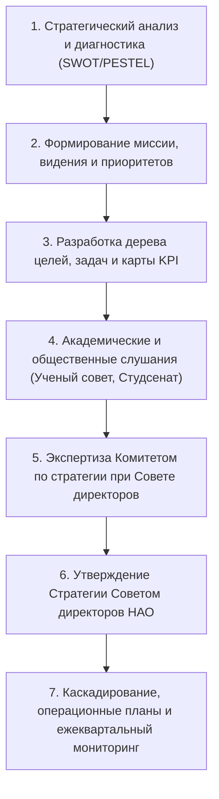

# РЕГЛАМЕНТ РАЗРАБОТКИ, АКТУАЛИЗАЦИИ И МОНИТОРИНГА СТРАТЕГИИ РАЗВИТИЯ
## [V_LEGAL_FORM] «[V_UNIVERSITY_FULL_NAME]»

---

### 1. ОБЩИЕ ПОЛОЖЕНИЯ И ЦЕЛИ РЕГЛАМЕНТА

1.1. Настоящий Регламент устанавливает единый стандартизированный порядок инициации, разработки, широкого обсуждения, независимой экспертизы, утверждения, каскадирования и регулярного мониторинга реализации Стратегии развития [V_LEGAL_FORM] «[V_UNIVERSITY_FULL_NAME]» (далее — Университет).  
1.2. Регламент разработан в строгом соответствии с требованиями Закона РК «Об акционерных обществах», Закона РК «О государственном имуществе», Правил разработки планов развития контролируемых государством АО (Приказ МНЭ РК № 56) и критериев Домена 09 «Миссия, стратегия, ценности ОВПО» Системы управления рисками (Совместный приказ МНВО РК № 166 и МНЭ РК № 116).  
1.3. **Горизонт стратегического планирования:** Стратегия развития Университета утверждается на **5-летний период** с ежегодной декомпозицией на операционные планы мероприятий и каскадированием целевых показателей результативности (KPI).

---

### 2. ПРИНЦИПЫ СТРАТЕГИЧЕСКОГО ПЛАНИРОВАНИЯ

Стратегический процесс Университета базируется на следующих принципах:
1. **Преемственность и соответствие национальной политике:** безусловная гармонизация целей Университета с Концепцией развития высшего образования и науки в РК на 2023–2029 годы (ПП РК № 248) и Национальным планом развития РК.
2. **Измеримость и верифицируемость (SMART):** каждый стратегический показатель имеет однозначный количественный или качественный алгоритм расчета, источник первичных данных и закрепленного владельца.
3. **Инклюзивность и вовлеченность (Shared Governance):** участие профессорско-преподавательского состава, исследователей, обучающихся, ассоциации выпускников и стейкхолдеров-работодателей в формировании приоритетов.
4. **Персональная подотчетность (RACI):** за достижение каждого целевого индикатора закрепляется персонально ответственный проректор, директор института или руководитель департамента.
5. **Цифровая прозрачность:** непрерывный мониторинг индикаторов в модуле «Аналитика и стратегия» цифровой платформы [V_SIS_SYSTEM_NAME].

---

### 3. ПОШАГОВЫЙ ТАЙМЛАЙН ЖИЗНЕННОГО ЦИКЛА СТРАТЕГИИ

Процесс разработки и мониторинга Стратегии развития включает 7 последовательных регламентных фаз:

#### График и регламент прохождения этапов:

| Этап | Содержание работ и процедур | Регламентные сроки | Ответственный субъект | Выходной артефакт |
|:---|:---|:---:|:---|:---|
| **1. Диагностика и бенчмаркинг** | Сбор аналитики, PESTEL, SWOT-анализ, бенчмаркинг ведущих мировых педагогических университетов, анализ рисков | За 8 месяцев до истечения действующей Стратегии | Департамент стратегии, Рабочая группа | Аналитический отчет диагностики |
| **2. Формирование ориентиров** | Определение обновленной миссии, видения, базовых ценностей и ключевых направлений трансформации | 3 недели | Правление Университета, Департамент стратегии | Концепция Стратегии развития |
| **3. Проектирование KPI и OKR** | Разработка сбалансированной системы из 25 ключевых показателей (KPI), Общеуниверситетских OKR 1-го уровня и дорожной карты | 4 недели | Проректоры по направлениям, Департамент стратегии | Проект Стратегии развития, Карта KPI и годовые OKR |
| **4. Общественные слушания** | Обсуждение проекта с коллективом, Ученым советом, Студенческим сенатом, Советом работодателей | 3 недели | Правление, Департамент стратегии | Протоколы слушаний, таблица разногласий |
| **5. Комитетская экспертиза** | Предварительное рассмотрение проекта Комитетом по стратегическому планированию при Совете директоров | До 1 октября | Комитет по стратегии при СД | Экспертное заключение Комитета СД |
| **6. Утверждение СД** | Рассмотрение и утверждение Стратегии Советом директоров [V_UNIVERSITY_SHORT_NAME] | До 1 ноября | Совет директоров Университета | Постановление Совета директоров |
| **7. Каскадирование и OKR-циклы** | Декомпозиция годовых индикаторов на институты и запуск 90-дневных квартальных спринтов OKR (Big Room Planning, еженедельные чек-ины, Quarterly Review) в [V_SIS_SYSTEM_NAME] | Ежеквартально (до 15 числа месяца после квартала) | Директора институтов, Департамент стратегии (OKR PMO) | Квартальные отчеты, протоколы OKR Review, карты KPI |

---

### 4. МАТРИЦА РАСПРЕДЕЛЕНИЯ ОТВЕТСТВЕННОСТИ (RACI)

| Операция регламента Стратегии | Департамент стратегии | Совет директоров | Правление / Ректор | Проректоры по блокам | Директора институтов | Студенческий сенат |
|:---|:---:|:---:|:---:|:---:|:---:|:---:|
| Проведение комплексного SWOT/PESTEL анализа | **A** | I | C | C | R (эксперты) | C (опросы) |
| Формулирование миссии, видения и целей | C | I | **A** | R (соразработчики) | C | C |
| Разработка карты 25 целевых KPI и годовых OKR | **A** | I | C | R (целевые значения) | C | I |
| Проведение открытых академических слушаний | R (модерация) | I | **A** | R (спикеры) | R (участники) | R (участники) |
| Экспертиза проекта Стратегии в Комитете СД | R (доклад) | **A** (Комитет) | C | I | I | I |
| Окончательное утверждение Стратегии на 5 лет | I | **A** | R (внесение проекта) | I | I | I |
| Утверждение квартальных Общеуниверситетских OKR | R (подготовка) | I | **A** | C | C | I |
| Каскадирование показателей и OKR на институты | **A** | I | C | C | R (подписание карт) | I |
| Фасилитация квартальных сессий OKR и чек-инов | **A** | I | I | C | R (защита итогов) | I |
| Ежеквартальная выгрузка фактических KPI в [V_SIS_SYSTEM_NAME] | **A** | I | I | C (верификация) | R (ввод данных) | I |
| Формирование годового отчета по исполнению Стратегии | **A** | I | C | R (материалы) | R (материалы) | I |
| Утверждение годового отчета об исполнении Стратегии | C | **A** | R (доклад) | I | I | I |

> **Пояснение модели и обозначений RACI:**  
> Модель RACI регламентирует разграничение обязанностей в процессе стратегического управления Университетом:  
> - **R (Responsible / Исполнитель)** — должностное лицо или подразделение, непосредственно собирающее данные, готовящее разделы документов или выполняющее мероприятия дорожной карты;  
> - **A (Accountable / Подотчетный)** — единственный полномочный орган или руководитель, несущий персональную ответственность за общий результат, утверждение решений и соблюдение законодательных дедлайнов (строго один **A** на процесс);  
> - **C (Consulted / Консультант)** — эксперт или орган управления, привлекаемый для обязательного предварительного согласования или дачи заключения;  
> - **I (Informed / Информируемый)** — лицо или подразделение, официально уведомляемое об утвержденных планах и итогах мониторинга.

---

### 5. МЕХАНИЗМ АКТУАЛИЗАЦИИ И ВНЕСЕНИЯ ИЗМЕНЕНИЙ

5.1. Корректировка Стратегии развития Университета допускается не чаще **одного раза в год** (за исключением случаев прямого изменения законодательства РК или государственных стратегических программ).  
5.2. Основаниями для внесения изменений являются:
- Изменение нормативно-правовой базы Республики Казахстан в сфере высшего образования и науки;
- Существенное изменение макроэкономических условий или нормативов государственного образовательного заказа;
- Досрочное достижение запланированных индикаторов либо выявление невозможности их достижения по форс-мажорным обстоятельствам по результатам годового мониторинга.  
5.3. Все поправки к Стратегии проходят процедуру рассмотрения Комитетом по стратегическому планированию и утверждаются **исключительно решением Совета директоров**.

---

### 6. ПРИМЕЧАНИЯ И СВЯЗАННЫЕ АРТЕФАКТЫ

Настоящий Регламент разработан и верифицирован в рамках контура стратегического развития Университета (TFW v3.4.0):
1. **Внешние НПА РК:**
   - [`docs/regulations/09_strategic_planning_and_governance_npa.md`](file:///g:/Мой%20диск/Google%20AI%20Studio/Abai%20Unviersity%20Transformation/docs/regulations/09_strategic_planning_and_governance_npa.md) — Закон РК «Об акционерных обществах» (`NPA-STRAT-01`), Приказ МНЭ РК № 56 (`NPA-STRAT-02`), совместный приказ МНВО/МНЭ № 166/116 (Домен 09 СУР).
2. **Связанные внутренние акты и методология OKR:**
   - [`docs/internal_acts/sops_and_rules/sop_okr_framework_and_scoring.md`](file:///g:/Мой%20диск/Google%20AI%20Studio/Abai%20Unviersity%20Transformation/docs/internal_acts/sops_and_rules/sop_okr_framework_and_scoring.md) — Регламент применения методологии OKR и скоринга результативности.
   - [`docs/internal_acts/regulations/strategic_development_department_regulation.md`](file:///g:/Мой%20диск/Google%20AI%20Studio/Abai%20Unviersity%20Transformation/docs/internal_acts/regulations/strategic_development_department_regulation.md) — Положение о Департаменте стратегического развития (OKR PMO).
   - [`docs/internal_acts/job_descriptions/jd_director_strategic_development.md`](file:///g:/Мой%20диск/Google%20AI%20Studio/Abai%20Unviersity%20Transformation/docs/internal_acts/job_descriptions/jd_director_strategic_development.md) — Должностная инструкция Директора Департамента стратегического развития.
3. **Архитектурная модель:**
   - [`docs/internal_acts/blueprints/abai_strategy_2026_2030_architecture.md`](file:///g:/Мой%20диск/Google%20AI%20Studio/Abai%20Unviersity%20Transformation/docs/internal_acts/blueprints/abai_strategy_2026_2030_architecture.md) — Архитектурный паспорт Стратегии: дуальная модель «Run (25 KPI) + Change (OKR)».
4. **Контур доказательств и база знаний:**
   - [`workspace/ABAI_20260915-160000_OKR_STRAT/evidence/EV__OKR_STRAT.md`](file:///g:/Мой%20диск/Google%20AI%20Studio/Abai%20Unviersity%20Transformation/workspace/ABAI_20260915-160000_OKR_STRAT/evidence/EV__OKR_STRAT.md) — Артефакт доказательств внедрения OKR.
   - [`KNOWLEDGE.md`](file:///g:/Мой%20диск/Google%20AI%20Studio/Abai%20Unviersity%20Transformation/KNOWLEDGE.md) — Верифицированные факты `FACT-012`, `FACT-016`, `FACT-019`.

