МИНИСТЕРСТВО НАУКИ И ВЫСШЕГО ОБРАЗОВАНИЯ РЕСПУБЛИКИ КАЗАХСТАН

НАЦИОНАЛЬНЫЙ ЦЕНТР РАЗВИТИЯ ВЫСШЕГО ОБРАЗОВАНИЯ

ASTANA IT UNIVERSITY

С.Омирбаев, А.Мухатаев, С.Бурбекова, Х.Касенов, Ш.Сулейменова

СИСТЕМА ОБЕСПЕЧЕНИЯ КАЧЕСТВА ВЫСШЕГО ОБРАЗОВАНИЯ:

РЕИНЖИНИРИНГ НАЦИОНАЛЬНОЙ МОДЕЛИ

МОНОГРАФИЯ

Астана - 2023

ББК 74

УДК 378.1

О-57

О-57 Омирбаев С.М., Мухатаев А.А., Бурбекова С.Ж., Касенов Х.Н., Сулейменова Ш.К. Система обеспечения качества высшего образования: реинжиниринг национальной модели: Монография. – Астана, 2023. – 206 с.

ISBN

В монографии предложены усовершенствованная национальная модель обеспечения качества и модель внутреннего обеспечения качества в организации высшего и послевузовского образования на основе исследования состояния качества высшего образования в Казахстане.

Монография подготовлена в рамках научной программы «BR18574103 Повышение конкурентоспособности вузов Казахстана через реинжиниринг национальной системы обеспечения качества высшего образования».

Адресована административно-управленческому персоналу, научным работникам, преподавателям и обучающимся системы высшего и послевузовского образования, сотрудникам государственных органов управления системой образования.

УДК 378.01

ББК 74

Рецензенты:

Каргин С.Т., доктор педагогических наук, профессор Карагандинского университета им. Е.А. Букетова

Кудышева А.А., кандидат педагогических наук, проректор по академическим вопросам Южно-Казахстанского педагогического университета

ISBN 978-5-8050-0672-3

Рекомендована к печати решением Ученого совета Astana IT University, протокол №2 от 28.09.2023 г.

© Омирбаев С.М., Мухатаев А.А., Бурбекова С.Ж.,

Касенов Х.Н., Сулейменова Ш.К.

## СОДЕРЖАНИЕ

| ВВЕДЕНИЕ (Айдос Мухатаев)....................................................... | 5 |
| --- | --- |
| РАЗДЕЛ 1. ОПРЕДЕЛЕНИЕ И КЛАСТЕРИЗАЦИЯ ФАКТОРОВ, ОКАЗЫВАЮЩИЕ ПРЯМОЕ И КОСВЕННОЕ ВЛИЯНИЕ НА КАЧЕСТВО ВЫСШЕГО ОБРАЗОВАНИЯ....................................... | 10 |
| 1.1 Анализ научной литературы по вопросам обеспечения качества (Айдос Мухатаев, Сауле Бурбекова) ............................ | 10 |
| 1.2 Изучение отечественного и международного опыта обеспечения качества высшего образования (Серик Омирбаев, Шынар Сулейменова, Ханат Касенов) ......................................... | 27 |
| 1.3 Анализ нормативных правовых актов в сфере подготовки кадров и обеспечения качества высшего образования (Серик Омирбаев, Шынар Сулейменова) .................................................. | 53 |
| 1.4 Эмпирическое исследование по выявлению проблем в системе обеспечения качества высшего образования РК (Айдос Мухатаев)........................................................................... | 65 |
| РАЗДЕЛ 2. КОНЦЕПЦИЯ И УСОВЕРШЕНСТВОВАННАЯ НАЦИОНАЛЬНАЯ МОДЕЛЬ СИСТЕМЫ ОБЕСПЕЧЕНИЯ КАЧЕСТВА ВЫСШЕГО ОБРАЗОВАНИЯ ....................................... | 105 |
| 2.1 Концепция обеспечения качества высшего образования на основе анализа отечественной и зарубежных систем обеспечения качества высшего образования (Серик Омирбаев) ........................................................................... | 105 |
| 2.2 Разработка усовершенствованной национальной модели системы обеспечения качества высшего образования (Серик Омирбаев) ....................................................................................... | 117 |
| 2.3 Архитектура системы обеспечения качества высшего образования на основе усовершенствованной Национальной модели (Айдос Мухатаев) ............................................................. | 142 |
| ЗАКЛЮЧЕНИЕ (Айдос Мухатаев) ................................................. | 173 |
| СПИСОК ИСПОЛЬЗОВАННЫХ ИСТОЧНИКОВ ............................ | 176 |
| ПРИЛОЖЕНИЯ (Айдос Мухатаев)................................................ | 188 |

## ПЕРЕЧЕНЬ ОБОЗНАЧЕНИЙ И СОКРАЩЕНИЙ

В настоящей монографии применяются следующие обозначения и сокращения:

| ESG | - | Стандарты и руководства для обеспечения качества высшего образования в Европейском пространстве высшего образования |
| --- | --- | --- |
| EQAR | - | Европейский реестр обеспечения качества |
| ENQA | - | Европейская ассоциация обеспечения качества высшего образования |
| OESD | - | Организация экономического сотрудничества и развития |
| АУП | - | Административно-управленческий персонал |
| ВО | - | Высшее образование |
| вуз | - | Высшее учебное заведение |
| ВНД | - | Внутренние нормативные документы |
| ГОСО | - | Государственные общеобязательные стандарты образования |
| ЕПВО | - | Европейское пространство высшего образования |
| ИКТ | - | Информационно-коммуникационные технологии |
| ИС | - | Информационная система |
| КТО | - | Кредитная технология обучения |
| НПА | - | Нормативно-правовые акты |
| НРК | - | Национальная рамка квалификации |
| НЦРВО | - | Национальный центр развития высшего образования |
| ОВПО | - | Организация высшего и послевузовского образования |
| ОП | - | Образовательная программа |
| ОРК | - | Отраслевые рамки квалификации |
| ПС | - | Профессиональные стандарты |
| ППС | - | Профессорско-преподавательский состав |
| РО | - | Результаты обучения |
| РОП | - | Реестр образовательных программ |
| СВОК | - | Система внутреннего обеспечения качества |

# ВВЕДЕНИЕ

Проблема развития национальной системы высшего образования стала предметом исследований ученых из разных стран. Обеспечение качества образования (в том числе высшего) является одной из глобальных Целей Устойчивого Развития Организации Объединенных Наций, что соответствует инициативе «Обеспечение всеохватного и справедливого качественного образования и поощрение возможности обучения на протяжении всей жизни для всех» и его ключевым показателям эффективности.

Стремясь создать систему обеспечения качества образования, казахстанские вузы действуют согласно Стандартам и руководству для обеспечения качества высшего образования в Европейском пространстве высшего образования – ESG. В Казахстане ESG рассматриваются скорее как практический инструмент.

В соответствии с Глобальным индексом знаний 2021 года Казахстан занимает невысокое место с точки зрения своей инфраструктуры знаний. Казахстан занимает 78-е место из 154 стран 72-е место из 154 в секторе высшего образования. В 2022 году в данном Индексе показатели ухудшились: 78 место в общем и 79 место в высшем образовании среди 132 стран.

Согласно рейтингу стран мира по индексу глобальной конкурентоспособности (2020) Казахстан занимает 55 место, а по индексу человеческого развития (2020) – 51 место. В целом показатели коррелируется между собой и раскрывает противоречия между необходимым и достигнутым качества образования, в частности высшего образования и конкурентоспособности системы.

В основе неудовлетворительного качества высшего образования Казахстана лежат несколько факторов. Вот основные из них:

1) отсутствие автономии – до 2018 года система высшего и послевузовского образования находилась под жесткой регламентацией государственного управления, теряя в гибкости в условиях глобальной конкурентоспособности. Как следствие – быстрое устаревание содержания образования, неактуальность образовательных программ и ограниченность возможности предложения вузами разнообразных траекторий обучающимся, что породило несоответствие запросам развивающего рынка труда;
2) недостаточное финансирование, в условиях низкой платежеспособности населения достаточно долгое время стоимость государственных грантов (при увеличении его количества) оставалась неизменной. Это привело к низкому уровню оплаты труда преподавателей (как следствие – утечка лучших специалистов в более привлекательные секторы экономики) и устареванию материально-технической базы университетов. Стоимость грантов на подготовку магистров и по сей день остается низким, даже ниже чем в бакалавриате;
3) коррупционные проявления в лицензировании и контроле качества высшего образования, что привело к открытию и существованию большого количества учебных заведений не соответствующих квалификационным требованиям.
Эти и другие проблемы непременно снижают конкурентоспособность и эффективность высшего образования. К ним можно отнести низкую эффективность системы обеспечения качества образования.

Для решения этих проблем необходимо принимать комплексные меры, учитывая мировые тенденции и лучшие практики, а также усиливать взаимодействие между государством, вузами, работодателями и общественностью.

С принятием Закона «О внесении изменений и дополнений в некоторые законодательные акты Республики Казахстан по вопросам расширения академической и управленческой самостоятельности высших учебных заведений» высшие учебные заведения получили в определенной степени свободу действия, тем самым было заложено начало решения первой проблемы – отсутствия автономии.

В 2020 году стоимость грантов на обучение по программам бакалавриата была увеличена от 30 до 300%, что позволило поэтапно увеличивать заработную плату ППС и обновление МТБ вузов. Тем не менее, дефицит высококвалифицированных кадров в сфере высшего образования до сих пор сохраняется.

Эти и другие решения проблем, конечно же, должны дать результаты в средне- и дальнесрочной перспективе. Государством предпринимаются меры для повышения качества и престижности высшего образования, в 2022 году путем реорганизации Министерства образования и науки создано Министерство науки и высшего образования.

Концепцией развития высшего образования и науки перед системой поставлены амбициозные задачи, казахстанские вузы должны войти в разные мировые рейтинги. Один из ключевых задач – увеличение доли иностранных студентов до 10% к 2029 году (согласно демографическим данным – это более 100 тысяч обучающихся).

Перед системой возникают вопросы: каким образом выполнить поставленные задачи? как достичь показателей? При изобилии финансирования можно было бы открыть новых или раскачать действующие несколько вузов по сценарию «ускоренные университеты». К сожалению в условиях глобальной неопределенности и политической нестабильности, такой «роскоши» не имеется. Даже реализуемая со следующего года инициатива «20 Центров академического превосходства» не принесет много пользы, так как, опять же, выделяемая сумма является не самой большой. Что делать в такой ситуации?

Нам кажется, есть один выход – настройка системы обеспечения качества таким образом, чтобы она стала синергетической и гармоничной; четкое определение ответственности и функции каждого участника процесса – обучающихся, вуза, аккредитационных органов, работодателей и государства. Особенно следует обратить внимание на систему внутреннего обеспечения качества как первостепенной ячейки национальной модели обеспечения качества, регламентацию процессов и процедур в соответствии стандартам обеспечения качества.

Это и другие факторы предполагают проведение исследования по реинжинирингу национальной системы высшего образования для повышения конкурентоспособности казахстанских вузов на мировом рынке. В 2018 году Центр Болонского процесса и академической мобильности (ныне – Национальный центр развития высшего образования) опубликовал Аналитический отчет, в котором предложено усилить внутреннюю систему обеспечения качества, казахстанским вузам рекомендовано усилить качественный состав академических услуг и структурных единицы. Необходимо концептуально пересмотреть внутренние документы и положения, регулирующие вопросы академической и научной политики вуза. При этом данная работа должна проводиться в условиях новой нормативно-правовой базы в рамках институциональной, академической и управленческой автономии казахстанских вузов.

Многие исследователи согласны с положением о том, что конкурентоспособность высших учебных заведений зависит от системы обеспечения качества высшего образования.

Таким образом, вопросы обеспечения качества высшего образования зависит от эффективно выстроенной методологии и целостностью его циклов, поэтому эти проблемы являются предметом данной монографии.

В монографии авторы сделали попытку решить комплекс научно-прикладных задач по совершенствованию целостной системы обеспечения качества высшего образования, направленного на конечный результат – подготовку конкурентоспособного специалиста.

В разделе 1 определены и кластеризованы факторы, оказывающие прямое и косвенное влияние на качество высшего образования. Проанализированы научная литература по проблеме, отечественный и международный опыт обеспечения качества высшего образования, нормативно-правовые акты в сфере высшего образования. Приведены результаты эмпирического исследования, проведенного с целью выявления проблем в системе обеспечения качества высшего образования РК

В разделе 2 представлена разработанная Концепция обеспечения качества высшего образования, подготовленная по итогам анализа соответствующих материалов и проведенных эмпирических исследований, а также описывается усовершенствованная на основе Концепции национальная модель системы обеспечения качества высшего образования, Теоретически обоснован необходимость реинжиниринга национальной системы обеспечения качества высшего образования РК.

Здесь же представлена архитектура системы обеспечения качества высшего образования на основе Национальной модели. Особое внимание уделено системе внутреннего обеспечения качества, что станет практической помощью для организациий высшего и послевузовского образования.

Исследование обусловлено важными экономическими и социальными вызовами современного общества, а также рядом долгосрочных государственных и международных мер по повышению конкурентоспособности казахстанских вузов на региональном и международном уровне, удовлетворении потребности рынка труда в высококвалифицированных специалистах.

В результате исследования выявлены основные подходы к обеспечению качества высшего образования, впервые представлены структурные модели внутреннего обеспечения качества, примеры регламентации на основе стандартов и руководства для обеспечения качества в Европейском пространстве высшего образования.

Монография подготовлена в рамках научной программы «BR18574103 Повышение конкурентоспособности вузов Казахстана через реинжиниринг национальной системы обеспечения качества высшего образования» и адресована административно-управленческому персоналу, научным работникам, преподавателям и обучающимся системы высшего и послевузовского образования, сотрудникам государственных органов управления системой образования.

Авторская группа благодарит Комитет науки Министерства науки и высшего образования Республики Казахстан за предоставленную возможность проведения исследования; Комитет по обеспечению качества науки и высшего образования за привлечение в рабочие группы; руководство и коллектив Национального центра развития высшего образования за предоставление актуальных данных и информационное сопровождение; персонально Кудеринова Алемхана за помощь в обработке массива данных эмпирческого исследования.

# Раздел 1. Определение и кластеризация факторов, оказывающие прямое и косвенное влияние на качество высшего образования

## 1.1 Анализ научной литературы по вопросам обеспечения качества

В обзоре научной литературы был проведен поиск широко используемых внутренних и внешних процедур обеспечения качества в организациях образования, а также критериев, используемых для оценки качества в контексте высшего образования. Стандартизация и реализация процесса управления качеством является основой системы обеспечения качества образования. Обеспечение качества — это систематический план действий по обеспечению удовлетворения определенных требований к качеству, где ключевыми требованиями эффективного обеспечения качества являются улучшение цели, когда каждый член организации вносит свой вклад в процесс качества. В ESG и ISO «качество» представлено как широкое понятие, а определения имеют общие значения: «качество» рассматривается как соответствие установленным стандартам, требованиям, неотъемлемым характеристикам и заявленным целям [1,2].

Исходя из этого общепринятого определения, более строгим определением качества является соответствие требованиям лицензирования, государственных общеобязательных образовательных стандартов и потребителей. Частью широкого определения качества являются «ценности качества»: академические, управленческие, педагогические и ориентированные на трудоустройство. Таким образом, качество в широком значении можно определить как превосходство, совершенство, соответствие высоким стандартам. Данный обзор литературы является основой для дальнейшего внедрения понятия качества в систему образования.

ESG использует термин «обеспечение качества» для описания всех видов деятельности в рамках цикла непрерывного совершенствования (т. е. обеспечения качества и деятельности по повышению качества), сосредотачивая деятельность в области качества на двух взаимосвязанных целях: отчетности и улучшении [1]. Исходя из этого, в рамках анализа научной литературы предлагается придерживаться следующих определений термина «обеспечение качества высшего образования»:

обеспечение качества высшего образования как процесса формирования и поддержания требуемых свойств и характеристик образовательных услуг;

обеспечение качества как процедура поддержания требуемых свойств и характеристик образовательных услуг по мере их предоставления;

обеспечение качества высшего образования как результат формирования требуемых свойств и характеристик образовательных услуг.

Под «требуемыми свойствами и характеристиками образовательных услуг» понимаются: i) качество содержания высшего образования; ii) качество студенческого контингента университета; iii) качество кадров университета; iv) качество инфраструктуры организации высшего и послевузовского образования (Омирбаев и др.) [3].

Для оценки понятия «качество» в образовательной среде использован систематический обзор литературы как процесс научного анализа. Для обеспечения эффективности стратегии поиска документов в крупнейших мультидисциплинарных базах данных, таких как Web of Science (WoS), Scopus для поиска исследований в области обеспечения качества, используются методы систематического обзора и мета-анализа. В этом исследовании также были изучены и собраны программные документы, публикации и отчеты с актуальной информацией о качестве. Были использованы фильтры по ключевым словам "обеспечение качества, мониторинг и контроль качества, культура качества» на поиск в статьях и журналах открытого доступа в области социальных наук и образования. Критериями отбора статей в открытом доступе были публикации в образовательных и общественно-научных изданиях, включающих как теоретические, так и эмпирические исследования (количественные, качественные или описательные методы).

В рамках обзора литературы были выполнены различные виды анализа данных, основанные на инструментах сбора и методах распределения данных, включая описательный и диагностический анализы, анализ надежности, анализ главных компонент, корреляцию, сравнительный анализ, контент-анализ и др.

На этапе отбора была проведена оценка названий статей и аннотаций для определения их соответствия исследовательскому вопросу и методологии обзора литературы. Были рассмотрены и проанализированы 50 источников, включая научные статьи, программные документы, теоретические и эмпирические исследования, а также классифицированы концепции и теории, направления исследований и методы. Концепции «качества» и теории обеспечения качества, полученные из программных документов и теоретических и эмпирических публикаций, объединяют информацию о тенденциях и методах исследований, основанных на эмпирических исследованиях.

Обзор исследований понятия «качество» является начальным шагом к систематизации соответствующих определений и проведению эмпирического исследования, где описательные и систематические обзоры помогают выявить пробелы в исследованиях. Между тем, систематические обзоры включают в себя не только информацию, полученную из литературы, но и использованные подходы в исследовании, а также источники литературы. Значимость систематического обзора литературы можно увидеть в критериях, используемых для оценки соответствия выбранной статьи для изучения и обзора. Таким образом, исследование содержит программные документы, теоретические и эмпирические статьи, предоставляющие обновленную информацию по управлению и обеспечению качества в образовательном контексте. Данный обзор литературы направлен на выявление концепций и теорий, направлений и методов исследования, связанных с понятием «качество» в образовательной среде, а также получения данных о подходах к определению понятия качества в общем смысле и определению термина «качество» в контексте процессов высшего образования. Был проведен отбор статей по ключевым словам «мониторинг и контроль качества», «культура качества», «обеспечение качества высшего образования».

В таблице 1.1 представлены количественные данные по результатам поиска источников в базах данных Scopus и Web of Science по ключевым словам.

**Таблица 1.1 – Результаты поиска в базах данных Scopus и Web of Science**

| Понятие | Web of Science | Scopus |
| --- | --- | --- |
| Обеспечение качества | 2394 | 2355 |
| Мониторинг качества | 1531 | 3286 |
| Контроль качества | 3938 | 42 |
| Культура качества | 2839 | 1512 |

В рамках исследования были проанализированы 50 источников, они сгруппированы статьи по следующим категориям:

обеспечение качества как процесс формирования и поддержания требуемых свойств и характеристик образовательных услуг в высших учебных заведениях;

обеспечение качества как процедура поддержания требуемых свойств и характеристик образовательных услуг в том виде, в каком они предоставляются в высших учебных заведениях;

обеспечение качества высшего образования как результат формирования требуемых свойств и характеристик образовательных услуг в высших учебных заведениях;

комбинированный подход к определению понятия «качество» в широком смысле.

Многими учеными качество рассматривается как «процесс». Так Эстин, Шеллекенс, Крозье, Дилл, Кэмпбелл и Розняй, Шишов, Клейнен, Абад-Сегура определяют «качество» как процесс трансформации и изменения. По мнению учёных Стенсакера, Бирнбаума, Гульдена, Слейсманса качество также можно рассматривать как процесс управления. Джессоп, Бендермахер, Есенбаева обсудили важность обеспечения качества как меры, принимаемой для улучшения.

Качество как «процедуру» повышения экономической эффективности процессов управления качеством и принятия объективных решений в области управления качеством предлагает Манарбек. Было проведено много исследований по изучению различных подходов к измерению качества (Каланова, Бишимбаев, Баартман, Принс), оценке качества и отражению практик оценки (Слюйсманс, Хобсон, Йостен-тен Бринке), трудностям в мониторинге и оценке качества, процессу оценки (Сридхаран, Влэсчану, Боуд, Фальчиков, Баартман, Клоппенбург).	Ли, Грина, Трипати, Дживан, Каланова, Бишимбаев предлагают определять качество как «результат» формирования необходимых свойств и характеристик образовательных услуг и соответствия установленным стандартам. По мнению Ван Дамма, Джурана, Грина, Валихановой, Харви и Стенсакера, качество — это «результат» удовлетворения требований потребителей и производства такого продукта или оказания такой услуги, который демонстрирует степень удовлетворенности потребителей. Некоторые авторы статьи также придерживаются комбинированного подхода к определению понятия «качество», где качество рассматривается как непрерывный процесс оценки качества, совокупность плановых, систематических процедур и мероприятий по контролю качества (Влэсчану, Грюнберг, Пырлеа). По мнению Сырбу, Галкуте, Мишина, качество – это совокупность результатов деятельности системы образования, качества системы и процесса образования и качества образовательных услуг и условий.

Результаты группировки представлены в таблице 1.2.

**Таблица 1.2 – Анализ понятий, связанных с концептом «качество»**

| № | Авторы |
| --- | --- |
| 1 | 2 |
| Понятие обеспечения качества как процесс | Понятие обеспечения качества как процесс |
| 1 | Эстин А. Достижение совершенства в образовании: критическая оценка приоритетов и практик в высшем образовании. Сан-Франциско – Jossey-Bass Inc. – 1985. – Р. 25–31. |
| 2 | Шеллекенс, Л.Х., ван дер Шааф, М.Ф., ван дер Влейтен, К..М., Принс, Ф.Дж., Вулс, С. и Бок, Х.Г.Д. (2023), «Разработка цифрового приложения для обеспечения качества программ оценки в высшем образовании», Обеспечение качества в образовании, том 31 No 2, стр. 346-366. https://doi.org/10.1108/QAE-03-2022-0066 |
| 3 | ENQA - Европейская Ассоциация обеспечения качества высшего образования Терминология обеспечения качества: на пути к общим европейским ценностям? Фиона Крозье, Бруно Курвале, Рэйчел Дирлав, Эмми Хелле, Фабрис Энар https://www.enqa.eu/wp-content/uploads/terminology_v01.pdf |
| 4 | Дилл, Д. (2007), Обеспечение качества в высшем образовании: практика и проблемы, Elsevier Publications, Чапел-Хилл, Северная Каролина. |
| 5 | Кэмпбелл К. и Розняй К., Обеспечение качества и разработка программ курсов. Доклады о высшем образовании Региональная сеть университетов по вопросам управления и управления высшим образованием в Юго-Восточной Европе, Бухарест, ЮНЕСКО. 2002 – С. 32 |
| 6 | Шишов С. Е. Мониторинг качества образования в школе / С. Е. Шишов, В. А. Калней М.: РПА, 2013.-352 с. |
| 7 | Стенсакер, Б. (2008). Результаты обеспечения качества: обсуждение знаний, методологии и валидности. Качество высшего образования, 14(1), 3–13. https://doi.org/10.1080/13538320802011532 [Taylor & Francis Online], [Google Scholar] |
| Продолжение таблицы 1.2 | Продолжение таблицы 1.2 |
| 1 | 2 |
| 8 | Манарбек Г., Кондыбаева С., Досжан Р., Тураров Д., Абылай А. Управление качеством высшего образования: инновационный подход с позиций институционализма. Ознакомительный обзор литературы. (2020) Cogent Business and Management, 7(1),1749217 https://www.tandfonline.com/doi/full/10.1080/23311975.2020.1749217 |
| 9 | Sluijsmans, D., Joosten-ten Brinke, D. and van Schilt-Mol , T. (2015), "Kwaliteit van toetsing onder de loep. Handvatten om de kwaliteit van toetsing in het hoger onderwijs te analyseren, verbeteren en borgen", Maklu. |
| 10 | Джессоп, Т., Макнаб, Н. и Габби, Л. (2012), «Помните о разрыве: анализ того, как процессы обеспечения качества влияют на модели оценки программ», Активное обучение в высшем образовании , Vol.13 No. 2. С. С. 143-154. |
| 11 | Бендермахер, Г., Ауде Эгбринк, М.Г., Вольфхаген, И. и Долманс, Д.Х. (2017), «Разгадка культуры качества в высшем образовании: реалистический обзор», Высшее образование , Vol. 73 No. 1. С. С. 39-60. |
| 12 | Есенбаева Г. А., Какенов К.С. МОДЕЛЬ СИСТЕМЫ ВНУТРЕННЕГО ОБЕСПЕЧЕНИЯ КАЧЕСТВА ОБРАЗОВАНИЯ В ВУЗЕ В КОНТЕКСТЕ БОЛОНСКОГО ПРОЦЕССА. Успехи современного естествознания. – 2014. – No 11 (часть 3) – С. 96–98 https://natural-sciences.ru/ru/article/view?id=34447 |
| 13 | Клейнен, Дж., Долманс, Д., Виллемс, Д. и Хаут, Х.В. (2013), «Концепции преподавателей о качестве и организационных ценностях в высшем образовании: соответствие или улучшение?", Assessment and Evaluation in Higher Education, Vol. 38 No. 2. С. С. 152-166. |
| 14 | Абад-Сегура, Э.; Гонсалес-Замар, доктор медицины; Инфанте-Моро, Ж.К.; Руиперес Гарсия Г. Устойчивое управление цифровой трансформацией в высшем образовании: глобальные исследовательские тенденции. Устойчивое развитие 2020, 12, 2107. |
| Понятие обеспечение качества как процедуры | Понятие обеспечение качества как процедуры |
| 15 | Манарбек Г., Сейфрид М. Ветры перемен? Взгляды ученых на внедрение менеджмента качества в Казахстане. (2022) Обеспечение качества в образовании, 30(4), с. 416-430. |
| 16 | Каланова Ш.М., Бишимбаев В.К. Всеобщее управление качеством в высшем образовании: Учебное пособие - практико-ориентированная монография. – Астана: Издательство «Фолиант», 2006. - 476 с. |
| Продолжение таблицы 1.2 | Продолжение таблицы 1.2 |
| 1 | 2 |
| 17 | Баартман, Л.К.Й., Принс, Ф.Дж., Киршнер,.А. и Ван дер Влейтен, К..М. (2007), "Определение качества программ оценивания: процедура самооценки", Исследования в области оценки образования, том 33 Nos 3/4, стр. 258-281 |
| 18 | Манарбек Г., Кондыбаева С., Садыханова Г., Жакупова Г., Байтанаева Б. Модернизация образовательных программ: полезный инструмент обеспечения качества. (2019) Труды 33-й конференции Международной ассоциации управления бизнес-информацией, IBIMA 2019: Education Excellence and Innovation Management through Vision 2020с. 4936-4945 |
| 19 | Sluijsmans, D., Joosten-ten Brinke, D. and van Schilt-Mol , T. (2015), "Kwaliteit van toetsing onder de loep. Handvatten om de kwaliteit van toetsing in het hoger onderwijs te analyseren, verbeteren en borgen", Maklu. |
| 20 | Хобсон, Р., Роллан, С., Ротганс, Дж., Шунхайм-Кляйн, М., Бест, Х., Хомышин-Гаевска, М., Даймок, Д., Эссоп, Р., Хапп , J. and Kundzina, R. (2008), «Обеспечение качества, сравнительный анализ, оценка и взаимное международное признание квалификаций», European Journal of Dental Education, Vol. 12 No. С1, с. С. 92–100. |
| 21 | Шридхаран, Б., Лейтч, С. и Уотти, К. (2015), «Доказательство результатов обучения: многоуровневая, многомерная модель выравнивания курса», Качество в высшем образовании, Vol.21 No. 2. С. С. 171–188. |
| 22 | Влащану, Л., Грюнберг, Л. и Парля, Д. (2004), Обеспечение качества и аккредитация: Глоссарий основных терминов и определений, ЮНЕСКО-Сепес, Бухарест. |
| 23 | Бок, Х.Г., Теуниссен,.В., Фавье, Р.., Ритбрук, Н.Дж., Тейс, Л.Ф., Броммер, Х., Хархейс, Дж.К., ван Бойкелен, ван дер Флейтен К.. и Яарсма Д.А. (2013), «Программная оценка обучения на рабочем месте, основанном на компетенциях: когда теория встречается с практикой», BMC Medical Education, Vol. 13 No. 1. С. 123. См. |
| 24 | Боуд, Д. и Фальчиков, Н. (2006), «Согласование оценки с долгосрочным обучением», Оценка и оценка в высшем образовании, Vol. 31 No. 4. С. С. 399-413. |
| 25 | Баартман, Л., Клоппенбург, Р. и Принс, Ф. (2017), «Kwaliteit van toetsprogramma's», Toetsen in Het Hoger Onderwijs, Bohn Stafleu van Loghum, Houten, pp.С. 37-49. |
| Продолжение таблицы 1.2 | Продолжение таблицы 1.2 |
| 1 | 2 |
| Концепция: гарантия качества как результат | Концепция: гарантия качества как результат |
| 26 | Стандарты и руководящие принципы обеспечения качества высшего образования в Европейском пространстве высшего образования (ESG) (ESG) https://www.enqa.eu/wp-content/uploads/filebase/esg/ESG%20in%20Russian_by%20IQAA.pdf |
| 27 | Омирбаев С. Национальная модель обеспечения качества образования в Казахстане. Образование. Обеспечение качества, НААР, 3 (24), 2021, с.24-29. |
| 28 | Пак Ю. Н. Потенциал свершения. Высшая школа в поисках ответов на вызовы времени // «Современное образование». - 2017. - No 1 (105). - С. 23–27. |
| 29 | ISO 9000:1994: Международный стандарт ISO 9000:2005. Система менеджмента качества. Основы и лексика. - М.: Издательство стандартов, 2005. – С. 3–7. |
| 30 | Харви Л. «Редакционная статья: Повестка дня в области качества». Качество высшего образования. 1995; 1(1) -5–12 рр. |
| 31 | Ван Дамм Д. Стандарты и индикаторы институциональной и программной аккредитации в высшем образовании. – СЕПЕС ЮНЕСКО, 2003. – 143 с. |
| 32 | Каланова Ш. М., Бишимбаев В.К. Всеобщее управление качеством в высшем образовании: Учебное пособие - практико-ориентированная монография. – Астана: Издательство «Фолиант», 2006. - 476 с. |
| 33 | Ли Харвейя; Диана Грина. Определение качества. Университет Центральной Англии, Бирмингем https://eclass.upatras.gr/modules/document/file.php/PN1589/Defining%20Quality%20Ha34rvey%20and%20Green%20copy.pdf |
| 34 | Обеспечение качества в высшем образовании Практическое пособие Центрально-Европейский университет им. Иегуды Элькана Центр высшего образования Будапешт, Венгрия, 2016 https://www.researchgate.net/profile/Liviu-Matei-2/publication/331345390_Quality_Assurance_in_Higher_Education_A_Practical_Handbook/links/5c74f6cd92851c6950415551/Quality-Assurance-in-Higher-Education-A-Practical-Handbook.pdf |
| 35 | Трипатхи М., Дживан В.К. Обеспечение качества в библиотеках дистанционного обучения. Обеспечение качества в образовании. 2009; 17(1)–45–60 рр. |
| Продолжение таблицы 1.2 | Продолжение таблицы 1.2 |
| 1 | 2 |
| 36 | Джуран Дж., Грина Ф. Джуран, С. Справочник по контролю качества. - Нью-Йорк: Мак Гроу - Хилл бук Ко., стр. 21. |
| 37 | Валиханова З. Формирование современной системы управления качеством образования в маркетингово-ориентированном высшем учебном заведении. (2018) Espacios, 39(15),31 |
| 38 | Харви, Л. и Стенсакер, Б. (2008), «Культура качества: понимание, границы и связи», European Journal of Education, Vol. 43 No. 4. С. С. 427–442. |
| 39 | Зинченко В., Брыжник, В., Горбунова, Л., Курбатов, С., Мельков, Ю. Анализ передового отечественного и зарубежного опыта по стратегиям высшего образования в условиях интернационализации для устойчивого развития общества; Институт высшей школы Национальной академии педагогических наук Украины: Киев, Украина, 2020; С. 270. |
| 40 | Сырбу, Р., Илие, А. Г., Энаке, А. С. и Думитриу, Д., 2009. Качество образовательных услуг в высшем образовании – обеспечение, управление или совершенство. Amfiteatru Economic, 9(26), с. 385. Шухарт, В. А., 1931. Экономический контроль качества выпускаемой продукции. Ньютаун: ASQ Quality Press. |
| Комбинированный подход к определению понятия «качество» | Комбинированный подход к определению понятия «качество» |
| 41 | AUN-QA. Руководство по обеспечению качества оценки AUN-QA на программном уровне. Университетская сеть АСЕАН. 2015. file:///C:/Users/Admin/Downloads/Guide-to-AUN-QA-Assessment-at-Programme-Level-Version-3_2015.pdf [1] |
| 42 | Качества в высшем образовании: Учебное пособие - практико-ориентированная монография. – Астана: Издательство «Фолиант», 2006. - 476 с. |
| 43 | Развитие внутренней культуры качества в европейских университетах. Отчет по проекту «Культура качества» 2002–2003 гг. – ЕУА, 2005. – Р. 50. |
| 44 | INQAAHE, 2005. Двухгодичная конференция в Веллингтоне, Новая Зеландия Качество, обеспечение и многообразие (29 марта 2005 г.) С какой целью? Эффективность обеспечения качества в высшем образовании |
| 45 | Терминология обеспечения качества: на пути к общим европейским ценностям? Фиона Крозье, Бруно Курвале, Рэйчел Дирлав, Эмми Хелле, Фабрис Энар https://www.enqa.eu/wp-content/uploads/terminology_v01.pdf |
| Продолжение таблицы 1.2 | Продолжение таблицы 1.2 |
| 1 | 2 |
| 46 | Совет по аккредитации высшего образования (CHEA) 2001 г., Глоссарий ключевых терминов в обеспечении качества и аккредитации http://www.chea.org/international/inter_glossary01.htm, последнее обновление 23 октября 2002 г., по состоянию на 18 сентября 2012 г., страница недоступна 30 декабря 2016 г. |
| 47 | Влащану, Л., Грюнберг, Л. и Парля, Д. (2004), Обеспечение качества и аккредитация: Глоссарий основных терминов и определений, ЮНЕСКО-Сепес, Бухарест. С. 74. |
| 48 | Бреннан, Дж., и Шах, Т. (ред.). (2000). Управление качеством высшего образования. Милтон-Кинс: ОЭСР, SRHE и издательство Открытого университета. |
| 49 | Галкуте, Л., Фадеева, З., Мадер, К., Скотт Г. Оценка трансформаций – Высшее образование процветает в переосмыслении систем качества. В области устойчивого развития и обеспечения качества высшего образования – трансформация обучения и общества; Palgrave Macmillan: Лондон, Великобритания, 2014; С. 1–25. |
| 50 | Мишин В. М., 2005. Управление качеством. 2-е изд., М.: ЮНИТИ-ДАНА. |

Собственные теории управления качеством разработаны многими исследователями и используются на практике. Поскольку качество является первым принципом материального и нематериального мира, этот факт приводит к различному толкованию понятия качества. Основоположниками менеджмента качества считаются J. Juran (Juran, 1992), E., Deming (Deming, 1982), Crosby (Crosby, 2014) и др. [4]. В рамках Европейских стандартов и руководящих принципов по обеспечению качества в высшем образовании (ENQA, 2005) были рассмотрены многие аспекты обеспечения качества, такие как качество академических стандартов, актуальность оценок, вовлечение заинтересованных сторон в надежность внутренней практики [5].

Понятие «обеспечение качества» отличается многомерностью в определении и предполагает комбинированный подход к определению термина «качество» [1, 6]. Существуют различные подходы к определению понятия качества, например, в Отчете  по проекту «Культура качества» Ассоциации европейских университетов было предложено 8 концепций качества: «качество как соответствие целевому назначению»; «качество как утверждение (ноль дефектов)»; «качество как удовлетворенность клиентов»; «качество как превосходство»; «качество как соотношение цены и качества»; «качество как трансформация»; «качество как модернизация»; и «качество как средство контроля» [7]. Бреннан Дж., Шах Т. предлагают четыре основных типа «ценностей качества»: академические, управленческие, педагогические и ориентированные на трудоустройство [8].

Результаты обзорного анализа научной литературы понятия «обеспечение качества» в высшем образовании демонстрируют мнение авторов, рассматривающих обеспечение качества высшего образования как «процесс» формирования и поддержания требуемых свойств и характеристик образовательных услуг. Astin, Schellekens и другие рассматривают понятие «качество» как процесс трансформации и изменения в развитии личности и ее талантов. [9,10,11].

При определении стратегических целей образовательные организации берут за основу понятие обеспечения качества как ключевого фактора формирования миссии университета и политики в области качества, в которой обеспечение качества рассматривается как совокупность политик, процедур, внутренних или внешних систем и практик, как совокупность показателей образовательного учреждения (содержание образования,  формы и методы обучения, материально-техническая база и т.д.) Вопрос распределения ответственности в процессе обеспечения качества играет важную роль, так как особое место отводится формированию чувства ответственности за управление качеством. (Дилл Д., Кэмпбелл К. и Розняй К., Шишов С. Э.) [12, 13, 14].

Стенсакер и Бирнбаум [15] называли растущую дискуссию об управлении качеством «тенденцией» менеджмента. Качество становится повесткой дня и для внешних сторон, таких как государственные органы и бизнес-сектор, а не только вузов. Gulden и др. утверждают в [16], что способность организации и готовность к изменениям напрямую влияют на систему управления организацией. Изучение институционализма и его элементов может помочь определить организационные структуры университетов и их реакцию на внешнюю среду. Слёйсманс и другие рассматривает обеспечение качества как меры, принимаемые для определения гарантированного качества образования [17].

По словам Джессопа и других «обеспечение качества требует комплексного, интегративного подхода, поскольку предполагает комплексную оценку результатов программы, отражающих как философию образовательной программы, так и сложность результатов» [18]. Непрерывное совершенствование и обеспечение качества оценки требует «перехода от контроля качества (с акцентом на подотчетность) к большей автономии, основанной на опыте и знаниях заинтересованных сторон» [19]. Есенбаева констатирует важность содействия такому сдвигу в культуре обучения при реализации [20]. Клейнен в своем исследовании рассматривает качество как «трансформацию, процесс изменений, который повышает значимость учащихся через их опыт обучения, что подчеркивает возможность развития и повышения компетенций учащихся [21,22]. Институциональное управление качеством стало важнейшим вопросом в обеспечении качества и частью ответственности организации образования. Сегодня перед вузами стоят задачи по предоставлению качественных услуг и сохранению конкурентоспособности на национальном и международном рынках. Таким образом, обеспечение качества рассматривается как «процедура» для поддержания требуемых свойств и характеристик образовательных услуг по мере их предоставления. Образовательному учреждению важно знать экономическую эффективность процессов управления качеством.

Манарбек и др. дали анализ институциональных и инструментальных причин с целью исследования внутренней динамики организационных изменений в высших учебных заведениях [23].

Другие авторы научных статей рассматривают различные подходы к измерению качества, такие как TQM (Total Quality Management) и PDCA (plan, do, check, act) как методы оценки качества (Каланова Ш.М., Бишимбаев, Баартман Л., Принс Ф.) [24,25]. При этом измерение физических свойств, параметров и характеристик товара (услуги) является первым подходом к понятию качества, а ментальная форма оценки качества продукта (услуги) определяется как второй подход. Gulden подчеркивает важность разработки учебных планов и разработки образовательных программ, а также вариативность методов обучения для обеспечения качества образовательных программ.

Манарбек и др. утверждают, что инструменты управления качеством, разработка концепций и многие вопросы управления остаются открытыми и для принятия объективного решения в управлении качеством необходимо дополнять и пересматривать факторы оценки качества, контроля и мониторинга [26]. По мнению Слёйсманс эффективным подходом к повышению внешнего и внутреннего качества является отчет о самооценке, который может привести к улучшению конкретных моментов и повышению осведомленности об оценке качества [27]. Еще одним методом рефлексии оценочных практик, может быть процедура PDCA - plan, do, check, act [28]. Процедура PDCA используется для обеспечения качества оценки на этапах «цикла оценки», которые, как правило, состоят из четырех этапов:

стадия проектирования для формулирования результатов модульного обучения, содержания, цели и метода оценивания;

стадия администрирования для эффективного администрирования и оценивания;

этап оценивания для анализа и оценки тестовых баллов;

этап действий по формулированию действий для заключительного этапа улучшения.

Организации образования испытывают трудности с мониторингом и оценкой качества, так как четкая демонстрация согласованности проблематична из-за пробелов в результатах модулей и программ, а также из-за отсутствия транспарентности. [29] 	Vlăsceanu и другие определяют обеспечение качества как «непрерывный процесс оценки (...) качества системы высшего образования, институтов или программ» [30].

Непрерывное обучение учащихся обеспечивается различными практиками оценивания [31]. Для обеспечения общего качества программы необходимо проводить качественную практику оценки путем регулярного анализа со стороны многих заинтересованных сторон [32]. Это требует участия заинтересованных сторон в обзоре программы исследования и ознакомления с показателями качества процедур, используемых для оценки качества [33].

Другая группа авторов рассматривала обеспечение качества высшего образования как «результат» формирования требуемых свойств и характеристик образовательных услуг. В работах [2] и [34] определение понятия «качество» рассматривается как соответствие установленным стандартам, требованиям, присущим характеристикам и заявленным целям. Харви Л. рассматривает качество в пяти категориях: 1) нечто особенное, 2) совершенство, 3) соответствие цели, 3) трансформация соотношения цены и качества [35]. Д. Ван Дамм рассматривает четыре модели качества: качество как стандарт совершенства; качество как пригодность для использования по назначению; качество как основные стандарты; качество как удовлетворенность потребителя (клиента) [36].

В национальном контексте Каланова Ш.М. и Бишимбаев В.К. рассматривают понятие «качество» как соответствие требованиям лицензирования, государственных общеобязательных образовательных стандартов и потребителей [24].

Но вместе с тем, понятие «качество» должна рассматриваться не только как соответствие установленным стандартам, но и как превосходство, совершенство, соответствие высоким стандартам (Lee Harveya, Diana Greena, Tripathi M, Jeevan) [37,38,39].

Понятие «качество» можно рассматривать как взаимодействие и трансформацию. Так, Стандарты и руководящие принципы обеспечения качества высшего образования в Европейском пространстве высшего образования (ESG) определяют понятие «качество» как результат взаимодействия между преподавателями, студентами и учебной средой.

Определение понятия «качество» также основано на способности удовлетворять требования потребителей. Таким образом, согласно определению, под «качеством» понимается производство такого товара или оказание такой услуги, характеристики которой удовлетворяют конкретные требования, имеющие числовое значение; второй – как степень удовлетворения ожиданий потребителя при применении или использовании данного товара или услуги (Ван Дамм Д., Джуран Дж., Грина Ф.) [40].

Валиханова идентифицирует концепцию качества как «то, чего хочет потребитель» [41]. Университетами используются клиентоориентированные методы, которые направлены на улучшение обслуживания и возможных требований клиентов. Харвии Стенсакер (2008) определяет качество в различных аспектах как «исключительное», «пригодное для использования по назначению» или «соотношение цены и качества» [42].

Зинченко и другие [43] пришли к выводу, что существующая система образования по-прежнему «обучает» общество. Выявлено, что стратегическим ресурсом является коммуникация, которая вносит существенный вклад в устойчивое развитие вузов и их конкурентные преимущества образовательных услуг на национальном и глобальном рынках. По их мнению высшие учебные заведения должны быть преобразованы и усовершенствованы как учреждения, ориентированные на все категории людей; должны быть «гендерно-чувствительными»; создание и укрепление безопасной, ненасильственной, инклюзивной и эффективной учебной среды для всех; обеспечить подготовку квалифицированных педагогических кадров, в том числе посредством международного сотрудничества развитых стран с развивающимися странами.	В результате обзора литературы были выявлено наличие комбинированного подхода к определению понятия «качество». Так, понятие «качество» стало предметом обсуждения на международных форумах международных организаций, где понятие качества рассматривается как непрерывный процесс оценки качества, совокупность спланированных, систематических процедур и мероприятий по контролю качества [44, 45, 46, 47].

Стратегия качества образования обеспечивает качественный процесс непрерывного совершенствования. Единая макросистема, интегрированная в вузовскую систему, включает в себя такие составляющие, как качество результатов деятельности образовательной системы, качество образовательной системы и процесса, качество образовательных услуг и условий. Сырбу и др. (2009) при формировании процесса управления качеством образования предлагает учитывать и использовать современные инструменты управления, контроля и мониторинга [48]. Galkute и др. (2014) определили качество как «центральный инструмент трансформации университетов». Для обеспечения качества в контексте устойчивого развития предлагается подход «соответствие цели» и непрерывной трансформацией в контексте достижения устойчивого развития. Основываясь на анализе внутренних систем качества, Галкуте и др. пришли к выводу, что ключевую роль играют «грамотные, открытые для изменений, изобретательные, этически устойчивые лидеры завтрашнего дня, и для этого необходима глубокая трансформация вузов» [49].	Мишин и другие определили пять важных моментов, которые следует учитывать в процессе внедрения обеспечения качества, такие как руководящие принципы, политика, цели, механизм управления и мероприятия. Эти пять факторов рассматриваются как источник при осуществлении повышения качества [50].

Анализ 50 источников показал наличие различных методологии исследования, в том числе 18 количественных исследований, 17 качественных исследований и 15 описательных методов. Мы обнаружили различия в инструментах исследования, анализе и участниках, основанных на дизайне исследований и наблюдаемых методах. Анализ 50 источников демонстрирует, что понятие «качество» трактуется с использованием различных понятий в зависимости от области исследования и тенденций. Обзор понятий, связанных с концептом «качество», представлено в таблице 1.3.

**Таблица 1.3 – Распределение понятий, связанных с концептом «качество»**

| Подходы к определению понятия «качество» | Количество источников |
| --- | --- |
| Качество как процесс | 14 |
| Качество как процедура | 11 |
| качество как результат | 15 |
| Комбинированный подход к понятию «качество» | 10 |

Понятие качества сформировалось при анализе эмпирических исследований, где изучалась взаимосвязь между различными подходами к понятию качества как процесса, процедуры и результата.  Инструментальной экспертизой были выявлены различные инструменты и методы анализа данных, включая контент-анализ, описательный анализ и логический анализ, используемые для оценки понятия «качество».

Тем не менее, следует подчеркнуть, что исследование имеет ограничения. Последующие систематические обзоры и мета-анализы рекомендуются по определению концепции обеспечения качества в индексируемых статьях, включенных в другие базы данных. Основой для дальнейших исследований может стать использование в предыдущих исследованиях концепций качества для построения комплексных теоретических рамок в соответствии с текущей ситуацией. Могут быть проведены будущие обзоры изучения истории исследовательских инструментов, используемых при определении качества.

Результат исследования в обзоре литературы подчеркивает иной подход к определению понятия «качество», на основе разработанной теории в новом контексте. Выделены три распространенных подхода к понятию «качество»: качество как процесс, как процедура и как результат.  В обзоре статей и стратегических документов были рассмотрены вопросы, связанные с руководящими принципами и основными концепциями качества, проблемы, связанные с определением качества в образовательных учреждениях, а также проблемы, связанные с понятием качества. В методологии исследований были рассмотрены методики, инструменты, и виды анализа данных.

Целью обзора литературы было выявление теорий, концепций, тенденций, проблем и методологий исследования, связанных с понятием «качество» в образовательном контексте.  Выводы касались концепций «обеспечение качества, мониторинг и контроль качества, культура качества» в контексте высшего образования.

Результаты обзора показали, что теоретические работы, такие как отчеты, программные документы, концепции качества, содержат различные подходы к понятию «качество»: как процесс, как процедура и как результат. Также выявлен комбинированный подход к определению понятия «качество», при котором оно («качество») рассматривается как совокупность различных составляющих. Несмотря на различные попытки сформулировать новые теории и применить существующие, исследователям еще предстоит разработать обновленную теорию качества. Анализ понятий в данном исследовании выявил понятие «качество» как совокупность различных составляющих, где основными факторами, определяющими инструмент качества, являются международная репутация, качественная исследовательская деятельность, любознательные студенты, международное сотрудничество, квалифицированный преподавательский состав, инфраструктура, новые дисциплины и эффективный менеджмент.

## 1.2 Изучение отечественного и международного опыта обеспечения качества высшего образования

## Отечественный опыт по обеспечению качества высшего образования

За годы независимости казахстанская система обеспечения качества трансформировалась с высокоцентрализованной и контролируемой правительством стадии до более децентрализованной, но все еще строго регулируемой стадии обеспечения качества. В ходе этих изменений разработана большая правовая база и созданы различные государственные, правительственные учреждения, комитеты, а также инструменты контроля и оценки качества высшего образования, которые в определенной степени зависят от соответствующего уполномоченного органа.

В этой связи целью данного подраздела является комплексный анализ формирования и развития казахстанской системы обеспечения качества начиная с 1991 года по сегодняшний день на основе сравнительно-исторического анализа, методов синтеза, контент анализа, опроса, а также анализа законодательных и стратегических актов.

Пранализированы современные инструменты контроля и обеспечения качества высшего образования (профилактический контроль и аккредитация) в контексте академической свободы вузов.

Таким образом, данное исследование расширяет объем предшествующей литературы, исследуя развитие и становление системы обеспечения качества высшего образования.

Качество высшего образования в Республике Казахстан до 2004 года подвергалось контролю со стороны государства в лице Министерства образования и науки Республики Казахстан, иначе говоря, существовала система контроля качества как на институциональном уровне, так и на уровне субъектов образовательного процесса.

В первые года независимости перед отечественной системой высшего образования возникли некоторые проблемы. Во-первых, сокращение государственного финансирования социальных секторов экономики, в том числе образования, что привело к либерализации и приватизации в сфере высшего образования, позволяющая частным лицам предоставлять образовательные услуги и взимать плату за обучение со студентов [51]. В результате этой реформы количество вузов возросло с 61 вуза до 180 вузов, из которых 130 вузов были частными. Эта ситуация повлияло на качество высшего образования и участились случаи неспособности завершения учебы по причине банкротства частного вуза и низкий уровень трудоустройства из-за плохой подготовки к профессиональной деятельности. Данная ситуация вызвала негативную реакцию Главы государства и его жесткое вмешательство привело к оптимизации вузов. В результате ряд частных вузов укрупнились путем слияния и объединения.

Во-вторых, в условиях сокращения финансирования появилась высокая степень коррупции, которая распространилась на всю систему образования. Для решения этой проблемы стало внедрение стандартизированной оценки – Единого национального тестирования в 2004 году, который должен был устранить коррупцию на самом низком уровне взаимодействия со студентами. Однако эта проблема несколько не улучшилась и даже сохранялась при аттестации и поступлении в вузы, что подрывало качество образования.

В-третьих, отечественная система высшего образования была неизвестна остальному миру и не гармонизировала с зарубежными системами, что повлияло на неспособность наших выпускников продолжать обучение за рубежом или быть готовыми к работе у иностранных работодателей. Став неформальным участником Болонского процесса, Казахстан использовал его рамки в качестве ориентира для приведения своей системы образования в соответствие со стандартами, ожидаемыми западными странами.

Таким образом, в целях решения этих проблем и снижения роста негативных тенденций возникла необходимость во внедрении системы обеспечения качества и контроля за деятельностью вузов. Для этого с 1999 года по 2007 год правительство разработало правовую базу и утвердило ряд стратегически важных документов. Это: Закон об образовании (1999 г.), Государственная программа по образованию (2000 г.), Стратегический план развития Республики Казахстан (2001 г.), и Государственной программы развития образования Республики Казахстан на 2005-2010 годы (2004).

В соответствии с этими директивными документами началась разработка инфраструктуры и инструментов для поддержки функционирования системы обеспечения качества. Но система была разработана в направлении контроля качества и государственного регулирования и была высоко централизованной.

Система высшего образования Казахстана в силу мировых реформ как глобализация, европеизация и интернационализация постоянно находится в процессе изменений и совершенствования. В ходе этих изменений трансформируется и система оценки и обеспечения качества высшего образования.

Hartley и др. в своем исследовании отмечают, что до недавнего времени легитимность системы высшего образования в Казахстане подтверждалась строгим министерским надзором с четкими правилами и руководящими принципами. Учреждения документировали свое соответствие нормативным актам в процессе аттестации [52].

Керимкулова и Кужабекова [51] в своем обзоре изменений и разработок обеспечения качества образования в Казахстане, с учетом отчета ОЭСР и Всемирного Банка, отметили, что «правительство пытается внедрить новые модели обеспечения качества «без изменения базовых структур» как значительное количество централизованно контролируемых механизмов и высокобюрократических процедур.

Несмотря на то, что система требовала жесткого регулирования, казахстанское правительство стремилось продвигать ряд реформаторских инициатив. Одним из которых было подписание Казахстаном Болонского соглашения в надежде привести свою систему высшего образования в соответствие с европейскими стандартами. Болонский процесс также поощрял использование независимой аккредитации в качестве средства обеспечения качества-цель, которую начали преследовать некоторые из более сильных институтов

В целом на основе анализа формирования системы обеспечения качества высшего образования в европейских странах выделены и охарактеризованы два периода: период до Болонских процессов; период – после Болонских процессов [53].

В рамках Болонского процесса начали внедряться принципы институциональной автономии и исследуя эти проблемы в Казахстане, Сагинтаева и Куракбаев [54] отметили, что одной из культурных норм децентрализации является то, что качество должно быть установлено путем периодического обзора прогресса в достижении целей, то есть через аккредитацию.

На этот момент в Казахстане была сформирована Национальная система оценки качества образования, включающая в себя различные процедуры контроля и оценки в виде государственной аттестации, лицензирования и аккредитации. Пак и др. [55] отметили, что при переходе от государственной аттестации к независимой аккредитации произойдет системная замена базового инструментария правового и институционального регулирования и обеспечения качества высшего образования. По их мнению, в условиях аккредитации вузы смогут представить общественности и работодателям дополнительные гарантии качества обучения.

На современном этапе Омирбаев и др. представили в виде трехмерного изображения дизайн Национальной модели обеспечения качества. Данная модель измеряется и состоит из трех основных сторон: из внутреннего система обеспечения качества, внешней системы обеспечения качества и механизмов управления и регулирования системы обеспечения качества. Все три стороны этой модели должны быть направлены на достижение высокого академического качества, которое называется точкой Q (quality) [56].

Таким образом, зарубежные исследования показывают, что фактором больших изменений в обеспечении качества большинства европейских стран стал Болонский процесс. Казахстанские ученые также в своих исследованиях изучают вопросы имплементации параметров Болонского процесса, в том числе аккредитации и автономии вузов.

В соответствии с Государственной программы развития образования Республики Казахстан на 2005-2010 годы была создана Национальная система оценки качества образования (НСОКО), в рамках которой реализованы следующие задачи:

* осуществлена институциональная оценка качества образования по всем его уровням;
* внедрены процедуры внутренней и внешней оценки качества образования, учебных достижений обучающихся;
* разработана система индикаторов образования;
* усовершенствованы стандартизированные оценочные средства и инструменты, определяющие уровень учебных достижений обучающихся;
* создана инфраструктура, осуществляющая оценку качества образования;
* повышены квалификационные требования к руководящим должностям организаций образования [57].
В программе указывалось, что для внешней оценки организаций образования предусматриваются процедуры лицензирования, аттестации, аккредитации, ранжирования, централизованного тестирования и прямых мониторинговых исследований [58]. Для функционирования НСОКО была создана инфраструктура, состоящая из Комитета по контролю в сфере образования и науки Министерства образования и науки, Национального центра государственных стандартов образования и тестирования, Национальный центр оценки качества образования, Национальный аккредитационный центр и Республиканский центр подтверждения и присвоения квалификации и т.д. [59].

В дальнейшем в Законе РК «Об образовании» НСОКО было утверждено законодательно и означало «совокупность институциональных структур, процедур, форм и способов установления соответствия качества образования государственным общеобязательным стандартам образования, потребностям личности, общества и государства».

Таким образом, высшие учебные заведения проходили следующие типы контроля качества согласно законодательству:

лицензирование образовательной деятельности юридических лиц, реализующих профессиональные учебные программы технического и профессионального, послесреднего, высшего, послевузовского образования по новым для них профессиям и специальностям;

государственный контроль в виде аттестации - процедура, проводимая с целью контроля соответствия образовательных услуг, предоставляемых организациями образования, требованиям государственного общеобязательного стандарта.

аккредитация – процедура признания аккредитационным органом соответствия образовательных услуг установленным требованиям и стандартам с целью предоставления объективной информации об их качестве и подтверждения наличия эффективных механизмов их усовершенствования.

Из этих типов контроля лицензирование считалось самым основным и проводилось в соответствии с Правилами лицензирования образовательной деятельности, утвержденной постановлением Правительства Республики Казахстан от 18 апреля 2000 года №596 (2000).

Лицензионный контроль был направлен на проверку условий осуществления образовательной деятельности вузов, иначе говоря, проверялась так называемая образовательная среда: наличие преподавательского состава, их остепененность; рабочие учебные планы, их соответствие государственным общеобязательным стандартам высшего и послевузовского образования (далее – ГОСО); материально-техническая база и создание соответствующих условий, обеспечивающих учебный процесс и безопасность обучающихся; библиотечный фонд, обеспечение обучающихся учебной и иной необходимой литературой. Каждый из названных параметров имел свои показатели, посредством которых оценивались соответствие созданных условий установленным нормам и нормативам.

Государственная аттестация вузов проводилась уполномоченным органом в области образования один раз в пять лет. Государственная аттестация проводилась в соответствии с Положением о государственной аттестации организаций образования, утвержденным постановлением Правительства Республики Казахстан от 3 сентября 1999 года №1305 [60]. Государственная аттестация проводилась с целью обеспечения государственного контроля за соответствием предоставляемых образовательных услуг требованиям ГОСО и за соблюдением законодательства в области образования. Иначе говоря, контроль осуществлялся за образовательной средой и за образовательным процессом.

Поэтому при государственной аттестации проверкой охватывали все направления деятельности вуза. Проводилась как институциональная аттестация, так и аттестация специальностей.

На уровне субъектов образовательного процесса контроль качества высшего образования осуществлялся через комплексное тестирование студентов выпускного курса по ряду учебных дисциплин на «выживаемость знаний». Комплексное тестирование проводилось при государственной аттестации вуза. Поэтому этот вид контроля служил одним из мощных инструментов контроля качества знаний.

Однако, следует отметить, что ни лицензирование, ни государственная аттестация не ставили целью осуществление контроля качества высшего образования. Оба этих видов контроля были направлены на соблюдение квалификационных требований, предъявляемых к образовательной деятельности и соответствие требованиям ГОСО. Как известно, ГОСО – это требования к содержанию образования, максимальному объему учебной нагрузки обучающихся, уровню подготовки обучающихся. Как правило, это минимальные требования, которые никоим образом не могут отражать качество образования.В 2001 году впервые в Казахстане ввели государственную аккредитацию, которая проводилась в соответствии с Правилами государственной аккредитации организации образования, утвержденными постановлением Правительства Республики Казахстан от 19 июля 2001 г. №976 [61].

Государственную аккредитацию проходили вузы, реализующие образовательные программы высшего и послевузовского образования в соответствии с лицензией на право ведения образовательной деятельности, с целью признания государством их статуса и по типу и виду с установлением перечня образовательных программ, по которым они имеют право выдавать документы об образовании государственного образца.

Это был первый опыт введения системы «гарантий» качества высшего образования со стороны государства. «Гарантия» в данном случае обусловливалась тем, что аккредитационный орган принимал положительное решение об аккредитации при наличии решения государственной аттестационной комиссии «аттестовать» вуз. И это, несмотря на то, что государственная аттестация, как было отмечено выше, не имела непосредственной связи с качеством образования. Такая аккредитация не соответствовала международным требованиям, так как основывалась на количественных данных и дублировала процесс аттестации. Поэтому старт внедрения аккредитации был оценен «полным провалом» и подвергся критике со стороны различных заинтересованных сторон [62.63].

Следующим этапом в развитии института аккредитации в Казахстане стало создание Национального аккредитационного центра, по сути единственного органа аккредитации на тот момент, который достиг две важные цели: первое – с учетом лучших практик европейских и американских аккредитационных агентств формирование и совершенствование законодательной базы процесса аккредитации вузов, второе – путем проведения семинаров и тренингов формирование первого пула казахстанских экспертов по аккредитации [64].

Вместе с тем, по результатам Обзора национальной политики в области образования «Высшее образование в Казахстане», проведенного ОЭСР и Всемирного Банка в 2007 году были определены следующие проблемы по развитию системы контроля и обеспечения качества [65]:

много реализуемых одновременно инициатив, начиная с лицензирования и тестирования, включая аккредитацию, сертификацию процессов и внешную оценку, которые приводят к путанице и стрессу для системы высшего образования;

внедрение новых моделей без изменения лежащих в их основе структур. Пока сохраняется большое количество инструментов центрального контроля, то вузы не смогут отказаться от «менталитета соблюдения требований» и не смогут «проявлять стимул к институциональному самосовершенствованию с той верой, что они являются собственниками учебного процесса».

Дублирование цели и задач аттестации, проводимой Министерством и аккредитаци Национального центра аккредитации. Уже тогда вузы отметили, что аккредитация в большей степени способствует повышению качества, чем аттестация (соблюдений требования и осуществление контроля).

Отсутствие независимой оценки и децентрализации механизмов контроля. Национальный центр аккредитации должен быть незасимой организацией с прямым участием профессиональных объединений и работодателей. Роль государственных органов должна заключаться в стратегическом управлении и контроле деятельности данных независимых органов.

Также в данном Обзоре эксперты показали поэтапно развитие государственной политики в сфере качества высшего образования Казахстан (таблица 1.4).

Таким образом, в результате обзора ОЭСР определилась важность развития института аккредитации и реализации принципов обеспечения качества образования.

В дальнейшем в 2010 году с присоединением Казахстана к Болонскому процессу и принятием его основных принципов и параметров повышалась роль аккредитации путем выхода ее из-под государственного контроля, становлении ее как независимой и добровольной процедурой [51].

В 2015 году происходит полный переход от государственной аттестации к институциональной и специализированной аккредитации, а государственный контроль остается в виде проверок соответствия к лицензионным требованиям.

Кроме того, законодательно закрепляются стимулирующие меры для вузов в прохождении процесса аккредитации: только аккредитованные вузы могут финансироваться из государственного бюджета и выдавать дипломы собственного образца, признанные правительством (статьи 39 и 62 Закона РК «Об образовании»). С учетом этого на текущий момент институциональную аккредитацию получили 104 вуза и специализированную аккредитацию 108 вузов по 3899 образовательным программам.

Также с 2015 года государственная аттестация полностью заменена институциональной и специализированной аккредитацией для вузов, а государственный контроль стал осуществляться государственными органами в форме лицензионных проверок.

С 2018 года с учетом расширения автономии вузов в действующее законодательство внесены значительные изменения в сфере обеспечения качества высшего образования.

Во-первых, в Предпринимательский кодекс Республики Казахстан внедрен новый институт профилактического контроля, целью которого в отличие от предыдущей системы проверок является профилактика и предупреждение правонарушений без возбуждения административного производства.

В рамках профилактического контроля реализуются такие задачи как выявление причин и условий противоправного поведения субъекта контроля, разъяснение правовых последствий правонарушения и убеждение в необходимости законопослушного поведения подконтрольного субъекта.

По итогам контроля вузам дается время на устранение выявленных нарушений. Если во второй раз выявленные нарушения не устранены, то вузу налагается административные взыскания и снова проводится повторная проверка на предмет устранения нарушений, в случае повторного их неустранения материалы проверки передаются в суд для лишения разрешительного документа. Тем самым, уполномоченный орган проводит профилактико-предупреждающие мероприятия в части пресечения рисков в деятельности организаций образования.

Для назначения профилактического контроля уполномоченным государственным органом проводится комплекс мероприятий, то есть систему оценок рисков, состоящей из совокупности количественных и качественных ипоказателей, связанных с непосредственной деятельностью субъекта контроля. Для этого утвержден проверочный лист из 46 показателей, до 2020 года он состоял из 105 пунктов [66].

Во-вторых, согласно предыдущей версии проверочного листа в 77 пунктах из 105 требовалось наличие или отсутствие того или иного количества ресурсов, документов. При этом не анализировалось их эффективность, влияние на качество образования и выполняемость в реальности.

В-третьих, в нормативно-правовых актах в области высшего и послевузовского образования теперь содержатся только рамочные требования, а основная деятельность и регламентация внутривузовских процессов осуществляются в соответствии с самостоятельно разработанными вузом документами.

**Таблица 1.4 – Развитие государственной политики в сфере качества высшего образования**

| Этапы | Государственные приоритеты | Цели | Инструменты государственного контроля |
| --- | --- | --- | --- |
| 1991-1994 г.г. | Развитие нормативно-правовой базы в сфере высшего образования | Государственные стандарты Многоуровневая система высшего образования | Аттестация вузов |
| 1995-1998 г.г. | Модернизация системы высшего образования и развитие негосударственного сектора | Концепция государственной политики в области образования Государственные стандарты высшего образования Классификатор специальностей | Лицензирование Аттестация вузов Соблюдение требований, содержащихся в лицензии Итоговый контроль |
| 1999-2000 г.г. | Децентрализация и расширение академической свободы в сфере высшего образования | Децентрилазция систем управления вузами Образовательные гранты и кредиты | Аттестация вузов Итоговый контроль |
| 2001-2004 г.г. | Стратегическое развитие высшего образования | Государственная программа развития образования в Республике Казахстан на 2005-2010 г.г. Национальная система оценки качества образования (НСОКО) | Лицензирование Соблюдение требований, содержащихся в лицензии Аттестация специальностей в в вузах Внутренний и итоговый контроль |
| 2005-2007 г.г. | Всесторонняя система оценки качества образования | Развитие оценки образования и организаций по обеспечению качества | Лицензирование Соблюдение требований, содержащихся в лицензии Аттестация специальностей в в вузах Внутренний и итоговый контроль |

Источник: OECD & World Bank. Reviews of national policies for education: Higher education in Kazakhstan. – 2007. – Paris, France: OECD. / https://www.oecd.org/countries/kazakhstan/reviewsofnationalpoliciesforeducationhighereducationinkazakhstan.htm

С внедрением профилактического контроля в качестве нового инструмента оценки качества сократилось количество казахстанских вузов с 131 в 2018 году до 120 в 2022 году. Основными нарушениями законодательства были нарушения по приему абитуриентов, принятию на работу преподавателей, не соответствующих установленным квалификационным требованиям, в части повышения квалификации преподавателей, планирования педагогической нагрузки, итоговой аттестации обучающихся и др. Таким образом в соответствии с поручением Президента РК Токаева К.К. Правительство приняло «…самые строгие меры в отношении вузов, в том числе частных, которые превратились, будем откровенны, в конторы по печатанию и выдаче дипломов» [67].

Таким образом, анализ развития профилактического контроля и аккредитации можно рассмотреть в Таблице 1.5.

В рамках профилактического контроля оцениваются критерии степени риска в соответствии с проверочным листом, который содержит нормы государственного общеобязательного стандарта, показатели квалификационных требований, предъявляемые к образовательной деятельности и типовых правил деятельности вузов. То есть эта проверка проводится на подтверждение количественных данных и соответствие нормативным актам. В этих условиях сложно определить уровень самого качества, оценить эффективность принимаемых мер внутри вуза для развития качества, выявить существующие проблемы, а также сформировать эффективные решения по повышению качества высшего образования [69].

С расширением автономии вузов в 2018 году уполномоченный орган в сфере обеспечения качества образования трансформируется из Комитета контроля в Комитет обеспечения качества. С увеличением доли аккредитованных вузов и программ у Правительства появилось сомнение к процессу аккредитации, так как некоторые вузы после аккредитации не подтверждали качество образовательных услуг при прохождении проверок со стороны государственного органа. Поэтому нормативно было закреплена солидарная ответственность аккредитационного органа за результаты аккредитации, что при закрытии вуза после проверок позволяло исключать аккредитационный орган из Национального Реестра [70].

**Таблица 1.5 – Особенности профилактического контроля и аккредитации**

| Профилактический контроль | Аккредитация |
| --- | --- |
| Профилактика и предупреждение правонарушений без возбуждения административного производства | Предоставление объективной информации об их качестве и подтверждения наличия эффективных механизмов его повышения |
| Проверочный лист, требования | Стандарты и руководства, критерии |
| Эксперты из числа сотрудников Комитета и преподавателей вузов | Эксперты из числа преподавателей казахстанских и зарубежных вузов, работодателей и обучающихся |
| Проведение тестирование студентов на знания ООД блока | Проведение интервью с различными группами (преподаватели, обучающиеся, работодатели, выпускники) |
| Конфиденциальность данных и публикация отчета только в системе Генеральной прокуратуры Республики Казахстан | Опубликование отчетов по результатам самооценки вуза и отчетов о результатах работы внешней экспертной группы |
| Командировочные расходы за счет республиканского бюджета | Услуга, оплачиваемая самим вузом |
| Источник: [68] | Источник: [68] |

Для достижения консенсуса в отношении четких целей и ожиданий системы обеспечения качества одной из последних изменений стало утверждение Руководства по обеспечению качества образования (Руководство). Данное Руководство представляет собой совокупность норм, регулирующих системы внутреннего и внешнего обеспечения качества образования, а также инструментов для повышения качества в соответствии с действующим законодательством и с учетом рекомендаций международных организаций и стандартов. Особенность этого документа в том, что по сравнению с действующим законодательством Казахстана, в его содержании подробно описаны понятия как «культура качества», «обеспечение качества», определены его элементы и принципы на всех уровнях образования, а также основное внимание направлено на формирование системы внутреннего обеспечения качества в организациях образования [71].

Таким образом, на современном этапе сформирована Национальная модель обеспечения качества (Рис.1.1), состоящая из трех основных сторон: из внутренней системы обеспечения качества, внешней системы обеспечения качества и механизмов управления и регулирования системы обеспечения качества. Все три стороны этой модели должны быть направлены на достижение высокого академического качества, которое называется точкой Q (quality) [56].

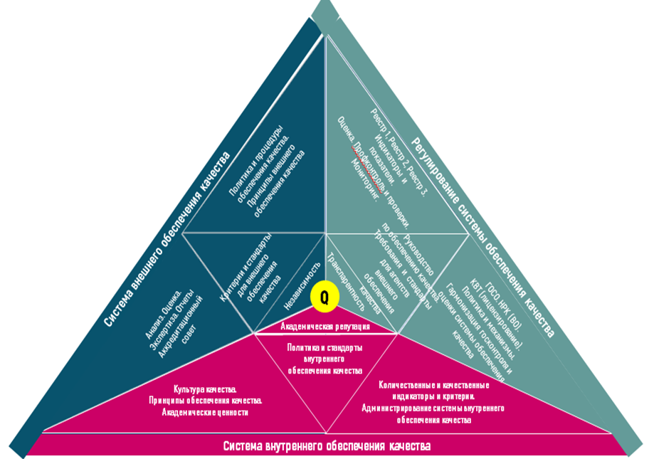

**Рисунок 1.1 – Национальная модель обеспечения качества**

Все уровни системы обеспечения качества направлены на достижение академического качества. В связи с этим принципы, механизмы и инструменты системы обеспечения качества на всех ее уровнях должны быть взаимосвязаны и взаимодействовать между собой. Только в этом случае становится возможным обеспечить повышения качества высшего образования. Если не будет срабатывать какой-нибудь элемент механизма обеспечения качества, то сложно будет решать вопросы повышения или улучшения качества образования [56].

Как нам известно, одним из принципов ESG является то, что вузы несут основную ответственность за качество предоставляемого образования и его обеспечение, а также поддерживает развитие культуры качества [72]. В этой связи один из элементов вышеуказанной модели и одним из ключевых элементов ESG является внутренняя система обеспечения качества вузов, направленная на обеспечение высокого качества образовательных услуг, соответствующих международным стандартам и требованиям рынка труда.

С учетом этого, в национальном законодательстве закреплено, что «в целях повышения качества образовательной деятельности вузы создают и обеспечивают соблюдение системы внутреннего обеспечения качества, основанного на международных стандартах и руководстве ESG, которые включают:

1) политику в области обеспечения качества;
2) разработку и утверждение программ;
3) студентоориентированное обучение, преподавание и оценку;
4) прием обучающихся, успеваемость, признание и сертификацию;
5) преподавательский состав;
6) учебные ресурсы и систему поддержки обучающихся;
7) управление информацией;
8) информирование общественности;
9) постоянный мониторинг и периодическую оценку программ;
10) периодическое внешнее обеспечение качества» [73].
Согласно Руководству по обеспечению качества политика и стандарты внутреннего обеспечения качества разрабатываются ОВПО самостоятельно [74].

Между тем, элементами системы внутреннего обеспечения качества являются:

Политика по обеспечению качества

Ценности и принципы обеспечения качества

Стандарты внутреннего обеспечения качества

Механизмы и инструменты (индикаторы и критерии) обеспечения качества

Управление системой обеспечения качества.

Все участники образовательного процесса должны быть приверженцами системы обеспечения качества, иметь общую культуру качества. Методология системы обеспечения качества основывается на академических ценностях и основополагающих принципах. Инструменты обеспечения качества должны соответствовать миссии и стратегии развития.

Таким образом, проведенный анализ веб-сайтов вузов Казахстана показал, что из просмотренных 94 сайтов вузов разметили Политику обеспечения качества 72 вуза, а Стандарты внутреннего обеспечения качества разместили только 36 вузов. Эти данные свидетельствуют о недостаточном внимании университетов, их администрации к системе внутреннего обеспечения качества.

Следует отметить, что имеющиеся политики качества носят в большей степени декларативный характер и не содержат реальных инструментов, что в случае отсутствия руководства или стандарта по качеству и вовсе малоэффективно. Кроме того, зачастую на сайтах размещены неактуальные политики. Полученные данные свидетельствуют о недостаточной активности вузов по внедрению действенной внутренней системы обеспечения качества.

## Международный опыт обеспечения качества высшего образования

Проблема развития национальной системы высшего образования является предметом исследований ученых из разных стран. В Казахстане повышение конкурентоспособности казахстанских вузов должно быть достигнуто за счет: реализации международных образовательных программ, академических обменов с зарубежными партнерами; приглашения привлечение иностранных специалистов к преподаванию; создание филиалов ведущих зарубежных университетов. Ключевым вопросом является обеспечение качества высшего образования. Данная статья рассматривает международный опыт обеспечения качества высшего образования в рамках реализации Программы целевого финансирования «Повышение конкурентоспособности вузов Казахстана через реинжиниринг национальной системы обеспечения качества высшего образования» на 2022-2024 годы. Программа связана с проводимыми более 10 лет исследованиями в области повышения качества образования, внедрения параметров Болонского процесса в систему высшего образования, научно-методического сопровождения инноваций.

Основной идеей исследования в рамках подзадачи является анализ лучшего опыта зарубежных стран с целью использования в модернизации национальной системы обеспечения качества высшего образования так как от качества высшего образования зависит дальнейшее развитие страны. Результатом данного исследования станет обоснование подходов к совершенствованию целостной системы обеспечения качества высшего образования, направленного на конечный результат – подготовку конкурентоспособного специалиста.

В Казахстане Постановлением Правительства Республики Казахстан от 12 октября 2021 года “Об утверждении национального проекта "Качественное образование “Образованная нация” [75] повышение конкурентоспособности казахстанских вузов должно быть достигнуто за счет: реализации международных образовательных программ, академических обменов с зарубежными партнерами; приглашения привлечение иностранных специалистов к преподаванию; создание филиалов ведущих зарубежных университетов. Ключевым вопросом является обеспечение качества высшего образования.

Предпосылками к разработке данному исследованию является необходимость решения следующих проблем:

* противоречия между необходимостью постоянного обеспечения качества высшего образования и неразработанностью ее методологии и методики;
* отсутствие систематизированной национальной модели обеспечения качества высшего образования.
* необходимость цифровизации для управления высшим образованием на основе больших данных;
* неразработанность методологии интеграции прикладного бакалавриата в качестве короткого цикла в систему высшего образования.
В связи с этим, на основании полученной информации об обеспечении качества высшего образования в зарубежных странах членами исследовательской группы будут внесены изменения в национальную модель обеспечения качества, а также будет предложена архитектура системы непрерывного образования.

Обеспечивая качество образования, казахстанские вузы развивают национальную систему в соответствии с ESG. В итоговом отчете Руководящей группы проекта указано, что в Казахстане ESG рассматриваются скорее как практический инструмент. Известно, что ESG более чем вдохновили на разработку национальной внешней системы обеспечения качества.

Согласно Глобальному индексу знаний 2021 года [76] Казахстан занимает невысокое место с точки зрения своей инфраструктуры знаний. Казахстан занимает 78-е место из 154 стран в Глобальном индексе знаний 2021 года и 60-е место из 61 страны с очень высоким уровнем человеческого развития; 72-е место из 154 в секторе высшего образования. В отчете представлены области для улучшения: уровень образования, степень магистра или ее эквивалент; государственные расходы на профессиональное образование. Согласно рейтингу стран мира по индексу глобальной конкурентоспособности (2020) Казахстан занимает 55 место, а по индексу человеческого развития (2020) – 51 место. В целом показатели коррелируется между собой и раскрывает противоречия между необходимому и достигнутому качеству образования, в частности высшего образования и конкурентоспособности системы.

Румынские ученые из Политехнического университета Тимишоары представили условия для повышения конкурентоспособности румынской системы высшего образования: они отметили, что реализация учебных программ на разных иностранных языках и использование информационных технологий являются одними из возможностей, которые способствуют повышению конкурентоспособности румынского высшего образования [77].

Юзеф Кабок и др. [78] считают, что эта конкурентоспособность должна быть реализована в будущем таким образом, чтобы все страны, регионы и высшие учебные заведения, которые вносят вклад в глобальное социальное развитие, основанное на знаниях в Европе, извлекли из этого выгоду, принимая во внимание важность конкурентоспособности высшего образования для общего социально-экономического и культурного развития каждого общество.

Исследователи из Китая предложили создать непрерывную модель оценки здоровья высшего образования. Они использовали анализ главных компонент и метод энтропийного веса для определения модели оценки состояния здоровья высшего образования и провели анализ временных рядов модели авторегрессионной скользящей средней на основе модели оценки высшего образования, которая получена путем изучения долгосрочных тенденций [79]. Одним из результатов является уделение большего внимания развитию научно-технических талантов, которые являются важной силой в развитии страны, а также будут объектом усилий по обучению в будущем образовании.

В. Парахина и др. [80] пришли к выводу, что важнейшей проблемой конкурентоспособности российских университетов является отсутствие стратегической гибкости. Их исследование показывает возможность решения определенных проблем организации стратегического управления в университетах посредством создания новых работающих механизмов внутреннего роста, которые соответствуют внешним изменениям.

Тем не менее Герберт Штальке и Джеймс М. Найс считают, что успешный реинжиниринг в высшем образовании должен начинаться с преподавания и обучения, а не с административных процессов [81].

Некоторые исследователи предполагают, что изменение высшего образования связано с глобализацией. Перед традиционными университетами сейчас стоит задача удовлетворить растущую потребность в обучении на протяжении всей жизни. Потребность и стремление к высшему образованию растут, но перед высшим образованием стоит задача внести существенные изменения, обусловленные глобализацией и технологиями [82].

Для достижения университетом конкурентной позиции Лаура М. Портной и Сильвия С. Бэгли [83] предложили для этого следующие действия: создание университетов мирового класса; интеграция университетов; приоритет обеспечения качества образовательных программ; интернационализация университетов; расширение трансграничного высшего образования; создание региональных альянсы.

Павел Лукша и Дмитрий Песков [84] считают, что главная задача регулирующих органов высшего образования никоим образом не заключается в реформировании существующих образовательных учреждений с целью адаптации их к новым целям, а скорее в создании в стране условий, позволяющих создать новое, эффективное образование, соответствующее уровню и целям страны.это развитие.

Анализируя адаптацию системы высшего образования, мы должны отметить резкое, резкое изменение ядра системы, катастрофический переход из одного состояния в другое из-за COVID-19. Международная комиссия по будущему образования представляет идеи для конкретных действий в мире после COVID, которые правительства должны рассмотреть [85].

Различные подходы к исследуемому вопросу предполагают проведение исследования по реинжинирингу национальной системы высшего образования для повышения конкурентоспособности вузов на мировом рынке. В 2018 году Центр Болонского процесса и академической мобильности Министерства образования и науки Республики Казахстан опубликовал Аналитический отчет, в котором предложено усилить внутреннюю систему обеспечения качества, казахстанским вузам рекомендовано усилить качественный состав академических услуг и структурных единицы. Необходимо концептуально пересмотреть внутренние документы и положения, регулирующие вопросы академической и научной политики вуза. При этом данная работа должна проводиться в условиях новой нормативно-правовой базы в рамках институциональной, академической и управленческой автономии казахстанских вузов [86].

Ю.Янь [87] убежден, чтобы постоянно улучшать качество образования и преподавания, вузы должны сочетать образование и обучение с технологией анализа больших данных, улучшить построение системы обеспечения качества образования и преподавания и стремиться к созданию долгосрочного механизма для повышения качества развития талантов [88]. Гуан К. и Ван Ю [89] считают, если руководство университета сможет в полной мере использовать информационные технологии в эпоху BD, оно сможет эффективно освоить диверсифицированные информационные ресурсы, тем самым внедряя инновации в свои собственные концепции и модели управления для дальнейшего повышения общего качества и уровня управления.

Китайские исследователи [90] доказали эффективность системы обеспечения качества высшего образования, основанной на модели EFQM, а также ее гибкость и практичность, которые могут быть использованы в системе обеспечения качества высшего образования нашей страны, с помощью которых можно задать направление для системы образования, реформировать и принять меры, таким образом, он может предоставить больше высококачественных талантов, которые способствуют национальному и социальному развитию.

В целом, исследователи согласны с положением о том, что конкурентоспособность высших учебных заведений зависит от системы обеспечения качества высшего образования, охватывающей насквозь все его уровни (короткий цикл (прикладной бакалавриат) – бакалавриат – магистратура - докторантура) и от гибкости модели. Ученые [91] с помощью множественного регрессионного анализа изучили взаимозависимость между высшим образованием, конкурентоспособностью и устойчивым развитием и сделали вывод о том, что высшее образование выступает как один из факторов, определяющих уровень конкурентоспособности экономики.

Исследовательским коллективом были проанализированы системы обеспечения качества зарубежных стран. Далее представлен анализ в разрезе 11 стран:

Австрия: В Австрии ответственной организацией за нормативно-правовые условия в области обеспечения качества в высших учебных заведениях является Федеральное министерство образования, науки и исследований. Дизайн внутренних систем обеспечения качества относится к автономии высших учебных заведений.

В марте 2012 года система внешнего обеспечения качества в австрийском секторе высшего образования была коренным образом реорганизована. На основании Федерального закона об обеспечении качества в высшем образовании было создано Австрийское агентство по обеспечению качества и аккредитации [92].

Все вопросы, связанные с развитием и обеспечением качества в университетских колледжах педагогического образования, которые были созданы в 2007 году, входят в сферу ответственности Федерального министерства образования, науки и исследований. Все высшие учебные заведения обязаны создать внутреннюю систему обеспечения качества преподавания, исследований и организации. Исходя из этого, вузы выбирают те подходы и механизмы, которые наилучшим образом соответствуют их собственным потребностям. Непрерывные внутренние оценки, оценка работы преподавательского состава, внешние оценки и т.д. являются общими элементами этих систем.

Босния и Герцеговина: В Боснии и Герцеговине реализуются два отдельных процесса: процесс лицензирования и процесс аккредитации. ВУЗ готовит отчет о самооценке (он составляется группой по самооценке, созданной в каждом вузе, в состав которой входят руководство, сотрудники отдела контроля качества, административный персонал и студенты) в соответствии с положениями кантональных законов о высшем образовании, Законом о высшем образовании.

На основании мнения экспертной группы, осуществляющей оценку и обзор качества вуза, Агентство по развитию высшего образования и обеспечению качества [93] дает рекомендацию по аккредитации вуза.

Болгария: Ответственность за обеспечение качества высшего образования несут высшие учебные заведения. С этой целью они применяют внутреннюю систему оценки и поддержания качества образования и профессорско-преподавательского состава. Ученый совет является органом управления образовательной и научной деятельностью каждого высшего учебного заведения, который утверждает эту систему и осуществляет контроль за ее внедрением и совершенствованием. Ректоры подготавливают и предлагают на утверждение Ученому совету годовой отчет высшего учебного заведения, годовой отчет о финансовых и физических показателях высшего учебного заведения, а также результаты функционирования внутренней системы оценки и поддержания качества образования. Студенческий совет имеет право участвовать со своими представителями в наблюдении за внутренней системой, а также в разработке вопросов для опроса общественного мнения студентов.

Специализированным государственным органом по оценке, аккредитации и контролю качества деятельности, осуществляемой высшими учебными заведениями, является Национальное агентство по оценке и аккредитации (NEAA) при Совете Министров [94].

Хорватия: Закон об обеспечении качества в науке и высшем образовании, принятый в 2009 году, учредил Агентство по науке и высшему образованию (ASHE) [95] в качестве агентства по обеспечению качества высшего образования в Хорватии. Хорватское агентство по науке и высшему образованию было создано по образцу лучших европейских практик обеспечения качества в науке и высшем образовании.

Согласно Закону об обеспечении качества в науке и высшем образовании, Агентство выполняет часть процедуры первоначальной аккредитации, процедуры повторной аккредитации, тематической оценки и аудита, собирает и обрабатывает данные о хорватском высшем образовании, науке и связанных с ними системах, которые служат основой для анализа, необходимого для установления стандартов и критерии оценок, проводимых ASHE, а также основа для принятия обоснованных и основанных на фактических данных стратегических решений органами системы высшего образования и науки.

Третьим уровнем обеспечения качества высшего образования в Хорватии являются сами высшие учебные заведения - университеты, факультеты, школы и политехнические институты. В дополнение к тем, которые находятся в ведении ASHE, каждый из них разрабатывает свои собственные внутренние протоколы и механизмы обеспечения качества и управляет ими.

К 30 июня каждого года Национальный совет по высшему образованию составляет план оценки высших учебных заведений на следующий календарный год и отчитывается о нем перед высшими учебными заведениями. Помимо годового плана, оценка высшего учебного заведения может быть запрошена хорватским парламентом, Правительством Республики Хорватия или министром науки и образования. Национальный совет назначает экспертную комиссию, которой поручено провести оценку высшего учебного заведения. Экспертная комиссия назначается не менее чем за 3 месяца до запланированного визита в высшее учебное заведение.

Чешская Республика: Министерство образования, молодежи и спорта [96], Чешская школьная инспекция и регионы участвуют в оценке системы образования от детских садов до высших профессиональных учебных заведений.

Каждое высшее профессиональное учебное заведение предусматривает свою собственную образовательную программу, но программа должна быть представлена в Министерство образования, молодежи и спорта для аккредитации. Министерство образования предоставляет аккредитацию на основании рекомендации Комиссии по аккредитации высшего профессионального (неуниверситетского) образования, 21 член которой назначается и освобождается от должности министром образования и является профессионалами, отобранными из высших учебных заведений, высших профессиональных учебных заведений и сферы труда.

Руководители высших профессиональных учебных заведений отвечают за внутреннюю оценку этих школ аналогично руководителям при внутренней оценке на более низких уровнях образования.

Согласно поправке 2016 года к Закону о высшем образовании, Национальное бюро аккредитации высшего образования (NAB) [97] отвечает за качество высшего образования и всестороннюю оценку образовательной, научной, научно-исследовательской, развивающей, инновационной, художественной и другой творческой деятельности высших учебных заведений.

США: Американская модель оценки качества основывается на внутренней оценке самого университета. Для этого вуз разрабатывает свою стратегию, программу и методику оценки с учетом текущих целей, задач и ресурсов. Проведенный при самооценки комплексный анализ позволяет самому университету своевременно принимать управленческие решения по совершенствованию образовательного процесса и  вносить коррективы по управлению качеством высшего образования.

В отличие от многих других стран, федеральное правительство США и Министерство образования США не обладают юридическими полномочиями признавать учреждения или программы, проводить проверки на предмет обеспечения качества или определять образовательные стандарты.  Федеральная роль в обеспечении качества ограничивается исследованиями и статистикой, широким политическим руководством и одобрением аккредитующих агентств с целью сертификации учреждений и программ, которые могут получать федеральную помощь и которые могут посещать студенты, получающие федеральные займы и гранты.

На федеральном уровне нет единого государственного органа, осуществляющий контроль над университетами, но Департаментом образования США формируется список органов, которые могут проводить аккредитацию.

В США функционирует Совет по аккредитации высшего образования [98], который является национальным защитником и институциональным выразителем академического качества посредством аккредитации.

Также имеется Ассоциация специальных и профессиональных аккредитационных организаций [99] – это ассоциация организаций, которые оценивают качество программ в колледжах и университетах по более чем 100 различным профессиям и специализированным дисциплинам – от сестринского дела до архитектуры, от физиотерапии до инженерии .

Каждое аккредитационное агентство США определяет и детально прописывают критерии оценки качества высшего образования, которые широко обсуждаются и доводятся до сведения университетов. В целом, американская модель оценки качества высшего образования основана на саморегуляции и концепции «академической свободы», которая означает, что университеты имеют свободу ведения своего бизнеса без ненужного внешнего контроля, особенно со стороны правительства.

Япония: В Японии структура обеспечения качества состоит из Стандартов учреждения университета (SEU), системы обеспечения качества и аккредитации (QAAS) и системы утверждения учреждения (EAS) [100].

QAAS требует, чтобы все университеты в Японии должны проходить процедуру аккредитации один раз в семь лет сертифицированными агентствами.

Цель этой системы состоит в том, чтобы обеспечить механизмы, с помощью которых впоследствии можно периодически проверять такие условия, как организационное управление и академическая деятельность в университетах, обеспечивая при этом минимальное участие национального правительства.

Эта система играет роль аккредитации, подтверждая, что аккредитованный университеты соответствуют стандартам, установленным агентствами, которые сертифицированы Министром образования, культуры, спорта, науки и технологий. В отчете Центрального совета по образованию за 2002 год утверждается, что эта система должна позволить университетам проходить процедуру аккредитации из внешнего мира и, таким образом, повышать ее качество.

Австралия: Австралия имеет всеобъемлющие механизмы обеспечения качества, встроенные в ее систему образования на правительственном и институциональном уровнях, а также через профессиональные образовательные организации.

Эти высшие органы включают университеты Австралии, ранее известные как Комитет вице-канцлеров Австралии по высшему образованию; English Australia, охватывающий учреждения, предоставляющие преподавание английского языка; TAFE Directors Australia [101] для государственных поставщиков профессионального образования и профессиональной подготовки, а также Австралийский совет частного образования и профессиональной подготовки [102] и Австралийский совет независимых Профессиональные колледжи, которые охватывают частных поставщиков профессионального образования и профессиональной подготовки.

Термин "университет" защищен законодательством Австралии. Университеты учреждаются в соответствии с законодательством штата или территории после тщательной оценки их академических и финансовых полномочий. Университеты в Австралии являются "самоаккредитирующимися"; то есть они уполномочены аккредитовывать свои собственные курсы и несут ответственность за свои академические стандарты. В них должны быть внедрены соответствующие процессы обеспечения качества, включая процессы коллегиальной оценки, внешнего контроля более высоких оценок и привлечения профессиональных организаций к аккредитации конкретных курсов.

Сингапур: При Министерстве образования [103] существует множество аккредитационных агентств, которые проверяют и поддерживают качество высшего образования, предлагаемого различными университетами, факультетами, колледжами и высшими учебными заведениями. Эти аккредитационные органы работают над тем, чтобы образование, предоставляемое студентам, соответствовало установленным стандартам, тем самым повышая ценность полученной степени.

Для аккредитации курса или образовательного учреждения правительство Сингапура создало различные агентства по аккредитации, которые в основном находятся в ведении Министерства образования или Сингапурского совета по стандартам, производительности и инновациям (SPRING).

Некоторыми из известных аккредитующих агентств являются: Отдел высшего образования, Совет по частному образованию, Сингапурский класс качества для частных образовательных организаций.

Полный контроль и управление образованием Сингапура находится в руках Министерства образования. Оно отвечает за разработку и исполнение руководящих принципов в области образования в Сингапуре. Также отвечает за управление и совершенствование государственных и поддерживаемых государством начальных школ, средних школ, младших колледжей и централизованного института. Он также регистрирует частные школы.

Российская Федерация: Необходимость обеспечения качества образовательной деятельности предусмотрена статьей 95.2 Федерального закона от 29 декабря 2012 года № 273-ФЗ «Об образовании в Российской Федерации» [104]. Критерии и показатели качества образования установлены федеральными нормативными актами (приказом Минобрнауки России от 5 декабря 2014 № 1547 «Об утверждении показателей, характеризующих общие критерии оценки качества образовательной деятельности организаций, осуществляющих образовательную деятельность») и локальными нормативными актами университета.

Контроль качества образования осуществляется посредством мониторинга результатов реализации образовательных программ, внутренней и внешней экспертизы качества образовательной деятельности, разработки мероприятий (планов, дорожных карт) по совершенствованию и стратегии развития образовательных программ.

Деятельность вузов лицензируется и аккредитуется Федеральной службой по надзору в сфере образования и науки РФ.

Великобритания: Высшие учебные заведения являются автономными, самоуправляющимися учреждениями. Каждый из них несет ответственность за качество своих собственных программ, а для тех учреждений, которые имеют право присуждать степени, - за академические стандарты предлагаемых ими степеней.

Вузы действуют в рамках нормативной базы, которая охватывает предоставление полномочий по присуждению степеней; право использовать название "университет" или "университетский колледж"; получение государственного финансирования через Управление по делам студентов (OfS) [105]; и назначение в целях поддержки студентов. Поставщики высшего образования должны зарегистрироваться в Of'S, если они хотят получить доступ к государственному грантовому финансированию или финансированию поддержки студентов, осущетсвить прием иностранных студентов или подать заявку на получение ученой степени или университетского звания. OfS несет юридическую ответственность за обеспечение качества высшего образования, которое оно осуществляет через назначенный орган - Агентство по обеспечению качества высшего образования (QAA) [106].

Агентство по обеспечению качества высшего образования (QAA) отвечает за внешнюю оценку высших учебных заведений в Великобритании. Оно поддерживает Кодекс качества высшего образования Великобритании, который является добровольным кодексом, устанавливающим, что должны делать поставщики высшего образования, чего они могут ожидать друг от друга и чего может ожидать от них широкая общественность.

QAA не является регулирующим органом; регулирующая роль принадлежит Управлению по делам студентов (OfS), и, следовательно, QAA не имеет никаких полномочий в отношении вузов и не имеет уставных полномочий.

Данный анализ позволит исследовательской группе провести комплексное изучение системы обеспечения качества, направленное на повышение конкурентоспособности вузов Казахстана через реинжиниринг национальной системы обеспечения качества высшего образования как катализатора улучшения качества человеческого капитала в условиях реализации концепции непрерывного образования.

Таким образом, вопросы обеспечения качества высшего образования зависят от эффективно выстроенной методологии и целостностью его циклов, поэтому эти проблемы являются предметом реализуемой Программы.

## 1.3 Анализ нормативных правовых актов в сфере подготовки кадров и обеспечения качества высшего образования

Высшее образование играет важную роль в обществе, создавая новые знания, передавая их обучающимся и продвигая инновации. Новая парадигма высшего образования, основанная на Болонских воззрениях, обусловливает необходимость реструктуризации качества высшего образования с участием всех заинтересованных сторон (внутренних и внешних). В данной статье авторами представлен анализ нормативно-правовых документов установленной формы, принятых на республиканском референдуме либо уполномоченным органом, устанавливающих нормы права, изменяющих, дополняющих, прекращающих или приостанавливающих их действие. Данные документы отражают имеющуюся систему высшего и послевузовского образования в Казахстане в части обеспечения ее качества. Всего проанализировано 11 документов в области обеспечения качества высшего и послевузовского образования. Анализ указанных НПА свидетельствует о направленности казахстанской системы высшего и послевузовского образования на обеспечение качества оказываемых услуг, на формирование культуры качества в соответствии с международными стандартами. Все вносимые изменения в документы отражают последовательность и системность вводимых новшеств в деятельность организаций высшего и послевузовского образования, направлены на повышение требований к качеству вузовского образования. При этом направленность изменений свидетельствует о воплощении в жизнь глобальных принципов гуманизма и демократии. Анализ документов в области обеспечения качества высшего и послевузовского образования свидетельствует о том, что в связи с вхождением в Болонский процесс казахстанское высшее и послевузовское образование строго следует международным договоренностям. В частности, в обеспечении качества высшего образования уполномоченный орган и казахстанские университеты руководствуются Стандартами и рекомендациями для обеспечения качества высшего образования в Европейском пространстве высшего образования (ESG).

Проблема развития национальной системы высшего образования является предметом исследований ученых из разных стран. В Казахстане Постановлением Правительства Республики Казахстан от 12 октября 2021 года “Об утверждении национального проекта "Качественное образование “Образованная нация” [75] повышение конкурентоспособности казахстанских вузов должно быть достигнуто за счет развития самой системы высшего и послевузовского и обеспечения ее качества.

В связи с этим, авторами исследовательской группы в рамках научного проекта «BR18574103	Повышение конкурентоспособности вузов Казахстана через реинжиниринг национальной системы обеспечения качества высшего образования», финансируемого Комитетом науки Министерства науки и высшего образования Республики Казахстан (программно-целевое финансирование по научным, научно-техническим программам на 2022-2024 годы) проведен анализ НПА с целью выявления социальных тенденций и фактов в системе высшего и послевузовского образования.

Основным методом анализа был выбран контент-анализ нормативно-правовых документов в области высшего и послевузовского образования.

Планируемым результатом исследования является качественно-количественная характеристика содержания стратегически значимых документов в области обеспечения качества высшего и послевузовского образования.

Всего проанализировано 11 документов в области обеспечения качества высшего и послевузовского образования:

* Стандарты и рекомендации для обеспечения качества высшего образования в Европейском пространстве высшего образования (ESG - European Standards and Guidelines) [72];
* Закон Республики Казахстан от 27 июля 2007 года № 319-III «Об образовании» (с изменениями и дополнениями по состоянию на 01.05.2023 г.) [107];
* Приказ Министра образования и науки Республики Казахстан от 17 июня 2015 года № 391 «Об утверждении квалификационных требований, предъявляемых к образовательной деятельности организаций, предоставляющих высшее и (или) послевузовское образование, и перечня документов, подтверждающих соответствие им» [108];
* Приказ Министра образования и науки Республики Казахстан от 29 ноября 2007 года № 583 «Об утверждении Правил организации и осуществления учебно-методической и научно-методической работы в организациях образования» [109];
* Приказ и.о. Министра образования и науки Республики Казахстан от 21 декабря 2007 года № 644 «Об утверждении Типовых правил деятельности методического (учебно-методического, научно-методического) совета и порядок его избрания» [110];
* Приказ и.о. Министра образования и науки Республики Казахстан от 19 июля 2021 года № 352 «Об утверждении Правил признания документов об образовании, а также перечня зарубежных организаций высшего и (или) послевузовского образования, документы об образовании которых признаются на территории Республики Казахстан» [111];
* Приказ Министра образования и науки Республики Казахстан от 31 октября 2018 года № 600 «Об утверждении Типовых правил приема на обучение в организации образования, реализующие образовательные программы высшего и послевузовского образования» [112];
* Приказ Министра науки и высшего образования Республики Казахстан от 12 октября 2022 года № 106. Зарегистрирован в Министерстве юстиции Республики Казахстан 13 октября 2022 года № 30139 «Об утверждении Правил ведения реестра образовательных программ, реализуемых организациями высшего и (или) послевузовского образования, а также основания включения в реестр образовательных программ и исключения из него» [113];
* Приказ Министра образования и науки Республики Казахстан от 30 октября 2018 года № 595 «Об утверждении Типовых правил деятельности организаций высшего и (или) послевузовского образования» [73];
* Приказ Министра образования и науки Республики Казахстан от 20 марта 2015 года № 137 «Об утверждении требований к организациям образования по предоставлению дистанционного обучения и правил организации учебного процесса по дистанционному обучению и в форме онлайн-обучения по образовательным программам высшего и (или) послевузовского образования» [114];
* Приказ Министра образования и науки Республики Казахстан от 1 ноября 2016 года № 629 «Об утверждении требований, предъявляемые к аккредитационному органу в сфере высшего и послевузовского образования и правил признания аккредитационных органов в сфере высшего и послевузовского образования, в том числе зарубежных» [70].
Проведение комплексного контент-анализа нормативно-правовых актов позволит далее провести в Казахстане реинжиниринг национальной системы обеспечения качества высшего образования как катализатора улучшения качества человеческого капитала в условиях реализации концепции непрерывного образования.

Различные подходы к исследуемому вопросу предполагают проведение исследования по реинжинирингу национальной системы высшего образования для повышения ее качества.

В 2018 году Центр Болонского процесса и академической мобильности Министерства образования и науки Республики Казахстан опубликовал Аналитический отчет, в котором предложено усилить внутреннюю систему обеспечения качества, казахстанским вузам рекомендовано усилить качественный состав академических услуг и структурных единицы. Необходимо концептуально пересмотреть внутренние документы и положения, регулирующие вопросы академической и научной политики вуза. При этом данная работа должна проводиться в условиях новой нормативно-правовой базы в рамках институциональной, академической и управленческой автономии казахстанских вузов [115].

Китайские исследователи [116] доказали эффективность системы обеспечения качества высшего образования, основанной на модели EFQM, а также ее гибкость и практичность, которые могут быть использованы в системе обеспечения качества высшего образования нашей страны, с помощью которых можно задать направление для системы образования, реформировать и принять меры, таким образом, он может предоставить больше высококачественных талантов, которые способствуют национальному и социальному развитию.

Членами исследовательской группы в 2021 году была разработана и предложена национальная модель обеспечения качества, представленная в виде трехмерного изображения. Другими словами, она измеряется и состоит, с одной стороны, из внутренней системы обеспечения качества, с другой стороны, из внешней системы обеспечения качества и, с третьей стороны, из механизмов управления и регулирования системы обеспечения качества. Основной целью этой модели для всех ее трех компонентов является достижение высокого академического качества, которое называется точкой Q (качество) [56].

Анализ НПА в области обеспечения качества высшего образования в Казахстане рассматривался и ранее, но не комплексно:

* через рассмотрение представленной автономии казахстанским высшим учебным заведениям [68];
* через изменение законодательства РК путем внедрения процедур контроля и оценки в виде государственной аттестации, лицензирования и аккредитации [55];
* через влияние пандемии на организацию системы высшего образования [117, 118].
В данном исследовании приводится анализ имеющихся НПА в области обеспечения качества высшего и послевузовского образования в Республике Казахстан.

«Стандарты и рекомендации для обеспечения качества высшего образования в Европейском пространстве высшего образования (ESG - European Standards and Guidelines) разработаны Европейской ассоциацией по обеспечению качества высшего образования ENQA (European Network for Quality Assurance) по прямому поручению Конференции министров образования европейских стран, подписавших Болонскую декларацию. В 2005 г. документ был разработан и одобрен министрами образования и рекомендован к внедрению в национальные системы гарантии качества. В мае 2015 г. вышла новая актуализированная версия ESG ENQA.

Анализируемый документ является одним из значимых инструментов Болонского процесса, направленного на формирование Европейского образовательного пространства для реализации следующих принципов и ценностей: равноправный доступ к образованию (Social dimension), возможность продолжения образования (LLL), трудоустраиваемость выпускников (Employability), студентоцентрированное обучение (Student - centred leaning), связь обучения с наукой и инновациями, международная открытость (International openness), мобильность, сбор данных, многомерная прозрачность результатов (Multidimensional transparency tools) и финансирование.

В этом аспекте «Стандарты и рекомендации для обеспечения качества высшего образования в Европейском пространстве высшего образования» способствуют студенческой мобильности, обеспечивая повышение доверия к учреждениям высшего образования; ограничению возможности для «фабрик по выдаче дипломов» в получении прибыли; приданию лигитимной основы для правительств предоставления права высшим учебным заведениям выбора любого агентства, включенного в Реестр, и для приведения в соответствие национальных нормативных актов; предоставлению возможности высшим учебным заведениям выбирать между различными агентствами в соответствии с национальными нормативными актами; созданию инструмента по обеспечению качества деятельности аккредитационных агентств и обеспечению взаимного доверия между ними.

Закон Республики Казахстан «Об образовании» официально закрепил ответственность казахстанской системы высшего и послевузовского образования в вопросах обеспечения качества. При этом с января 2017 года государственную аттестацию вузов заменила международная аккредитация.

Все это свидетельствует о серьезных реформах в области обеспечения качества высшего образования в стране, связанные, в первую очередь, с вхождением Казахстана в Болонский процесс в части прозрачности, обеспечения равноправного доступа к образованию, трудоустройства выпускников, студентоцентрированного обучения, международной открытости и академической мобильности обучающихся и персонала.

Результаты анализа документа [108]  в изучаемом контексте показали, что при лицензировании образовательной деятельности вуз согласно п. 60 должен иметь договоры в соответствии с гражданским законодательством о сотрудничестве с аккредитованными зарубежными и (или) научными организациями, реализующими программы послевузовского образования, и предусматривающих нормы по статусу ОВПО-партнера по соответствующему направлению подготовки кадров, привлечении зарубежных консультантов и реализации совместных научных проектов. Это свидетельствует о значимости аккредитации вузов в международном контексте. Иными словами, данный документ регулирует уровень сотрудничества организаций высшего и послевузовского образования с зарубежными университетами и научными центрами.

Следует также отметить, что в 2019 году анализируемый документ был кардинально пересмотрен и процедуры профконтроля были оптимизированы: число квалификационных требований сократилось наполовину, что облегчило и упростило процессы сбора информации при сохранении их важности для обеспечения объективности оценки и выводов.

Документ [109] обновлялся 7 раз с 2007 года. К предмету анализа содержание и назначение документа имеет непосредственное отношение, так как учебно-методическая и научно-методическая работа в ОВПО осуществляется в целях интеграции науки и образования, обеспечения и совершенствования учебного и воспитательного процесса, разработки и внедрения новых технологий обучения, обеспечения повышения квалификации педагогических работников, что является одним из составляющих гарантии качества предоставляемых образовательных услуг. Разработка и особенно реализация образовательных программ не представляется возможной без указанных выше направлений деятельности ОПВО. При этом, согласно данным правилам, существует вертикальная система управления качеством реализации образовательных программ, которая включат в себя учебно-методические объединения по направлениям подготовки кадров, общее руководство которым возлагается на республиканский учебно-методический совет высшего и послевузовского образования. При этом в структурных подразделениях ОПВО решения по методическому обеспечению образовательного процесса вуза принимаются коллегиально (постоянные советы, комиссии, объединения, комитеты, секции).

Проверенная на практике в течение многих лет и зарекомендовавшая себя как эффективная форма научно-методического сопровождения образовательного процесса вузов данный вид деятельности ОВПО выступает гарантом качества учебного, воспитательного и научного составляющих все деятельности вузов.

Типовые правила [110] не были пересмотрены с 2007 года. В целом, его содержание в определенной степени дублирует положения предыдущего документа. В связи с этим, имеет смысл объединить их в один документ.

Нормативный документ [111] регламентирует процедуры признания документов об образовании, выданных зарубежными организациями образования, в том числе их филиалами, а также научными центрами и лабораториями с учетом национального законодательства Республики Казахстан. Данные процедуры проводятся в рамках Государственной услуги "Признание документов об образовании". В анализируемом документе прописаны порядок признания документов об образовании всех уровней. При этом делается исключение для документов (при условии установления их подлинности), выданных организациями высшего и (или) послевузовского образования, входящими в три международных академических рейтинга и в число первых 250 (двухсот пятидесяти) позиций двух и более из них (мировой рейтинг лучших университетов мира Квакарелли Саймондс (QS World University Rankings, КьюЭс Ворлд Юниверсити Ранкинг), академический рейтинг университетов мира (Academic Ranking of World Universities, Академик Ранкинг оф Ворлд Юниверситиес), рейтинг лучших университетов мира по версии издания Таймс (Times Higher Education World University Rankings, Таймс Хайер Едукейшн Ворлд Юниверсити Ранкинг), что свидетельствует о высоких требованиях к качеству квалификаций, полученных заявителями. Также исключение составляют документы, полученные в рамках международной стипендии "Болашак", а также выданные организациями образования стран, подписавших международные договоры (соглашения) при условии установления подлинности документа об образовании.

На данном основании, следует то, что интеграция казахстанской системы образования в международное образовательное пространство направлена, прежде всего, на повышение качества признаваемых квалификаций, что является одним из стратегических механизмов гарантии качества высшего и послевузовского образования.

Типовые правила приема [112] обновлялись 11 раз с 2018 года. При этом постепенно усиливались требования к приему на обучение в организации образования, реализующие образовательные программы высшего и послевузовского образования. При явном усилении требований к поступающим на обучение по образовательным программам высшего и послевузовского образования в Казахстане данный документ предоставляет гибкие (вариативные) возможности для абитуриентов, как то: творческие экзамены, укрупнение специальностей в Классификаторе специальностей высшего и послевузовского образования. Повышение требований с одновременным упрощением процедур поступления в вузы выступает гарантией объективного отбора претендующих на получение образовательного гранта по образовательным программам высшего и послевузовского образования, что представляет собой солидный задел для формирования качественного контингента обучающихся вузов страны.

Ведение Реестра [113] осуществляется в целях формирования единого информационного учета образовательных программ, реализуемых организациями высшего и (или) послевузовского образования.

Стратегическая значимость данного документа для обеспечения качества высшего и послевузовского образования определяется тем, что все образовательные программы, в том числе инновационные, заявляемые вузами страны, проходят независимую экспертизу на соответствие актуальности, требованиям ГОСО, запросам работодателей, формализованных в отраслевых рамках квалификаций и/или профессиональных стандартах. Кроме того, основанием для включения образовательной программы в Реестр является наличие соответствующей лицензии на занятие образовательной деятельностью по соответствующему направлению подготовки. При этом данный документ способствует совершенствованию и развитию образовательных программ в плане их обновления. Важным моментом является то, что Реестр регулирует бюджетное финансирование образовательных услуг вузов. Анализируемый документ представляет собой один из действенных механизмов обеспечения качества высшего и послевузовского образования Республики Казахстан, его введение свидетельствует о развитии национальной системы обеспечения качества образования.

Анализ документа [73] на предмет обеспечения качества высшего и послевузовского образования позволяет сделать вывод о том, что ОВПО обязаны создавать систему внутреннего обеспечения качества, основанную на международных стандартах и руководствах для обеспечения качества высшего и послевузовского образования в европейском пространстве высшего образования (ESG). При этом каждый вуз разрабатывает собственную политику в области обеспечения качества. Более того, на базе факультетов (школ) ОВПО формируется совет (комитет, комиссия) по академическому качеству, принимающему решения по содержанию и условиям реализации образовательных программ, по политике оценивания и другим академическим вопросам факультета (школы), организующий анкетирование обучающихся на предмет соответствия качества образовательных программ и (или) дисциплин/модулей, на предмет наличия фактов нарушения академической честности. В состав Совета (комитета, комиссии) по академическому качеству входят преподаватели, обучающиеся, представители административно-управленческого персонала ОВПО, что свидетельствует о студентоориентированости вузовского образования Казахстана.

С каждым годом казахстанская система высшего и послевузовского образования в ответ на глобальные вызовы современности совершенствовал и развивал цифровые технологии на основе усиления требований к организациям образования по предоставлению дистанционного обучения и уточнения правил организации учебного процесса по дистанционному обучению и в форме онлайн-обучения по образовательным программам высшего и (или) послевузовского образования. В частности, закреплялись требования к подготовке кадров в ОВПО в сфере, прежде всего, педагогических наук, а также к специальным навыкам в области ИКТ преподавателей вуза. Именно форма дистанционного обучения была признана наиболее уместной для консультационной поддержки обучающихся. При этом предоставляется автономия вузам в установлении порядка разрешения и организации перехода на дистанционное обучение по программам академической мобильности, двудипломным программам и программам обмена. Касательно высшего и послевузовского образования в анализируемом документе [114] отведена целая глава (Глава 3, с 29 по 52 пункты), в которой четко прописаны разрешения и запреты на отдельные направления подготовки кадров. При этом вузы обязаны в своей академической политике, политике академической честности, кодексе чести студента, правилах этики, проведении промежуточной и итоговой аттестации, внутренних стандартах качества предусмотреть порядок организации онлайн обучения.

## Введение кардинально новых форм обучения в условиях цифровизации образования обогащают педагогический арсенал обучения и воспитания, при этом все правила и требования к организации онлайн-обучения, прописанные в данном документе, направлены на сквозное обеспечение качества образования, в целом. Касается это не только отслеживания, но научно-методического/учебно-методического сопровождения всего процесса онлайн-обучения.

Следующий документ [70] был обновлен трижды, наибольшее число изменений и дополнений (20 сносок) были внесены в 2023 году, что свидетельствует об усилении требований к аккредитационному органу в сфере высшего и послевузовского образования. Основные механизмы признания аккредитационных органов в сфере высшего и послевузовского образования, в том числе зарубежных связаны с созданием трех реестров, первый из которых закрепляет официальный статус аккредитационных органов в сфере высшего и послевузовского образования Республики Казахстан, вторые два реестра включают аккредитованные организации высшего и послевузовского образования и аккредитованные образовательные программы организаций высшего и послевузовского образования.

В соответствии с данным документом в Казахстане приняты два вида аккредитации: институциональная аккредитация – процесс оценивания качества организации высшего и послевузовского образования аккредитационным органом на соответствие заявленному статусу и установленным стандартам аккредитационного органа и специализированная аккредитация – оценка качества отдельных образовательных программ, реализуемых организацией высшего и послевузовского образования.

Анализируемый документ представляет собой эффективный механизмом обеспечения качества образовательных услуг ОВПО и его повышении, имеющий непосредственное отношение к вопросам гарантии качества высшего и послевузовского образования Казахстана.

Анализ НПА в области обеспечения качества высшего и послевузовского образования показал, что в соответствии с принципом, согласно которому ESG определяет общую структуру систем гарантии качества образования и обучения на европейском, национальном и институциональном уровне, в Казахстане на национальном уровне законодательно закреплена ответственность вузов за надлежащее качество оказываемых услуг и его обеспечение. Также цели и принципы ESG, находя свое отражение в стратегических значимых документах в области высшего и послевузовского образования, детализируются в документах институционального уровня. В частности, казахстанские университеты разрабатывают и принимают: Политику качества университета, Систему внутреннего обеспечения качества, Политику управления рисками, Цели в области качества, Планы мероприятий по устойчивому развитию и др.

Все сказанное выше свидетельствует о направленности казахстанской системы высшего и послевузовского образования на обеспечение качества оказываемых услуг, на формирование культуры качества в соответствии с международными стандартами.

Цель данного анализа заключалась в выявлении социальных тенденций и фактов в системе высшего и послевузовского образования.

Все стратегически значимые документы в области высшего и послевузовского образования отражают общие социальные тенденции казахстанского сообщества в направлении реализации целей устойчивого развития, продвижения принципов демократизма и гуманизма в глобальном и национальном контексте. Логическим подтверждением этому является предоставление вузам принятие академической и управленческой свободы и переход вузов в НАО, который ознаменовал собой новый этап в развитии всей системы высшего образования, основной целью которого является улучшение качества университетского образования и науки. Данное нововведение в силу своей сложности кардинальности все еще формируется как социальная тенденция, которая требует изменений и дополнений ряда других НПА в области высшего и послевузовского образования. Также проанализированные документы отражают положительные тенденции усиления социальной ответственности вузов, их нацеленность на повышение качества и глобальной конкурентоспособности казахстанского образования и науки, воспитание и обучение личности на основе общечеловеческих ценностей.

Все вносимые изменения в документы отражают последовательность и системность вводимых новшеств в деятельность организаций высшего и послевузовского образования, направлены на повышение требований к качеству вузовского образования. При этом направленность изменений свидетельствует о воплощении в жизнь глобальных принципов гуманизма и демократии. Следует также отметить своевременное реагирование на внешние вызовы и оперативность уполномоченного органа, ответственного за разработку данных документов.

Анализ документов в области обеспечения качества высшего и послевузовского образования свидетельствует о том, что в связи с вхождением в Болонский процесс казахстанское высшее и послевузовское образование следует международным договоренностям. В частности, в обеспечении качества высшего образования уполномоченный орган и казахстанские университеты руководствуются Стандартами и рекомендациями для обеспечения качества высшего образования в Европейском пространстве высшего образования (ESG), что регулирует процессы, связанные с расширением  равноправного доступа к образованию, возможностей обучения в течение всей жизни, гарантией трудоустройства выпускников, направленностью на студентоцентрированное обучение, международную открытость и мобильность, а также с обеспечением многомерной прозрачности результатов и финансирования. Переход с государственной аттестации вузов на международную аккредитацию свидетельствует о серьезных реформах в области обеспечения качества высшего образования в стране.

В целом, анализ указанных НПА свидетельствует о направленности казахстанской системы высшего и послевузовского образования на обеспечение качества оказываемых услуг, на формирование культуры качества в соответствии с международными стандартами.

## 1.4 Эмпирическое исследование по выявлению проблем в системе обеспечения качества высшего образования РК

Оценка качества является одним из самых важных аспектов управления развитием системы высшего образования. В силу этого выбор методов ее осуществления прямо влияет на все аспекты деятельности вузов и в значительной мере определяет качество образовательных услуг.

Для проведения эмпирического исследования исследовательской группой были подготовлены анкеты для следующих категорий стейкхолдеров по 4 аспектам качества высшего образования (качество контента; качество контингента; качество персонала; качество инфраструктуры):

обучающиеся – 25 вопросов по качеству процесса поступления, качеству инфраструктуры вуза, качеству организации академического процесса и ППС, а также 7 вопросов по социально-демографическому блоку) (приложение 1);

профессорско-преподавательский состав – 17 вопросов по констатации качества высшего образования и 5 вопросов социально-демографического характера (приложение 2);

административно-управленческий персонал вузов – 15 вопросов по определению качества высшего образования (приложение 3);

работодатели – 7 вопросов по определению качества специалистов с высшим образованием (приложение 4).

Следующим методом проведения эмпирического исследования был выбран метод анкетирования, так как он считается универсально применимой исследовательской методологией для исследований в области образования [117].

Для более полного сбора материалов и сравнения с результатами анкетирования были подготовлены вопросы для интервью с работодателями, ППС, АУП и независимых экспертов (приложение 5).

После разработки инструментария исследовательской группой был проведен массовый онлайн-опрос по определению качества высшего и послевузовского образования Республики Казахстан среди обучающихся, профессорско-преподавательского состава, административно-управленческого персонала и работодателей.

Для подведения результатов эмпирического исследования были использованы количественные методы, так как понимание и применение количественных  исследовательских инструментов  имеет решающее значение для продвижения исследований в области образования,  как теории, так и практики, поскольку оно способствует точности и достоверности  результатов исследований [118;  Streiner et al., 2014].

При проведении эмпирического исследования основным методом отбора проб стал кластерная выборка, что позволит более точно и детально изучить проблему. Размер выборки определен по известной совокупности и рассчитан по формуле Крейчи и Морган [1970] для известного числа популяций. При этом взяты за уровень достоверности  95% и   погрешность 5%.

Выборочная совокупность по каждой категории респондентов составила:

студенты - 7 595 человек;

профессорско-преподавательский состав - 2 502 человек;

административно-управленческий персонал - 292 человек;

работодатели – 329 человек.

Вид выборки – Типическая (стратифицированная). Предполагает разделение неоднородной генеральной совокупности на типологические или районированные группы по какому-либо существенному признаку, после чего из каждой группы производится случайный отбор единиц. Были охвачены все административные регионы (области) страны.

При анализе данных применены статистические методы обработки данных и методы выводной статистики.

## 1.4.1 Результаты анкетириования

## 1.4.1.1 Опрос студентов

Процесс поступления

Профессиональная ориентация в школе является неотъемлемой частью процесса поступления в высшее учебное заведение, поскольку позволяет получение данных о предпочтениях, склонностях и возможностях учащихся, также выработать гибкую систему сотрудничества старшей ступени школы с учреждениями дополнительного и профессионального образования.

Согласно данным массового опроса, 76% респондентов ответили, что для них проводили профессиональную ориентацию в школе (Рисунок 1.2).

**Рисунок 1.2 – Распределение ответов на вопрос «Проводили ли для Вас профессиональную ориентацию в школе?»**

При этом анализ в разрезе профиля образовательной программы респондентов позволяет сделать вывод о том, что для студентов, обучающихся по педагогическому профилю, чаще других не проводили профессиональную ориентацию в школе 13% (Таблица 1.6).

**Таблица 1.6 – Распределение ответов на вопрос «Проводили ли для Вас профессиональную ориентацию в школе?» в разрезе профиля обучаемой образовательной программы**

| Профиль | Да | Нет |
| --- | --- | --- |
| Филологический | 5,7% | 5,0% |
| Философский | 0,6% | 0,7% |
| Журналистика | 0,5% | 0,3% |
| Психология | 1,4% | 1,8% |
| Социология | 0,8% | 1,2% |
| Исторический | 2,2% | 1,4% |
| Юридический | 6,0% | 6,2% |
| Экономический | 5,5% | 6,9% |
| Искусства | 4,2% | 4,7% |
| Международных отношений | 1,9% | 2,8% |
| Политология | 0,5% | 0,5% |
| Иностранные языки | 9,1% | 7,1% |
| ИКТ | 5,8% | 7,4% |
| Педагогический | 18,5% | 13,0% |
| Другое (НАПИШИТЕ) | 37,5% | 41,1% |

При выборе ВУЗа респонденты чаще всего обращались к рекомендациям друзей, родственников, знакомых - 25,9% и непосредственной репутации учебных заведений - 22,5%. Немаловажным фактором является расположение ВУЗа - 17,66 (Рисунок 1.3). Стоит также отметить, что выбор университета определялся получением гранта.

**Рисунок 1.3 – Распределение ответов на вопрос «Что повлияло на ваш выбор ВУЗа?»**

При выборе же образовательной программы, студенты ориентировались преимущественно на высокую вероятность трудоустройства – 35% и престижность профессии – 27,8% (Рисунок 1.4).

**Рисунок 1.4 – Распределение ответов на вопрос «Ответьте, пожалуйста, что повиляло на выбор образовательной программы, по которой сейчас учитесь?»**

Занимательно при этом то, что в разрезе пола, для мужчин на выбор ВУЗа в большей степени оказала низкая стоимость обучения – 43% и преподавательский состав – 38%, а для женщин выбор родителей – 67% и количество грантов – 66%.

Результаты опроса демонстрируют, что процесс поступления в высшее учебное заведение не вызывает особых сложностей у абитуриентов (Рисунок 1.5).

**Рисунок 1.5 – Распределение ответов на вопрос «Как бы Вы оценили процесс поступления в ваш ВУЗ?»**

При этом, этап тестирования или экзамены и выбор университета являются наиболее затруднительными для абитуриентов (Рисунок 1.6).

**Рисунок 1.6 – Распределение ответов на вопрос «Что из процесса поступления, на ваш взгляд, является сложным/затруднительным для абитуриентов?»**

Большая часть респондентов считает, что в процессе поступления созданы равные условия для людей из разных социальных групп (рисунок 1.7).

**Рисунок 1.7 – Распределение ответов на вопрос «Как Вы считаете, созданы ли равные условия поступления и обучения для людей из разных социальных групп (инклюзия, иногородние и т.д.)»**

Инфраструктура

Согласно ряду исследований (CABE, SMG, JISC), анализирующих влияние архитектурных и планировочных решений в проектировании университетских кампусов на эффективность образовательного и научного процесса, университеты, помещения которых организованы с учетом интересов потребностей различных внутриуниверситетских групп, стимулирует студентов на активное получение знаний, а ученых и преподавателей – на их генерацию и трансляцию.

Результаты опроса демонстрируют в целом хорошую удовлетворенность студентов инфраструктурой своего университета. Так, полностью удовлетворены – 44,8%, скорее удовлетворены – 31% респондентов (рисунок 1.8).

**Рисунок 1.8 – Распределение ответов на вопрос «Насколько Вы удовлетворены инфраструктурой своего университета?»**

При этом наибольшая удовлетворенность отмечается в отношении библиотеки и территории университета, в то время, как респонденты в меньшей степени удовлетворены уборными комнатами, функционированием WI-FI, скоростью интернета.

**Рисунок 1.9 – Распределение ответов на вопрос ««Оцените, пожалуйста, качество инфраструктуры по пятибалльной шкале»**

Одна из главных составляющих инфраструктуры университета – это доступность для людей, с особыми потребностями. В этом случае следует отметить, что в совокупности ответов «Скорее нет, чем да» и «Нет» практически каждый пятым респондент считает, что инфраструктура университета не соответствует правилам эксплуатации (рисунок 1.10).

**Рисунок 1.10 – Распределение ответов на вопрос «Как Вы считаете, соответствует ли инфраструктура вашего учебного заведения правилам и стандартам эксплуатации для людей, с особыми потребностями?»**

При этом, почти каждый пятый респондент отметил, что инфраструктура университета не соответствует правилам и стандартам эксплуатации для людей с особыми потребностями (рисунок 1.11).

**Рисунок 1.11 – Распределение ответов на вопрос «Как Вы считаете, соответствует ли инфраструктура вашего учебного заведения правилам и стандартам эксплуатации для людей, с особыми потребностями?»**

Учебный процесс

Учебный процесс представляет собой процедуру, в ходе которой студент или слушатель осваивает конкретный набор дисциплин обретает определенные знания и навыки, необходимые ему в жизни (как повседневной, та и профессиональной). Организация данного порядка требует учета ряда факторов и условий. Планирование образовательного учебного процесса учитывает актуальность знаний, вовлеченность ППС и самих обучающихся, коммуникация администрация учебного заведения и пр.

Согласно данным опроса, студенты в меньшей степени удовлетворены возможностью выбора преподавателя, желаемого курса или предмета, а также учетом и обработкой жалоб студентов (рисунок 1.12).

**Рисунок 1.12 – Распределение ответов на вопрос «Оцените, пожалуйста, следующие направления деятельности вашего ВУЗа по пятибалльной шкале»**

Говоря о получаемых знаниях, в совокупности ответов «Да» и «Скорее да, чем нет» 72,5% респондентов полагают, что изучаемые ими дисциплины могут быть полезными в дальнейшем. Саму же актуальность знаний оценивают преимущественно высоко (рисунок 1.13).

**Рисунок 1.13 – Распределение ответов на вопрос «Какова доля актуальности содержания изучаемых дисциплин?»**

В отношении качества занятий, у студентов отмечается наибольшая неудовлетворенность аудиториями и форматом занятий (рисунок 1.14).

**Рисунок 1.14 – Распределение ответов на вопрос «Оцените пожалуйста качество занятий по пятибалльной шкале, по следующим параметрам»**

Немаловажным в организации учебного процесса также является уровень квалификации профессорско-преподавательского состава. Довольно занимательно, что студенты отмечают хорошее владение предметом, взаимодействие со студентами и требовательность к знаниям у ППС, что говорит достаточно высоком уровне квалификации.

С другой стороны, в меньшей степени респонденты удовлетворены владением современными технологиями и методиками преподавания, объективностью оценивания и доброжелательностью (рисунок 1.15).

**Рисунок 1.15 – Распределение ответов на вопрос «Как бы Вы оценили уровень квалификации преподавательского состава по пятибалльной шкале, который непосредственно ведет у Вас занятия?»**

Стоит отметить, что среди студентов прослеживается положительная оценка и удовлетворенность работой и коммуникацией своей кафедры (Рисунок 1.16).

**Рисунок 1.16 – Распределение ответов на вопрос «Насколько Вы удовлетворены работой и коммуникацией своей кафедры/департамента?»**

Также согласно мнению студентов, у них имеется свободный доступ в библиотеке к актуальной и необходимой литературе, что непосредственно является одним из ключевых показателей качества высшего образования.

Однако почти каждый четвертый респондент затруднился ответить на вопрос о наличии у студентов доступа к международным библиотекам и порталам научной литературы (рисунок 1.17), 9% респондентов сообщили о том, что у них отсутствует доступ.

**Рисунок 1.17 – Распределение ответов на вопрос «Имеется ли доступ у студентов к международным библиотекам, порталам научной литературы?»**

Несмотря на то, что в большинстве современных университетах созданы условия и возможности для организации академической мобильности для студентов за рубеж, о чем также сообщают студенты (рисунок 1.18), более половины респондентов не принимало участие в ней (рисунок 1.19).

**Рисунок 1.18 – Распределение ответов на вопрос «Как вы считаете, созданы ли в университете условия и возможности для академической мобильности студентов за рубеж?»**

**Рисунок 1.19 – Распределение ответов на вопрос «Участвовали ли Вы в программах академической мобильности?»**

При этом, 63,4% студентов отметили, что хотели бы принять участие в программе академической мобильности за рубеж.

## 1.4.1.2 Опрос профессорско-преподавательского состава

Уровень ресурсного обеспечения

Успешное выполнение системой высшего образования функций по подготовке компетентных специалистов определяется качеством педагогических кадров. Ориентация высшего образования на новый формат образовательных результатов предполагает регулярный мониторинг профессионализма и педагогической деятельности ППС.

В свою очередь, эффективная работа преподавательского состава зависит от полноценного функционирования инфраструктуры университета. Результаты опроса демонстрируют достаточно умеренный уровень удовлетворенности инфраструктурой (рисунок 1.20).

**Рисунок 1.20 – Распределение ответов на вопрос «Укажите, пожалуйста, насколько Вы удовлетворены инфраструктурой университета?»**

По словам каждого пятого преподавателя – 20,2%, аудиторий для проведения занятий меньше, чем должно быть. В то же время более половины считает, что аудиторий достаточно для нормальной работы (рисунок 1.21).

**Рисунок 1.21 – Распределение ответов на вопрос «Укажите, достаточно ли в университете аудиторий для комфортного проведения занятий?»**

Стоит отметить, что профессорско-преподавательский состав, как и студенты (таблица 2), достаточно высоко оценивают имеющийся фонд учебной и научной литературы в университете (рисунок 1.22).

**Рисунок 1.22 – Распределение ответов на вопрос «Считаете ли Вы имеющийся в университете фонд учебной и научной литературы, в том числе на электронных носителях, удовлетворительным для студентов и преподавательского состава?»**

При этом отмечается неоднозначная оценка качества медицинских пунктов, поскольку каждый пятый затруднился ответить, 13,2% считает, медпункты плохо оборудованы (рисунок 1.23).

**Рисунок 1.23 – Распределение ответов на вопрос «Оцените качество медицинских центров/пунктов, размещенных в университете»**

Наблюдается довольно низкая удовлетворенность качеством пунктов общественного питания: в совокупности ответов «Скорее не удовлетворен (-а)» и «Полностью не удовлетворен (-а)» около трети (28,2% респондентов отмечают низкое качество (рисунок 1.24).

**Рисунок 1.24 – Распределение ответов на вопрос «Удовлетворены ли качеством пунктов общественного питания, расположенных в университете/корпусах?»**

Наибольшая неудовлетворенность при этом отмечается в отношении функционировании WI-FI, скорости интернета, уборных комнат, медицинских пунктов и технического оборудования в аудиториях (рисунок 1.25).

**Рисунок 1.25 – Распределение ответов на вопрос «Оцените, пожалуйста, качество инфраструктуры по пятибалльной шкале»**

При этом профессорско-преподавательский состав достаточно высоко удовлетворен библиотекой и территорией университета.

Говоря о доступности инфраструктуры людям с особыми потребностями, практически каждый пятый респондент считает, что она не соответствует правилам и стандартам эксплуатации, 11,6% затруднились ответить (рисунок 1.26).

**Рисунок 1.26 – Распределение ответов на вопрос «Как Вы считаете, соответствует ли инфраструктура университета всем правилам и стандартам эксплуатации для людей с особыми потребностями?»**

Качество контента

Примечательно, что профессорско-преподавательский состав отмечает, что студенты получают актуальные и полезные знания в процессе обучения (рисунок 1.27).

**Рисунок 1.27 – Распределение ответов на вопрос «Как Вы считаете, получают ли обучающиеся университета актуальные знания и навыки?»**

Немаловажным в системе высшего образования при этом является уровень подготовки абитуриентов, который ППС преимущественно оценивает удовлетворительным – 37,4% (рисунок 1.28).

**Рисунок 1.28 – Распределение ответов на вопрос «Оцените, пожалуйста, уровень подготовки абитуриентов»**

В отношении своих функциональных обязанностей и задач ППС выразил умеренную удовлетворенность: полностью удовлетворен (-а) – 33,7% и скорее удовлетворен (-а) – 38,2% (рисунок 1.29).

**Рисунок 1.29 – Распределение ответов на вопрос «Удовлетворены ли функциональными обязанностями и задачами ППС, которые ставит перед ними руководство университета?»**

## 1.4.1.3 Опрос административно-управленческого персонала

Качество образовательного процесса зависит не только и, может быть, даже не столько от уровня квалификации преподавателя и степени подготовленности учащихся, сколько от качества управления этим процессом. Перспективными средствами совершенствования организации образовательного процесса являются системный мониторинг и управление, технология реализации, которые постоянно совершенствуются.

Индикаторы качества высшего образования

Согласно результатам опроса административно-управленческого персонала, в первую очередь индикатором качества высшего образования является трудоустройство выпускников (75 открытых ответов). Раскрывая ответы по трудоустройству, участники опроса также упоминали востребованность выпускников на рынке труда их и конкурентоспособность.

Не менее важным индикатором респонденты посчитали непосредственно сами знания или качественную образовательную программу (70 открытых ответов).

Следующим индикатором по частоте ответов является квалифицированный профессорско-преподавательский состав (40 открытых ответов).

Проблемы системы высшего образования

Примечательно, что ответы на открытый вопрос «По-вашему мнению, какие имеются проблемы для эффективного функционирования государственной системы обеспечения качества высшего образования в Казахстане» продемонстрировали достаточно широкий спектр проблем, согласно мнению АУП персонала.

Так, наиболее часто отмечаемая проблема носит системный характер, непосредственно в самой организации системы высшего образования (43 открытых ответов). Респонденты отмечают, что в Казахстане отсутствует единая система модель, концепция или идеология системы высшего образования. Упоминались также непрофессионализм специалистов, разрабатывающих нормативные документы в области высшего и послевузовского образования, проблема в самом подходе к нормированию системы образования, построению ГОСО и планов ОП вузов, в подготовке молодых ППС и пр.

Также довольно значимой проблемой, по мнению персонала, является отсутствие автономии ВУЗов и чрезмерная бюрократия (29 открытых ответов). Респонденты отмечали недоверие со стороны государства, «жесткую регламентация дисциплин», бюрократизацию системы и пр.

Равнозначными проблемами респонденты посчитали неудовлетворительный уровень квалификации ППС (21 открытых ответов) и низкое финансирование системы высшего образования (21 открытых ответов), куда отнесли низкую заработную плату, финансирование научных исследований и пр.

Также наблюдается умеренная неудовлетворенность квалификационными требованиями, предъявляемым к деятельности вуза (рисунок 1.30).

**Рисунок 1.30 – Распределение ответов на вопрос «Как Вы оцениваете квалификационные требования, предъявляемые к образовательной деятельности вузов?»**

Говоря о тенденции и состоянию качества образования, большая часть респондентов сообщила о том, что с последней проверки (государственный/профилактический контроль), в их университете улучшилась система обеспечения качества образования (рисунок 1.31).

**Рисунок 1.31 – Распределение ответов на вопрос «Как Вы считаете, улучшилась ли система обеспечения качества/ повысилось ли качество образования в вашем вузе по результатам последней проверки (государственный контроль/ профилактический контроль) со стороны уполномоченного государственного органа в области образования и науки?»**

## 1.4.1.4 Опрос работодателей

Согласно результатам опроса, у работодателей отмечается довольно высокая удовлетворенность качеством подготовки молодых специалистов при приеме на работу (рисунок 1.32).

**Рисунок 1.32 – Распределение ответов на вопрос «Оцените свою удовлетворенность качеством подготовки молодых специалистов (выпускников университета) при приеме на работу»**

Занимательно при этом является то, что наиболее важными критериями (качеством) подготовки молодых специалистов, по мнению работодателей – это «Практические навыки работы и понимание того, как «делается» работа» - 48,9%, «Готовность к обучению и работе в целом» - 19,7% и «Теоретические знания» - 14,6% (рисунок 1.33).

**Рисунок 1.33 – Распределение ответов на вопрос «Какие критерии подготовки молодых специалистов Вы считаете наиболее важными? (не более 2-х вариантов ответа)»**

Работодатели при этом продемонстрировали убежденность в том, что их следует привлекать к разработке образовательных программ в университетах (рисунок 1.34).

**Рисунок 1.34 – Распределение ответов на вопрос «Как Вы считаете, следует ли привлекать работодателей к разработке образовательных программ в университетах?»**

Наряду с этим, практически все работодатели выразили готовность предоставлять своих специалистов для обучения и подготовки обучающихся на территории университета (рисунок 1.35).

**Рисунок 1.35 – Распределение ответов на вопрос «Готова ли ваша организация предоставлять/выделять своих специалистов для обучения и подготовки обучающихся на территории университета, либо у себя в организации?»**

Как видно из результатов анкетирования, респонденты в целом оценивают качество высшего образования в Казахстане как удовлетворительное. Такое же мнение высказали работодатели и независимые эксперты во время интервью.

Анализ результатов анкетирования и интервью приведен в следующем разделе.

## 1.4.2 Анализ результатов собранного эмпирического материала (интервью и опрос)

## 1.4.2.1 Результаты опроса

Массовый онлайн-опрос по определению качества высшего и послевузовского образования Республики Казахстан был проведен среди следующих категорий лиц и составил:

* 	студенты - 7 595 человек;
* 	профессорско-преподавательский состав - 2 502 человек;
* 	административно-управленческий персонал - 292 человек;
* 	работодатели - 329 человек.
Вопросы опроса можно разделить на 3 основных блока:

оценка качества контента и реализации образовательных программ;

оценка качества инфраструктуры вузов;

оценка качества преподавательского состава.

Профессиональная ориентация в школе является неотъемлемой частью процесса поступления в высшее учебное заведение, поскольку позволяет получение данных о предпочтениях, склонностях и возможностях учащихся, также выработать гибкую систему сотрудничества старшей ступени школы с учреждениями дополнительного и профессионального образования. В этой связи в рамках опроса среди студентов были заданы вопросы по выбору вуза, образовательной программы.

Так, положительным моментом является, что на сегодня активно проводится профориентационная работа среди абитуриентов и это подтверждено ответом 76% респондентов опроса. При этом в разрезе профиля образовательных программ для студентов, обучающихся по педагогическому профилю, чаще других не проводили профессиональную ориентацию в школе -13%.

При выборе ВУЗа респонденты чаще всего обращались к рекомендациям друзей, родственников, знакомых - 25,9% и непосредственной репутации учебных заведений - 22,5%. Немаловажным фактором является расположение ВУЗа - 17,66%.

При выборе же образовательной программы, студенты ориентировались преимущественно на высокую вероятность трудоустройства – 35% и престижность профессии – 27,8%.

Результаты опроса демонстрируют, что процесс поступления в высшее учебное заведение не вызывает особых сложностей у абитуриентов и 59,8% респондентов ответили, что этот процесс для них простой и понятный и оценивают на «отлично».

При этом, для 51,4% респондентов этап тестирования или экзаменов и выбор университета являются наиболее затруднительными.

К основным факторам качества высшего образования относят уровень развития материально-технической базы (инфраструктуры), которая влияет на эффективность образовательного и научного процесса с учетом интересов потребностей различных внутриуниверситетских групп, стимулирует студентов на активное получение знаний, а ученых и преподавателей – на их генерацию и трансляцию.

По результатам опроса студенты показывают большую удовлетворительность имеющейся инфраструктурой в своих вузах. Так, полностью удовлетворены – 44,8%, скорее удовлетворены – 31% респондентов.

При этом наибольшая удовлетворенность отмечается в отношении библиотеки и территории университета, в то время, как респонденты в меньшей степени удовлетворены уборными комнатами (46,1%), функционированием WI-FI, скоростью интернета (45,8%).

Одна из главных составляющих инфраструктуры университета – это доступность для людей, с особыми потребностями. В этом случае следует отметить, что в совокупности ответов «Скорее нет, чем да» (13,5%) и «Нет» (5,6%) практически каждый пятым респондент считает, что инфраструктура университета не соответствует правилам эксплуатации.

Качество контента образовательной программы и ее реализация является очень важным фактором подготовки современных кадров. В этой связи ценным было узнать от студентов степень их удовлетворенности от получаемых знаний, их актуальности и качестве преподавания этих знаний. Так, в совокупности ответов «Да» и «Скорее да, чем нет» 72,5% респондентов полагают, что изучаемые ими дисциплины могут быть полезными в дальнейшем и актуальность знаний оценивают преимущественно высоко.

Согласно данным опроса, студенты в меньшей степени удовлетворены возможностью выбора преподавателя (39,2%), желаемого курса или предмета (35,3%), а также учетом и обработкой жалоб студентов (37,7%).

В отношении качества проведения занятий, у студентов отмечается наибольшая неудовлетворенность аудиториями (29,7%) и форматом занятий (27,9%).

При оценке уровня квалификации профессорско-преподавательского состава студенты отмечают хорошее владение предметом (66,8%), взаимодействие со студентами (65,1%) и требовательность к знаниям (66,7%) студентов, что говорит достаточно высоком уровне квалификации. С другой стороны, в меньшей степени респонденты удовлетворены владением современными технологиями и методиками преподавания (24,9%), объективностью оценивания (22,7%) и доброжелательностью (21,7%).

Несмотря на то, что в большинстве современных университетах созданы условия и возможности для организации академической мобильности для студентов, более половины респондентов (57,1%) не принимало участие в ней. Также 63,4% студентов отметили, что хотели бы принять участие в программе академической мобильности за рубежом.

Ориентация высшего образования на новый формат образовательных результатов предполагает регулярный мониторинг профессионализма и педагогической деятельности ППС. В этой связи мнение преподавателей касательно организации учебного процесса и развития системы высшего образования является неотъемлемой частью исследования этих вопросов.

Эффективная работа преподавательского состава зависит от полноценного функционирования инфраструктуры университета. Результаты опроса демонстрируют достаточно умеренный уровень удовлетворенности инфраструктурой (39,4%).

По словам каждого пятого преподавателя – 20,2%, аудиторий для проведения занятий меньше, чем должно быть. Стоит отметить, что профессорско-преподавательский состав, как и студенты, достаточно высоко оценивают (83,1%) имеющийся фонд учебной и научной литературы в университете.

Преподаватели так же, как и студенты отметили неудовлетворенность в отношении функционировании WI-FI, скорости интернета (51%), уборных комнат (46,2%), медицинских пунктов (43,4%) и технического оборудования в аудиториях (42,4%).

Касательно качества контента и актуальности знаний преподаватели высоко оценили этот фактор (77,3%), к которому они имеют непосредственное отношение.

В отношении своих функциональных обязанностей и задач ППС, которые ставит перед ними руководство университета, респонденты выразили умеренную удовлетворенность: полностью удовлетворен (-а) – 33,7% и скорее удовлетворен (-а) – 38,2%.

Качественное управление системой обеспечения качества в каждом вузе зависит от профессионализма и решительности руководства вуза. В этой связи опрос также был проведен среди административно-управляющего персонала вузов.

Данная категория респондентов считает, что основным индикатором качества высшего образования является трудоустройство выпускников, в том числе их востребованность на рынке труда и конкурентоспособность (75 открытых ответов). Не менее важным индикатором респонденты посчитали непосредственно сами знания или качественную образовательную программу (70 открытых ответов). Следующим индикатором по частоте ответов является квалифицированный профессорско-преподавательский состав (40 открытых ответов).

Примечательно, что ответы на открытый вопрос «По-вашему мнению, какие имеются проблемы для эффективного функционирования государственной системы обеспечения качества высшего образования в Казахстане» продемонстрировали достаточно широкий спектр проблем, согласно мнению АУП персонала.

Для данной категории респондентов были заданы вопросы касательно проблем в системе высшего образования и обеспечении его качества. Так, респонденты отмечают, что в Казахстане отсутствует единая система, модель, концепция или идеология системы высшего образования. Упоминались также непрофессионализм специалистов, разрабатывающих нормативные документы в области высшего и послевузовского образования, проблема в самом подходе к нормированию системы образования, построению ГОСО и планов ОП вузов, в подготовке молодых ППС и пр.

Также довольно значимой проблемой, по мнению персонала, является отсутствие автономии ВУЗов и чрезмерная бюрократия (29 открытых ответов). Респонденты отмечали недоверие со стороны государства, «жесткую регламентация дисциплин», бюрократизацию системы и пр.

Равнозначными проблемами респонденты посчитали неудовлетворительный уровень квалификации ППС (21 открытых ответов) и низкое финансирование системы высшего образования (21 открытых ответов), куда отнесли низкую заработную плату, финансирование научных исследований и пр.

Также важным были их мнение касательно действующих инструментов контроля и оценки качества образования в вузах: это профилактический контроль, основанный на критериях риска и квалификационных требованиях. Так, наблюдается умеренная неудовлетворенность квалификационными требованиями, предъявляемым к деятельности ВУЗа (33,7%).

Несмотря на эту умеренную удовлетворенность, большая часть респондентов сообщила о том, что с последней проверки (государственный/профилактический контроль), в их университете улучшилась система обеспечения качества образования (69,4%).

Согласно действующему законодательству, на сегодняшний день важно привлекать работодателей к разработке образовательных программ, проведению занятий и в целом в управление вузом. В этой связи опрос был проведен также среди работодателей, вопросы которого были направлены на оценку их удовлетворенности знаниями выпускников и их роли в подготовке кадров.

Как показали результаты опроса, работодатели отметили довольно высокую удовлетворенность качеством подготовки молодых специалистов при приеме на работу (79,9%). При этом, по их мнению, наиболее важными критериями (качеством) подготовки молодых специалистов являются «Практические навыки работы и понимание того, как «делается» работа» - 48,9%, «Готовность к обучению и работе в целом» - 19,7% и «Теоретические знания» - 14,6%. Тем самым можно отметить, что при приеме на работу наряду с профессиональными знаниями очень ценятся надпрофессиональные навыки (soft skills), которые помогают решать жизненные задачи и работать с другими людьми.

Также определена готовность работодателей участвовать в разработке ОП и реализации учебного процесса. Так, 81,2% респондентов отметили, что их следует привлекать к разработке образовательных программ в университетах и 86,6% выразили готовность предоставлять своих специалистов для обучения и подготовки обучающихся.

Таким образом, результаты массового онлайн-опроса показали основные преимущества и недостатки развития системы высшего образования, деятельности вузов и качества подготовки кадров, которые можно продемонстрировать следующим образом:

**Таблица 1.7 – SWOT-анализ по итогам проведенного опроса.**

| Сильные стороны | Слабые стороны |
| --- | --- |
| Активная профориентационная работа Простой и понятный процесс поступления в вузы Обеспечены равные условия при поступлении в вузы для людей из разных социальных групп Хорошо сформированная библиотека и современный фонд учебной литературы Доступность руководства вуза (ректоров, проректоров) Актуальность преподаваемых курсов и дисциплин Достаточное количество аудиторий для работы ППС Хорошо подготовленные абитуриенты, которые в дальнейшем легко обучаемые Высокая удовлетворенность работодателей качеством подготовки молодых специалистов при приеме на работу | Слабый WI-FI и скорость интернета Низкое качество содержания уборных комнат и медицинских пунктов в вузах Низкий уровень технического оборудования в аудиториях Затруднительный процесс сдачи тестирования и экзаменов при поступлении в вуз Не соответствие инфраструктуры вузов правилам и стандартам эксплуатации для людей с особыми потребностями Формальный выбор преподавателя и курсов Слабый учет и обработка жалоб, апелляций студентов Отсутствие доступа к международным библиотекам и порталам научной литературы Отсутствие автономии ВУЗов и чрезмерная бюрократия Низкое финансирование системы высшего образования |
| Возможности | Угрозы |
| Участие студентов в академической мобильности Участие студентов в коллегиальных органах управления вузов Участие работодателей в разработке образовательных программ и преподавании курсов | Демографический рост населения, в том числе молодежи, требующие обучения в вузах Устаревание преподавательского состава Низкая мотивация поступления абитуриентов в казахстанские вузы Устаревание материально-технической базы вузов |

## 1.4.2.2 Результаты интервью

Для глубокого изучения и уточнения мнений респондентов было проведено интервью среди трех категорий лиц:

* независимые эксперты- 5 чел.
* сотрудники вузов – 6 чел.
* работодатели- 8 чел.
Вопросы интервью были сформированы по трем основным блокам:

понимание основных понятий системы обеспечения качества высшего образования;

оценка действующей системы обеспечения качества образования (профилактический контроль и аккредитация);

рекомендации для дальнейшего совершенствования системы обеспечения качества высшего образования.

На сегодняшний день в системе обеспечения качества высшего образования существует три основных инструмента контроля и оценки качества:

профилактический контроль, основанный на критериях риска (https://adilet.zan.kz/rus/docs/V2200030920 );

независимая оценка или аккредитация (https://adilet.zan.kz/rus/docs/V1600014438 );

система внутреннего обеспечения качества в вузах.

Как нам известно на внедрение и развитие этих инструментов повлияло включение нашей страны в Болонский процесс и расширение академической свободы вузов.

Согласно большинству мнений респондентов, рамках интервью на сегодняшний день в системе высшего образования сформирована достаточная законодательная база для функционирования вузов и использования академической свободы. Однако в рамках интервью были высказаны мнения, что вузы до сих пор боятся брать на себя эту ответственность, что порождает формирование новых дополнительных инструкций и правил для них.

Также по мнению респондентов профилактический контроль является барьером в развитие академической свободы, который больше направлен на контроль качества образования. Его основной документ как критерии рисков являются больше «нормативом от государства, чтобы оправдать или соответствовать тем требованиям, которые в большей степени являются количественными и позволяют проконтролировать соблюдение этих нормативов». Из-за большого количества проверок, которые означают, что необходимо обеспечить соответствие здесь и сейчас, имеется разрыв между пониманием культуры качества. «Если мы говорим про профилактический контроль и автономию, то эти 2 понятия идут абсолютно вразрез друг другу потому, что автономия — это доверие государства, самостоятельность и зрелость, а проф. контроль — это все понятия обнуляет». Также отмечено, что «Наше государство делает это все своими руками и идет тотальный контроль и дублирование системы аккредитации. Это противоречит мировом подходам в области менеджмента, где идет делегирование и доверие».

Некоторые эксперты отметили, что принятие критериев риска — это «шаг назад» по развитию. Также многие эксперты отметили, что показатель остепененности в вузах не позволяет развивать кадровый состав ППС, так как сейчас молодые доктора наук стремятся уезжать работать в большие города как Алматы, Астана, где заработная плата и условия жизни лучше, чем в регионах. И на местах в связи с этим прослеживается устаревание кадров и в результате использование этими кадрами старых методик преподавания, что не вызывает интерес обучения у студентов. «Например, пожилому профессору, у которого стаж работы 40-50 лет, которого мы уважаем, очень трудно меняться, а сейчас в процессе обучения студенты хотят видеть изменённый современный стиль преподавания». «Мы нашими жесткими требованиями загоняем наших преподавателей в такие жесткие рамки, когда они не думают о качестве, а думают о формальном соответствии, и мы получаем лидерство в негативных процессах».

Было вы сказано предположение, что в будущем «профилактический контроль за ненадобностью отпадёт, если каждый вуз будет иметь подотчётность самому себе, своему обществу и стране. Когда это всё будет налажено, то тогда университеты будут больше стараться и этот инструмент проф. контроля».

Однако многие сотрудники вузов в ходе интервью отметили, что профилактический контроль в преобладающем значении «очень эффективен, он задает рамки, по которым человек может судить университет, может судить насколько вещи, которые они выполняют соответствуют рамке заданной законом». Также отмечено, что «на институциональном уровне важнее все-таки профилактический контроль, чтобы видеть соответствие лабораторной базы, соотношения качества преподавателей. А на уровне образовательной программы необходима аккредитация, но с привлечением экспертов, которые соответствуют образовательной программе».

В целях совершенствования процедуры профилактического контроля, один из сотрудников вуза отметил, что нужно после проведенной проверки проводить совещания с вузом и «некие разборы полета» в части какие ошибки часто сделаны вузом, как с этим справляться, то есть оказание взаимопомощи вузу по исправлению своих ошибок, а не только наказание и лишение лицензии.

Между тем, касательно принятых законодательных актов, сотрудники вузов отметили, что такие законы и правила принимаются без обсуждений и дискуссий. То есть даже если создается рабочая группа, то ее работа проводится формально. Так, «обычно спускают новый закон, с чем-то бываем не согласны, и даже если мы не можем это физически делать и нет ресурсов, то все равно никто не спрашивает нашего мнения». «У нас нет дискуссий, дискуссионной площадки, где мы бы могли поговорить. Если бы была такая площадка, где можно было бы высказать какой-то вопрос и мы бы коллегиально принимали альтернативное предложение, которые могло бы в дальнейшем войти в законодательную силу, то тогда можно было бы сказать, что оно действительно работает и помогает».

Также отмечено, что нет взаимодействия между Комитетами уполномоченного органа, которые формируют политику подготовки кадров и обеспечения качества высшего образования: «один Комитет, например, делает одно, а второй комитет противоречит и получается такая каша».

Таким образом, в рамках интервью большинство респондентов отметили ограничительную функцию профилактического контроля в реализации академической свободы, автономии вузов, отсутствие обсуждения принятых законодательных актов, нецелесообразность некоторых показателей критериев риска как остепененность в условиях быстроразвивающейся экономики и появления новых специальностей.

По вопросу аккредитации многие эксперты отметили, что на сегодня в нашей стране имеется хороший опыт развития института аккредитации и законодательной базы. Так, «наша система признана в Европе и нашими коллегами из Центральной Азии, по их мнению, именно казахстанская система берется как номер 1 из примеров успешного создания внешнего обеспечения качества».

По мнению независимых экспертов, аккредитация - это возможность оценить развитие вуза в динамике, и «наша система обеспечения качества появилась раньше, чем остальные параметры автономии. Аккредитация как один из признаков автономии, с 2012-го года существуют как оформленный институт, начал признаваться, давно аккредитованные вузы получили свободу от гос. аттестации».

Среди респондентов положительно отмечено формирование и развитие самого института аккредитации, однако отмечается неудовлетворенность деятельностью самих агентств, созданных и признанных на территории Казахстана. Так, многие работодатели отметили, что необходимо внедрять систему независимой оценки качества образования с привлечением экспертов из других стран. Это позволит получить объективные оценки и сравнения с международными стандартами, что поможет выявить сильные стороны и слабые места системы образования.

Однако касательно деятельности аккредитационных агентств отмечено, что «они не специализированы, они работают по всем направлениям и очень сложно самим экспертам оценить соответствие стандартов, технические, экономические и педагогические».

В связи с этим, одной из рекомендаций в ходе интервью было сказано, что имеются высокие требования к вузу, то должны быть и более высокие требования к агентствам.

В этом направлении респонденты отметили работу самого Республиканского аккредитационного совета, который принимает решения по признанию аккредитационных агентств. Так, по мнению экспертов работа этого совета на сегодняшний день не совсем прозрачна и понятна, то есть агентства отправляют свои отчеты для продления в реестре, но у них нет возможности презентовать свое агентство, высказаться и обсудить об имеющихся проблемах в вузах, которые часто встречаются при аккредитации. Также отмечено, что сотрудниками Министерства не проводится надлежащий мониторинг отчетов агентств об их деятельности и в целом отчетов по аккредитации вузов и образовательных программ. Это является необходимым перед продлением нахождения агентства в Реестре: «Сейчас продлевается время пребывание агентств по формальным признакам, то есть министерство не анализирует те отчеты, которые агентства дают».

В деятельности аккредитационных агентств респонденты отметили недостаточную компетентность и экспертный уровень. Так, по мнению одного из экспертов «Мы должны развивать наши национальные агентства, и они могли бы брать этих людей экспертов и делать из них проводников потому, что они знают нашу национальную систему, и у них есть зарубежный опыт».

Также отмечено, что аккредитационные агентства должны поддерживать вузы в развитии системы внутреннего обеспечения качества в части повышения квалификации по написанию отчетов по самооценке, овладение инструментами аккредитации, а также в становлении «в качестве аналитических центров, которые помогали бы вузам за большие их деньги, оплаченные вузом для проведения аккредитации, проводить необходимое обучение». Одним из экспертов дана рекомендация, что «привлекаемый эксперт должен проходить обучение и сдавать экзамен до того, как его запустят в вуз».

В процедуре аккредитации важным аспектов является независимость и объективность, которые достигаются путем привлечения независимых экспертов, в том числе работодателей и студентов. В ходе интервью многие респонденты отметили важность этого вопроса и низкую активность этих лиц в процедуре аккредитации. Зачастую сами аккредитационные агентства включают таких лиц прямь перед самой аккредитацией, без проведения соответствующего обучения и разъяснений. Поэтому и прослеживается низкая активность и отсутствие опыта этих заинтересованных сторон в процедуре аккредитации. Так, «привлеченные работодатели и студенты думают, что не нужно ничего читать, писать рекомендации, а просто надо подписывать документы», «главное работать с внешними сообществами, работодателями, бывшими выпускниками, чтобы они во время внешнего аудита были голосом общества и открыто говорили, и оценивали качество вуза». Работодатели отметили, что «стоит уделить внимание участию студентов и выпускников в оценке качества образования, так как их мнение и опыт могут дать важные и полезные рекомендации для улучшения учебного процесса».

Вместе с тем, респондентами отмечено, что в ходе различных проверок и процедур аккредитации вузы готовят отчеты, документы, которые содержат много различных статистических данных. Однако зачастую, эти данные не обрабатываются и не используются при принятии решений. Также «сам вуз должен понимать какие данные нужны и на их основе принимать решения, включить лицензионные требования, включить критерии риска, и в дальнейшем оно все само сложится».

Эта проблема больше связана с функционированием системы внутреннего обеспечения качества в вузах. На сегодняшний день законодательно утверждено о создании такой системы и вузы кто успешно, кто формально формируют их. Но респонденты отмечают, что в целом политика качества в вузах имеет больше формальный характер, не связана со стратегией развития вуза. Также отмечено, что для успешного развития системы внутреннего обеспечения качества важна роль отделов и служб качества в вузах. Зачастую, по мнению респондентов, «отделы обеспечения качеств работают параллельно с учебным отделом и их воспринимают как «мальчиков для битья», либо (где авторитарные руководители) как твердую руку руководства». «Целый отдел мониторинга качества, ограничивается тем, что проводят анкеты, чтобы студенты оценили преподавателя, но нет после этого никакой аналитики». Вместе с тем, по их мнению, «эти опросы еще носят лишь формальный характер, ведь студенты не отвечают по полной мере, даже если им говорят, что это анонимно».

Сотрудники вузов отметили, что «в службах качества должны быть люди с международным опытом, со знанием английского языка, которые могли бы участвовать в международных конференциях по повышению качества образования».

Таким образом, эксперты отмечают, что наши службы качества в вузах должны проводить колоссальную работу по обучению, реагированию на анкетирование и рекомендации студентов, преподавателей, формировать систему внутреннего обеспечения качества, где отчеты для различных проверок и аккредитации формируются заранее и автоматически без затраты дополнительных ресурсов как время, финансовые расходы и обучения персонала.

Также необходимо отметить следующие рекомендации по совершенствованию системы высшего образования и обеспечения его качества, которые были даны в ходе интервью:

* «Надо дорабатывать со стороны государственной политики, разъяснять людям, что такое система обеспечения качества, аккредитация и тогда к ней будет особое внимание»;
* «Необходимо чтобы акцент был перенесен от контроля к обеспечению качеств и к доверию, тем органам, кто занимается данными проверками»;
* «Очень важно, чтобы были опубликованы и прозрачны методики подсчеты показателей качества (квалификационные требования);
* «Понятие «качество» концептуально определилось бы нашим государством, и каждый вуз разработал бы для себя собственные критерии качества и это не диктовалось бы сверху, то тогда каждый университет мог бы быть креативным»;
* «Повысить финансирование высшего образования».
По результатам анализа ответов интервью и данных рекомендаций можно обозначит следующие преимущества и недостатки действующей системы обеспечения качества высшего образования в РК:

**Таблица 1.8 – SWOT-анализ по итогам проведенного интервью**

| Сильные стороны | Слабые стороны |
| --- | --- |
| Предоставление академической свободы вузам Внедрение профилактического контроля со стороны Министерства Внедрение института аккредитации Достаточно сформированная законодательная база Внедрение системы внутреннего обеспечения качества | Недостаточная компетентность и экспертный уровень экспертов аккредитации и профилактического контроля Отсутствие качественных курсов повышения квалификации по процедуре аккредитации и написанию отчетов по самооценке со стороны аккредитационных агентств Формальный подход в формировании политики качества Слабая работа отделов и служб качества в вузах по совершенствованию обеспечения качества Формальный подход Республиканского аккредитационного совета в признании аккредитационных агентств Отсутствие анализа отчетов о деятельности аккредитационных агентств и отчетов по аккредитации вузов и образовательных программ Формальный подход в анализе результатов анкетирования среди студентов и ППС |
| Возможности | Угрозы |
| При аккредитации оценка развития вуза в динамике Участие работодателей и студентов в процедуре аккредитации Анализ имеющихся образовательных данных для принятия решений Проведение анкетирования среди студентов и ППС по удовлетворенности учебным процессом и деятельностью вузов | Отсутствие понимания «обеспечения качества высшего образования» и самого понятия «качество образования» Разработка и утверждение большего количества регламентов, правил и инструкций, что ограничивает академическую свободу вузов Развитие профилактического контроля, который дублирует функции и цели по оценке качества высшего образования Отсутствие высококвалифицированных экспертов по аккредитации |

# Раздел 2. Концепция и усовершенствованная национальная модель системы обеспечения качества высшего образования

# 2.1 Концепция обеспечения качества высшего образования на основе анализа отечественной и зарубежных систем обеспечения качества высшего образования

По итогам анализа отечественного и международного опыта, обзора научной литературы и НПА, эмпирического исследования текущего состояния качества высшего образования Республики Казахстан была разработана Концепция обеспечения качества высшего образования на основе анализа отечественной и зарубежных систем обеспечения качества высшего образования.

Высшее образование играет важную роль в обществе, создавая новые знания, передавая их обучающимся и продвигая инновации. Новая парадигма высшего образования, основанная на Болонских воззрениях, обусловливает необходимость реструктуризации качества высшего образования с участием всех заинтересованных сторон (внутренних и внешних). С одной стороны, высшее образование является практикоориентированным, взаимодействует с существующими практиками и принимает во внимание потребности рынка труда. С другой стороны, произошли институциональные изменения миссии, стратегии, педагогических концепций и процессов с точки зрения студентоцентрированного обучения.

Обеспечение качества глубоко подвергается воздействию миссии, политики, практик, участии заинтересованных сторон и академической культуры университета.

Основная задача высшего образования заключается в подготовке высококвалифицированных кадров в соответствии с потребностями отраслей экономики. В этой связи качество высшего образования означает его соответствие требованиям к качеству подготовки кадров и потребностям обучающихся и работодателей. А само функционирование высшего образования должно быть направлено на обеспечение должного качества конечного его продукта – подготовленного специалиста.

В высшем образовании идет переплетение обучающихся, институциональных структур, образовательного процесса, а также его взаимодействие с различными стейкхолдерами (государство, работодатели, партнеры, агентства).

Таким образом, Концепция обеспечения качества высшего образования рассматривается как с точки зрения потребителя (обучающегося, работодателя), отражающее соответствии цели, так и с точки зрения соответствия использованию или потребления образовательной услуги (продукта).

Обучающиеся предъявляют требования к высокому качеству образовательной программы (контент, отражающий интересы и запросы обучающегося), образовательной среды (инфраструктура) и образовательного процесса (организация, технологии). Реализация данных требований обеспечивается при участии обучающихся в работе академических комитетов по разработке образовательных программ и иных коллегиальных органов. Трансформация качественных изменений заключается в том, что обучающийся выступает обязательным участником образовательного процесса.

Работодатели устанавливают требования к высокому качеству образовательной программы (контент с точки зрения наличия необходимых компетенций, востребованных на рынке труда) и качественным характеристикам выпускников (наличие необходимых навыков и компетенций). Данные требования обеспечиваются посредством участия работодателей в разработке и экспертизе образовательных программ, проведении итоговой аттестации обучающихся, а также при оценке качества выпускников в результате социологического опроса.

Стратегический подход к качеству образования заключается в том, что – это есть добавленная ценность между вкладом и результатом. В этой связи весь образовательный процесс направлен на обеспечение востребованных обществом результатов обучения, иначе говоря организация образовательного процесса основывается на определении ожидаемых результатов обучения и оценке достигнутых результатов обучения.

Таким образом, «качество» рассматривается как исключительно высокое явление, пронизывающее все аспекты высшего образования и соответствующее его стратегической цели.

Суть обеспечения качества

Новая парадигма обеспечения качества основана на утверждении, что качество является относительным и многоуровневым понятием, оценка качества имеет множество аспектов, отправной точкой являются интересы обучающихся и потребности рынка труда, качество является результатом процессов, требования к качеству изменяются и повышаются, качество – это вопрос, относящийся к каждому.

В этой связи субъекты образования должны постоянно работать над всеми указанными факторами обеспечения качества высшего образования. Таким образом, обеспечение качества рассматривается более широко, включая способы управления, мониторинга, оценки и контроля для обеспечения качества образования и образовательной услуги. Поэтому обеспечение качества само является инструментом для обеспечения и улучшения качества.

Качество высшего образования является многомерной величиной, предопределяющей его многофакторность, а его архитектура содержит различные критерии, индикаторы и показатели, позволяющие оценить и измерить эффективность системы обеспечения качества.

Подходы к обеспечению качества на разных уровнях управления будут отличаться инструментальной частью. Так, на институциональном уровне обеспечение качества означает создание системы управления, контроля и оценки качества образовательного процесса и образовательной среды, обеспечивающих высокое качество оказываемой образовательной услуги.

Основываясь на мировоззрении причинно-следственных связей и факторного влияния качество высшего образования обеспечивается качественным контентом образования, качественным персоналом, качественным контингентом, качественной инфраструктурой и качественным управлением и организацией, и, стало быть, зависит от всех участников образовательного процесса.

Внешнее обеспечение качества в основном характеризуется двумя аспектами. Первый аспект связан с аудитом и оценкой обеспечения качества институционального уровня, которую осуществляют профессиональные сообщества, представленные специализированными аккредитационными агентствами. Последние, проводя профессиональную оценку внутреннего обеспечения качества вузов, информируют общество о качестве образования.   Второй аспект связан с управлением, регулированием, мониторингом, контролем, проверками и оценкой обеспечения качества как институционального уровня, так и уровня профессиональных сообществ. Речь идет об установлении требований и правил деятельности аккредитационных агентств, квалификационных требований, стандартов и норм деятельности высших учебных заведений. Данный аспект представлен сложным управленческим и регуляторным механизмом обеспечения качества высшего образования, который создается и функционирует на национальном и государственном уровне.

Менеджмент обеспечения качества

Обеспечение качества – это инструмент управления, способствующий повышению качества, достижению которой стремится система высшего образования в соответствии с требованиями и потребностями заинтересованных сторон, и который реализуется наиболее эффективным способом, и периодически совершенствуется.

Должна быть создана система, которая управляет всеми потребностями, также она управляет самим качеством.

Систему менеджмента качества мы понимаем как организационную структуру, политику, процессы, процедуры и ресурсы, необходимые для реализации менеджмента качества.

Обеспечение качества в менеджменте фокусируется на качестве организации и основано на участии всех заинтересованных сторон для удовлетворения их ожиданий и целей насколько это возможно.

Для каждого уровня управления обеспечением качества характерны специфические средства и пути достижения целей.

На институциональном уровне менеджмент обеспечения качества включает мероприятия по управлению качественным контентом, качественным персоналом, качественным контингентом, качественной инфраструктурой, которые находят свое отражение в соответствующих стандартах обеспечения качества. Ключевым средством здесь выступает система внутреннего обеспечения качества.

Аккредитационные агентства применяют свои инструменты менеджмента обеспечения качества посредством осуществления аудита и оценки обеспечения качества высших учебных заведений. С этой целью они разрабатывают собственные стандарты и Руководства по обеспечению качества.

Аккредитационные агентства осуществляют свою деятельность в соответствии с государственной политикой в области образования, установленным  принципам и нормам. В связи с этим национальные структуры (Республиканский совет по обеспечению качества) определяют требования к аккредитационным агентствам, регулируют их деятельность, используя специфические механизмы менеджмента обеспечения качества. Таким образом формируется управление обеспечением качества агентств по обеспечению качества.

Важное место в менеджменте обеспечения качества занимает деятельность государства по обеспечению качества высшего образования, которая включает мероприятия по руководству и управлению системой обеспечения качества. В данной деятельности государство основывается на широком спектре механизмов и инструментов управления обеспечением качества как на институциональном уровне, так и для агентств по обеспечению качества и государственных структур.

Культура качества

Университеты должны проводить систематическую и кропотливую работу по формированию культуры качества.

Культура качества формируется на основе и вместе с организационной культурой. Поэтому наличие культуры качества характерно только для Университетов. Хотя в известной степени данным феноменом возможно оперировать на любом уровне системы обеспечения качества. Поскольку важно осознавать, что обеспечение качества и достижение высокого качества образования невозможно без создания культуры качества. Только устойчиво сформированная культура качества способна обеспечить высокое качество работы на каждом уровне, месте, участке. А это означает, что все субъекты образования одинаково понимают вопросы качества и обеспечения качества.

На институциональном уровне культура качества проявляется в коллективном поведении и представляет собой набор общих убеждений, взглядов, ценностей, целей и практик, которые характеризуют университеты и(или) систему высшего образования в целом. Культура качества определяется как среда, аура, в которой все не только следуют руководящим принципам качества, но и постоянно видят, как другие предпринимают действия, ориентированные на качество, слышат, как другие говорят о качестве, и чувствуют качество вокруг себя.

Сотрудники на всех уровнях и во всех функциях должны «жить» качеством, чтобы достичь этого идеального состояния. Сотрудники Университета должны быть обучены работе с инструментами обеспечения качества, размышлять над ошибками и работать над решением проблем в межфункциональном режиме. Вуз, достигший истинной культуры качества, демонстрирует три общие черты: приверженность руководства, ответственность сотрудников и постоянное совершенствование в масштабах всей организации:

1) приверженность руководства
Руководство университета, к которому причислены ректор, проректора, руководители структурных подразделений, должно поверить в то, что повышение качества увеличивает конкурентное преимущество на рынке. Руководство, которое увлечено качеством, создает и поддерживает понимание целей и производительности в области качества. Одним из распространенных способов, которым руководство демонстрирует свою приверженность качеству, – это установить ожидание того, что качество является обязанностью каждого. Менеджмент должен демонстрировать качественное лидерство. Даже когда у руководителей лучшие намерения, между тем, что они говорят, и тем, что они делают, часто существует разрыв. В результате сотрудники получают смешанные представления о том, действительно ли качество важно. Лидеры должны «говорить» и действовать каждый день, последовательно отдавая приоритет качеству при принятии решений.

2) ответственность сотрудников
Определяющей чертой университета с истинной культурой качества является то, что сотрудники должны делать качественные действия. Руководство должно предоставить сотрудникам возможность участвовать в обеспечении качества, а также обеспечить качественное обучение. Ответственность за качество и использование инструментов качества должна выходить за рамки ответственного подразделения за качество. Работники должны обеспечивать качество на своем рабочем месте, качественно исполняя свои обязанности, используя инструменты качества и выполняя все мероприятия, направленные на устранение действий, подрывающее качество.  Чтобы поощрять развитие приверженности к качеству, все сотрудники университета должны понимать это и видеть ощутимые преимущества, которые оно приносит. Работники должны четко понимать, как выполняемая ими работа влияет на качество образовательных услуг и, в конечном счете, как их работа влияет на заинтересованные стороны. Что наиболее важно, работники должны чувствовать себя комфортно, сообщая о нарушениях качества и оспаривая предписания, снижающие качество.

3) постоянное совершенствование в масштабах всего университета
Университеты с самым высоким уровнем качества стремятся к постоянному совершенствованию, поскольку они всегда поддерживают ориентацию на потребителя и способствуют созданию атмосферы сотрудничества и командной работы, вознаграждают весь персонал за межфункциональную совместную работу над решением сложных проблем. Важно всегда придерживаться культуры качества, применять системный подход к улучшению услуг и процессов. Каждую неудачу следует рассматривать как возможность стать лучше, задействовать межфункциональные группы сотрудников, чтобы найти истинную основную причину выявленных несоответствий и принять меры для реализации эффективных корректирующих и предупреждающих действий, предотвращающих повторение возникших несоответствий.

При правильном согласовании с ценностями и бизнес-целями культура качества может высвободить огромное количество энергии для достижения общей цели и способствовать процветанию университета.

Система обеспечения качества основывается на методологии обеспечения качества, которая служит воззрением формирования и развития всех ее элементов.

Методология обеспечения качества

Методология обеспечения качества представляет собой систему принципов и способов организации деятельности по поддержке и улучшению качества. Методология системы обеспечения качества основывается на академических ценностях и основополагающих принципах.

Качество – совокупность свойств, признаков товаров, материалов, услуг, работ, характеризующих их соответствие своему предназначению и предъявляемым к ним требованиям, а также способность удовлетворять потребностям и запросам пользователей. Большинство качественных характеристик определяется объективно на основе стандартов, договоров, контрактов. Соответственно, обеспечение качества – это поддержание соответствия продукта/услуги предъявляемым требованиям.

Таким образом, обеспечение качества – это непрерывный и постоянный процесс улучшения качества образования, обучения и других услуг в соответствии с определенными согласованными наборами критериев.

На институциональном уровне – это процесс, установленный самим Университетом, в котором ответственность за объяснение и предоставление доказательств этого качества также лежит на ОВПО. Поэтому каждый Университет вырабатывает свою собственную методологию обеспечения качества. Процесс совершенствования качества, в свою очередь, реализуется с помощью соответствующих методов планирования. Поэтому, данный внутренний процесс обеспечения качества требует двух вещей: 1) создание механизма, который может реформировать и улучшать университетское образование реальным, существенным образом; 2) способность/ответственность объяснять/обосновывать эти улучшения заинтересованным сторонам с помощью четко определенного набора критериев.

Методы по обеспечению качества – это инструменты обеспечения качества образования.

Система внутреннего обеспечения качества (СВОК) представляет собой совокупность взаимосвязанных и взаимодействующих между собой Политики, стандартов, инструментов и способов управления качеством образования.

Организация деятельности в ОВПО по обеспечению качества осуществляется на основе Стандартов и Руководств по обеспечению качества высшего образования в европейском пространстве высшего образования (ESG EHEA).

Одним из важных элементов СВОК является разработка в ОВПО внутренней нормативной документации. Иерархия внутренних нормативных документов по обеспечению качества включает четыре уровня документации:

1) политика по обеспечению качества
2) стандарты внутреннего обеспечения качества;
3) внутренние нормативные документы;
4) положения о структурных подразделениях и должностные инструкции.
Политика по обеспечению качества направлена на поддержание высоких стандартов качества образования, а также обеспечение связи между обучением, научными исследованиями и инновациями.

Орудием реализации Политики по обеспечению качества выступает культура качества.

Стандарты внутреннего обеспечения качества устанавливают совокупность требований к образованию для обеспечения высокого качества деятельности на основе единых процедур. Система внутреннего обеспечения качества представляет собой постоянное совершенствование и поддержание развития культуры качества на всех уровнях функционирования университета.

Внутренние нормативные документы обеспечивают целенаправленное решение управленческих задач на институциональном уровне. К внутренним нормативным документам относятся организационно-правовые, организационно-распорядительные документы. Они выступают регуляторами внутренней жизнедеятельности наравне с нормативными правовыми актами.

Положения о структурных подразделениях и должностные инструкции определяют функции, обязанности, права и ответственность работников и структурных подразделений.

Способы и инструменты системы внутреннего обеспечения качества должны соответствовать миссии и стратегии развития.

Для измерения требований и ожиданий по качеству используются критерии (критерии качества являются характеристиками продукта или услуги, которая может быть использована в целях измерения или оценивания его качества в соответствии с требованиями заинтересованных сторон).

Индикаторы, напрямую связанные с обеспечением качества, затрагивают все вещи, области или критерии обеспечения качества образования: количественные (численные показатели всех вводимых ресурсов, соотношения, суммы, средние величины, проценты); качественные (содержание и реализация миссии, политики и процессов оценки студентов, портфолио, культура качества и др.).

Одним из немаловажных компонентов СВОК отведено вовлеченности всех заинтересованных лиц в процессы обеспечения качества.

Вовлеченность в обеспечение качества проявляется через проведение внутреннего мониторинга деятельности университета с привлечением профессорско-преподавательского и административно-управленческого составов, обучающихся, работодателей в качестве экспертов для оценки деятельности вуза и/или образовательных программ и на их соответствие стандартам внутреннего обеспечения качества.

Такая группа лиц знакомится со Стандартами и критериями по системе внутреннего обеспечения качества, отчетом по самооценке вуза (или образовательной программы), технологиями проведения интервью с различной категорией участников (представители учебного заведения, выпускники и работодатели).

Преимущества предлагаемой методологии отражается в росте продуктивности работы каждого сотрудника и университета в целом; минимизируются риски; большинство решений и заключений выполняются правильно с первого раза; осуществляется объективная оценка и анализ работы различных подразделений и вуза в целом, увеличивается эффективность принятых решений; осуществляется постоянное улучшение действующей системы качества. Результатом является удовлетворение потребностей всех заинтересованных сторон.

Система внешнего обеспечения качества построена на внешнем аудите и внешней оценке. Основными ее принципами являются независимость, объективность и беспристрастность. В связи с этим аккредитационные агентства, осуществляющие аккредитацию выступают независимыми самостоятельными некоммерческими организациями, которые разрабатывают собственные политику внешнего обеспечения качества, руководства и стандарты аккредитации, определяют процедуры проведения аудита и оценки, основанные на объективных критериях и показателях.

Национальная система оценки и обеспечения качества высшего образования вытекает из приоритетов и принципов государственной политики в области высшего образования. При этом государство гарантирует доступность качественного высшего образования для всех граждан страны. В этой связи государство осуществляет контроль, мониторинг и оценку качества высшего образования. Тенденция такова, что происходит переход от контроля качества к системе обеспечения качества. Это означает, что постепенно сужаются контрольно-надзорные функции государства, а расширяются регуляторные механизмы обеспечения качества, основанные на доверии и сотрудничестве. При уполномоченном органе в области высшего образования создан Республиканский совет по обеспечению качества, который регулирует деятельность аккредитационных агентств. Все это обусловливает разнообразие инструментов и механизмов обеспечения качества, которые государство используется для регулирования деятельности аккредитационных агентств и для контроля, оценки качества образования на институциональном уровне.

Основополагающие принципы обеспечения качества

Основополагающими принципами системы обеспечения качества являются:

1) обеспечение качества и качество предоставляемого образования является ответственностью высших учебных заведений;
2) обеспечение качества и качество образования носит студентоцентрированный характер;
3) обеспечение качества направлено на непрерывное улучшение и повышение эффективности;
4) обеспечение качества является устойчивым, транспарентным и адаптивным.
Каждый уровень системы обеспечения качества имеет свои принципы, вытекающие из специфики деятельности и подходов к их построению. Эти принципы формулируют каждая организация самостоятельно.

Основополагающие ценности обеспечения качества

Важнейшей задачей в обеспечении качества является определение ценностей образования, которые должны служит ориентиром и маяком в продвижении качества образования. Как правило академические ценности определяются Стратегией развития будь то на национальном уровне или на институциональном уровне.

Академическими ценностями, определенными Концепцией развития высшего образования и науки на 2023-2029 годы являются:

1) междисциплинарность и глобальность образовательных программ;
2) инклюзивность высшего образования;
3) критическое и проблемно-проектное мышление;
4) обучение в течение всей жизни;
5) креативность, инновации и предприимчивость;
6) обучение, основанное на исследованиях;
7) информационно-коммуникационные технологии и цифровая трансформация высшего образования;
8) интернационализация высшего образования;
9) социальная ответственность.
Академические ценности на институциональном уровне формируются высшими учебными заведениями в соответствии со Стратегией развития.

Академические ценности на институциональном уровне, формирующие корпоративную и академическую культуру, выступают основой для выработки норм и форм поведения сотрудников университета.

Следует отметить, что качество высшего образования обеспечивают, прежде всего, высшие учебные заведения, которые непосредственно организовывают образовательную деятельность: вузы создают качественную образовательную среду (качественный образовательный контент, качественная образовательная инфраструктура) и организуют качественный образовательный процесс (качественный персонал, качественный контингент). Таким образом, вуз создает систему внутреннего обеспечения качества – это базовый уровень системы обеспечения качества.

Вместе с тем, в качестве высшего образования заинтересованы различные структуры, стороны, одни из которых осуществляются оценивание качества высшего образования, другие – контроль качества высшего образования, а также управление, регулирование и мониторинг. В связи с этим в системе обеспечения качества выделяют также инструментальный уровень, который представлен с одной стороны, системой внешнего обеспечения качества, направленной на аудит и оценку качества, проводимые специализированными структурами – аккредитационными агентствами, с другой стороны, системой обеспечения для агентств по обеспечению качества, направленной на установление требований и оценку их деятельности, и, с третьей стороны, системой государственного управления качеством образования, направленной на контроль, оценку, мониторинг и регулирование системы обеспечения качества.

Данный концепт обусловливает четырехстороннюю систему обеспечения качества высшего образования Казахстана. Основной целью всех компонентов системы обеспечения качества является достижение высокого академического качества, которое обозначается точкой Q (качество).

# 2.2 Разработка усовершенствованной национальной модели системы обеспечения качества высшего образования

На основе анализа научной литературы, международного и отечественного опыта, нормативных правовых акто Республики Казахстан, можно сделать вывод о том, что действующая система обеспечения качества высшего образования нуждается в обновлении и усовершенствовании.

Современные проблемы Национальной системы обеспечения качества в высшем образовании имеют большую актуальность для высших учебных заведений Казахстана, поскольку современный период модернизации системы высшего образования предполагает как структурные изменения, так и обновление содержания образовательных программ и технологий обучения. Это связано, прежде всего, с двумя важными событиями – разработкой Концепции развития высшего образования и науки [122]. Оба документа имеют непосредственное отношение к Системе обеспечения качества высшего образования.

Казахстан, как полноправный член Европейского пространства высшего образования, формирует свою систему обеспечения качества высшего образования в соответствии с европейскими подходами, а именно на основе Стандартов и Руководящих принципов обеспечения качества в ЕПВО (ESG). Это реализация в казахстанском образовании не только взятых на себя обязательств, но и отвечает внутренним потребностям образования и национальным интересам.

Следует отметить, что казахстанская национальная модель обеспечения качества высшего образования полностью базируется на ESG и имеет аналогичную трехуровневую структуру (табл. 2.1).

**Таблица 2.1 – Структура Национальной системы обеспечения качества Республики Казахстан в высшем образовании**

| ESG | Казахстан |
| --- | --- |
| Стандарты внутреннего обеспечения качества | Стандарты внутреннего обеспечения качества |
| Стандарты внешнего обеспечения качества | Стандарты внешнего обеспечения качества |
| Стандарты для агентств по обеспечению качества | Государственное управление системой обеспечения качества |

Основы обеспечения качества на национальном уровне заложены в статье 30 Конституции Республики Казахстан, устанавливающей государственные и общеобязательные стандарты образования, и деятельность любых образовательных учреждений должна соответствовать этим стандартам.

В соответствии с Законом Республики Казахстан «Об образовании» государственный контроль за качеством образования обеспечивается путем создания и обеспечения функционирования национальной системы оценки качества образования (статья 8). Уполномоченным органом, в компетенцию которого входит данная функция, является Министерство образования и науки Республики Казахстан. Комитет по обеспечению качества в сфере образования и науки, функционирующий в составе Министерства образования и науки, является органом, выполняющим функции по реализации государственной политики в области обеспечения качества образования и науки, а также контрольно-исполнительные функции.

4 июля 2018 года был принят Закон Республики Казахстан «О внесении изменений и дополнений в некоторые законодательные акты Республики Казахстан по вопросам расширения академической и административной самостоятельности высших учебных заведений» [123]. Уровень автономии университетов, сопровождаемый механизмами подотчетности.  Осуществлен переход от контроля качества к системе обеспечения качества. По этой причине Комитет по контролю в сфере образования и науки был преобразован в Комитет по обеспечению качества в образовании и науке.

Управление качеством образования направлено на реализацию единой государственной политики в области образования и включает в себя государственные и институциональные структуры, составляющие единую национальную систему оценки качества образования, рациональности использования средств, выделяемых на финансирование образования, и в целом эффективности функционирования системы образования.

Проблема исследований национальной системы обеспечения качества является предметом исследований ученых разных стран. В последние годы ученые изучают систему обеспечения качества образования, формы и методы обеспечения качества, уделяя особое внимание изучению тенденций развития системы обеспечения качества высшего образования в странах Европы и Америки, уделяя особое внимание и изучая их ведущую идеологию обеспечения качества образования,  форм и конкретных методов, получая много вдохновения.

Преподаватели Забайкальского государственного университета [124] изучали нормативно-методические изменения в системе обеспечения качества высшего образования. Они предложили сделать акцент на обеспечении следующих условий: приверженность топ-менеджмента инновационным процессам; включение ориентации на инновации в «Кодекс корпоративной культуры»; информирование персонала организации о проектах документов, введение в действие которых обеспечит нормативные и методические изменения в отдельных видах деятельности;  участие организации в обсуждении внесенных проектов документов, предложение исправлений в них; и т.д.

Обеспечение качества образования Казахстанские вузы развивают национальную систему в соответствии с ESG. В итоговом отчете Руководящей группы проекта [125] говорится, что в Казахстане ESG рассматриваются скорее как практический инструмент. Известно, что ESG были более чем вдохновляющими для развития национальной внешней системы контроля качества. Таким образом, ESG вошла во внутренний QA через внешний QA. Они также пришли к выводу о том, что влияние можно наблюдать как в процессах внутреннего, так и внешнего контроля качества, а также на национальном и системном уровнях.

А. Близнюк предположил [126], что вуз может руководствоваться несколькими содержательными аспектами понятия «качество образования» при формировании собственной системы качества. Менеджмент университета призван решать проблему роста внутренней культуры качества, а не «управлять культурой». Решение этой проблемы осложняется тем, что оно во многом зависит от понимания качества (а оно может быть разным), что приводит к амбивалентным ситуациям.

Ученый из Политехнического университета Кофоридуа [127] сообщил, что их университет приложил усилия для разработки внутренних структур обеспечения качества и общеинституциональной политики обеспечения качества. Но политехникумы не очень преуспели в создании культуры качества, слабые места и проблемы все еще остаются. Среди прочего, в исследовании рекомендуется, чтобы политехнические институты не копировали университетскую и международную практику оптом, а выбирали практики обеспечения качества, соответствующие политехническому контексту. Это говорит о необходимости ориентироваться на национальный контекст при создании национальной системы обеспечения качества.

Политика обеспечения качества высшего образования осуществляется не только на уровне университетов, но и на национальном уровне через механизмы регулирования. Государство формирует национальную модель обеспечения качества, которая должна быть стабильной, прозрачной и понятной каждому субъекту образовательного процесса. Необходимость государственного регулирования системы обеспечения качества обусловлена тем, что государство защищает интересы граждан в получении доступного и качественного высшего образования.

Государственное управление системой обеспечения качества высшего образования основано на принципах доверия и устойчивости и установлено на трех компонентах: минимальные требования к содержанию образования (государственный общеобязательный стандарт; типовые образовательные программы общеобразовательных дисциплин); минимальные требования к реализации (Квалификационные требования к образовательной деятельности) и требования к аккредитационным органам (рис. 2.1).

**Рисунок 2.1 – Структура государственного управления системой обеспечения качества высшего образования**

Согласно Закону «Об образовании», государственное регулирование в сфере образования направлено на создание условий, обеспечивающих реализацию конституционных прав на образование и обеспечение высокого качества образовательных услуг, предоставляемых образовательными организациями, и осуществляется посредством правового обеспечения, управления качеством образования, стандартизации и контроля (ст. 54). Для определения минимальных требований к содержанию образования приказом Министерства образования и науки от 31 октября 2018 года No 604 утвержден Государственный общеобязательный стандарт высшего образования, определяющий требования к содержанию образования с ориентацией на результаты обучения, максимальный объем учебной нагрузки студентов,  образовательный уровень обучающихся, срок обучения в организациях высшего и (или) послевузовского образования независимо от формы собственности и ведомственной подчиненности.

Документами, выполняющими нормативную функцию со стороны государственной системы обеспечения качества и являющимися ориентиром для вузов при разработке образовательных программ, являются Национальная рамка квалификаций, отраслевая рамка квалификаций и профессиональные стандарты. Они устанавливают минимальные требования к знаниям, навыкам и компетенциям персонала, подготовленного вузами.

В связи с академической самостоятельностью вузов государство отказалось от регулирования содержания образования и передало вузам компетенцию по определению содержания образовательных программ, оставив только утверждение Типовых образовательных программ общеобразовательных дисциплин, которые были утверждены постановлением МОН РК от 31 октября.  2018 No 603, определяющие цель, задачи, структуру, содержание, методику преподавания дисциплин.

Следующим блоком механизмов Государственной системы обеспечения качества является установление минимальных требований к организации образовательного процесса. Основанием для подготовки кадров с высшим образованием в Казахстане является лицензия на ведение образовательной деятельности; Лицензирование осуществляется путем подтверждения соответствия квалификационным требованиям к образовательной деятельности [108].  Например, для осуществления деятельности в сфере высшего образования к вузам предъявляются 18 требований (соответствие образовательной программы Государственному общеобязательному стандарту, требования к профессорско-преподавательскому составу, материально-технической базе, базе практик и т.д.). На основе этих требований разработаны Критерии оценки степени риска для системы образования [66]. Образовательный мониторинг осуществляется с помощью набора административных данных и аналитических оценочных показателей для внешней и внутренней оценки качества системы образования.

Мониторинг учебных достижений обучающихся является независимым систематическим мониторингом качества образования и не зависит от образовательных организаций.

Третья составляющая в структуре государственного управления качеством образования представлена в виде требований к Аккредитационным агентствам, которые отражены в Правилах признания органов по аккредитации, в том числе иностранных, и формирования реестров признанных органов по аккредитации, аккредитованных организаций образования и образовательных программ, утвержденных приказом Министра образования и науки Республики Казахстан от 1 ноября.  2016 г. No 629 [111]. Государство через формирование Реестра признанных аккредитационных органов (Реестр 1) и Реестра аккредитованных образовательных организаций (Реестр 2) и Реестра аккредитованных образовательных программ (Реестр 3) косвенно регулирует процессы обеспечения качества.

Таким образом, управление обеспечением качества на государственном уровне осуществляется путем принятия управленческих решений и создания нормативно-правовых условий.

Следующим уровнем системы QA высшего образования являются стандарты внешнего обеспечения качества. В Казахстане эти стандарты разрабатываются аккредитационными органами самостоятельно, на основе ESG.

Следует отметить, что согласно законодательству в Казахстане процедура аккредитации организациями образования является добровольной, однако, согласно Закону «Об образовании», неаккредитованные вузы не имеют права выдавать документы об образовании  (дипломы собственного образца – с 2021 года такие дипломы выдают вузы Казахстана (кроме медицинских и военных)  (ст. 39) и не может претендовать на государственное финансирование (ст. 62), что делает эту процедуру обязательной.

Законодательство в сфере образования не ограничивает право вузов выбирать аккредитационный орган (единственное требование – агентство должно быть включено в Реестр 1) и вид аккредитации. Организация образования имеет право проходить институциональную и (или) специализированную (программную) аккредитацию.

Основной целью институциональной аккредитации является получение подтверждения готовности образовательной организации к подготовке в соответствии с предъявляемыми к ним современными требованиями и наличия системы, направленной на обеспечение качества образовательного процесса и образовательных программ. Специализированная аккредитация – оценка качества образовательных программ, реализуемых организацией образования.

Согласно требованиям [70], для вхождения в Реестр 1 органы по аккредитации должны быть включены в реестры и (или) ассоциации органов по аккредитации государств-членов ОЭСР: Европейский реестр обеспечения качества (EQAR) или быть полноправным членом Европейской ассоциации по обеспечению качества в высшем образовании. Данное требование позволит выстроить систему обеспечения качества в соответствии с европейскими стандартами и рекомендациями в области обеспечения качества, тем самым обеспечив выполнение обязательств Казахстана как участника Болонского процесса.

При этом аккредитационные органы, аккредитовавшие образовательные программы не менее двух организаций высшего и (или) послевузовского образования, входящих в один из академических рейтингов как топ-200 ARWU (Academic Ranking of World Universities), топ-300 THE (Times Higher Education), топ-300 QS World University Rankings, U.S. News and World Report (показатель иностранного аккредитационного органа,  Global Score от 65), может быть распознан и включен в Регистр 1 автоматически.

По состоянию на октябрь 2023 года в Реестр признанных аккредитационных органов Казахстана включены 12 агентств, в том числе 3 из Германии (FIBAA, ASIIN, ACQUIN), 1 – из Бельгии (MusiQuE) и 1 – из США (ACBSP). Присутствие на рынке крупных иностранных игроков способствует усилению конкуренции.

Реестр 2 включает 109 организаций высшего и послевузовского образования, а Реестр 3 – 2384 образовательные программы бакалавриата, 1660 – магистратуры и 462 – докторантуры.

Эти реестры, скорее всего, носят статистический характер и формируются для мониторинга этих явлений в системе образования. Но их значимость от этого не уменьшается, поскольку, например, сведения об аккредитованных образовательных организациях свидетельствуют о том, что эти образовательные организации успешно прошли процедуру признания соответствия образовательных услуг установленным стандартам (правилам) аккредитации. Такая информация используется при распределении государственного образовательного заказа, так как государству важно распределить заказ в вузах, предоставляющих качественные образовательные услуги.

Аккредитационные агентства разрабатывают собственные политики и процедуры обеспечения качества, основанные на принципах внешнего обеспечения качества, а также соответствующие руководства и другие документы для университетов, на основании которых последние готовятся к аккредитации.

Аккредитационные агентства имеют аккредитационные советы, которые принимают окончательные решения об утверждении Отчетов об аккредитации вузов и об аккредитации вузов.  Поэтому все решения об аккредитации принимаются коллегиально.

Таким образом, внешнее обеспечение качества высшего образования на уровне аккредитации вузов и образовательных программ высшего и послевузовского образования в Казахстане является независимым. Независимость внешнего обеспечения качества обусловлена тем, что оно осуществляется независимыми аккредитационными агентствами по критериям и стандартам, разработанным ими самостоятельно.

Следующим уровнем системы обеспечения качества является внутреннее обеспечение качества, которое является основой в этой структуре. Создание внутренней системы обеспечения качества имеет юридическую сторону. Так, пунктом 36 Типовых правил деятельности организаций образования, реализующих образовательные программы высшего и послевузовского образования, утвержденных приказом Министерства образования и науки Республики Казахстан от 30 октября 2018 года No 595, определено, что «в целях повышения качества образовательной деятельности в университете создается система внутреннего обеспечения качества...».

С расширением независимости казахстанских вузов усиливается их ответственность за качество образовательных услуг. И немалую роль начинает играть система внутреннего обеспечения качества и корпоративного управления.

Система внутреннего обеспечения качества основана на принципах обеспечения качества и на политике и стандартах внутреннего обеспечения качества, которые разрабатываются высшим учебным заведением самостоятельно, но на основе ESG. Анализ сайтов вузов Казахстана показал, что 77 вузов имеют Политику обеспечения качества (из 101 вуза информация сформирована на основе опроса сайтов вузов). В свою очередь, Стандарты внутреннего обеспечения качества разработаны только в 19 вузах. Эти данные свидетельствуют о недостаточном внимании вузов, их администрации к системе внутреннего обеспечения качества. Между тем, это один из важных параметров Болонского процесса, частью которого является Республика Казахстан.

Дизайн Национальной модели обеспечения качества в данное время представлен в трехмерном изображении. Иными словами, она измеряется и состоит, с одной стороны, из внутренней системы обеспечения качества, с другой стороны, из внешней системы обеспечения качества, и, с третьей стороны, из управленческих и регулирующих механизмов системы обеспечения качества. Основной целью этой модели для всех трех ее составляющих является достижение высокого академического качества, которое обозначается как Q (качество).

Важно отметить, что основополагающими принципами модели являются: доверие и прозрачность, устойчивость и целостность (или единство), направленность и адаптивность.

В архитектуре казахстанской системы обеспечения качества высшего образования сформированы все необходимые институциональные основы и инструменты обеспечения качества, а также оцениваемые и измеряемые материалы.

Основой Национальной модели обеспечения качества высшего образования в Казахстане является система внутреннего обеспечения качества. Показателем достижения академического качества внутренней системой обеспечения качества является академическая репутация высшего учебного заведения.

Как известно, академическая репутация – это мнение различных категорий субъектов сообщества и (или) общества, сформированное о высшем учебном заведении, основанное на его академических качествах: достижениях, достоинствах и недостатках.

Академическая репутация вуза является одним из важных показателей статуса и престижа вуза на рынке образования. Существуют разные методы оценки академической репутации, например, разные рейтинги вузов. Однако академическая репутация – понятие, имеющее более широкий спектр отражения результатов деятельности вуза, чем рейтинги. Академическая репутация имеет свои ценности. Академическая репутация отражает «воспринимаемое потребителем качество» образовательных услуг университета.

Академическая репутация измеряется в соответствии с запросами заинтересованных сторон: студентов, преподавателей, сотрудников, выпускников (так называемых амбассадоров репутации), государственных служащих, бизнеса и т.д.

В этом плане академическая репутация – это не ретушь, а реальный результат деятельности университета. Чтобы добиться высокой академической репутации, вуз должен действительно работать лучше и качественнее, а не только заботиться об имидже. Совершенство академической репутации достигается эффективностью внутренней системы обеспечения качества.

С точки зрения Л. Боллаерта, прежде чем создавать внутреннюю систему обеспечения качества, университет должен выбрать концепцию качества и определить методологию обеспечения качества. В соответствии с концепцией качества в университете формируются академические ценности и культура качества.

Внутренняя система обеспечения качества основана на принципах обеспечения качества, а также на политике и стандартах внутреннего обеспечения качества, которые разрабатываются высшим учебным заведением самостоятельно.

В связи с этим университетам недостаточно иметь только разработанную Политику в области обеспечения качества, необходимо также принять Внутренние стандарты обеспечения качества, согласно требованиям пункта 36 вышеупомянутых Типовых правил.

Университетские стандарты внутреннего обеспечения качества должны разрабатываться в соответствии с ESG, учитывать национальные приоритеты, особенности, задачи, решаемые системой высшего образования.

В Стандарте 1 «Политика обеспечения качества» целесообразно указать антикоррупционные меры и принцип «нулевой терпимости к коррупции», создание специального структурного подразделения, осуществляющего администрирование внутренней системы обеспечения качества. Стандарт 2 «Разработка и утверждение программ» должен отражать академическую и управленческую самостоятельность, принятый алгоритм разработки, рассмотрения, оценки и утверждения образовательных программ, наличие Ученых комиссий, участвующих в разработке образовательных программ, порядок включения образовательных программ в республиканский Реестр образовательных программ. В Стандарт 4 «Прием, прогресс, признание и аттестация обучающихся» предпочтительно включить принципы признания результатов обучения формального, неформального и неформального обучения, что стало вполне возможным в соответствии с Концепцией непрерывного образования (непрерывного образования), утвержденной Постановлением Правительства Республики Казахстан от 8 июля.  2021, No 471. В Стандарте 5 «Профессорско-преподавательский состав» необходимо отразить законодательные нормы приема и увольнения работников Трудового кодекса Республики Казахстан, квалификационные требования к профессорско-преподавательскому составу вузов, утвержденные приказом Министерства образования и науки Республики Казахстан от 17 июня,  2015, No 391. Стандарт 6 «Учебные ресурсы и поддержка обучающихся» должен описывать условия предоставления обучающимся общежития в соответствии с Квалификационными требованиями к образовательной деятельности и перечнем документов, подтверждающих их соответствие, утвержденными приказом Министра образования и науки Республики Казахстан от 17 июня 2015 года No 391. И, таким образом, необходимо гармонизировать стандарты внутреннего обеспечения качества с действующими нормативно-правовыми актами, регулирующими сферу высшего образования.

Внутренняя система обеспечения качества отражается в количественных и качественных показателях и критериях, характеризующих ее «современное состояние».

Во внутренней системе обеспечения качества важное значение имеет администрирование всех ее процессов и процедур. В связи с этим каждое высшее учебное заведение должно выработать собственную внутреннюю систему обеспечения качества и создать условия для ее постоянного развития, совершенствования, обновления, корректировки в зависимости от миссии и видения развития вуза на долгосрочный период. То есть сделать его адаптивным и целеустремленным.  При этом очень важно, чтобы в фокусе внимания была качественная культура. Это явление, без которого другие механизмы и инструменты обеспечения качества не будут работать.

И только грамотно сформированная культура качества внутри университета будет свидетельствовать об эффективно функционирующей внутренней системе обеспечения качества. Университет, только имея хорошо налаженную внутреннюю систему обеспечения качества, может перейти к следующему этапу (уровню) обеспечения качества – внешнему обеспечению качества, поскольку на этом этапе проводится независимая, а потому объективная внешняя оценка системы обеспечения качества, сформированной внутри университета.

Независимость внешнего обеспечения качества заключается в том, что оно осуществляется независимыми аккредитационными агентствами в соответствии с критериями и стандартами, разработанными ими самостоятельно. При этом важно, чтобы Стандарты и Руководства по внешнему обеспечению качества не только соответствовали ESG, но и отражали приоритетные задачи, стоящие перед казахстанской системой высшего образования. В свою очередь, стандарты внешнего обеспечения качества должны быть гармонизированы с национальной политикой в области образования и нормативными правовыми актами, регулирующими высшее образование. В этом случае внешнее обеспечение качества будет дополнять государственную политику в сфере образования.

Аккредитационные агентства разрабатывают собственные политики и процедуры обеспечения качества, основанные на принципах внешнего обеспечения качества, а также соответствующие руководства и другие документы для университетов, на основании которых последние готовятся к аккредитации. В работе аккредитационных агентств важен глубокий анализ, тщательная оценка, квалифицированная экспертиза деятельности вузов и их внутренних систем обеспечения качества. В то же время, если в вузе отсутствует внутренняя система обеспечения качества, то аккредитационное агентство не должно давать положительное заключение и аккредитовать данный вуз. Это принципиально и очень важно! В противном случае принцип целостности (единства) системы обеспечения качества работать не будет.

При аккредитационных агентствах функционируют аккредитационные советы, которые принимают окончательные решения об утверждении отчетов об аккредитации вузов и об аккредитации вузов.

Политика обеспечения качества высшего образования осуществляется не только на уровне вузов, но и на национальном уровне через механизмы регулирования. Государство формирует национальную модель обеспечения качества, которая должна быть устойчивой, прозрачной и понятной каждому субъекту образовательного процесса. Необходимость государственного регулирования системы обеспечения качества обусловлена тем, что она (авт. – государство) защищает интересы граждан в получении доступного и качественного высшего образования.

Государственная политика основывается на Руководящих принципах обеспечения качества, а также на требованиях и стандартах внешних органов по обеспечению качества. Эта политика основывается, прежде всего, на государственных общеобязательных образовательных стандартах, Национальной рамке квалификаций высшего образования, квалификационных требованиях к образовательной деятельности (лицензированию). Это немаловажно, так как каждая страна имеет свои национальные особенности, свои национальные приоритеты, свою стратегию развития. В конце концов, любая политика проводится (вернее, должна проводиться) с учетом национальных интересов и менталитета. Такая политика всегда найдет поддержку в широком кругу и вызовет доверие.

Мировая практика показывает, что наиболее эффективным способом повышения качества образования является косвенное регулирование всех процессов качества образования. В связи с этим идет переход от системы государственного контроля к системе обеспечения качества. На начальном этапе этот процесс был институционализирован путем переименования государственного органа.

В настоящее время необходимо начать процесс гармонизации государственного контроля и оценки с системой обеспечения качества путем пересмотра контрольно-верификационных процедур и процессов государственного контроля, показателей и критериев его оценки. Интересы государства должны сближаться с вузами, аккредитационными агентствами и другими субъектами образовательного рынка. Так как все они имеют одну общую цель – достижение высокого академического качества, реализация которого невозможна без единства интересов.

Уполномоченному органу следует доверять тем аккредитационным органам, которые включены в этот Реестр. Не случайно на всем пространстве Европейского пространства высшего образования развивается сотрудничество в области обеспечения качества с целью взаимного доверия. Министры образования стран-участниц Болонского процесса договорились о том, что они будут доверять агентствам по обеспечению качества стран-участниц, включенных в Европейский реестр агентств по обеспечению качества (EQAR).

Как уже отмечалось выше, все уровни системы обеспечения качества направлены на достижение академического качества. В связи с этим принципы, механизмы и инструменты системы обеспечения качества на всех ее уровнях должны быть взаимосвязаны и взаимодействовать друг с другом. Только в этом случае становится возможным повышение качества высшего образования. Если какой-то элемент механизма обеспечения качества не сработает, будет сложно решить вопросы повышения качества образования. В частности, отсутствие культуры качества среди всех субъектов образовательного процесса реально не улучшит качество образования, поскольку оценочный инструментарий будет свидетельствовать о низкой заинтересованности отдельных сторон в повышении качества образования.

Все уровни системы обеспечения качества направлены на достижение академического качества. В связи с этим принципы, механизмы и инструменты системы обеспечения качества на всех ее уровнях должны быть взаимосвязаны и взаимодействовать друг с другом. Только в этом случае становится возможным повышение качества высшего образования. Если какой-то элемент механизма обеспечения качества не сработает, будет сложно решать вопросы улучшения или повышения качества образования. В частности, отсутствие культуры качества среди всех субъектов образовательного процесса реально не улучшит качество образования, поскольку оценочный инструментарий будет свидетельствовать о низкой заинтересованности отдельных сторон в повышении качества образования.

Конкурентным преимуществом современного вуза является способность быстро адаптироваться к внешним структурным изменениям в области законодательства, международным тенденциям, приоритетным тенденциям.

Таким образом, успешное функционирование национальной модели обеспечения качества достигается только при слаженной работе механизмов обеспечения качества на всех уровнях управления образовательной деятельностью и процессом оценки ее качества.

На основе проведенного исследования был проведен реинжиниринг трехуровневой национальной модели обеспечения качества высшего образования.

Национальная модель системы обеспечения качества высшего образования (далее – Национальная модель) представляет собой совокупность взаимосвязанных и взаимодействующих между собой уровней обеспечения качества с присущими им методами управления качеством высшего образования, основанными на соответствующих способах, критериях, инструментах, индикаторах и показателях измерения качества.

Национальная модель направлена на структурное повышение качества высшего образования на уровне системы высшего образования в целом, и в каждой организации высшего и(или) послевузовского образования.

Национальная модель отражает согласованную и принятую практику обеспечения качества в Республике Казахстан, и поэтому служит концепцией, которая обязательно принимается и соблюдается всеми заинтересованными сторонами: организациями высшего и послевузовского образования, агентствами по обеспечению качества (аккредитационными агентствами), осуществляющими свою деятельность на территории Республики Казахстан, национальным (республиканским) органом по обеспечению качества высшего образования и государственными структурами.

Национальная модель служит средством получения информации о процессе функционирования системы обеспечения качества высшего образования в Республике Казахстан.

Стремление академического сообщества к созданию конкурентоспособного высшего образования в стране, основанного на прочном фундаменте знаний и инноваций, обусловливает необходимость формирования адекватных условий для осуществления качественной образовательной деятельности и объединения действий и усилий всех заинтересованных сторон по обеспечению качества высшего образования.

Синхронность функционирования элементов (уровней управления)  Национальной модели подтверждает достижение консенсуса в отношении четких целей и ожиданий системы обеспечения качества.

## Структура Национальной модели системы обеспечения качества высшего образования

Национальная модель объединяет внутренние и внешние механизмы обеспечения качества и характеризует их взаимодействие, взаимообусловленность и постоянное улучшение.

Усовершенстовованная национальная модель в отличие от действующей (ее описание приведено в 1 разделе) имеет четыре уровня обеспечения качества (рисунок 2.2):

1) первый – это базовый уровень, представлен системой внутреннего обеспечения качества;
2) второй – это оценочный уровень, представлен системой внешнего обеспечения качества;
3) третий – это интегрированный уровень, представлен обеспечением качества для агентств по обеспечению качества;
4) четвертый – это координационный уровень, представлен государственным регулированием системы обеспечения качества.

**Рисунок 2.2 – Визуализация усовершенствованной национальной модели обеспечения качества высшего образования**

Национальная модель основана на следующем концепте:

1) организации высшего и(или)послевузовского образования должны осуществлять качественный образовательный процесс на основе качественной образовательной среды. Для этого ими создается система внутреннего обеспечения качества, нацеленная на качественный контент, качественный контингент, качественный персонал и качественную инфраструктуру. При этом они несут полную ответственность за качество образования и обеспечение качества своей деятельности.
2) агентства по обеспечению качества проводят оценку качества образования в организации высшего и послевузовского образования на институциональном уровне и уровне каждой образовательной программы, осуществляют оценку эффективности системы внутреннего обеспечения и информируют заинтересованные стороны, включая общественность, о качестве высшего образования в организации высшего и(или) послевузовского образования.
3) государственные и национальные структуры уполномочены четко формулировать цель и роль обеспечения качества как неотъемлемой части системы высшего образования, создать правовое поле, позволяющее агентствам по обеспечению качества и вузам соответствовать Национальному стандарту обеспечения качества высшего образования Республики Казахстан, Стандартам и руководящим принципам обеспечения качества в европейском пространстве высшего образования (ESG), обеспечить соблюдение их требований, убедиться, что правила, определяющие базовую структуру системы обеспечения качества, соответствуют своему назначению. В этой связи государственные и национальные структуры, во-первых, определяют политику в области системы обеспечения качества, ее миссию и общую модель, во-вторых, регулируют порядок обеспечения качества для агентств по обеспечению качества, и, в-третьих, определяют границы гарантий государства по обеспечению качества.
Гарантии государства по обеспечению качества определяются границами Национального стандарта обеспечения качества высшего образования, Национальной рамки квалификаций высшего образования.

Все субъекты высшего и послевузовского образования Республики Казахстан ориентируются на данную модель обеспечения качества.

В качестве инструментов обеспечения качества используются стандарты и индикаторы. В стандартах описываются те явления и ситуации, которые вуз и его сотрудники должны развивать посредством управления образовательным процессом и образовательной средой, чтобы удовлетворять потребностям и ожиданиям заинтересованных сторон.

Индикаторы предоставляют информацию о деятельности вуза относительно требований к качеству и помогают улучшать его деятельность. В этой связи индикаторы выполняют три функции: измеряют, сигнализируют и сообщают состояние дел о качестве.

В образовательной практике для измерения используют количественные индикаторы, качественные индикаторы, индикаторы вклада, индикаторы процесса, индикаторы результата, индикаторы направления, индикаторы действенности, финансовые индикаторы, индикаторы KPI.

К измеряемым областям относятся: прием студентов, академические успехи (успеваемость) и продвижение, сохранение контингента, выпуск, выпускники (прошлых лет), образовательные программы, профессорско-преподавательский состав, академический персонал, связи с бизнесом, с другими вузами, с обществом, учебное оборудование, финансовая помощь, гранты и исследования, библиотека, уровень удовлетворенности, стратегическое планирование, включая академическую стратегию, вовлечение студентов, образовательные технологии.

## Цель и принципы построения Национальной модели системы обеспечения качества высшего образования

Ключевой целью Национальной модели является достижение высокого академического качества на основе имплементации механизмов обеспечения качества в деятельность всех заинтересованных сторон и формирование культуры качества во всех высших учебных заведениях страны.

Основными принципами построения Национальной модели системы обеспечения качества в Республике Казахстан являются:

1) транспарентность и ответственность;
2) доверие и устойчивость;
3) целенаправленность и адаптивность;

## Система внутреннего обеспечения качества

Система внутреннего обеспечения качества представляет собой совокупность взаимосвязанных и взаимодействующих между собой Политики, стандартов, инструментов и способов управления качеством образования на институциональном уровне.

Элементами системы внутреннего обеспечения качества являются:

1) политика по обеспечению качества;
2) ценности и принципы обеспечения качества;
3) стандарты внутреннего обеспечения качества;
4) механизмы и инструменты (индикаторы и критерии) обеспечения качества;
5) управление системой обеспечения качества.
При этом Политика и стандарты внутреннего обеспечения качества должны разрабатываться вузами самостоятельно в соответствии с национальными и международными требованиями и стандартами системы обеспечения качества.

Удовлетворение многообразных индивидуальных потребностей граждан высшие учебные заведения должны обеспечивать без снижения качества обучения, что обусловливает создание эффективно функционирующей системы внутреннего обеспечения качества.

Вузы создают систему внутреннего обеспечения качества в соответствии с Национальным стандартом и международными стандартами и руководствами для обеспечения качества высшего образования в европейском пространстве высшего образования – ESG.

Политика и стандарты внутреннего обеспечения качества охватывают оценку образовательной среды и образовательного процесса.

Оценка образовательной среды основывается на определении достаточности материальных (библиотека, лабораторное оборудование, информационно-технологическая инфраструктура), финансовых (объемы финансирования) и человеческих (преподаватели, тьюторы, эдвайзеры, академические менеджеры) ресурсов для обучения и преподавательской деятельности.

Оценка образовательного процесса охватывает процедуры разработки и утверждения образовательных программ, студентоцентрированного обучения, преподавания и оценки, а также вопросы, охватывающие все этапы студенческого «жизненного цикла», начиная от приема, и завершая сертификацией.

Вузами формулируются ожидаемые результаты обучения образовательных программ с учетом дескрипторов Национальной рамки квалификации высшего образования и присуждаемая степень (квалификация) определяется объемом академических кредитов конкретного уровня образования.

В системе внутреннего обеспечения качества большое внимание уделяется механизмам внутреннего контроля и оценки качества, успеваемости обучающихся, технологий обучения, а также повышению международной сопоставимости в рамках обеспечения качества. Особое место занимают механизмы функционирования инструментов для повышения качества обучения и преподавания, что отражается в академической политике. Последняя включает также политику оценивания учебных достижений обучающихся и результатов обучения.

Система внутреннего обеспечения качества также включает оценку и инструменты обеспечения качества инновационных технологий обучения, включая дистанционное (электронное) обучение, неформальное, включая микрокредиты, и информальное обучение. При этом очень важно иметь внутренние процедуры обеспечения качества и признания результатов обучения неформального и информального обучения.

Обучение в течение всей жизни обеспечивается посредством реализации различных форм и видов обучения: формального, неформального, информального, освоение микромодулей и дисциплин, нано-кредитов и некредитного обучения.

На процедурах внутреннего обеспечения качества основываются рамки академических кредитов, порядок их перезачета, правила присуждения академических степеней и признания квалификаций, включая микро-квалификации.

Система внутреннего обеспечения качества основана на развитии сильной культуры качества, которая должна быть сформирована в каждом вузе, поскольку она является частью организационной культуры и все заинтересованные стороны участвуют в ее создании и непрерывном совершенствовании.

Культура качества – система убеждений и ценностей о качестве образования, которую разделяют абсолютно все представители коллектива: от ректора до ассистента и обучающихся.

Элементами культуры качества являются:

1) формальные процессы обеспечения качества, которые основаны на инструментах и процессах для определения, измерения, обеспечения оценки и обеспечения повышения качества;
2) приверженность качеству, которая формируется на индивидуальном уровне (персональная приверженность для стремления к качеству) и коллективный уровень (индивидуальные отношения и осознания в итоге составляют общую культуру).
Компонентом культуры качества выступает культура академической и научной честности.

Промоутером обеспечения качества выступают академическая честность и ответственность всех участников образовательного процесса: обучающиеся, преподаватели, исследователи, менеджеры. Вуз разрабатывает свои процедуры и правила академической честности.

Внутреннее обеспечение качества основано на качестве обучения и преподавания, основанных на взаимосвязи образовательного процесса с исследованиями и инновациями.

Важное место занимают оценка качества образовательной среды, создания адаптивных условий обучающимся для освоения образовательной программы, проведения исследований, уровня цифровизации образовательных инструментов.

Важными элементами системы внутреннего обеспечения качества выступают процессы для обеспечения и повышения качества исследовательской и управленческой деятельности.

Система внутреннего обеспечения качества направлена на реализацию «третьей миссии» высшего образования (университета, вуза), что отражается в Стандартах внутреннего обеспечения качества.

В вузе формируется внутренняя подотчетность и прозрачность процессов, которые основаны на принципах обеспечения качества.

Неотъемлемой частью системы внутренного обеспечения качества является управление рисками. Вузы разрабатывают политику и процедуры управления рисками.

## Система внешнего обеспечения качества

Агентства по обеспечению качества (аккредитационные агентства) осуществляют свою деятельность по внешней оценке организаций образований (институциональную, программную) в соответствии с международными стандартами и руководствами для обеспечения качества высшего образования в европейском пространстве высшего образования – ESG, Национальным стандартом обеспечения качества высшего образования и Правилами признания аккредитационных органов, в том числе зарубежных, и формирования реестров признанных аккредитационных органов, аккредитованных организаций образования и образовательных программ.

Агентства по обеспечению качества разрабатывают собственную методологию внешнего обеспечения качества, Стандарты и Руководства аккредитации, процедуры проведения аккредитации, критерии внешней оценки качества, требования к отчетам (самооценки, внешней оценки, внешнему аудиту), формируют экспертов (международных и национальных).

Стандарты и руководства внешней оценки разрабатываются аккредитационными агентствами в соответствии с ESG и Национальным стандартом обеспечения качества высшего образования.

При проведении процедуры внешнего обеспечения качества во внимание обязательно принимается эффективность процессов внутреннего обеспечения качества, сформированность культуры качества.

Аккредитационные агентства обеспечивают привлечение к процедуре внешнего оценивания только сертифицированных экспертов в области высшего образования и гарантируют соблюдение ими кодекса этики и принципа конфиденциальности информации, связанной с деятельностью аккредитуемой организации.

Агентства по обеспечению качества несут солидарную ответственность за результаты проведенной аккредитации, которая наступает в случае отзыва лицензии аккредитованного вуза и/или приложения к лицензии аккредитованной образовательной программы.

Агентства по обеспечению качества должны выполнять также консультирующую роль с тем, чтобы система обеспечения качества получила полное развитие.

Деятельность агентств по обеспечению качества должна быть:

1) направлена на внедрение адекватных последующих процедур и рассмотрение системы обеспечения качества в качестве непрерывного процесса;
2) прозрачной и подотчетной, чтобы вызывать интерес, доверие и уважение со стороны общества, государственных структур, субъектов, потребителей.
Общество и все заинтересованные стороны должны доверять аккредитационным агентствам и, более того, знать эти агентства.

## Система обеспечения качества для агентств внешнего обеспечения качества

Деятельность агентств по обеспечению качества должна регулироваться Республиканским советом по обеспечению качества.

Республиканский совет по обеспечению качества является независимым общественно-коллегиальным органом, создаваемым уполномоченным органом в сфере высшего образования.

Республиканский совет по обеспечению качества будет определять национальную концепцию системы обеспечения качества высшего образования, разрабатывает и принимает Национальный стандарт обеспечения качества высшего образования и устанавливает требования к деятельности аккредитационных агентств.

Агентства по обеспечению качества должны быть привержены обеспечению качества и культуре качества, проводят регулярную деятельность по внешнему обеспечению качества.

С целью обеспечения гласности, прозрачности, объективности, всесторонности, подотчетности и информированности общества в деятельность агентств по обеспечению качества должны включаться все заинтересованные стороны к оценке качества.

Агентства по обеспечению качества разрабатывают собственные процедуры внутреннего обеспечения качества.

Агентства по обеспечению качества регулярно публикуют отчеты по внешнему обеспечению качества, представляют соответствующую информацию в Реестры 2 и 3 уполномоченного органа в области образования.

Национальный стандарт предусматривает формирование информационной базы данных о качестве.

Информационная база данных о качестве должна включать данные об основных участниках, осуществляющих внешнюю оценку качества, также данные о результатах внешнего оценивания качества.

Информация об агентствах по внешнему обеспечению качества формируется на основании данных Реестра 1. Процедура включения агентств по внешнему обеспечению качества в Реестр 1 регламентируется Правилами признания аккредитационных органов, в том числе зарубежных, и формирования реестров признанных аккредитационных органов, аккредитованных организаций образования и образовательных программ, утвержденными приказом Министра образования и науки Республики Казахстан от 1 ноября 2016 года № 629.

## Государственное регулирование системы обеспечения качества высшего образования

Государство путем установления общеобязательных стандартов образования и квалификационных требований, предъявляемых к образовательной деятельности, должно гарантировать минимальный уровень качества.

Уполномоченный орган в сфере образования разрабатывает механизм оценки риска, по которому определяется уровень соответствия качества оказываемых услуг обучающимся заявленным параметрам (ГОСО, Квалтребования).

Полная информация о результатах внешней оценки качества должна формироваться на основании данных Реестра 2, Реестра 3 и отчетов и решений аккредитационных органов.

Управленческие решения по системе обеспечения качества должна приниматься на основе национальной базы данных результатов внешнего обеспечения качества.

Национальная база данных результатов внешнего обеспечения качества – база, создаваемая уполномоченным органом, где размещаются отчеты и решения аккредитационных органов по итогам институциональной и специализированной аккредитации.

Информационная база данных о качестве является основным инструментов распространения информации. Механизм оценки риска должен быть основан на подходах управление рисками.

При определении высокой степени риска по обеспечению качества (риск необеспечения качества/оказание некачественных услуг, несостоятельность выполнения договорных обязательств по оказанию образовательных услуг) уполномоченный орган для обеспечения гарантии качества вправе объявить банкротство системы обеспечения качества вуза  и применять процедуры оздоровления с внедрением риск-менеджеров, оказанием соответствующей помощи (финансовой, консультативной, нормативной и т.д.).

Вузы и/или учредители также самостоятельно могут объявить банкротство системы обеспечения качества и прибегнуть к помощи уполномоченного органа.

Агентства по обеспечению качества несут солидарную ответственность за результаты проведенной аккредитации, которая наступает в случае объявления банкротства его системы обеспечения качества высокой степени риска аккредитованного вуза.

## 2.3 Архитектура системы обеспечения качества высшего образования на основе усовершенствованной Национальной модели

Структурная архитектура представляет собой детализацию взаимосвязей компонентов национальной модели обеспечения качества (система внутреннего обеспечения качества; система внешнего обеспечения качества; обеспечение качества для аккредитационных агентств; государственное управление системой обеспечения качества высшего образования) (рисунок 2.3).

**Рисунок 2.3 – Взаимосвязь компонентов системы обеспечения качества**

Как видно из рисунка, все компоненты системы обеспечения качества имеют многоуровневые связи. Необходимо подчеркнуть, что национальную модель обеспечения качества можно использовать не только для системы высшего образования, но и адаптировать для других уровней образования: дошкольного и среднего, технического и профессоинального, а также дополнительного. Для разработки архитектуры системы обеспечения качества необходимо первым делом «построить» цикл высшего образования от «входа» до «выхода». Так как Казахстан с 2010 года является полноправным членом Болонского процесса, на основе цикла лежат ESG (рисунок 2.4).

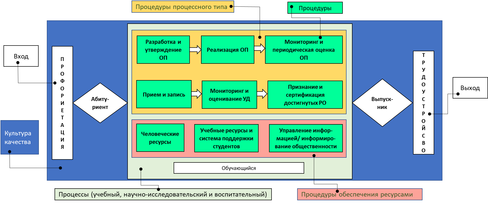

*Структурная диаграмма / Mermaid:* 

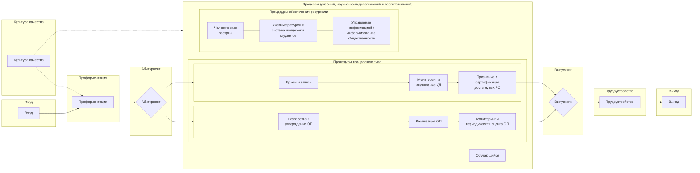

**Рисунок 2.4 – Цикл функционирования высшего образования (на основе ESG)**

Для того, чтобы понять, насколько нормативы в сфере высшего образования позволяют построить архитектуру системы обеспечения качества в соответствии с ESG, исследовательской группой проведен анализ отражение положений ESG в НПА на основе материалов раздела 1.3 (таблица 2.2)

**Таблица 2.2 – Отражение отражение положений ESG в НПА в сфере высшего образования**

| ESG | Закон РК Об образо-вании | Типовые правила деятель-ности ОВПО | ГОС высшего образо-вания | Правила КТО | Типовые правила приема | КВТ | СОР |
| --- | --- | --- | --- | --- | --- | --- | --- |
| 1.1. Политика в области ОК |  |  |  |  |  |  |  |
| 1.2 Разработка и утверждение программ |  |  |  |  |  |  |  |
| 1.3 Студенто-центрированное обучение, преподавание и оценка |  |  |  |  |  |  |  |
| 1.4 Прием сту-дентов, успева-емость, приз-нание и сертификация |  |  |  |  |  |  |  |
| 1.5 ППС |  |  |  |  |  |  |  |
| 1.6 Учебные ресурсы и система поддержки студентов |  |  |  |  |  |  |  |
| 1.7 Управление информацией |  |  |  |  |  |  |  |
| 1.8 Информиро-вание общественности |  |  |  |  |  |  |  |
| 1.9 Постоянный мониторинг и периодическая оценка программ |  |  |  |  |  |  |  |
| 1.10 Периоди-ческое внешнее ОК |  |  |  |  |  |  |  |

Дальше на основе описания усовершенствованной национальной модели обеспечения качества, взаимосвязи ее компонентов и НПА нами была разработана структурная архитектура системы обеспечения качества высшего образования, состоящая из целевого, методологического, содержательного и результативного блоков (рисунок 2.5).

**Рисунок  2.5 – Структурная архитектура системы обеспечения качества высшего образования**

В определении понятия «качества» мы придерживаемся точки зрения Jessop  (2012), считающего, что обеспечение качества «предполагает комплексную оценку результатов, так и сложность результатов». Поэтому необходимо разработать критерии качества, которые в полной мере позволили бы оценить уровень качества как на институциональном, так и в комбинированном виде на национальном уровне (таблица 2.3).

Опираясь на наши ранние исследования, мы рассматриваем «обеспечение качества высшего образования» как обеспечение качества его четырех компонентов:

* качество контента (содержание – ОП);
* качество контингента (обучающиеся);
* качество персонала;
* качество инфраструктуры.

**Таблица 2.3 – Критерии и показатели обеспечения качества высшего образования**

| Раздел | № | Критерии | № | Показатели | Показатели |
| --- | --- | --- | --- | --- | --- |
| 1 | 2 | 3 | 4 | 5 | 5 |
| Качество контента | 1.1. | Степень вовлечен-ности стейк-холдеров в разработку ОП | 1.1.1 | ОП разработана с участием 3 и более стейкхолдеров (ППС, работодатели, обучающиеся и т.д.) | ОП разработана с участием 3 и более стейкхолдеров (ППС, работодатели, обучающиеся и т.д.) |
| Качество контента | 1.1. | Степень вовлечен-ности стейк-холдеров в разработку ОП | 1.1.2 | ОП разработана с участием не менее 2 стейкхолдеров (ППС, работодателей, обучающиеся) | ОП разработана с участием не менее 2 стейкхолдеров (ППС, работодателей, обучающиеся) |
| Качество контента | 1.1. | Степень вовлечен-ности стейк-холдеров в разработку ОП | 1.1.3 | ОП разработана с участием менее 2 стейкхолдеров (ППС, работодателей, обучающиеся) | ОП разработана с участием менее 2 стейкхолдеров (ППС, работодателей, обучающиеся) |
| Качество контента | 1.2. | Согласован-ность ОП с НРК, ОРК, ПС, ГОСО | 1.2.1 | Содержание ОП соответствует ГОСО | Содержание ОП соответствует ГОСО |
| Качество контента | 1.2. | Согласован-ность ОП с НРК, ОРК, ПС, ГОСО | 1.2.2 | Результаты обучения коррелируют с дескрипторами Национальной рамки квалификации | Результаты обучения коррелируют с дескрипторами Национальной рамки квалификации |
| Качество контента | 1.2. | Согласован-ность ОП с НРК, ОРК, ПС, ГОСО | 1.2.3 | РО коррелируют с ОРК/профстандартами | РО коррелируют с ОРК/профстандартами |
| Качество контента | 1.3. | Адекватность форму-лировки РО ОП | 1.3.1 | РО отражают контекст и уровень ОП | РО отражают контекст и уровень ОП |
| Качество контента | 1.3. | Адекватность форму-лировки РО ОП | 1.3.2 | РО ОП являются измеримыми | РО ОП являются измеримыми |
| Качество контента | 1.3. | Адекватность форму-лировки РО ОП | 1.3.3 | РО ОП отражают уровень компетенций выпускника | РО ОП отражают уровень компетенций выпускника |
| Качество контента | 1.4. | Уровень практико-ориентиро-ванности ОП | 1.4.1 | Доля практикоориентированных дисциплин в ОП (с учетом практик) | Доля практикоориентированных дисциплин в ОП (с учетом практик) |
| Качество контента | 1.4. | Уровень практико-ориентиро-ванности ОП | 1.4.2 | Обеспеченность базами практик | Обеспеченность базами практик |
| Качество контента | 1.4. | Уровень практико-ориентиро-ванности ОП | 1.4.3 | Наличие сертификационных программ/курсов (в т.ч. микроквалификаций) в ОП | Наличие сертификационных программ/курсов (в т.ч. микроквалификаций) в ОП |
| Качество контента | 1.5. | Обеспечен-ность норматив-ными, учебно- и научно-методиче-скими разработ-ками | 1.5.1 | Полнота академической документации (ВНД) | Полнота академической документации (ВНД) |
| Качество контента | 1.5. | Обеспечен-ность норматив-ными, учебно- и научно-методиче-скими разработ-ками | 1.5.2 | Полнота учебно-методических разработок по ОП (силлабусы, методические материалы, наглядные материалы, оценочные материалы (в т.ч. электронные) | Полнота учебно-методических разработок по ОП (силлабусы, методические материалы, наглядные материалы, оценочные материалы (в т.ч. электронные) |
| Качество контента | 1.5. | Обеспечен-ность норматив-ными, учебно- и научно-методиче-скими разработ-ками | 1.5.3 | Полнота научно-методических разработок по ОП | Полнота научно-методических разработок по ОП |
| Качество контента | 1.6. | Результаты внешней оценки ОП | 1.6.1. | 1.6.1. | Наличие аккредитации ОП |
| Качество контента | 1.6. | Результаты внешней оценки ОП | 1.6.2. | 1.6.2. | Участие в международных рейтингах (QS, The, ARWU) |
| Качество контента | 1.6. | Результаты внешней оценки ОП | 1.6.3. | 1.6.3. | Участие в отечественных рейтингах (Атамекен) |
| Качество контин-гента | 2.1. | 1. Динамика и структура приема | 2.1.1. | 2.1.1. | Наличие динамики роста контингента |
| Качество контин-гента | 2.1. | 1. Динамика и структура приема | 2.1.2. | 2.1.2. | Доля студентов-обладателей "Алтын белгі" |
| Качество контин-гента | 2.1. | 1. Динамика и структура приема | 2.1.3. | 2.1.3. | Доля бакалавров с баллами ЕНТ |
| Качество контин-гента | 2.2. | Успеваемость обучающихся | 2.2.1. | 2.2.1. | Адекватность медианы оценок |
| Качество контин-гента | 2.2. | Успеваемость обучающихся | 2.2.2. | 2.2.2. | Доля доводимости студентов до выпуска |
| Качество контин-гента | 2.2. | Успеваемость обучающихся | 2.2.3. | 2.2.3. | Доля студентов, имеющих повышенные стипендии, гранты |
| Качество контин-гента | 2.3. | Степень интернационализации обучающихся | 2.3.1. | 2.3.1. | Доля иностранных студентов |
| Качество контин-гента | 2.3. | Степень интернационализации обучающихся | 2.3.2. | 2.3.2. | Доля студентов, участвовуюших в программах академмобильности |
| Качество контин-гента | 2.3. | Степень интернационализации обучающихся | 2.3.3. | 2.3.3. | Доля студентов, участвовуюших в совместных, двудипломных ОП |
| Качество контин-гента | 2.4. | Участие студентов в научных мероприятиях | 2.4.1. | 2.4.1. | Доля студентов, имеющих призовые места международныхх олимпиад, конкурсов научных проектов |
| Качество контин-гента | 2.4. | Участие студентов в научных мероприятиях | 2.4.2. | 2.4.2. | Доля студентов, имеющих призовые места Республиканских олимпиад, конкурсов научных проектов |
| Качество контин-гента | 2.4. | Участие студентов в научных мероприятиях | 2.4.3. | 2.4.3. | Доля студентов, принимающих участие в научных и инновационных проектах |
| Качество контин-гента | 2.5. | Участие студентов в социальных проектах | 2.5.1. | 2.5.1. | Доля студентов, участвующих в общественной жизни на республиканском уровне |
| Качество контин-гента | 2.5. | Участие студентов в социальных проектах | 2.5.2. | 2.5.2. | Доля студентов, участвующих в общественной жизни на вузовском и региональном уровнях |
| Качество контин-гента | 2.5. | Участие студентов в социальных проектах | 2.5.3. | 2.5.3. | Доля студентов, охваченных волонтерской деятельностью |
| Качество контин-гента | 2.6. | Востребованность выпускников ОП | 2.6.1. | 2.6.1. | Доля выпускников образовательной программы, трудоустроенных по профилю в течение 6 месяцев после выпуска |
| Качество контин-гента | 2.6. | Востребованность выпускников ОП | 2.6.2. | 2.6.2. | Доля выпускников образовательной программы, трудоустроенных по профилю в течение года после выпуска |
| Качество контин-гента | 2.6. | Востребованность выпускников ОП | 2.6.3. | 2.6.3. | Наличие целевого заказа от предприятий, отраслей, ведомств и организаций/предприятий-партнеров на подготовку специалистов по образовательной программе (договоры о целевой подготовке для предприятий и др.) |
| Качество персонала | 3.1. | Порядок приема персонала | 3.1.1. | 3.1.1. | Наличие документированной процедуры приема ППС |
| Качество персонала | 3.1. | Порядок приема персонала | 3.1.2. | 3.1.2. | Конкурс на 1 объявленное место |
| Качество персонала | 3.1. | Порядок приема персонала | 3.1.3. | 3.1.3. | доля ППС, имеющих профессиональные сертификаты и сертификаты ПК |
| Качество персонала | 3.2. | Качественная структура персонала | 3.2.1. | 3.2.1. | доля остепененности ППС в разрезе ОП/направления подготовки |
| Качество персонала | 3.2. | Качественная структура персонала | 3.2.2. | 3.2.2. | доля ППС, выпускников программы "Болашак" |
| Качество персонала |  |  | 3.2.3. | 3.2.3. | доля ППС, владеющих английским языком |
| Качество персонала |  |  | 3.2.4. | 3.2.4. | доля преподавателей-практиков |
| Качество персонала |  |  | 3.2.5. | 3.2.5. | Доля ППС, обладателей звания "Лучший преподаватель вуза" |
| Качество персонала | 3.3. | Научная и инновационная активность персонала | 3.3.1. | 3.3.1. | доля ППС, имеющих патенты, свидетельства на изобретения и права на интеллектуальную собственность |
| Качество персонала | 3.3. | Научная и инновационная активность персонала | 3.3.2. | 3.3.2. | доля ППС, участвующих в реализации ГФ, ПЦФ, хоздоговорных и инициативных проектов |
| Качество персонала | 3.3. | Научная и инновационная активность персонала | 3.3.3. | 3.3.3. | доля ППС, имеющих научные публикации в высокорейтинговых журналах |
| Качество персонала | 3.4. | Интернационализация персонала | 3.4.1. | 3.4.1. | доля ППС, участвующих в программах мобильности |
| Качество персонала | 3.4. | Интернационализация персонала | 3.4.2. | 3.4.2. | доля ППС, участвующих в международных проектах и программах |
| Качество персонала | 3.4. | Интернационализация персонала | 3.4.3. | 3.4.3. | Доля привлеченных ведущих зарубежных специалистов |
| Качество персонала | 3.5. | Обеспеченность качества преподавания | 3.5.1. | 3.5.1. | Уровень оценок ППС обучающимися |
| Качество персонала | 3.5. | Обеспеченность качества преподавания | 3.5.2. | 3.5.2. | Уровень медианы оценок обучающихся в разрезе ППС |
| Качество персонала | 3.5. | Обеспеченность качества преподавания | 3.5.3. | 3.5.3. | Уровень оценок обучающихся по внешнему оцениванию учебных достижений |
| Качество инфра-струк-туры | 4.1. | Достаточность ресурсного обеспечения | 4.1.1. | 4.1.1. | Достаточность аудиторного фонда |
| Качество инфра-струк-туры | 4.1. | Достаточность ресурсного обеспечения | 4.1.2. | 4.1.2. | Достаточность мест в общежитиях |
| Качество инфра-струк-туры | 4.1. | Достаточность ресурсного обеспечения | 4.1.3. | 4.1.3. | Наличие в вузе уникального оборудования, необходимого для подготовки специалистов по профилям |
| Качество инфра-струк-туры | 4.1. | Достаточность ресурсного обеспечения | 4.1.4. | 4.1.4. | Фонд учебной и научной литературы, в том числе на электронных носителях |
| Качество инфра-струк-туры | 4.1. | Достаточность ресурсного обеспечения | 4.1.5. | 4.1.5. | наличие медицинских центров/пунктов |
| Качество инфра-струк-туры | 4.1. | Достаточность ресурсного обеспечения | 4.1.6. | 4.1.6. | Достаточность мест в пунктах общественного питания |
| Качество инфра-струк-туры | 4.1. | Достаточность ресурсного обеспечения | 4.1.7. | 4.1.7. | Обеспеченность студенческими сооружениями и инвентарем |
| Качество инфра-струк-туры | 4.2. | Уровень технического сопровождения | 4.2.1. | 4.2.1. | Наличие в вузе систем сопровождения учебного процесса (LMS, онлайн платформы) |
| Качество инфра-струк-туры | 4.2. | Уровень технического сопровождения | 4.2.2. | 4.2.2. | Функционирование Wi-FI, скорость Интернет |
| Качество инфра-струк-туры | 4.2. | Уровень технического сопровождения | 4.2.3. | 4.2.3. | Наличие систем прокторинга, а также систем на проверку уникальности/плагиат |
| Качество инфра-струк-туры | 4.2. | Уровень технического сопровождения | 4.2.4. | 4.2.4. | Наличие лицензионных программных продуктов |
| Качество инфра-струк-туры | 4.3. | Инклюзивность инфраструктуры | 4.3.1. | 4.3.1. | Обеспечение безбарьерного доступа к объектам |
| Качество инфра-струк-туры | 4.3. | Инклюзивность инфраструктуры | 4.3.2. | 4.3.2. | Наличие методических условий для инклюзивного обучения |
| Качество инфра-струк-туры | 4.3. | Инклюзивность инфраструктуры | 4.3.3. | 4.3.3. | Наличие оборудования, организационных условий для инклюзивного обучения |
| Качество инфра-струк-туры | 4.4. | Уровень автоматизации бизнес-процессов | 4.4.1. | 4.4.1. | наличие документированных бизнес-процессов |
| Качество инфра-струк-туры | 4.4. | Уровень автоматизации бизнес-процессов | 4.4.2. | 4.4.2. | наличие корпоративной системы сопровождения процессов, системы электронного документооборота |
| Качество инфра-струк-туры | 4.4. | Уровень автоматизации бизнес-процессов | 4.4.3. | 4.4.3. | Скорость принятия решений |
| Качество инфра-струк-туры | 4.5. | Обеспечение студентоцентрированности инфраструктуры | 4.5.1. | 4.5.1. | Уровень участия обучающихся в управлении инфраструктурой |
| Качество инфра-струк-туры | 4.5. | Обеспечение студентоцентрированности инфраструктуры | 4.5.2. | 4.5.2. | Наличие специальных зон для отдыха и работы обучающихся во внеурочное время |
| Качество инфра-струк-туры | 4.5. | Обеспечение студентоцентрированности инфраструктуры | 4.5.3. | 4.5.3. | Доступность сервисов внутри кампуса для обучающихся |

Как уже сказано в Концепции обеспечения качества, для организаций высшего и послевузовского образования качество высшего образования означает соответствие требованиям к качеству подготовки кадров, и потребностям обучающихся и работодателей. Таким образом, концепция качества должна рассматриваться как с точки зрения потребителя (обучающегося, работодателя), отражающее соответствии цели, так и с точки зрения соответствия использованию или потребления образовательной услуги (продукта).

Обучающиеся предъявляют требования к высокому качеству образовательной программы (контент, отражающий интересы и запросы обучающегося), образовательной среды (инфраструктура) и образовательного процесса (организация, технологии). Реализация данных требований обеспечивается при членстве обучающихся в академических комитетах по разработке образовательных программ и иных коллегиальных органах. Трансформация качественных изменений заключается в том, что обучающийся выступает обязательным участником образовательного процесса.

Работодатели устанавливают требования к высокому качеству образовательной программы (контент с точки зрения наличия необходимых компетенций, востребованных на рынке труда) и качественным характеристикам выпускников (наличие необходимых навыков и компетенций). Данные требования обеспечиваются посредством участия работодателей в разработке и экспертизе образовательных программ, а также при оценке качества выпускников в результате социологического опроса.

В этой связи ОВПО должны постоянно работать над всеми указанными факторами обеспечения качества высшего образования. Таким образом, обеспечение качества рассматривается более широко, включая способы управления, мониторинг, оценку и контроль для обеспечения качества образования или образовательной услуги. Учитывая вышесказанное, и имея в виду практическую значимость для вузов, исследовательская группа разработала для системы внутреннего обеспечения качества отдельную архитектуру в виде структурной модели (рисунок 2.6).

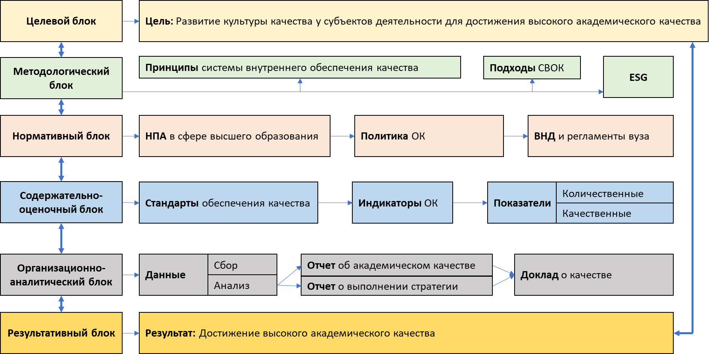

*Структурная диаграмма / Mermaid:* 

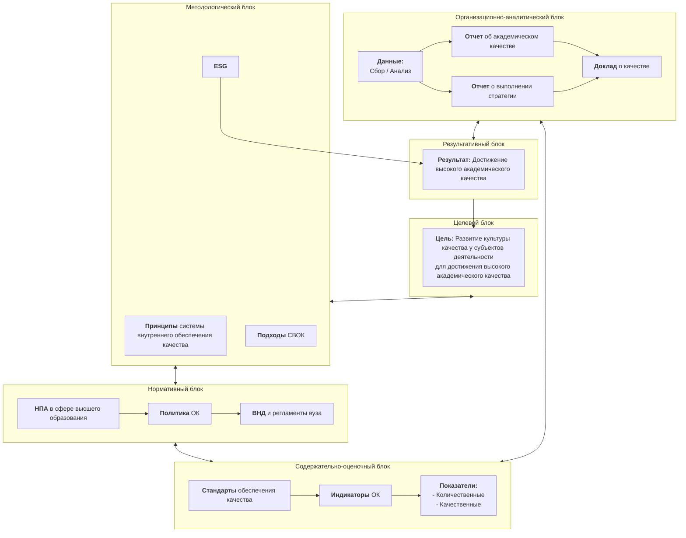

**Рисунок 2.6 – Общая модель системы внутреннего обеспечения качества**

Разработанная общая (структурная) модель системы внутреннего обеспечения качества состоит из следующих блоков:

1) целевой – где определена цель системы;
2) методологический – где определены принципы и подходы к обеспечению  качества;
3) нормативный – где определена законодательная база системы;
4) содержательно-оценочный, охватывающий стандарты, индикаторы (критерии) и показатели качества;
5) организационно-аналитический – процессуальные и процедурные шаги реализации системы;
6) результативный, определяющий ожидаемый результат системы обеспечения качества.
Все блоки системы логически взаимосвязаны в вертикальном и в горизонтальном значении.

Принципами системы внутреннего обеспечения качества для вуза являются следующие:

обеспечение качества соответствует разнообразию систем высшего образования и обучающихся;

соответствие деятельности ОВПО законодательным и нормативным требованиям, рекомендациям ESG;

обеспечение и повышение качества применимы ко всем образовательным программам, реализуемым ОВПО;

лидирующая роль руководства ОВПО в обеспечении единства стратегии, политики и процедур, вовлечении всех работников и обучающихся в деятельность по обеспечению качества;

учет потребностей и ожиданий внешних и внутренних стейкхолдеров, активное их вовлечение в деятельность по обеспечению качества образования;

обеспечение равенства возможностей и справедливости по отношению к обучающимся;

продвижение академической честности и академической свободы, нулевой терпимости к коррупционным проявлениям, нетерпимости к любым формам дискриминации;

четкое разделение полномочий и ответственности за процессы, качество и стандарты;

применение процессного подхода и комплаенс-риск ориентированного мышления;

принятие важных управленческих решений на основе всестороннего анализа данных и информации;

создание условий для непрерывного совершенствования системы обеспечения качества и развития культуры качества

применение внешней и внутренней оценки качества;

обеспечение регулярного пересмотра политики и стандартов обеспечения качества;

обеспечение прозрачности и доступности информации для заинтересованных сторон.

Архитектуру нормативно-правового обеспечения системы можно визуализировать следующим образом (рисунок 2.7):

**Рисунок 2.7 – Архитектура нормативно-правового обеспечения системы ОК высшего образования**

Одним из ключевых в данной архитектуре является Стратегия развития вуза. Следовательно, она должна быть сквозным связывающим звеном в нормативном обеспечении системы внутреннего обеспечения качества, так как видение и миссия вуза определяет его вектор развития. Поэтому нами была разработана архитектурная структура взаимосвязи стратегии развития вуза с внутренними нормативными документами (рисунок 2.8).

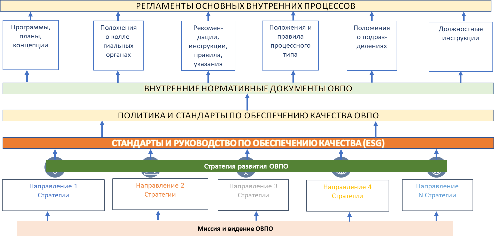

*Структурная диаграмма / Mermaid:* 

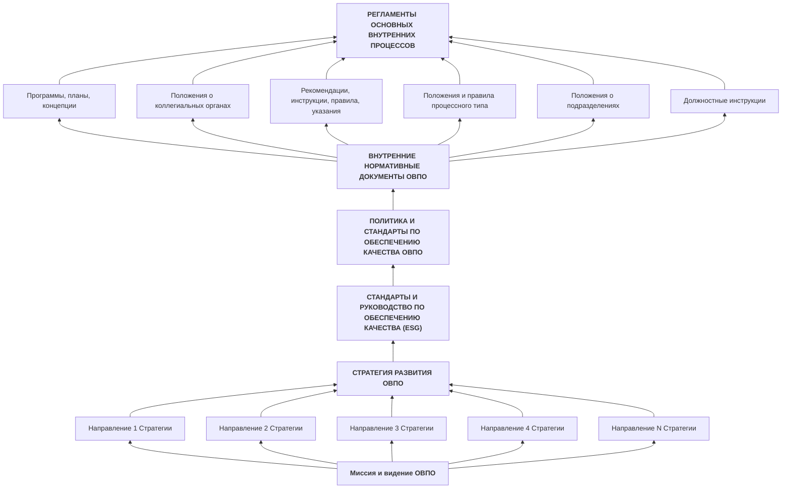

**Рисунок 2.8 – Взаимосвязь Стратегии развития и системы внутреннего обеспечения качества в ОВПО**

Следующий блок – содержательно-оценочный, состоит из политики и стандартов обеспечения, критериев и показателей качества ОВПО.

Как уже было сказано, политика и стандарты внутреннего обеспечения качества вуза разрабатывается на основе ESG и состоит из 10 стандартов:

Политика в области обеспечения качества;

Разработка и утверждение программ;

Студентоцентрированное обучение, преподавание и оценка;

Прием студентов, успеваемость, признание и сертификация;

Преподавательский состав;

Учебные ресурсы и система поддержки студентов;

Управление информацией;

Информирование общественности;

Постоянный мониторинг и периодическая оценка программ;

Периодическое внешнее обеспечение качества.

В оценке уровня качества используются те же критерии и показатели, которые были указаны в таблице 4.3.

В целом, микромодель данного блока можно структурно показать следующим образом (рисунок 2.9):

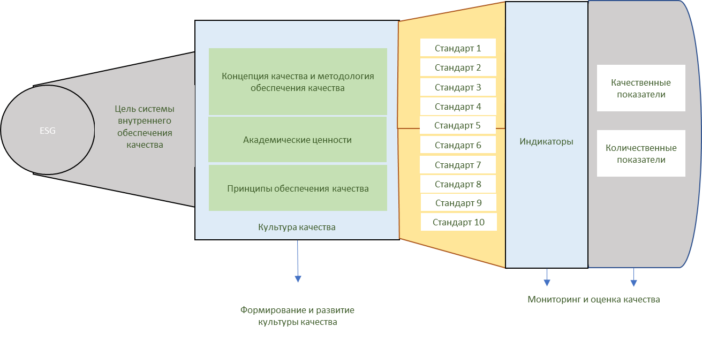

*Структурная диаграмма / Mermaid:* 

```mermaid
flowchart LR
    subgraph Источник["Входные требования"]
        ESG["ESG"] --> AIM["Цель системы внутреннего обеспечения качества"]
    end

    subgraph Основа["Базовые принципы и культура"]
        direction TB
        C_M["Концепция качества и методология обеспечения качества"]
        A_V["Академические ценности"]
        P_Q["Принципы обеспечения качества"]
        CUL["Культура качества<br/><i>(Формирование и развитие)</i>"]
    end

    subgraph Стандарты["Стандарты СВОК"]
        direction TB
        S1["Стандарт 1: Политика обеспечения качества"]
        S2["Стандарт 2: Разработка и утверждение программ"]
        S3["Стандарт 3: Студентоориентированное обучение, преподавание и оценка"]
        S4["Стандарт 4: Прием студентов, успеваемость, признание и сертификация"]
        S5["Стандарт 5: Преподавательский состав"]
        S6["Стандарт 6: Учебные ресурсы и система поддержки студентов"]
        S7["Стандарт 7: Управление информацией"]
        S8["Стандарт 8: Информирование общественности"]
        S9["Стандарт 9: Постоянный мониторинг и периодическая оценка программ"]
        S10["Стандарт 10: Периодическое внешнее обеспечение качества"]
    end

    subgraph Оценка["Оценка и мониторинг"]
        IND["<b>Индикаторы</b>"] --> POK_QUAL["Качественные показатели"]
        IND --> POK_QUANT["Количественные показатели"]
    end

    AIM --> Основа --> Стандарты --> Оценка
```

**Рисунок 2.9 – Содержательно-оценочный блок системы внутреннего обеспечения качества**

Для наглядности можно привести пример из практики по содержанию стандарта 1.2. «Разработка и утверждение образовательных программ» для того, чтобы показать каким образом можно регламентировать внутренние процессы (Стандарты внутреннего обеспечения качества AITU 2.0).

Как уже выше написано, при соблюдении иерархии системы внутреннего обеспечения качества, указанного на рис. 2.10, алгоритм выглядит следующим образом:

1) на основе ESG и нормативных правовых документов РК в сфере высшего и послевузовского образования, сформулированы положения стандарта 1.2 «Разработка и утверждение образовательных программ» и руководство, а также его критерии;
2) далее определены процедуры и утверждены документально;
3) по каждой процедуре разработаны регламенты и описаны в блок-схемах.

**Рисунок 2.10 – Иерархичность документов системы внутреннего обеспечения качества**

При разработке части 1.2 «Разработка и утверждение образовательных программ» Системы внутреннего обеспечения качества ОВПО, основополагающими документами Болонского процесса выступают «Европейские стандарты и руководства для обеспечения качества в Европейском пространстве высшего образования» (стандарт 1.2) и Европейская система трансфера кредитов (ECTS).

Нормативной основой национального уровня части 1.2. СВОК являются следующие документы:

* Государственные общеобязательные стандарты высшего и послевузовского образования;
* Национальная рамка квалификации высшего образования РК
* Отраслевые рамки квалификаций
* Правила организации учебного процесса по кредитной технологии обучения в организациях высшего и (или) послевузовского образования.
* Правила ведения реестра образовательных программ, реализуемых организациями высшего и (или) послевузовского образования, а также основания включения в реестр образовательных программ и исключения из него.
Положения стандарта (или сами стандарты) части СВОК 1.2. «Разработка и утверждение программ» сформулированы следующим образом:

Стандарт 1.2.1. Университет на основе академической и управленческой самостоятельности определяет внутренние процедуры разработки и утверждения образовательных программ.

Стандарт 1.2.2. Университет разрабатывает образовательные программы на основе требований Национальной рамки квалификации высшего образования Республики Казахстан, Отраслевых рамок квалификации, соответствующих профессиональных стандартов, ГОСО РК, Руководство по использованию ECTS (2015), Стратегического плана развития университета и на примерах лучшей практики.

Стандарт 1.2.3. Образовательные программы разрабатываются в контексте компетентностной модели подготовки специалистов по модульному принципу и отражают результаты обучения.

Стандарт 1.2.4. Результаты обучения формулируются по программе в целом, по каждому модулю и отдельным дисциплинам.

Стандарт 1.2.5. Университет разрабатывает требования по освоению/получению микроквалификаций.

Стандарт 1.2.6. Университет присуждает степень в соответствии с государственными общеобязательными стандартами высшего и послевузовского образования.

Для оценки соответствия стандартов к требуемым параметрам, определены следующие критерии части 1.2:

Образовательные программы соответствуют ГОСО высшего и послевузовского образования, Руководству по использованию ECTS, НРК ВО РК, ОРК, профессиональным стандартам.

Образовательные программы учитывают требования рынка труда и ожидания работодателей.

Образовательные программы являются практикоориентированными, виды учебных занятий и технологии обучения нацелены на привитие обучающимся навыков и компетенций.

Результаты обучения коррелируют с дескрипторами ГОСО высшего и послевузовского образования, Национальной рамки квалификации высшего образования Республики Казахстан.

В образовательных программах обеспечивается согласованность компетенций, результатов обучения и академических кредитов в разрезе учебных дисциплин, модулей и программы в целом.

Микроквалификация имеет самостоятельную ценность и включает оценку, основанную на четко определенных стандартах, в том числе путем признания предшествующего обучения.

Далее определено руководство по реализации положений части 1.2:

Академическая политика, Правила разработки образовательных программ высшего и послевузовского образования регламентируют внутренние процедуры разработки и утверждения образовательных программ.

Образовательные программы разрабатываются в соответствии с Правилами разработки образовательных программ высшего и послевузовского образования.

Работу Академических комитетов координирует декан и соответствующие Департаменты образовательных программ.

Методическое сопровождение образовательной программы включает каталог элективных дисциплин, силлабусы по учебным дисциплинам, учебно-методические разработки по учебным дисциплинам и профессиональным практикам, а также справочно-информационные ресурсы.

Учебная нагрузка определяется в академических кредитах. Один академический кредит приравнивается 30 академическим часам.

Учебная нагрузка обучающихся включает в себя аудиторные занятия и самостоятельную работу обучающихся, в том числе под руководством преподавателя, подготовку и сдачу рубежных контролей и промежуточной аттестации. Соотношение аудиторных занятий и иных видов учебной нагрузки составляет не менее 30:70.

Академическая степень и(или) квалификация, получаемая в результате освоения образовательной программы бакалавриата соответствует 6 (шестому) уровню с объемом не менее 240 академических кредитов, магистратуры – 7 (седьмому) уровню с объемом не менее 60, или 90, или 120 академических кредитов и докторантуры – 8 (восьмому) уровню с объемом не менее 180 академических кредитов Национальной рамки квалификации в высшем образовании Республики Казахстан, согласованные со Всеобъемлющей рамкой квалификаций в Европейском пространстве высшего образования.

Обучающимся предоставляется возможность прохождения дополнительных программ обучения с целью получения микроквалификаций через сертификацию или освоение микрокредитов.

Университет определяет программы микроквалификаций, которые могут быть встроенными в содержание ОП, а также дополнительными, которые осваиваются вне учебной программы.

Для каждой микроквалификации определяются компетенции, которыми должны обладать обучающиеся по итогу пройденных курсов и составляется карта компетенций.

Присвоение микроквалификаций может быть осуществлено через перезачет результатов обучения курсов МООК и на основании сертификатов IТ вендеров.

Документом, подтверждающим результат присвоения микроквалификации является выдача сертификата или свидетельства о завершении обучения, полученный в результате неформального образования с указанием объема пройденного курса.

Для обеспечения реализации  стандарта должны быть рзработаны и утверждены следующие внутренние нормативные документы университета:

Академическая политика ОВПО;

Правила организации учебного процесса по кредитной технологии обучения ОВПО;

Правила разработки образовательных программ высшего и послевузовского образования ОВПО;

Положение о кодировке дисциплин;

Положение о формировании Каталога элективных дисциплин.

Практика показала, что основными процессами части 1.2 системы внутреннего обеспечения качества являются «Разработка образовательных программ», «Внесение изменений и дополнений в образовательные программы» и «Разработка и утверждение Каталога элективных дисциплин» (в принципе, можно и определять больше процедур, но данные процедуры являются основными).

По каждому процессу/процедуре определены основные владельцы, участники в целом и порядок реализации согласно внутренним нормативным документам.

Рассмотрим на примерах вышеуказанных процессов.

Регламент процесса «Разработка и утверждения новых ОП»

1.	Владелец процесса – подразделение по академической деятельности.
2.	Ответственный работник – руководитель образовательной программы (зав.кафедрой).
3.	Разработка и утверждение новых образовательных программ осуществляются в соответствии Правилами разработки образовательных программ высшего и послевузовского образования ОВПО (далее – Правила).
4.	Разработка ОП состоит из следующих этапов: 1) подготовка к разработке ОП; 2) проектирование ОП; 3) разработка структурных элементов ОП; 4) оценка качества ОП.
5.	Для разработки ОП по инициативе кафедры Ученый совет создает Академический комитет (АК).
6. На 1 этапе «Подготовка к разработке ОП» АК проводит анализ рынка подготовки кадров, анализ возможностей вуза для реализации ОП и определяется перечень направлений подготовки.
7.	На 2 этапе «Проектирование образовательной программы» члены АК проводят:
1)	исследования сферы профессиональной деятельности;
2)	выявляют профессионально значимые компетенции;
3)формулируют результаты обучения программы на основе детализации компетенций;

4) определяют взаимосвязи результатов обучения и критериев оценки;
5) проектируют методы и средства оценки достижения результатов обучения (далее – РО);
6) определяют потребности в ресурсах.
8.	На 3 этапе «Разработка структурных элементов образовательной программы» формулируются название и цель ОП, проектируется содержание ОП и определяются стратегии обучения согласно п 6 Правил.
9.	Содержание ОП проектируется через определение модулей/учебных дисциплин программы. ОП разрабатывается в контексте профессиональных функций и состоит из перечня учебных дисциплин, содержание которых зависит от целей, компетенций и результатов обучения по модулям.
10.	Разработанный проект образовательной программы передается для оценки в Совет по качеству университета и проходит  оценку проверку на предмет заимствования без ссылки на автора и источник заимствования (проверка ОП на предмет плагиата).
11.	При отрицательном заключении Совета по качеству ОП возращается в АК для доработки и после доработки вновь передается Совету по качеству. При положительном заключении Совета по качеству разработанная образовательная программа согласовывается представителями работодателей и передается для утверждения в Ученый совет ОВПО.
12.	После положительного решения Ученого совета сотрудник подразделения по АД подает заявку о включении ОП в Реестр ОП ВПО уполномоченного органа.
13. Заявка для включения ОП в Реестр рассматривается в соответствии с «Правилами ведения реестра образовательных программ, реализуемых организациями высшего и (или) послевузовского образования, а также основания включения в реестр образовательных программ и исключения из него» уполномоченного органа.
14. При отрицательном заключении по заявке по включению ОП в Реестр, ОП возращается в АК для доработки и после доработки вновь передается для включения в Реестр.
15.	После получения положительного решения эксперта Реестра, образовательная программа публикуется на сайте ОВПО.
Блок-схема процесса 1.2.1 «Разработка и утверждение образовательных программ» представлена на рис. 2.11.

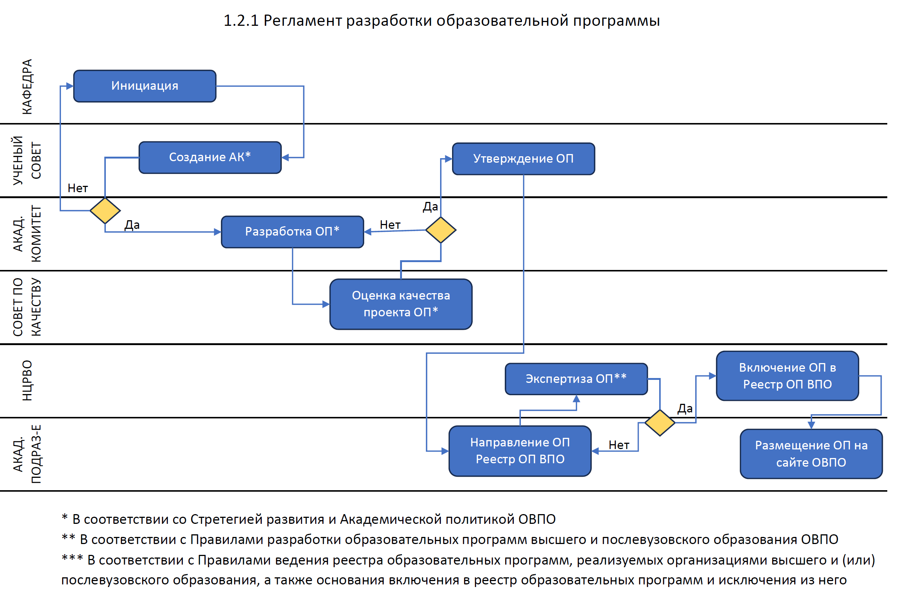

*Структурная диаграмма / Mermaid:* 

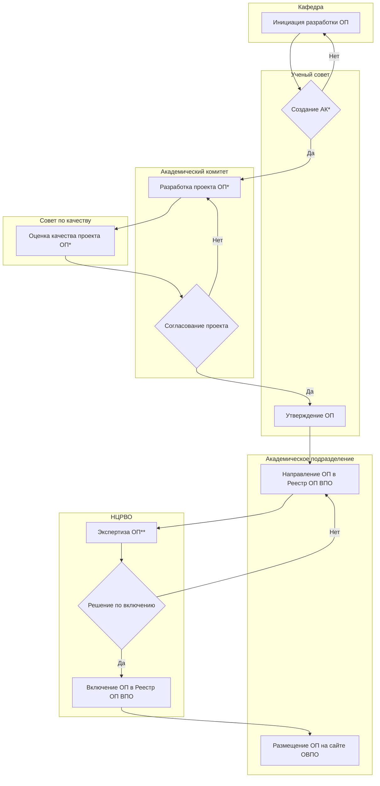

**Рисунок 2.11 – Регламент процесса «1.2.1 – Разработка и утверждение образовтельных программ»**

Регламент процесса «Внесение изменений и дополнений в ОП»

1.	Владелец процесса – кафедра.
2.	Ответственный работник – сотрудник подразделения по обеспечению качества.
3.	Внесение изменений и дополнений в образовательную программу осуществляются по мере необходимости (при внесении изменений в нормативно-правовые акты в области образования, по рекомендации работодателей и т.д.).
4.	Академический комитет проводит анализ структуры образовательной программы. Определяет список дисцилин необходимых для внесения изменений в образовательную программу.
5.	Академический комитет определяет цели, задачи и РО по дисциплине.
6. Дополнения и изменения образовательной программы передается для оценки в Совет по качеству университета и проходит  оценку проверку на предмет заимствования без ссылки на автора и источник заимствования (проверка ОП на предмет плагиата).
7.	При отрицательном заключении Совета по качеству ОП возращается в АК для доработки и после доработки вновь передается Совету по качеству. При положительном заключении Совета по качеству изменения и дополнения в образовательную программу передается для утверждения в Ученый совет ОВПО.
12.	После положительного решения Ученого совета сотрудник подразделения по АД подает заявку об обновлении ОП в Реестр ОП ВПО уполномоченного органа.
13. Заявка для обновления ОП в Реестр рассматривается в соответствии с «Правилами ведения реестра образовательных программ, реализуемых организациями высшего и (или) послевузовского образования, а также основания включения в реестр образовательных программ и исключения из него» уполномоченного органа.
14. При отрицательном заключении по заявке по включению ОП в Реестр, ОП возращается в АК для доработки и после доработки вновь передается для обновления в Реестр.
15.	После получения положительного решения эксперта Реестра, дополненная и измененная образовательная программа публикуется на сайте ОВПО.
Блок-схема процесса 1.2.2 «Внесение изменений и дополнений в ОП» представлена на рис. 2.12.

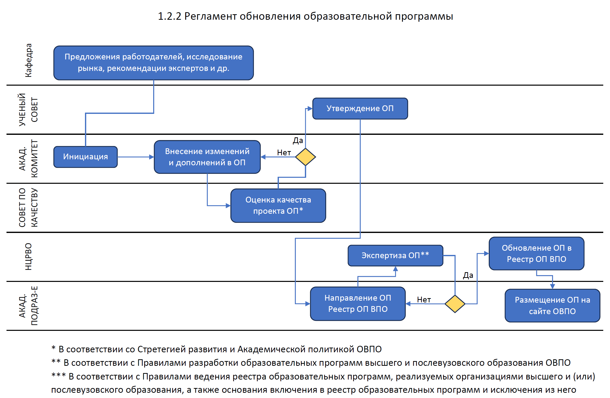

*Структурная диаграмма / Mermaid:* 

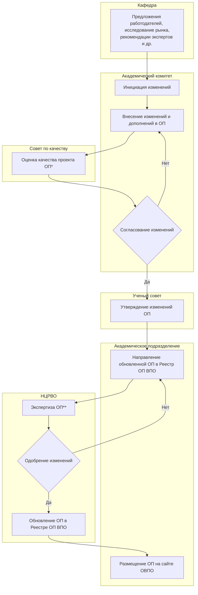

**Рисунок 2.12 – Регламент процесса «Внесение изменений и дополнений в ОП»**

Регламент процесса «Разработка и утверждение Каталога элективных дисциплин»

1.	Владелец процесса – подразделение по академической деятельности.
2.	Ответственный работник – руководитель образовательной программы.
3.	Разработка и утверждение Каталога элективных дисциплин осуществляются в соответствии с Правилами разработки образовательных программ высшего и послевузовского образования ОВПО(утв. Ректором ОВПО) (далее – Правила) и Поожением о формировании Каталога элективных дисциплин.
4.	Академическим комитетом определяется перечень дисциплин для включения в Каталог элективных дисциплин.
5.	Руководитель ОП (ав.кафедрой) передает сотруднику подразделения по академической деятельности наименование дисциплины на трех языках с решением Академического комитета о включение в Каталог элективных дисциплин
6.	Сотрудник подразделения по академической деятельности вносит наименование дисциплины в ИС ОВПО (справочник дисциплин).
7.	Руководитель ОП (ав.кафедрой), за которым закреплена дисциплина заполняет формуляр «Описания дисциплины» в ИС ОВПО на каждую дисциплину отдельно.
8.	Затем формируется электронный Каталог элективных дисциплин по указанной образовательной программе.
Блок-схема процесса 1.2.3 «Разработка и утверждение Каталога элективных дисциплин» представлена на рис. 2.13.

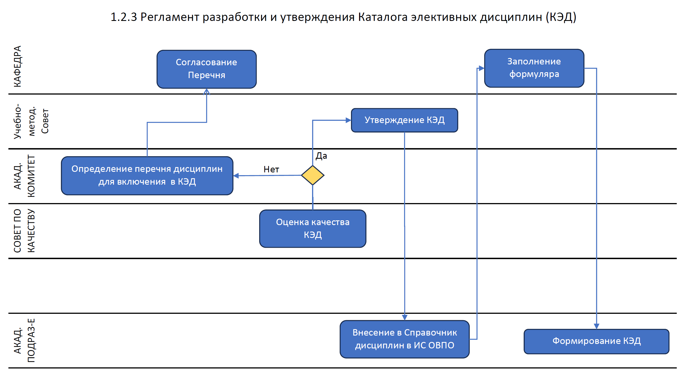

*Структурная диаграмма / Mermaid:* 

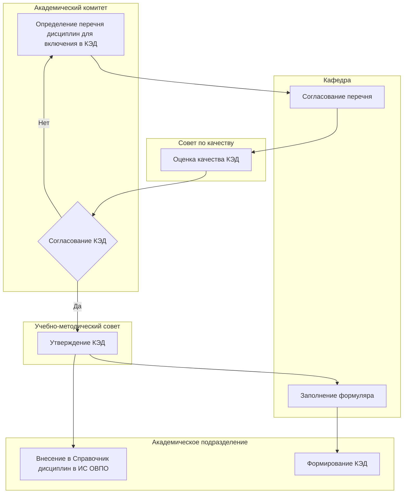

**Рисунок 2.13 – Регламент процесса «Разработка и утверждение Каталога элективных дисциплин»**

На примере части 1.2 «Разработка  утверждение образовательных программ» системы внутреннего обеспечения качества показан алгоритм регламентации процессов. Все остальные 9 стандартов  системы внутреннего обеспечения качества подобным образом должны быть регламентированы.

Переходим к следующим блокам модели системы внутреннего обеспечения качества – организационно-аналитический, отвечающий процессуальные и процедурные шаги реализации системы. В соответствии с параметрами обеспечения качества, построена следующая архитектура организации cистемы внутреннего обеспечения качества ОВПО (рисунок 2.13), а также схема организационно-аналитического блока модели системы внутреннего обеспечения качества (рисунок 2.14):

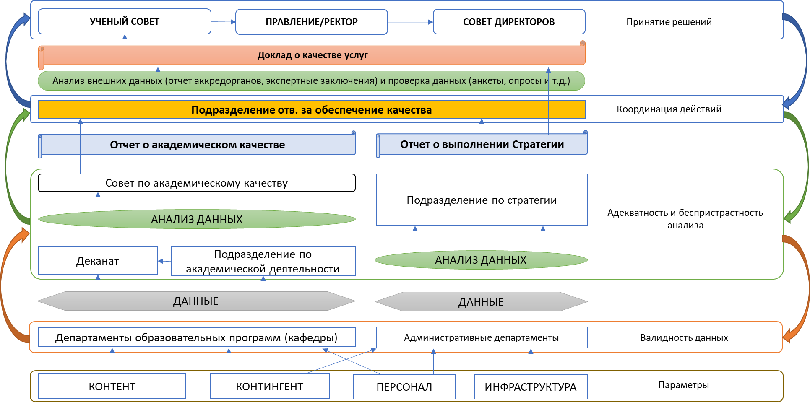

*Структурная диаграмма / Mermaid:* 

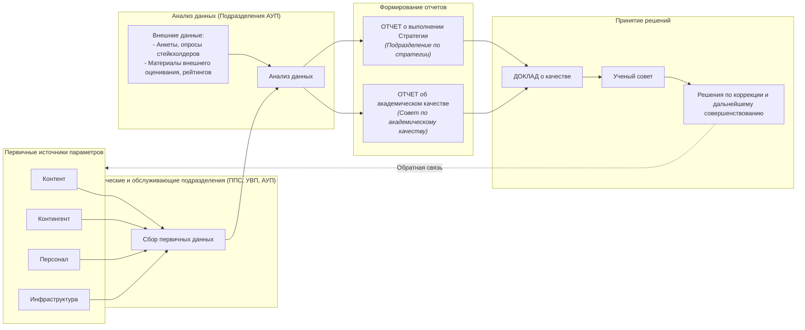

**Рисунок 2.13 – Архитектура организации cистемы внутреннего обеспечения качества ОВПО**

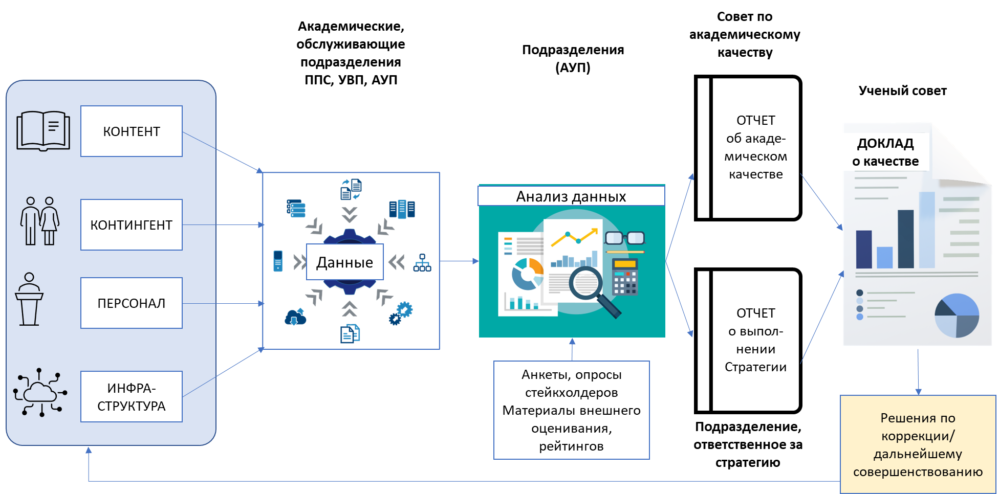

*Структурная диаграмма / Mermaid:* 

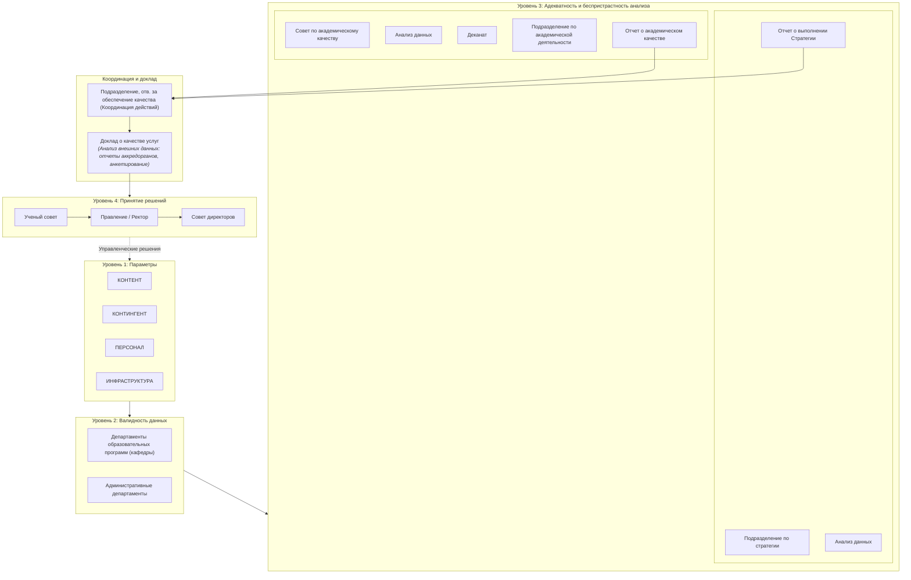

**Рисунок 2.14 – Организационно-аналитический блок модели системы внутреннего обеспечения качества**

Как видно в рисунках, важное место отведено сбору и аналитике данных. Это закономерно, так как для успешной жизнедеятельности системы необходим подход, основанный на принятие решений на основе больших данных.

Также не менее важно участие всех участников процесса в разработке и реализации системы обеспечения качества на уровне ОВПО: это и АУП, ППС, УВП, обучающиеся. Матрицу их участия в системе внцутреннего обеспечения качества можно показать следующим образом (рисунок 2.15):

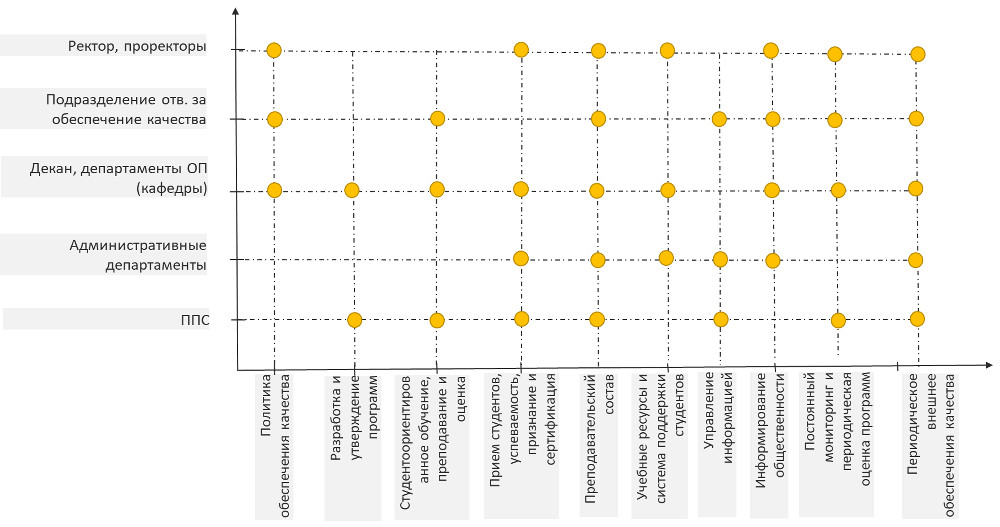

*Структурная диаграмма / Mermaid:* 

| Субъект / Должность | Ст. 1 (Политика) | Ст. 2 (Программы) | Ст. 3 (Студентоориент.) | Ст. 4 (Прием/успев.) | Ст. 5 (ППС) | Ст. 6 (Ресурсы) | Ст. 7 (Информ.) | Ст. 8 (Обществ.) | Ст. 9 (Мониторинг) | Ст. 10 (Внеш. ОК) |
| :--- | :---: | :---: | :---: | :---: | :---: | :---: | :---: | :---: | :---: | :---: |
| **Ректор, проректоры** | ● | | | ● | ● | ● | | ● | ● | ● |
| **Подразделение, отв. за обеспечение качества** | ● | | ● | | ● | | ● | ● | ● | ● |
| **Декан, департаменты ОП (кафедры)** | ● | ● | ● | ● | ● | ● | | ● | ● | ● |
| **Административные департаменты** | | | | ● | ● | ● | ● | ● | | ● |
| **ППС** | | ● | ● | ● | ● | | ● | | ● | ● |

**Рисунок 2.15 – Матрица вовлеченности работников ОВПО в реализации стандартов СВОК**

В матрице желтые точки на пересечениях показывают на участие того или иного работника соответствующего подразделения в реализации стандартов внутреннего обеспечения качества вуза. По плотности таких точек можно сделать вывод о том, что все работники вуза непосредственно участвуют в системе обеспечения качества.

Таким образом, система внутреннего обеспечения качества ОВПО должна быть направлена на поддержание высоких стандартов качества образовательных услуг вуза, а также обеспечение связи между обучением, научными исследованиями и инновациями через привлечение ведущих мировых специалистов в области информационных и цифровых технологий; формирование ресурсной базы для проведения научных исследований фундаментального и прикладного характера; создание лабораторий вендорных компаний, ориентированных на экономику страны; обеспечение достаточного уровня гражданской зрелости студентов и необходимых мер по социальной поддержке студентов и сотрудников университета с целью повышения конкурентоспособности.

Национальная модель и архитектура обеспечения качества высшего образования направлены на формирование:

1) качественного образовательного контента путем создания специализированных сетевых ресурсов непрерывного образования, встроенных в университетские программы;
2) качественного контингента через прием талантливых абитуриентов, прошедших вступительные испытания, отличающихся высокой мотивацией и научно-исследовательским потенциалом, для последующего служения обществу;
3) качественного персонала посредством конкурсного рекрутинга, интегрированного в общий процесс реализации кадровой политики университета, и привлечения специалистов с реального сектора, бизнес-структур, сертифицированных проектных менеджеров;
4) качественной инфраструктуры через развитие инновационной экосистемы и SMART-университета, как залог современной комфортной цифровой образовательной среды.
Управление обеспечением качества включает мероприятия по управлению качественным контентом, качественным контингентом, качественным персоналом, качественной инфраструктурой, которые находят свое отражение в соответствующих Стандартах внутреннего обеспечения качества.

Национальная модель обеспечения качества высшего образования основана на ценностях культуры качества среди всего сообщества высшего: академического персонала, обучающихся, административного и управленческого состава, работодателей, государственных органов и других, согласно которой каждый осознает свои обязательства и ответственность по обеспечению и повышению качества.

# ЗАКЛЮЧЕНИЕ

Современные проблемы обеспечения качества высшего образования имеют большую актуальность для организаций высшего и послевузовского образования Казахстана, поскольку современный период модернизации системы высшего образования предполагает как структурные изменения, так и обновление содержания образовательных программ и технологий обучения.

Казахстан, как полноправный член Европейского пространства высшего образования, формирует свою систему обеспечения качества высшего образования в соответствии с европейскими подходами, а именно на основе Стандартов и Руководящих принципов обеспечения качества в ЕПВО (ESG). Это реализация в казахстанском образовании не только взятых на себя обязательств, но и отвечает внутренним потребностям образования и национальным интересам.

Следует отметить, что казахстанская национальная модель обеспечения качества высшего образования полностью базируется на ESG и имеет аналогичную трехуровневую структуру.

Объектом исследования монографии является система обеспечения качества высшего и послевузовского образования. Она выполнена в рамках научной программы «Повышение конкурентоспособности вузов Казахстана через реинжиниринг национальной системы обеспечения качества высшего образования», рассчитанной на 2023-2024 годы.

В ходе проведенного исследования получены следующие результаты:

проведен обзор научной литературы с целью выявления теорий, концепций, тенденций, проблем и методологий исследования, связанных с понятием «качество» в образовательном контексте.  Результаты обзора показали, что теоретические работы, такие как отчеты, программные документы, концепции качества, содержат различные подходы к понятию «качество»: как процесс, как процедура и как результат. Также выявлен комбинированный подход к определению понятия «качество», при котором оно («качество») рассматривается как совокупность различных составляющих. Несмотря на различные попытки сформулировать новые теории и применить существующие, исследователям еще предстоит разработать обновленную теорию качества. Анализ понятий в данном исследовании выявил понятие «качество» как совокупность различных составляющих, где основными факторами, определяющими инструмент качества, являются международная репутация, качественная исследовательская деятельность, любознательные студенты, международное сотрудничество, квалифицированный преподавательский состав, инфраструктура, новые дисциплины и эффективный менеджмент.

определены и проведена кластеризация факторов, оказывающие прямое и косвенное влияние на качество высшего образования и разработана концепция обеспечения качества высшего образования на основе анализа отечественной и зарубежных систем обеспечения качества высшего образования, анализа научной литературы и нормативно-правовых актов в сфеер высшего образования.

Полученные в ходе эмпирческого исследования состояния качества высшего образования помогли сравнить данные с официальными;

разработана усовершенствованная национальная модель системы обеспечения качества высшего образования, с описанием ее характеристик как составляющих ожидаемого уровня качества высшего образования. Если действующая модель состоит из трех модулей, то в обновленную модель включена модуль «Обеспечение качества для аккредитационных ороганов». Тем самым особое внимание уделено независимой оценке качества высшего образования. Также были детализированы функции государства как гаранта качества.

разработаны критерии и показатели оценки качества по четырем основным компонентам качества: «качество контента», «качество контингента», «качество персонала», «качество инфраструктуры», которые, на наш взгляд, являются основой всего процесса обеспечения качества.

Полученные результаты позволяют сделать следующие выводы:

* система внутреннего обеспечения качества ОВПО должна быть направлена на поддержание высоких стандартов качества образовательных услуг вуза;
* Национальная модель и архитектура обеспечения качества высшего образования направлены на формирование:
1) качественного образовательного контента путем создания специализированных сетевых ресурсов непрерывного образования, встроенных в университетские программы;
2) качественного контингента через прием талантливых абитуриентов, прошедших вступительные испытания, отличающихся высокой мотивацией и научно-исследовательским потенциалом, для последующего служения обществу;
3) качественного персонала посредством конкурсного рекрутинга, интегрированного в общий процесс реализации кадровой политики университета, и привлечения специалистов с реального сектора, бизнес-структур, сертифицированных проектных менеджеров;
4) качественной инфраструктуры через развитие инновационной экосистемы и SMART-университета, как залог современной комфортной цифровой образовательной среды.
То есть, управление обеспечением качества включает мероприятия по управлению качественным контентом, качественным контингентом, качественным персоналом, качественной инфраструктурой, которые находят свое отражение в соответствующих Стандартах внутреннего обеспечения качества.

Усовершенствованная национальная модель обеспечения качества высшего образования основана на ценностях культуры качества среди всего сообщества высшего: академического персонала, обучающихся, административного и управленческого состава, работодателей, государственных органов и других, согласно которой каждый осознает свои обязательства и ответственность по обеспечению и повышению качества.

Полученные результаты помогут настроить систему обеспечения качества высшего и послевузовского образования, тем самым способствуя подготовке высококонкурентных специалистов для экономики страны.

# СПИСОК ИСПОЛЬЗОВАННЫХ ИСТОЧНИКОВ

1.	Standards and guidelines for quality assurance of higher education in the European Higher Education Area (ESG) https://www.enqa.eu/wp-content/uploads/filebase/esg/ESG%20in%20Russian_by%20IQAA.pdf
2.	ISO 9000:1994: International Standard ISO 9000:2005. Quality Management System. Fundamentals and vocabulary. - M.: Publishing house of standards, 2005. - S. 3–7.
3.	Omirbaev S. National model for ensuring the quality of education in Kazakhstan. Education. Quality assurance, IААR, 3 (24), 2021, p.24-29.
4.	Juran, J. M., 1992. Juran on quality by design: the new steps for planning quality into goods and services. s.l.:Simon and Schuster.
5.	Stukalo, N., Lytvyn, M. (2021) Towards Sustainable Development through Higher Education Quality Assurance. 2021, 11(11), 664; https://doi.org/10.3390/educsci11110664
6.	Qualities in Higher Education: Textbook - a practice-oriented monograph. - Astana: Publishing house "Foliant", 2006. - 476 p.
7.	Developing an Internal Quality Culture in European Universities. // Report on the Quality Culture Project 2002-2003. – EUA, 2005. – Р. 50.
8.	Brennan, J., & Shah, T. (Eds.). (2000). Managing quality in higher education. Milton Keynes: OECD, SRHE & Open University Press.
9.	Astin A. Achieving Educational Excellence: A Critical Assessment of Priorities and Practices in Higher Education. San Francisco – Jossey-Bass Inc. – 1985. – Р. 25–31.
10.	Schellekens, L.H., van der Schaaf, M.F., van der Vleuten, C.P.M., Prins, F.J., Wools, S. and Bok, H.G.J. (2023), "Developing a digital application for quality assurance of assessment programmes in higher education", Quality Assurance in Education, Vol. 31 No. 2, pp. 346-366. https://doi.org/10.1108/QAE-03-2022-0066
11.	ENQA - Европейская Ассоциация обеспечения качества высшего образования Terminology of quality assurance: towards shared European values? Fiona Crozier, Bruno Curvale, Rachel Dearlove, Emmi Helle, Fabrice Hénard https://www.enqa.eu/wp-content/uploads/terminology_v01.pdf
12.	Dill, D. (2007), Quality Assurance in Higher Education: Practices and Issues, Elsevier Publications, Chapel Hill, NC.
13.	 Campbell, C. & Rozsnyai, C., Quality Assurance and the Development of Course Programmes. Papers on Higher Education Regional University Network on Governance and Management of Higher Education in South East Europe Bucharest, UNESCO. 2002 – P. 32
14.	Shishov, S. E. Monitoring the quality of education at school. / S. E. Shishov, V. A. Kalney M.: RPA, 2013.-352 p.
15.	Stensaker, B. (2008). Outcomes of quality assurance: A discussion of knowledge, methodology and validity. Quality in Higher Education, 14(1), 313. https://doi.org/10.1080/13538320802011532
16.	Gulden, M., Saltanat, K., Raigul, D., Dauren, T., Assel, A. Quality management of higher education: Innovation approach from perspectives of institutionalism. An exploratory literature review. (2020) Cogent Business and Management, 7(1),1749217
https://www.tandfonline.com/doi/full/10.1080/23311975.2020.1749217

17.	Sluijsmans, D., Joosten-ten Brinke, D. and van Schilt-Mol, T. (2015), “Kwaliteit van toetsing onder de loep. Handvatten om de kwaliteit van toetsing in het hoger onderwijs te analyseren, verbeteren en borgen”, Maklu.
18.	Jessop, T., McNab, N. and Gubby, L. (2012), “Mind the gap: an analysis of how quality assurance processes influence programme assessment patterns”, Active Learning in Higher Education, Vol. 13 No. 2, pp. 143-154.
19.	Bendermacher, G., Oude Egbrink, M.G., Wolfhagen, I. and Dolmans, D.H. (2017), “Unravelling quality culture in higher education: a realist review”, Higher Education, Vol. 73 No. 1, pp. 39-60.
20.	Yesenbaeva G., Kakenov K. (2014) Model of the system of internal quality assurance of education at a university in the context of the Bologna process. Advances of modern natural science. № 11 (Volume 3) – С. 96-98 https://natural-sciences.ru/ru/article/view?id=34447
21.	Kleijnen, J., Dolmans, D., Willems, J. and Hout, H. (2013), “Teachers’ conceptions of quality and organisational values in higher education: compliance or enhancement?”, Assessment and Evaluation in Higher Education, Vol. 38 No. 2, pp. 152-166.
22.	Abad-Segura, E.; González-Zamar, M.D.; Infante-Moro, J.C.; Ruipérez García, G. Sustainable management of digital transformation in higher education: Global research trends. Sustainability 2020, 12, 2107.
23.	Manarbek, G., Seyfried, M. Winds of change? Academics’ views on the introduction of quality management in Kazakhstan. (202 four main types 2) Quality Assurance in Education, 30(4), с. 416-430
24.	Kalanova Sh.M., Bishimbaev V.K. Total Quality Management in Higher Education: Textbook - a practice-oriented monograph. - Astana: Publishing house "Foliant", 2006. - 476 p.
25.	Baartman, L.K.J., Prins, F.J., Kirschner, P.A. and Van der Vleuten, C.P.M. (2007), “Determining the quality of assessment programs: a self-evaluation procedure”, Studies in Educational Evaluation, Vol. 33 Nos 3/4, pp. 258-281.
https://www.tandfonline.com/doi/full/10.1080/23311975.2020.1749217

26.	Manarbek, G., Kondybayeva, S., Sadykhanova, G., Zhakupova, G., Baitanayeva, B. Modernization of educational programmes: A useful tool for quality assurance. (2019) Proceedings of the 33rd International Business Information Management Association Conference, IBIMA 2019: Education Excellence and Innovation Management through Vision 2020с. 4936-4945
27.	Sluijsmans, D., Joosten-ten Brinke, D. and van Schilt-Mol, T. (2015), “Kwaliteit van toetsing onder de loep. Handvatten om de kwaliteit van toetsing in het hoger onderwijs te analyseren, verbeteren en borgen”, Maklu.
28.	Hobson, R., Rolland, S., Rotgans, J., Schoonheim‐Klein, M., Best, H., Chomyszyn‐Gajewska, M., Dymock, D., Essop, R., Hupp, J. and Kundzina, R. (2008), “Quality assurance, benchmarking, assessment and mutual international recognition of qualifications”, European Journal of Dental Education, Vol. 12 No. s1, pp. 92-100.
29.	Sridharan, B., Leitch, S. and Watty, K. (2015), “Evidencing learning outcomes: a multi-level, multi-dimensional course alignment model”, Quality in Higher Education, Vol. 21 No. 2, pp. 171-188.
30.	Vlăsceanu, L., Grünberg, L. and Pârlea, D. (2004), Quality Assurance and Accreditation: A Glossary of Basic Terms and Definitions, Unesco-Cepes Bucharest.
31.	Bok, H.G., Teunissen, P.W., Favier, R.P., Rietbroek, N.J., Theyse, L.F., Brommer, H., Haarhuis, J.C., van Beukelen, P., van der Vleuten, C.P. and Jaarsma, D.A. (2013), “Programmatic assessment of competency-based workplace learning: when theory meets practice”, BMC Medical Education, Vol. 13 No. 1, p. 123.
32.	Boud, D. and Falchikov, N. (2006), “Aligning assessment with long‐term learning”, Assessment and Evaluation in Higher Education, Vol. 31 No. 4, pp. 399-413.
33.	Baartman, L., Kloppenburg, R. and Prins, F. (2017), “Kwaliteit van toetsprogramma’s”, Toetsen in Het Hoger Onderwijs, Bohn Stafleu van Loghum, Houten, pp. 37-49.
34.	PakYu.N. Accomplishment potential. Higher school in search of answers to the challenges of the time // "Modern Education". - 2017. - No. 1 (105). - S. 23-27.
35.	Harvey L. ‘Editorial: The quality agenda'. Quality in Higher Education. 1995; 1(1) -5–12 рр.
36.	Van Damm D. Standards and Indicators in Institutional and Programme Accreditation in Higher Education. – UNESCO CEPES, 2003. – 143 p.
37.	Lee Harveya ; Diana Greena. Defining Quality. University of Central England, Birmingham https://eclass.upatras.gr/modules/document/file.php/PN1589/Defining%20Quality%20Harvey%20and%20Green%20copy.pdf
38.	 Quality Assurance in Higher Education A Practical Handbook Central European University Yehuda Elkana Center for Higher Education Budapest, Hungary 2016 https://www.researchgate.net/profile/Liviu-Matei-2/publication/331345390_Quality_Assurance_in_Higher_Education_A_Practical_Handbook/links/5c74f6cd92851c6950415551/Quality-Assurance-in-Higher-Education-A-Practical-Handbook.pdf
39.	 Tripathi M, Jeevan VKJ. Quality assurance in distance learning libraries. Quality Assurance in Education. 2009; 17(1)- 45–60 рр.
40.	Juran J., Gryna F. Juran,s Qality Control Handbook. - New York: Mc Graw - Hill book Co., p. 21.
41.	Valikhanova, Z. Formation of a modern quality management system of education in marketing-oriented institution of higher education. (2018) Espacios, 39(15),31
42.	Harvey, L. and Stensaker, B. (2008), “Quality culture: understandings, boundaries and linkages”, European Journal of Education, Vol. 43 No. 4, pp. 427-442.
43.	Zinchenko, V.; Bryzhnik, V.; Gorbunova, L.; Kurbatov, S.; Melkov, Y. Analysis of Leading Domestic and Foreign Experience on Higher Education Strategies in Terms of Internationalization for Sustainable Development of Society; Institute of Higher Education of the National Academy of Educational Sciences of Ukraine: Kyiv, Ukraine, 2020; p. 270.
44.	INQAAHE, 2005. Biennial Conference Wellington, New Zealand Quality, Assurance and Diversity (29 March 2005) To What End? The Effectiveness of Quality Assurance in Higher Education.
45.	Terminology of quality assurance: towards shared European values? Fiona Crozier, Bruno Curvale, Rachel Dearlove, Emmi Helle, Fabrice Hénard https://www.enqa.eu/wp-content/uploads/terminology_v01.pdf
46.	Council For Higher Education Accreditation (CHEA) 2001, Glossary of Key Terms in Quality Assurance and Accreditation http://www.chea.org/international/inter_glossary01.htm, last updated 23 October 2002, accessed 18 September 2012, page not available 30 December 2016.
47.	 Vlăsceanu, L., Grünberg, L. and Pârlea, D. (2004), Quality Assurance and Accreditation: A Glossary of Basic Terms and Definitions, Unesco-Cepes Bucharest. p. 74.
48.	Sârbu, R., Ilie, A. G., Enache, A. C. & Dumitriu, D., 2009. The quality of educational services in higher education–assurance, management or excellence. Amfiteatru Economic, 9(26), p. 385. Shewhart, W. A., 1931. Economic control of quality of manufactured product. Newtown: ASQ Quality Press.
49.	Galkute, L.; Fadeeva, Z.; Mader, C.; Scott, G. Assessment for Transformation—Higher Education Thrives in Redefining Quality Systems. In Sustainable Development and Quality Assurance in Higher Education—Transformation of Learning and Society; Palgrave Macmillan: London, UK, 2014; pp. 1–25.
50.	Mishin, V. M., 2005. Quality management. 2nd edition ed. Moscow: IuNITI-DANA. Morey, A. I., 2004. Globalization and the emergence of for-profit higher education. Higher Education, 48(1), pp. 131-150.
51.   Kerimkulova S., Kuzhabekova А. Quality Assurance in Higher Education of Kazakhstan: A Review of the System and Issues // The Rise of Quality Assurance in Asian Higher Education. – 2017. – Р. 87-108. – DOI: https://doi.org/10.1016/B978-0-08-100553-8.00006-9
52. Hartley, M., Gopaul, B., Sagintayeva, A. et al. Learning autonomy: higher education reform in Kazakhstan. High Educ 72, 277–289 (2016). https://doi.org/10.1007/s10734-015-9953-z
53. Minazheva G. Modern trends in the formation of the quality system of higher education, E3S Web Conf., 159 (2020) 09013, DOI: https://doi.org/10.1051/e3sconf/202015909013
54. Sagintayeva, A., Kurakbayev К. (2015). Understanding the Transition of Public Universities to Institutional Autonomy in Kazakhstan. European Journal of Higher Education, 5:2, 197-210,
DOI: https://doi.org/10.1080/21568235.2014.967794

55. Пак Ю. Н., Нугужинов Ж. С., Пак Д. Ю., Рахимов М.А. Опыт высшей школы Казахстана по обеспечению качества образования // Аккредитация в образовании. – 2018. – № 102.
– URL: https://akvobr.ru/kazahstan_obespechenie_kachestva_obrazovaniya.html

56. Omirbayev S., Mukhatayev A., Biloshchytskyi A., Kassenov Kh. National model of the quality assurance of education in Kazakhstan: Format, Tools, And Regulatory Mechanisms // Scientific Journal of Astana IT University. – 2021. – № 8. – Р. 63-74. – DOI: https://doi.org/10.37943/AITU.2021.24.30.007
57. О Государственной программе развития образования в Республике Казахстан на 2005-2010 годы. Указ Президента Республики Казахстан от 11 октября 2004 года N 1459. https://adilet.zan.kz/rus/docs/U040001459_
58. 4.	Абдиев К. С. Национальная система оценки качества образования Республики Казахстан: описание инфраструктуры и проводимых оценочных мероприятий //Качество образования в Евразии. – 2014. – №. 2./ https://cyberleninka.ru/article/n/natsionalnaya-sistema-otsenki-kachestva-obrazovaniya-respubliki-kazahstan-opisanie-infrastruktury-i-provodimyh-otsenochnyh
59. 5.	Национальная система оценки качества образования Республики Казахстан: принципы и перспективы развития [Текст]: научное издание / Ж. К. Түймебаев [и др.]. - Астана : ИД "Сарыарка", 2012 :. - 272 с.
60. Об утверждении Правил о государственной аттестации организаций образования. Постановление Правительства Республики Казахстан от 3 сентября 1999 года N 1305. https://adilet.zan.kz/rus/docs/P990001305_
61. Об утверждении Правил государственной аккредитации организаций образования. Постановление Правительства Республики Казахстан от 19 июля 2001 года N 976. https://adilet.zan.kz/rus/docs/P010000976_
62. Пак Ю. Н., Нугужинов Ж. С., Пак Д. Ю., Рахимов М.А. Опыт высшей школы Казахстана по обеспечению качества образования // Аккредитация в образовании. – 2018. – № 102.
– URL: https://akvobr.ru/kazahstan_obespechenie_kachestva_obrazovaniya.html

63. Каланова Ш. М. Будущее независимой аккредитации в Казахстане // Аккредитация в образовании. – 2013. – №63. – Р. 42-43. – URL: https://akvobr.ru/nezavisimaja_akkreditacia_v_kazahstane.html
64.  Шаханова Н. Ж. Национальная модель аккредитации: опыт Казахстана // Аккредитация в образовании. – 2009. – №1. – Р. 42-45. – URL:  https://akvobr.ru/nacionalnaja_model_akkreditacii_opyt_kazahstana.html
65.  OECD & World Bank. Reviews of national policies for education: Higher education in Kazakhstan. – 2007. – Paris, France: OECD. / https://www.oecd.org/countries/kazakhstan/reviewsofnationalpoliciesforeducationhighereducationinkazakhstan.htm
66. Совместный приказ и.о. Министра образования и науки Республики Казахстан от 31 декабря 2015 года № 719 и и.о. Министра национальной экономики Республики Казахстан от 31 декабря 2015 года № 843 «Об утверждении критериев оценки степени риска и проверочных листов по проверкам за системой образования». [Электронный ресурс] // Әділет [web-сайт]. – 2015. – URL: http://adilet.zan.kz/rus/docs/V1500012777
67.  Выступление Главы государства К. Токаева на церемонии закрытия Года молодежи и старта Года волонтера. 10 декабря 2019 года [Электронный ресурс] // Официальный сайт Президента Республики Казахстан [web-сайт]. – 2019. – URL:/ https://www.akorda.kz/ru/speeches/internal_political_affairs/in_speeches_and_addresses/vystuplenie-glavy-gosudarstva-k-tokaeva-na-ceremonii-zakrytiya-goda-molodezhi-i-starta-goda-volontera
68. Сулейменова Ш.К., Омирбаев С.М. Инструменты контроля и обеспечения качества высшего образования в условиях автономии казахстанских вузов//Central Asian Economic Review. 2022; - №6. – С.114-128
69. Bokayev, B., Suleimenova, S., Yessentemirova, A., & Didarbekova, N. (2022). Innovative Approaches in the Quality Assurance System in the Context of Expanding the Academic Autonomy of Kazakh Universities. Innovation Journal, 27(3).
70. Приказ Министра образования и науки Республики Казахстан от 1 ноября 2016 года № 629 «Об утверждении требований, предъявляемые к аккредитационному органу и правил признания аккредитационных органов, в том числе зарубежных» [Электронный ресурс] // Әділет [web-сайт]. – 2016. – URL:  https://adilet.zan.kz/rus/docs/V1600014438
71. Приказ Министра образования и науки Республики Казахстан от 23 июня 2022 года № 292 «Об утверждении Руководства по обеспечению качества по уровням образования». [Электронный ресурс] // Сайт Министерства просвещения Республики Казахстан [web-сайт]. – 2022. –URL: https://www.gov.kz/memleket/entities/edu/documents/details/319826?lang=ru
72.   Стандарты и Руководства для обеспечения качества высшего образования в европейском пространстве высшего образования (ESG). https://www.enqa.eu/wp-content/uploads/filebase/esg/ESG%20in%20Russian_by%20NCPA.pdf
73. Об утверждении Типовых правил деятельности организаций высшего и (или) послевузовского образования. Приказ Министра образования и науки Республики Казахстан от 30 октября 2018 года № 595. https://adilet.zan.kz/rus/docs/V1800017657
74. Приказ Министра образования и науки Республики Казахстан от 23 июня 2022 года № 292 «Об утверждении Руководства по обеспечению качества по уровням образования». [Электронный ресурс] // Сайт Министерства просвещения Республики Казахстан [web-сайт]. – 2022. –URL: https://www.gov.kz/memleket/entities/edu/documents/details/319826?lang=ru
75. Национальный проект «Качественное образование «Образованная нация» [Электронный ресурс]. URL: https://adilet.zan.kz/rus/docs/P2100000726.
76. The Global Knowledge Index (GKI). By the United Nations Development Programme Regional Bureau for Arab States (RBAS), One United Nations Plaza, NEW YORK, NY10017, USA, and the Mohammed Bin Rashid Al Maktoum Knowledge Foundation, MBRF, Dubai World Trade Center, DUBAI, 214444, UAE, https://www.undp.org/publications/global-knowledge-index-2021.
77. Rus S., Tamasila M., Mocan M., Ivascu L., Turi A. Conditions for enhancing the competitiveness of the Romanian higher education system: Case study. (2018) Proceedings of the 32nd International Business Information Management Association Conference, IBIMA 2018 - Vision 2020: Sustainable Economic Development and Application of Innovation Management from Regional expansion to Global Growth, pp. 182 – 190.
78. József Kabók, Slobodan Radišić & Bogdan Kuzmanović (2017) Cluster analysis of higher-education competitiveness in selected European countries, Economic ResearchEkonomska Istraživanja, 30:1, 845-857, DOI: 10.1080/1331677X.2017.1305783.
79. Li-Jun Xu, Yan Liang, Jin-Tao Su, Tong Ouyang, Jia-Ming Zhu, "The Comprehensive Evaluation of the National Higher Education System Based on EWM and ARMA Models", Complexity, vol. 2021, Article ID 9987584, 13 pages, 2021. https://doi.org/10.1155/2021/9987584.
80. Parakhina, Valentina & Godina, Olga & Boris, Olga & Ushvitsky, Lev. (2017). Strategic management in universities as a factor of their global competitiveness. International Journal of Educational Management. 31. 62-75. 10.1108/IJEM-03-2016-0053.
81. Stahlke, Herbert & Nyce, James. (1996). Reengineering Higher Education: Reinventing Teaching and Learning. CAUSE/EFFECT. 19.
82. Mense, Evan & Lemoine, Pamela & Garretson, Christopher & Richardson, Michael. (2018). The Development of Global Higher Education in a World of Transformation. Journal of Education and Development. 2. 47. 10.20849/jed.v2i3.529.
83. Portnoi, L., Bagley, S. 2016. Welcome to the Era of "Global Competition 2.0". The AAUP’s Role in a Globalized, Competitive Higher Education Landscape, https://www.nafsa.org/_/File/_/ti_january2016.pdf.
84. Luksha, P., Peskov, D. 2014. Future of Education: Global Agenda, map.edu2035.org/attachments/7/a52816a4-8139-412c-809f-74ad18ca5292.pdf.
85. Education in a post COVID-19 world: Nine ideas for action. UNESCO, International Commission on the Futures of Education, 2020. https://en.unesco.org/news/education-post-covid-world-nine-ideas-public-action.
86. Analytical report on the implementation of the principles of the Bologna Process in the Republic of Kazakhstan, 2018. - Astana: Center for the Bologna Process and Academic Mobility of the Ministry of Education and Science of the Republic of Kazakhstan, 2018. p. 64
87. Yang Y. Construction of School Quality Assurance System Based on Big Data Analysis // Lecture Notes on Data Engineering and Communications Technologies, 2022, Vol.102, P. 381 – 388.
88. Guan Q., Wang Y. Factors affecting the efficiency of university administration based on big data analysis // ACM International Conference Proceeding Series, 25 May 2021, 2nd International Conference on Computers, Information Processing and Advanced Education, CIPAE 2021, P. 935 – 938.
89. Du, G., Yuan, J., Miao, F., & Wei, P. (2017). Effectiveness of design process of education quality assurance system based on EFQM model. Eurasia Journal of Mathematics, Science and Technology Education, 13(12), 8205-8211. https://doi.org/10.12973/ejmste/80784
90. Miloš Krsti´c, José António Filipe, José Chavaglia. Higher Education as a Determinant of the Competitiveness and Sustainable Development of an Economy //Sustainability 2020, 12, 6607; https://doi:10.3390/su12166607
91. Bragg, D. D., & Ruud, C. M. (2011). The adult learner and the applied baccalaureate: Lessons from six states. Champaign: Office of Community College Research and Leadership, University of Illinois at Urbana-Champaign
92. Die Agentur für Qualitätssicherung und Akkreditierung Austria [Электронный ресурс]. URL: https://www.aq.ac.at/de/.
93. Agencija za razvoj visokog obrazovanja i osiguranje kvaliteta [Электронный ресурс]. URL: http://www.hea.gov.ba/.

94. National Evaluation and Accreditation Agency [Электронный ресурс]. URL: http://www.neaa.government.bg.
95. The Agency for Science and Higher Education [Электронный ресурс]. URL: https://www.azvo.hr/en.
96. The Ministry of Education, Youth and Sports [Электронный ресурс]. URL: https://www.msmt.cz/?lang=2.
97. National Accreditation Bureau for Higher Education [Электронный ресурс]. URL: https://www.nauvs.cz/index.php/en/.
98. The Council for Higher Education Accreditation [Электронный ресурс]. URL: https://www.chea.org/.
99. Association of Specialized and Professional Accreditors [Электронный ресурс]. URL: https://aspa-usa.org/.
100. Ministry of Education, Culture, Sports, Science and Technology [Электронный ресурс]. URL: https://www.mext.go.jp/en/about/mext/index.htm
101. TAFE Directors Australia [Электронный ресурс]. URL: https://tda.edu.au/.
102. Australian Council for Private Education and Training [Электронный ресурс]. URL: https://www.iteca.edu.au/.
103. Ministry of Education [Электронный ресурс]. URL: https://www.moe.gov.sg/.
104. Федеральный закон об образовании в Российской Федерации [Электронный ресурс]. URL: http://www.consultant.ru/document/cons_doc_LAW_140174/
105. The Office for Students [Электронный ресурс]. URL: https://www.officeforstudents.org.uk/
106. The Quality Assurance Agency for Higher Education [Электронный ресурс]. URL: https://www.qaa.ac.uk/
107.	Закон Республики Казахстан от 27 июля 2007 года № 319-III «Об образовании» (с изменениями и дополнениями по состоянию на 01.05.2023 г.) [Электрон. ресурс] - 2007. - URL:  https://adilet.zan.kz/rus/docs/Z070000319_/ (дата обращения 07.05.2023).
108.	Приказ Министра образования и науки Республики Казахстан от 17 июня 2015 года № 391 «Об утверждении квалификационных требований, предъявляемых к образовательной деятельности организаций, предоставляющих высшее и (или) послевузовское образование, и перечня документов, подтверждающих соответствие им» [Электрон. ресурс] – 2015. - URL: https://adilet.zan.kz/rus/docs/V1500011716/ (дата обращения 11.05.2023).
109.	Приказ Министра образования и науки Республики Казахстан от 29 ноября 2007 года № 583 «Об утверждении Правил организации и осуществления учебно-методической и научно-методической работы в организациях образования» [Электрон. ресурс] – 2007. - URL: https://adilet.zan.kz/rus/docs/V070005036_/ (дата обращения 11.05.2023).
110.	Приказ и.о. Министра образования и науки Республики Казахстан от 21 декабря 2007 года № 644 «Об утверждении Типовых правил деятельности методического (учебно-методического, научно-методического) совета и порядок его избрания» [Электрон. ресурс] – 2007. - URL: https://adilet.zan.kz/rus/docs/V070005090_/ (дата обращения 11.05.2023).
111.	 Приказ и.о. Министра образования и науки Республики Казахстан от 19 июля 2021 года № 352 «Об утверждении Правил признания документов об образовании, а также перечня зарубежных организаций высшего и (или) послевузовского образования, документы об образовании которых признаются на территории Республики Казахстан» [Электрон. ресурс] – 2021. - URL: https://adilet.zan.kz/rus/docs/V2100023626/ (дата обращения 11.05.2023).
112.	 Приказ Министра образования и науки Республики Казахстан от 31 октября 2018 года № 600 «Об утверждении Типовых правил приема на обучение в организации образования, реализующие образовательные программы высшего и послевузовского образования» [Электрон. ресурс] – 2018. - URL: https://adilet.zan.kz/rus/docs/V1800017650/ (дата обращения 11.05.2023).
113.	 Приказ Министра науки и высшего образования Республики Казахстан от 12 октября 2022 года № 106. Зарегистрирован в Министерстве юстиции Республики Казахстан 13 октября 2022 года № 30139 «Об утверждении Правил ведения реестра образовательных программ, реализуемых организациями высшего и (или) послевузовского образования, а также основания включения в реестр образовательных программ и исключения из него» [Электрон. ресурс] - 2022. - URL: https://adilet.zan.kz/rus/docs/V2200030139/ (дата обращения 11.05.2023).
114.	Приказ Министра образования и науки Республики Казахстан от 20 марта 2015 года № 137 «Об утверждении требований к организациям образования по предоставлению дистанционного обучения и правил организации учебного процесса по дистанционному обучению и в форме онлайн-обучения по образовательным программам высшего и (или) послевузовского образования» [Электрон. ресурс] - 2022. - URL: https://adilet.zan.kz/rus/docs/V1500010768/ (дата обращения 12.05.2023).
115.	Аналитический отчет по реализации принципов Болонского процесса в Республике Казахстан [Электрон. ресурс] – 2018. - URL: https://enic-kazakhstan.edu.kz/uploads/additional_files_items/28/file_en/analiticheskiy-otchet-final-14-12-2018-1.pdf/ (дата обращения 13.05.2023).
116.	 Du, G., Yuan, J., Miao, F., & Wei, P. (2017). Effectiveness of design process of education quality assurance system based on EFQM model. Eurasia Journal of Mathematics, Science and Technology
117. Tight, M. (2003), "Naming academic knowledge: What is included within the university?", Tight, M. (Ed.) Access and Exclusion (International Perspectives on Higher Education Research, Vol. 2), Emerald Group Publishing Limited, Leeds, pp. 247-268. https://doi.org/10.1016/S1479-3628(03)80012-6.
118.  Creswell, J. W., & Clark, V. L. P. (2017). Designing and Conducting Mixed Methods Research. Thousand Oaks, CA Sage Publications.
119. David L. Streiner,  Jan Kottner. Recommendations for reporting the results of studies of instrument and scale development and testing // https://onlinelibrary.wiley.com/doi/full/10.1111/jan.12402

# ПРИЛОЖЕНИЯ

## Приложение 1

АНКЕТА ОПРОСА СТУДЕНТА ДЛЯ ОЦЕНКИ КАЧЕСТВА ВЫСШЕГО ОБРАЗОВАНИЯ

Уважаемый студент, просим Вас ответить на следующие вопросы по оценке качества высшего образования. Анонимность Ваших ответов гарантируем.

Ответы будут использованы исключительно для анализа и выявления проблем системы обеспечения качества всшего образования. Ответив искренне, Вы способствуете улучшению качества высшего образования в Казахстане.

Спасибо за участие в анкетировании!

Процесс поступления

Проводили ли для Вас профессиональную ориентацию в школе?

Да

Нет

Что повляло на выбор ВУЗа?

Репутация вуза

Рекомендации друзей, родственников

В регионе другого вуза с такой специализацией не было

Привлекательная ценовая политика

Другое (напишите)

Ответьте, пожалуйста, что повляло на выбор образовательной программы, по которой сейчас учитесь?

Высокая вероятность трудоустройства

Престижность профессии

Количество грантов

Это выбор родителей

Низкая стоимость обучения

Преподавательский состав вуза

Другое (напишите)

Как бы Вы оценили процесс поступления в высшее учебное заведение?

Отлично, процесс простой и понятный

В целом хорошо, но есть сложности

Плохо, процесс сложный и непонятный

Затрудняюсь ответить

Что из процесса поступления, на ваш взгляд, является сложным/затруднительным для абитуриентов?

Сбор необходимых документов

Коммуникация с администрацией университета (обратная связь, приемная комиссия)

Этап тестирования или экзамены

Выбор университета или специальности

Другое (НАПИШИТЕ)

Затрудняюсь ответить

Как Вы считаете, созданы ли равные условия поступления и обучения для людей из разных социальных групп (инклюзия, иногородние и т.д.)

Да

Скорее да, чем нет

Скорее нет, чем да

Нет

Затрудняюсь ответить

Инфраструктура университета

Насколько Вы удовлетворены инфраструктурой своего университета?

Полностью удовлетворен (-а)

Скорее удовлетворен (-а)

Скорее не удовлетворен (-а)

Полностью не удовлетворен (-а)

Затрудняюсь ответить

Оцените, пожалуйста, качество инфраструктуры по пятибалльной шкале

| 1 | Техническое оборудование аудиторий | 1 | 2 | 3 | 4 | 5 |
| --- | --- | --- | --- | --- | --- | --- |
| 2 | Помещение и инвентарь для занятий спортом | 1 | 2 | 3 | 4 | 5 |
| 3 | Медицинское помещение | 1 | 2 | 3 | 4 | 5 |
| 4 | Территория университата | 1 | 2 | 3 | 4 | 5 |
| 5 | Внутреннее или внешнее состояние корпуса | 1 | 2 | 3 | 4 | 5 |
| 6 | Лабораторные аудитории | 1 | 2 | 3 | 4 | 5 |
| 7 | Поточные аудитории | 1 | 2 | 3 | 4 | 5 |
| 8 | Общежития | 1 | 2 | 3 | 4 | 5 |
| 9 | Уборные комнаты | 1 | 2 | 3 | 4 | 5 |
| 10 | Библиотекой | 1 | 2 | 3 | 4 | 5 |
| 11 | Столовой | 1 | 2 | 3 | 4 | 5 |

Как Вы считаете, соответствует ли инфраструктура вашего учебного заведения, всем правилам и стандартам эксплуатации для людей, с особыми потребностями?

Да

Скорее да, чем нет

Скорее нет, чем да

Нет

Затрудняюсь ответить

Учебный процесс

Как Вы думаете, изучаемые Вами дисциплины могут быть полезными Вам в дальнейшей работе?

Да

Скорее да, чем нет

Скорее нет, чем да

Нет

Затрудняюсь ответить

Как Вы считаете, содержание изучаемых Вами учебных дисциплин является актуальным?

## Содержание всех дисциплин актуальное

## Содержание большинства дисциплин актуальное

## Содержание большинства дисциплин неактуальное

## Содержание всех дисциплин неактуальное

Затрудняюсь ответить

Какова доля актуальности содержания изучаемых дисциплин?

91-100%

71-90%

50-70%

Менее 50%

Затрудняюсь ответить

Оцените пожалуйста качество занятий по пятибалльной шкале, по следующим параметрам

| 1 | Новые знания | 1 | 2 | 3 | 4 | 5 |
| --- | --- | --- | --- | --- | --- | --- |
| 2 | Формат занятия | 1 | 2 | 3 | 4 | 5 |
| 3 | Продолжительность занятия | 1 | 2 | 3 | 4 | 5 |
| 4 | Вовлеченность преподавателя | 1 | 2 | 3 | 4 | 5 |
| 5 | Система оценок | 1 | 2 | 3 | 4 | 5 |
| 6 | Учебная программа (СИЛЛАБУС) | 1 | 2 | 3 | 4 | 5 |
| 7 | Аудитории | 1 | 2 | 3 | 4 | 5 |

Как бы Вы оценили уровень квалификации преподавательского состава по пятибалльной шкале, который непосредственно ведет у Вас занятия?

| 1 | Владение современными технологиями и методиками преподавания | 1 | 2 | 3 | 4 | 5 |
| --- | --- | --- | --- | --- | --- | --- |
| 2 | Выстраивание коммуникаций на родном или других языках | 1 | 2 | 3 | 4 | 5 |
| 3 | Знание предмета, владение учебным материалом | 1 | 2 | 3 | 4 | 5 |
| 4 | Взаимодействие со студентами во время занятий, контакт с аудиторией | 1 | 2 | 3 | 4 | 5 |
| 5 | Требовательность к знаниям и умениям студентов, их дисциплине | 1 | 2 | 3 | 4 | 5 |
| 6 | Объективность в оценке знаний и умений студентов | 1 | 2 | 3 | 4 | 5 |
| 7 | Доброжелательность и корректность по отношению к студентам | 1 | 2 | 3 | 4 | 5 |

Насколько Вы удовлетворены работой и коммуникацией своей кафедры/деканата/департамента?

Полностью удовлетворен (-а)

Скорее удовлетворен (-а)

Скорее не удовлетворен (-а)

Полностью не удовлетворен (-а)

Затрудняюсь ответить

Как Вы считаете, созданы ли равные условия обучения для людей из разных социальных групп (инклюзия, иногородние и т.д.)

Да

Скорее да, чем нет

Скорее нет, чем да

Нет

Затрудняюсь ответить

Удовлетворены ли автоматизированной информационной системой университета, используемых в учебном процессе?

Полностью удовлетворен (-а)

Скорее удовлетворен (-а)

Скорее не удовлетворен (-а)

Полностью не удовлетворен (-а)

Затрудняюсь ответить

Ответьте, пожалуйста, имеется ли в свободном доступе в библиотеке университета актуальная и необходимая литература для обучения?

Да

Скорее да, чем нет

Скорее нет, чем да

Нет

Затрудняюсь ответить

Имеется ли доступ студентам к международным библиотекам, порталам научной литературы?

Да

Скорее да, чем нет

Скорее нет, чем да

Нет

Затрудняюсь ответить

Как вы считаете, созданы ли в университете условия и возможности для академической мобильности студентов за рубеж?

Да

Скорее да, чем нет

Скорее нет, чем да

Нет

Затрудняюсь ответить

Участвовали ли Вы в программах академической мобильности?

Да

Нет

Если не участвовали, хотели бы Вы поучаствовать в программах академической мобильности?

Да

Нет

Скажите, пожалуйста, удовлетворены ли Вы развлекательными и социальными мероприятиями, проводимыми администрацией университета?

Полностью удовлетворен (-а)

Скорее удовлетворен (-а)

Скорее не удовлетворен (-а)

Полностью не удовлетворен (-а)

Затрудняюсь ответить

Как бы Вы оценили процесс трудоустройства студентов вашего университета/факультета после выпуска?

Очень хорошо, университет помогает трудоустроиться

Хорошо, университет дает достаточно знаний и компетенций, позволяющих выпускникам самостоятельно устраиваться

Средне, ситуация неоднозначная, половина устраивается, другая – нет

Плохо, университет ни помогает в трудоустройстве, ни дает нужных знаний

Затрудняюсь ответить

Что Вы бы хотели изменить/отменить/внедрить в системы высшего образования, для повышения ее качества?

_______________________________________________________________________________________________________________________________________________________________________________________________________________________________________

Социально-демографический блок

D1. Пол:

Мужской

Женский

D2. Ваш возраст

17

18

19

20

21

22

23+

D3. Из какой Вы области/города?

Абайская область‎

Акмолинская область‎

Актюбинская область‎

Алматинская область‎

Атырауская область‎

Восточно-Казахстанская область‎

Жамбылская область‎

Жетысуская область‎

Западно-Казахстанская область‎

Карагандинская область‎

Костанайская область‎

Кызылординская область‎

Мангистауская область‎

Павлодарская область‎

Северо-Казахстанская область‎

Туркестанская область‎

Улытауская область‎

г. Астана

г. Алматы

г. Шымкент

D4. Ваша формат обучения

Государственный грант

Целевой грант

Обучение со скидкой

Платное обучение

Другое (НАПИШИТЕ)

D5. Ваша факультет

филологический

философский

журналистики

психологии

социологии

исторический

юридический

экономический

искусств

международных отношений

политологии

иностранных языков

Другое (НАПИШИТЕ)

D6. Какое количество баллов Вы набрали на ЕНТ?

Ниже 50 баллов

51-80 баллов

81-110 баллов

111-125 баллов

126-140 баллов

Не сдавал (-а) ЕНТ

Поступил (-а) по квоте

D7. Являетесь ли Вы обладателем "Алтын белгі"?

Да

Нет

БЛАГОДАРИМ ЗА УЧАСТИЕ!

## Приложение 2

АНКЕТА ОПРОСА ППС ДЛЯ ОЦЕНКИ КАЧЕСТВА ВЫСШЕГО ОБРАЗОВАНИЯ

Уважаемый преподаватель, просим Вас ответить на следующие вопросы по оценке качества высшего образования. Анонимность Ваших ответов гарантируем.

Ответы будут использованы исключительно для анализа и выявления проблем системы обеспечения качества всшего образования. Ответив искренне, Вы способствуете улучшению качества высшего образования в Казахстане.

Спасибо за участие в анкетировании!

Достаточность ресурсного обеспечения

1. Скажите, пожалуйста, насколько Вы удовлетворены инфраструктурой университета?
Полностью удовлетворен (-а)

Скорее удовлетворен (-а)

Скорее не удовлетворен (-а)

Полностью не удовлетворен (-а)

Затрудняюсь ответить

2. Как по-вашему, имеются ли в университете достаточно аудиторий для комфортного проведения занятий?
Аудиторий более чем достаточно

Аудиторий в целом хватает для нормальной работы

Аудиторий меньше, чем должно быть

Аудиторий критически мало для нашего количество студентов

Затрудняюсь ответить

3. Имеются ли в университете уникальное оборудование, необходимое для подготовки специалистов по профилям
Да

Нет

Затрудняюсь ответить

4. Считаете ли Вы имеющийся фонд учебной и научной литературы университета, в том числе на электронных носителях, удовлетворительным для студентов и преподавательского состава?
Полностью удовлетворителен

Скорее удовлетворителен

Скорее не удовлетворителен

Полностью не удовлетворителен

Затрудняюсь ответить

5. Оцените, пожалуйста, качество медицинских центров/пунктов при университете
Медицинские центры/пункты имеются в каждом корпусе, отлично оборудованы, работает квалифицированный персонал

Медицинские центры/пункты имеются в большинстве корпусов, средне оборудованы, работает квалифицированный персонал

Медицинские центры/пункты имеются лишь в главном корпусе, плохо оборудованы, низкий уровень квалификации медперсонала

Затрудняюсь ответить

6. Удовлетворены ли качеством пунктов общественного питания, расположенных в университете/корпусах?
Полностью удовлетворен (-а)

Скорее удовлетворен (-а)

Скорее не удовлетворен (-а)

Полностью не удовлетворен (-а)

Затрудняюсь ответить

7. Оцените, пожалуйста, качество инфраструктуры по пятибалльной шкале

| 1 | Техническое оборудование аудиторий | 1 | 2 | 3 | 4 | 5 |
| --- | --- | --- | --- | --- | --- | --- |
| 2 | Помещение и инвентарь для занятий спортом | 1 | 2 | 3 | 4 | 5 |
| 3 | Медицинские пункты | 1 | 2 | 3 | 4 | 5 |
| 4 | Территория университата | 1 | 2 | 3 | 4 | 5 |
| 5 | Внутреннее или внешнее состояние корпуса | 1 | 2 | 3 | 4 | 5 |
| 6 | Лабораторные аудитории | 1 | 2 | 3 | 4 | 5 |
| 7 | Поточные аудитории | 1 | 2 | 3 | 4 | 5 |
| 8 | Общежития | 1 | 2 | 3 | 4 | 5 |
| 9 | Уборные комнаты | 1 | 2 | 3 | 4 | 5 |
| 10 | Библиотека | 1 | 2 | 3 | 4 | 5 |
| 11 | Пункты общественного питания | 1 | 2 | 3 | 4 | 5 |
| 12 | Функционирование Wi-FI, скорость Интернет |  |  |  |  |  |

8. Удовлетворены ли автоматизированной информационной системой университета, используемой в учебном процессе?
Полностью удовлетворен (-а)

Скорее удовлетворен (-а)

Скорее не удовлетворен (-а)

Полностью не удовлетворен (-а)

Затрудняюсь ответить

9. Как Вы считаете, соответствует ли инфраструктура университета всем правилам и стандартам эксплуатации для людей, с особыми потребностями?
Да

Скорее да, чем нет

Скорее нет, чем да

Нет

Затрудняюсь ответить

Качество контента

10. Участвовали ли Вы в разработке образовательной программы?
Да

Нет

11. Скажите, пожалуйста, кто, как правило, принимает участие в разработке образовательной программы в вашем университете?
Профессорско-преподавательский состав

Профессорско-преподавательский состав совместно с административно-управленческим персоналом

Профессорско-преподавательский состав совместно с административно-управленческим персоналом и обучающимся

Профессорско-преподавательский состав совместно с административно-управленческим персоналом и обучающимся и работодателями

Другое (НАПИШИТЕ)

Затрудняюсь ответить

12. Как Вы считаете, соответствует ли образовательные программы следующим пунктам?

| № | Пункт | Да | Нет | Затрудняюсь ответить |
| --- | --- | --- | --- | --- |
| 1 | Национальная рамка квалификации | 1 | 2 | 3 |
| 2 | Отраслевые рамки квалификации (ОРК) | 1 | 2 | 3 |
| 3 | Профессиональный стандарт | 1 | 2 | 3 |
| 4 | Государственный общеобязательный стандарт высшего и послевузовского образования | 1 | 2 | 3 |

13. Получают ли студенты университета знания и навыки, актуальность в сегодняшним условиям жизни?
Да

Нет

Затрудняюсь ответить

14. Участвует ли ваш университет в международных рейтингах (QS, THE, ARWU)?
Да

Нет

Затрудняюсь ответить

15. Оцените, пожалуйста, уровень подготовки абитуриентов
Высокий, студенты поступают хорошо подготовленными и легко обучаемы

Удовлетворительный, студенты обладают базовыми знаниями

Средний, лишь небольшое количество студентов поступают подготовленными и готовы к обучению

Низкий, студенты поступают абсолютно неподготовленные и трудно обучаемы

Затрудняюсь ответить

16. Удовлетворены ли функциональными обязанностями и задачами профессорско-преподавательского состава, которые ставит перед ними руководство университета?
Полностью удовлетворен (-а)

Скорее удовлетворен (-а)

Скорее не удовлетворен (-а)

Полностью не удовлетворен (-а)

Затрудняюсь ответить

17. Что Вы бы хотели изменить/отменить/внедрить в системы высшего образования, для повышения ее качества?
_______________________________________________________________________________________________________________________________________________________________________________________________________________________________________

Социально-демографический блок

18. Ваш пол
Мужской

Женский

19. Ваш возраст ______________________________
20. Из какой Вы области/города?
Абайская область‎

Акмолинская область‎

Актюбинская область‎

Алматинская область‎

Атырауская область‎

Восточно-Казахстанская область‎

Жамбылская область‎

Жетысуская область‎

Западно-Казахстанская область‎

Карагандинская область‎

Костанайская область‎

Кызылординская область‎

Мангистауская область‎

Павлодарская область‎

Северо-Казахстанская область‎

Туркестанская область‎

Улытауская область‎

г. Астана

г. Алматы

г. Шымкент

21. Форма собственности университета, в котором Вы работаете
НАО

АО

Частное ВУЗ

Другое (Напишите) __________________

22. Профиль вашей преподаваемой ОП
Напишите __________________

БЛАГОДАРИМ ЗА УЧАСТИЕ!

## Приложение 3

АНКЕТА ОПРОСА РАБОТОДАТЕЛЕЙ И АУП ДЛЯ ОЦЕНКИ КАЧЕСТВА ВЫСШЕГО ОБРАЗОВАНИЯ

Уважаемый респондент, просим Вас ответить на следующие вопросы по оценке качества высшего образования. Анонимность Ваших ответов гарантируем.

Ответы будут использованы исключительно для анализа и выявления проблем системы обеспечения качества всшего образования. Ответив искренне, Вы способствуете улучшению качества высшего образования в Казахстане.

Спасибо за участие в анкетировании!

1. Оцените, пожалуйста, процедуру приема ППС в вашу организацию
Процедура простая и понятная

Процедура в целом стандартная, однако можно её упростить

Процедура непростая как для АУП-а, так и для претендентов

Процедура сложная и непонятная

Другое (НАПИШИТЕ) __________________

Затрудняюсь ответить

2. Оцените свою удовлетворенность качеством и количеством профессоров/преподавателей на рынке труда
Полностью удовлетворен (-а)

Скорее удовлетворен (-а)

Скорее не удовлетворен (-а)

Полностью не удовлетворен (-а)

Затрудняюсь ответить

3. Через какие каналы ваша организация ищет профессоров/преподавателей на работу? (НЕ БОЛЕЕ 2-Х ВАРИАНТОВ ОТВЕТА)
Посредствам интернет ресурсов (hh.kz, enbek.kz и пр.)

Нанимаем из числа собственных выпускников

Личные контакты

Профессиональные сообщества

Собственный интернет-сайт

Другое (НАПИШИТЕ) _______________________________________________

4. Какие условия владения языками ставятся перед профессорами/преподавателями при приеме на работу в вашу организацию?
Казахский язык

Русский язык

Английский язык

Казахский и русский языки

Владение тремя языками

Достаточно совершенного владения один языком

Другое (НАПИШИТЕ) _________________________________________________

5. Укажите наиболее значимые критерии к отбору ППС в вашу организацию (НЕ БОЛЕЕ 3-Х ВАРИАНТОВ ОТВЕТА)
Наличие профессиональных сертификатов и сертификатов ПК

Участие в программе «Болашак»

Владение иностранным языком

Владение казахским языком

Практический опыт преподавания

Научная степень

Наличие патента, свидетельства на изобретения и права на интеллектуальную собственность

Участие в реализации ГФ, ПЦФ, хоздоговорных и инициативных проектов

Наличие научных публикаций в высокорейтинговых журналах

6. Как вы считаете, обладает ли ППС состав вашего университета актуальными знаниями о нормативно-правовых актах?
Да

Нет

Затрудняюсь ответить

7. Как по Вашему мнению, образовательные программы разрабатываются ли в соответствии с нормативно-правовыми актами?
Да

Нет

Не владею информацией

8. Как Вы считаете, при разработке образовательных программ в вашем ВУЗе учитываются ли следующие пункты?

| № | Пункт | Да | Нет | Затрудняюсь ответить |
| --- | --- | --- | --- | --- |
| 1 | Национальная рамка квалификации (НРК) | 1 | 2 | 99 |
| 2 | Отраслевые рамки квалификации (ОРК) | 1 | 2 | 99 |
| 3 | Профессиональный стандарт | 1 | 2 | 99 |
| 4 | Государственные общеобязательные стандарты образования | 1 | 2 | 99 |

9. Укажите кто в вашем университете, как правило, принимает участие в разработке образовательной программы?
Профессорско-преподавательский состав

Профессорско-преподавательский состав совместно с административно-управленческим персоналом

Профессорско-преподавательский состав совместно с административно-управленческим персоналом и обучающимся

Профессорско-преподавательский состав совместно с административно-управленческим персоналом и обучающимся и работодателями

Другое (НАПИШИТЕ) ________________________________________________

Затрудняюсь ответить

10. Как вы считаете, насколько образовательные программы вашего университета учитывают современные тенденции развития общества и потребности работодателей?
_____________________________________________________________________________

11. Внедряет ли ваша организация дуальное обучение?
Да

Нет

Затрудняюсь ответить

12. Где и как часто ППС вашего университета проходит стажировку?
__________________________________________________________________________________________________________________________________________________________

13. Какие воспитательные работы ваша организация проводит?
__________________________________________________________________________________________________________________________________________________________

14. Что Вы бы хотели изменить/отменить/внедрить в систему высшего образования, для повышения его качества?
_______________________________________________________________________________________________________________________________________________________________________________________________________________________________________

## Приложение 4

АНКЕТА ДЛЯ РАБОТОДАТЕЛЕЙ

1. Оцените свою удовлетворенность качеством подготовки молодых специалистов (выпускников университета) при приеме на работу
Полностью удовлетворен (-а)

Скорее удовлетворен (-а)

Отчасти удовлетворен (-а), отчасти нет

Скорее не удовлетворен (-а)

Полностью не удовлетворен (-а)

Затрудняюсь ответить

2. Как Вы считаете, образовательные программы, в рамках которых обучают специалистов (студентов) соответствуют современным тенденциям развития общества?
Да, студенты приходят с актуальными знаниями и навыками

Студенты получают неплохую базу знаний, но у них отсутствуют навыки

Образовательные программы совсем не соответствуют сегодняшним условиям развития, приходится их заново обучать

Другое (НАПИШИТЕ) _____________________________________________

Затрудняюсь ответить

3. Какие критерии подготовки молодых специалистов Вы считаете наиболее важными? (НЕ БОЛЕЕ 2-Х ВАРИАНТОВ ОТВЕТА)
Теоретические знания

Практические навыки работы и понимание того, как «делается» работа

Готовность к обучению и работе в целом

Наличие стажировки

Высокая успеваемость (GPA, красный диплом и пр.)

Социальные навыки (коммуникабельность, открытость и пр.)

Владение языками

Другое (НАПИШИТЕ) ____________________________________

Затрудняюсь ответить

4. Как Вы считаете, следует ли привлекать работодателей к разработке образовательных программ в университетах?
Да, определенно следует

Нет, этим пусть лучше занимаются образовательные учреждения и государство

Другое (НАПИШИТЕ) _______________________________

Затрудняюсь ответить

5. Предоставляет ли Ваша организация возможность для прохождения стажировки обучающимся в университете?
Да

Нет

6. Имеется ли у Вашей организации договора с университетами о целевой подготовке молодых специалистов для вашего предприятия?
Да

Нет

Планируем заключать договора в ближайшее время

7. Готова ли ваша организация предоставлять/выделять своих специалистов для обучения и подготовки обучающихся на территории университета, либо у себя в организации?
Да

Нет

## Приложение 5

Вопросы интервью

Знакомы ли Вы с системой обеспечения качества высшего образования и что вы знаете о ней??

Что для вас является показателем качества высшего образования/ качества знаний выпускника?

По вашему мнению, на сегодняшний день что нужно предпринять\ какие имеются барьеры для повышения качества образования в вузах?

Что вы можете порекомендовать для совершенствования системы обеспечения/ оценки качества высшего образования в Казахстане?

Считаете ли вы эффективной действующую систему сотрудничества работодателей с вузами в подготовке кадров?

ВРЕМЯ ОКОНЧАНИЯ ИНТЕРВЬЮ ___________

