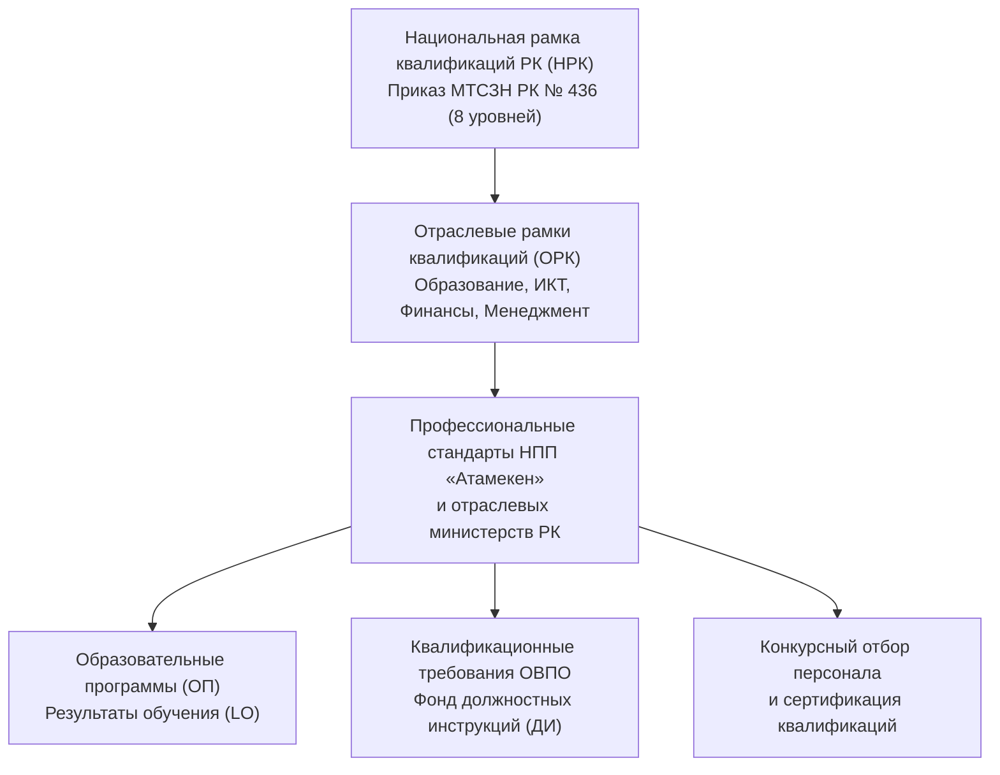
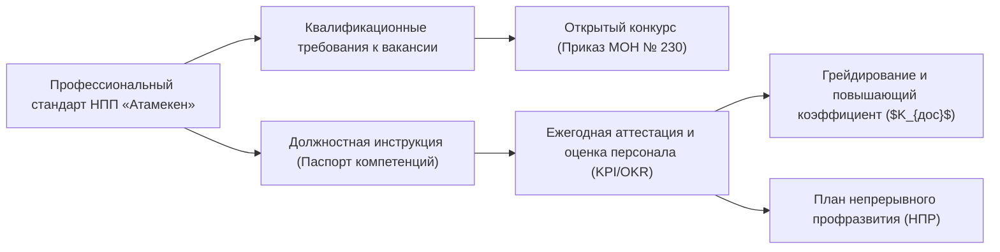

# ОТРАСЛЕВОЙ НОРМАТИВНЫЙ СТАНДАРТ: ПРИМЕНЕНИЕ НАЦИОНАЛЬНОЙ СИСТЕМЫ КВАЛИФИКАЦИЙ И ПРОФЕССИОНАЛЬНЫХ СТАНДАРТОВ НПП «АТАМЕКЕН» В ОРГАНИЗАЦИЯХ ВЫСШЕГО И ПОСЛЕВУЗОВСКОГО ОБРАЗОВАНИЯ РК

> **Код документа:** `STD-RK-013-PROF-STANDARDS-ATAMEKEN`  
> **Нормативная база законодательства Республики Казахстан:**  
> - **Закон Республики Казахстан «О профессиональных квалификациях» от 04.07.2023 № 14-VIII** (ИПС «Әділет» Z2300000014);  
> - **Трудовой кодекс Республики Казахстан от 23.11.2015 № 414-V** (ст. 116 — Национальная система квалификаций, ст. 117 — Профессиональные стандарты, ст. 118 — Профессиональная подготовка, переподготовка и повышение квалификации);  
> - Закон РК «Об образовании» от 27.07.2007 № 319-III (ст. 5, 43, 43-1 — автономия ОВПО при формировании ОП на основе профстандартов);  
> - Закон РК «О науке и технологической политике» от 10.06.2024 № 103-VIII;  
> - Приказ Министра труда и социальной защиты населения РК от 06.09.2023 № 436 «Об утверждении Национальной рамки квалификаций» (МЮ РК № 33385);  
> - Приказ Министра труда и социальной защиты населения РК от 06.09.2023 № 374 «Об определении правил признания профессиональных квалификаций» (МЮ РК № 33387);  
> - Совместный приказ Министра просвещения РК от 15.12.2023 № 374 и Министра науки и высшего образования РК от 15.12.2023 № 548 «Об утверждении профессионального стандарта "Педагог"» (МЮ РК № 33789);  
> - Приказ МОН РК от 13.07.2009 № 338 «Об утверждении Типовых квалификационных характеристик должностей педагогических работников и приравненных к ним лиц»;  
> - Приказ Министра здравоохранения и социального развития РК от 21.12.2015 № 553 «Об утверждении Квалификационного справочника должностей руководителей, специалистов и других служащих» (КСД);  
> - Реестр профессиональных стандартов Национальной палаты предпринимателей Республики Казахстан «Атамекен» (НПП «Атамекен»);  
> - Отраслевые рамки квалификаций (ОРК) в отраслях «Образование и наука», «Информационно-коммуникационные технологии», «Финансовая и страховая деятельность», «Государственное и местное управление».  
> **Статус:** Отраслевой нормативный стандарт (Sector Standard) для ОВПО Республики Казахстан.  
> **Область применения:** Обязателен для всех структурных подразделений, институтов, факультетов, кафедр, научных центров и административных департаментов [V_LEGAL_FORM] «[V_UNIVERSITY_FULL_NAME]».  

---

## 1. НАЗНАЧЕНИЕ И ПРАВОВАЯ ОСНОВА

1.1. Настоящий Отраслевой стандарт устанавливает единые методологические и обязательные правовые требования к интеграции **Национальной системы квалификаций (НСК)** Республики Казахстан в кадровую политику, фонд должностных инструкций (ДИ), регламенты открытого конкурсного замещения должностей и систему профессионального развития персонала ОВПО.  
1.2. В соответствии со статьями 116–118 Трудового кодекса РК и статьями 5, 8, 9 Закона РК от 04.07.2023 № 14-VIII «О профессиональных квалификациях», применение профессиональных стандартов является **обязательным для работодателей** при:
- разработке должностных инструкций работников и положений о подразделениях;
- тарификации работ, установлении квалификационных разрядов и категорий;
- формировании квалификационных требований к кандидатам при проведении конкурсов на занятие вакантных должностей;
- организации непрерывного профессионального развития (НПР), аттестации и оценки персонала;
- валидации и признании результатов неформального и информального образования, микроквалификаций (Microcredentials).  
1.3. Принципы функционирования НСК в Университете:
- **Приоритет профессиональных стандартов перед КСД:** При наличии утвержденного профессионального стандарта НПП «Атамекен» или профильного государственного органа квалификационные требования формируются на его основе, вытесняя устаревшие характеристики КСД № 553;
- **Компетентностный подход:** Оценка работника по триаде «Знания — Умения — Трудовые действия (Skills & Behaviors)» вместо формального учета стажа;
- **Автономия и ответственность:** Привязка должностей к уровням Национальной рамки квалификаций (НРК) с учетом требуемого уровня самостоятельности, сложности задач и масштаба руководства;
- **Цифровая верификация:** Фиксация квалификационных профилей, сертификатов и признанных микроквалификаций в едином цифровом досье сотрудника в УИС «[V_SIS_SYSTEM_NAME]» (Abai Digital) и ЕСУТД Enbek.kz.

---

## 2. ИЕРАРХИЯ НАЦИОНАЛЬНОЙ СИСТЕМЫ КВАЛИФИКАЦИЙ РК

### 2.1. Дескрипторы уровней Национальной рамки квалификаций (НРК), применяемые в ОВПО:

| Уровень НРК | Образовательный эквивалент | Характеристика квалификации и полномочий | Типовые должности в ОВПО |
|:---:|---|---|---|
| **5 уровень** | Послесреднее / Колледж / Прикладной бакалавриат | Выполнение практических задач под общим руководством, решение типовых проблем, ответственность за результат собственной работы. | Лаборант, оператор ЭВМ, диспетчер расписания, комендант этажа, младший инспектор режима. |
| **6 уровень** | Высшее образование (Бакалавриат) | Самостоятельное решение сложных профессиональных задач, разработка методик, координация работы других лиц, ответственность за процесс. | Преподаватель (ассистент), методист, системный администратор, инженер по БиОТ, бухгалтер, юрисконсульт, специалист HR. |
| **7 уровень** | Послевузовское образование (Магистратура) | Управление сложными процессами, экспертно-аналитическая деятельность, разработка инновационных решений, руководство подразделением. | Старший преподаватель, доцент, ведущий научный сотрудник, начальник отдела, директор департамента, главный бухгалтер. |
| **8 уровень** | Послевузовское образование (Докторантура PhD / Доктор по профилю) | Определение стратегических направлений, генерация новых научных знаний, руководство крупными научно-образовательными кластерами. | Профессор, директор исследовательского института, заведующий кафедрой, декан факультета/школы, проректор, ректор. |

---

## 3. КЛАСТЕРЫ ПРОФЕССИОНАЛЬНЫХ СТАНДАРТОВ И ИХ ПРИМЕНЕНИЕ В УНИВЕРСИТЕТЕ

### 3.1. Кластер «Педагогические кадры и академическое управление»
1. **Профессиональный стандарт «Педагог» (Приказ Минпросвещения № 374 / МНВО № 548):**
   - Устанавливает трудовые функции преподавания, методической разработки ОП, воспитательной работы, применения цифровых образовательных технологий и непрерывного профессионального развития;
   - Формирует дескрипторы квалификационных категорий ППС ОВПО:
     * *Педагог (уровень 6 НРК):* проведение практических и лабораторных занятий, разработка Силлабусов под руководством наставника;
     * *Педагог-модератор / Преподаватель (уровень 7 НРК):* чтение лекций, руководство курсовыми работами, участие в грантовых НИР;
     * *Педагог-эксперт / Доцент (уровень 7–8 НРК):* разработка авторских курсов, научное руководство магистрантами, публикации Scopus/WoS;
     * *Педагог-исследователь / Профессор (уровень 8 НРК):* научное руководство докторантами PhD, руководство научными школами, разработка инновационных ОП, международная экспертиза.
2. **Типовые квалификационные характеристики МОН РК № 338:**
   - Применяются в части сохранения обязательных базовых академических цензов (наличие степени магистра/PhD, ученого звания ассоциированного профессора/профессора, требований к стажу научно-педагогической деятельности).

### 3.2. Кластер «Научно-исследовательская деятельность и трансфер технологий»
1. **Закон РК «О науке и технологической политике» № 103-VIII и Приказ МНВО № 592/№ 424:**
   - Внедрение 7-классной тарифной системы оплаты труда научных сотрудников (от младшего научного сотрудника до главного научного сотрудника);
   - Трудовые функции: планирование фундаментальных и прикладных исследований по шкале TRL 1–9, патентный поиск, патентование РННТД, коммерциализация разработок, сопровождение диссертационных советов PhD по Приказу МНВО № 126.

### 3.3. Кластер «Информационно-коммуникационные технологии (ИКТ)» (НПП «Атамекен»)
Применяются утвержденные отраслевые профстандарты НПП «Атамекен» в сфере ИКТ:
1. **«Разработка и анализ программного обеспечения»:**
   - Должности: ведущий разработчик, архитектор ПО, системный аналитик Управления цифровизации;
   - Требования: владение современным стеком (Python, FastApi, React, TypeScript), знание реляционных и NoSQL СУБД, опыт работы с API государственных шлюзов (Smart Bridge, ЕПВО);
2. **«Администрирование сетевых систем и серверной инфраструктуры»:**
   - Должности: системный администратор, сетевой инженер УИТ, инженер NOC Ситуационного центра;
   - Требования: стек Linux/Windows Server, протоколы BGP/OSPF, виртуализация (VMware, Proxmox), подтвержденные отраслевые вендорные сертификаты (Cisco CCNA/CCNP, Linux LFCS, Microsoft MCSE);
3. **«Информационная безопасность и защита данных»:**
   - Должности: офицер ИБ, специалист по защите персональных данных;
   - Требования: знание ЕТИКТ (ПП РК № 832), Приказа МЦРИАП № 395/НҚ, стандартов ISO/IEC 27001, проведение аудитов уязвимостей (OWASP), международные сертификаты (CompTIA Security+, CEH, CISM).

### 3.4. Кластер «Экономика, финансы и государственные закупки»
1. **Профессиональный стандарт «Бухгалтерский учет и аудит» (НПП «Атамекен»):**
   - Должности: Главный бухгалтер, ведущий бухгалтер расчетной группы, ведущий бухгалтер материальной группы;
   - Требования: 7 уровень НРК для Главбуха, знание МСФО (IAS/IFRS), сертификат Профессионального бухгалтера РК, DipIFR (ACCA), CAP/CIPA, знание налогового законодательства РК;
2. **Профессиональный стандарт «Управление закупками и материально-техническим снабжением»:**
   - Должности: Начальник УГЗ, специалист по госзакупкам;
   - Требования: безупречное знание нового Закона РК «О государственных закупках» № 106-VIII, правил веб-портала goszakup.gov.kz, порядка научных закупок по ст. 4 Закона о науке и Приказу МНВО № 538.

### 3.5. Кластер «Управление персоналом и комплаенс»
1. **Профессиональный стандарт «Управление человеческими ресурсами (HRM)» (НПП «Атамекен»):**
   - Должности: Директор Департамента HR, рекрутер, специалист по кадровому администрированию;
   - Требования: владение современными HR-методологиями (грейдирование Hay/Мерсер, оценка 360, OKR/KPI), знание Трудового кодекса РК, владение ЕСУТД Enbek.kz и HRM-модулями УИС.

---

## 4. ПРАВИЛА СОСТАВЛЕНИЯ ДОЛЖНОСТНЫХ ИНСТРУКЦИЙ НА ОСНОВЕ ПРОФСТАНДАРТОВ

4.1. Каждая должностная инструкция Университета формируется по двухуровневой модульной структуре:
- **Базовая часть (Юридический инвариант):** общие положения, иерархия подчинения, трудовые права и обязанности по ст. 22, 23 ТК РК, установленная персональная дисциплинарная (пп. 12, 16 п. 1 ст. 52 ТК РК), материальная (ст. 120, 123 ТК РК) и административная ответственность (ст. 79 КоАП РК) за разглашение служебной информации и нарушение защиты персональных данных;
- **Профильная часть (Паспорт профессиональных компетенций — Job Competency Card):**
  1. Наименование профессии по НРК и ОРК;
  2. Уровень НРК (5–8) с дескриптором требуемой автономности и ответственности;
  3. Перечень трудовых функций (ТФ) и соответствующих трудовых действий из профстандарта;
  4. Матрица обязательных Hard Skills (профессиональные навыки, языки, технологии);
  5. Матрица Digital Skills и кибербезопасности (уровень владения УИС, ведение цифрового следа Audit Trail, правила цифровой гигиены и соблюдение регламента эскалации инцидентов);
  6. Профиль доступа к персональным данным (фиксация категории и объема обрабатываемых персональных данных работников/обучающихся согласно Методическому руководству Университета);
  7. Требования к обязательным отраслевым сертификатам и допускам;
  8. Возможность признания микроквалификаций (Microcredentials).  

4.2. **Запрет дискриминации и признание профессиональных сертификатов:**  
При отсутствии у кандидата классического профильного диплома, но наличии признанного сертификата профессиональной квалификации аккредитованного Центра признания квалификаций (в рамках ст. 13–15 Закона РК № 14-VIII), данный кандидат допускается к участию в открытом конкурсе наравне с дипломированными специалистами (за исключением должностей с жесткими лицензионными требованиями МНВО РК).

---

## 5. ПОРЯДОК ПРИЗНАНИЯ МИКРОКВАЛИФИКАЦИЙ (MICROCREDENTIALS) И НЕФОРМАЛЬНОГО ОБРАЗОВАНИЯ

5.1. В соответствии со ст. 13–15 Закона РК «О профессиональных квалификациях» и Правилами признания профессиональных квалификаций (Приказ МТСЗН РК от 06.09.2023 № 374), Университет признает результаты неформального и информального образования работников и кандидатов при условии их валидации через:
- Международные сертификаты признанных IT-вендоров (Cisco, Microsoft, Oracle, AWS, Google Cloud);
- Сертификаты профессиональных бухгалтерских ассоциаций (Палата бухгалтеров РК, ACCA, CIMA);
- Сертификаты повышения квалификации в ведущих мировых и казахстанских научных центрах объемом не менее 72 академических часов (соответствие п. 4 Приказа МНВО № 374);
- Сертификаты цифровых платформ микроквалификаций (Coursera for Campus, edX), валидированные Академическим советом школы/института.  
5.2. Признанные микроквалификации учитываются:
- при конкурсном замещении должностей ППС как дополнительные баллы в конкурсной матрице;
- при ежегодной оценке результативности ППС и установлении повышающих коэффициентов к окладу;
- при начислении персональных надбавок за профессиональные достижения ($K_{дос}$) научным работникам по Приказу МНВО РК № 424.

---

## 6. МАТРИЦА СВЯЗИ ПРОФСТАНДАРТОВ С КОРПОРАТИВНЫМИ ПРОЦЕССАМИ

---

## 7. ЦЕЛЕВЫЕ МЕТРИКИ ВНЕДРЕНИЯ СТАНДАРТА (KPI / KRI)

| Код метрики | Наименование показателя | Целевое значение | Периодичность аудита |
|:---:|---|:---:|:---:|
| **KPI-PS-01** | Доля должностных инструкций Университета, гармонизированных с профстандартами НПП «Атамекен» и уровнями НРК | **100%** | Ежегодно (до 1 сентября) |
| **KPI-PS-02** | Доля объявлений открытого конкурса на замещение должностей ППС и ученых с квалификационными требованиями по НРК/ОРК | **100%** | Постоянно |
| **KPI-PS-03** | Доля ИТ-специалистов и бухгалтеров, подтвердивших квалификацию отраслевыми сертификатами | $\ge \mathbf{75\%}$ | 1 раз в полугодие |
| **KPI-PS-04** | Доля ППС, прошедших повышение квалификации по Профстандарту «Педагог» за последние 3 года | **100%** | Ежегодно |
| **KRI-PS-05** | Количество предписаний органов инспекции труда по квалификационным несоответствиям (ст. 98 КоАП) | **0** | Непрерывно |

---

## 8. ЗАКЛЮЧИТЕЛЬНЫЕ И ПЕРЕХОДНЫЕ ПОЛОЖЕНИЯ

8.1. Настоящий отраслевой стандарт вступает в силу с момента его утверждения и является нормативным базисом для всех внутренних актов Университета в сфере HR, конкурсов и оплаты труда.  
8.2. **Переходный период:**
- Для действующих сотрудников Университета, чья квалификация на момент введения профстандартов не в полной мере соответствует новым требованиям НСК (по уровню образования или наличию вендорных сертификатов), устанавливается переходный адаптационный период сроком **до 24 месяцев**;
- В течение адаптационного периода Департамент HR организует корпоративное обучение, стажировки и сертификацию работников за счет средств Университета;
- Несоответствие новым требованиям профстандарта в период адаптации не является основанием для расторжения трудового договора по инициативе работодателя.
