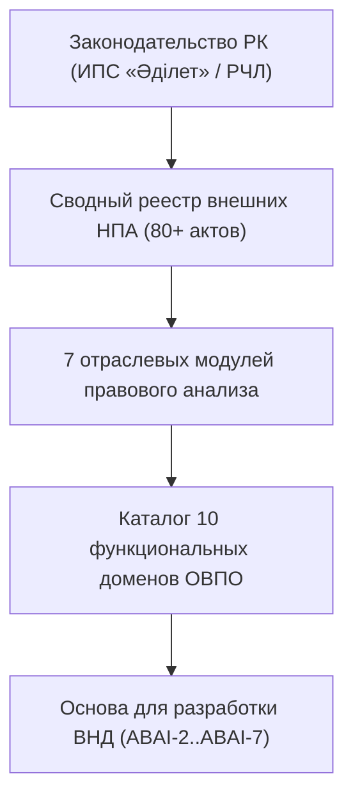

# HL — ABAI-1: Формирование исчерпывающего реестра внешних НПА Республики Казахстан и функциональной декомпозиции

> **Date**: 2026-09-14  
> **Author**: Coordinator  
> **Title**: Сводный реестр внешних нормативных правовых актов Республики Казахстан и архитектура функциональных доменов  
> **Abbreviation**: REG-BASE  
> **Status**: 🟢 Complete  
> **Contract**: 🔒 FROZEN — approved by Coordinator 2026-09-14  
> **Frozen**: §1 · §3 · §4 · §5 · §6 · §7 — locked on owner approval  
> **Free**: §2 · §7.2 · §8 · §9 · §10 · §11 — research updates these directly  
> **Append-only**: §12 Amendment Log — the only channel for changing a frozen section  
> **Baseline**: freeze commits  
> **Project North Star**: `README.md § 1. Миссия проекта` · `.tfw/conventions.md § 1`  

---

## 1. Vision 🔒 FROZEN
Создать юридически безупречный, исчерпывающий внешний нормативно-правовой фундамент Университета в соответствии с Новой регуляторной политикой «С чистого листа» (РЧЛ). Преобразовать массивы законодательства РК (Законы, Кодексы, Приказы МНВО/МОН, МЗ, МЧС, МЦРИАП, МНЭ, МФ) в стройную систему аналитических модулей и 10 функциональных доменов с прямыми эталонными гиперссылками на ИПС «Әділет» (`adilet.zan.kz`).

**Impact:** Университет получает 100% юридическую защищенность, полную готовность к проверкам КОКСНВО по системе управления рисками (СУР) и прозрачную архитектурную основу для разработки всех внутренних положений и должностных инструкций.

> *«Каждое внутреннее правило и обязанность в университете отныне имеют прямую ссылку на норму закона РК, исключая произвол и серые зоны».*

## 2. Current State (As-Is) 🟢 FREE
- Разобщенность нормативной базы: локальные акты ссылаются на устаревшие редакции приказов МОН РК.
- Отсутствие единого реестра внешних НПА с кликабельными гиперссылками на эталонные публикации в ИПС «Әділет».
- Несистематизированность критериев оценки степени риска КОКСНВО (Совместный приказ МНВО № 166 и МНЭ № 116).

| Параметр | Текущее состояние (As-Is) |
|---|---|
| Реестр внешних НПА | Фрагментарные списки в различных отделах |
| Валидация ссылок на Әділет | Отсутствует, текстовые цитаты без URL |
| Домены функциональной модели | Размыты, отсутствуют четкие классификаторы |

## 3. Target State (To-Be) 🔒 FROZEN
Сформирован Сводный реестр внешних НПА из 80+ актов, охватывающий 13 Законов/Кодексов, 38 актов МНВО/МОН, 20 актов МЗ РК, 9 актов МЧС РК со 100% кликабельными ссылками на `adilet.zan.kz`, разработаны 7 тематических модулей нормативного анализа и Каталог 10 функциональных доменов ОВПО.

| Параметр | Целевое состояние (To-Be) |
|---|---|
| Сводный реестр НПА | 80+ проверенных актов с действующими ссылками на adilet.zan.kz |
| Правовые модули | 7 специализированных модулей в `docs/regulations/` |
| Функциональные домены | 10 структурированных доменов с кодами `FUNC-{DOMAIN}-*` |

### 3.1 Result Visualization
```text
┌─────────────────────────────────────────────────────────────────────────┐
│              РЕЕСТР ВНЕШНИХ НПА РК (docs/regulations/)                 │
├─────────────────────────────────────────────────────────────────────────┤
│ 13 Законов/Кодексов · 38 актов МНВО · 20 актов МЗ · 9 актов МЧС РК      │
│ [Әділет] ──> [01_acad] [02_sci] [03_hr] [04_stud] [05_gov] [06_med]...  │
└─────────────────────────────────────────────────────────────────────────┘
                                     │
                                     ▼
┌─────────────────────────────────────────────────────────────────────────┐
│             КАТАЛОГ 10 ФУНКЦИОНАЛЬНЫХ ДОМЕНОВ УНИВЕРСИТЕТА              │
│       FUNC-ACAD · FUNC-SCI · FUNC-HR · FUNC-STUD · FUNC-GOV ...         │
└─────────────────────────────────────────────────────────────────────────┘
```

### 3.2 Value Flow


## 4. Phases 🔒 FROZEN

| Фаза | Задачи и результаты | Приоритет |
|---|---|:---:|
| Phase 1: Реестр НПА | Формирование Сводного реестра внешних актов РК со ссылками на Әділет | 🔴 |
| Phase 2: Модули анализа | Разработка 7 тематических модулей в `docs/regulations/` | 🔴 |
| Phase 3: Декомпозиция | Структурирование 10 функциональных доменов деятельности | 🟡 |

### 4.1 Role Assignment 🔒 FROZEN
- **Coordinator:** Планирование скоупа, архитектура реестра, аудит покрытия НПА.
- **Researcher:** Поиск и верификация регистрационных номеров МЮ РК и ссылок в ИПС «Әділет».
- **Executor:** Разработка файлов аналитических модулей и Каталога доменов.
- **Reviewer:** Проверка легитимности и независимая экспертиза (Map → Verify → Judge → Decide).

## 5. Definition of Done (DoD) 🔒 FROZEN
- ✅ 1. Сформирован файл `docs/regulations/external_npa_registry.md` со 100% работающими ссылками на ИПС «Әділет».
- ✅ 2. Созданы 7 отраслевых модулей анализа законодательства в `docs/regulations/01_*.md` – `07_*.md`.
- ✅ 3. Разработан классификатор функциональных доменов в `docs/functions_and_powers/README.md`.
- ✅ 4. Оформлен протокол доказательств `evidence/EV__ABAI-1.md` со статусом всех критериев VERIFIED.
- ✅ 5. Оформлен `review/REVIEW.md` с вердиктом `✅ APPROVE`.

## 6. Definition of Failure (DoF) 🔒 FROZEN
- ❌ 1. Наличие недействующих (битых) гиперссылок на ИПС «Әділет».
- ❌ 2. Включение отмененных или недействующих нормативных актов.
- ❌ 3. Наличие плейсхолдеров (`TODO`, `TBD`) в текстах аналитических справок.

**On failure:** Откат правок, повторная сверка с эталонным банком НПА МЮ РК, эскалация Координатору.

## 7. Principles 🔒 FROZEN
1. **Принцип эталонной привязки** — каждый внешний акт обязан иметь ссылку на публикацию в ИПС «Әділет».
2. **Принцип РЧЛ («С чистого листа»)** — обязательный учет 10 направлений оценки риска ОВПО по Приказу МНВО № 166 и МНЭ № 116.
3. **Принцип антидублирования** — функциональные домены не должны пересекаться по зонам ответственности.

### 7.1 Quality Contract 🔒 FROZEN
Запрещено использование неквалифицированных оценок нормативных актов. Все реквизиты должны содержать официальную дату, номер и регистрацию в Реестре государственной регистрации нормативных правовых актов МЮ РК.

### 7.2 Knowledge Citations 🟢 FREE
No applicable prior knowledge items — initial bootstrap phase.

## 8. Dependencies 🟢 FREE
| Dependency | Status |
|---|:---:|
| Доступ к ИПС «Әділет» (`adilet.zan.kz`) | ✅ |
| Тексты приказов МНВО/МОН РК | ✅ |

## 9. Risks 🟢 FREE
| Risk | Probability | Impact | Mitigation |
|---|:---:|:---:|---|
| Изменение редакции приказа МНВО в ходе проекта | Medium | High | Еженедельный мониторинг официальных публикаций МЮ РК |

## 10. RESEARCH Case 🟢 FREE

### Blind Spots
- Необходимость учета специфических отраслевых санитарных норм для педагогических лабораторий и столовых.

### Hypotheses
| # | Hypothesis | Status |
|---|---|:---:|
| H1 | СУР КОКСНВО включает проверку по 10 направлениям из 3 независимых источников | confirmed |

### Proposed RESEARCH Focus
1. Сбор актуальных регистрационных номеров приказов МНВО/МОН, МЗ, МЧС РК.
2. Проверка соответствия структуры ОВПО Типовым правилам деятельности ОВПО № 595.

## 11. Strategic Insights (Planning) 🟢 FREE
| # | Insight | Category | Source |
|---|---|---|---|
| S1 | Структурирование внешних требований по 10 доменам СУР гарантирует успешное прохождение государственного контроля КОКСНВО. | Regulatory | МНВО РК / РЧЛ |

## 12. Amendment Log 🟢 APPEND-ONLY
**No amendments.**

---

*HL — ABAI-1: Формирование исчерпывающего реестра внешних НПА РК | 2026-09-14*
