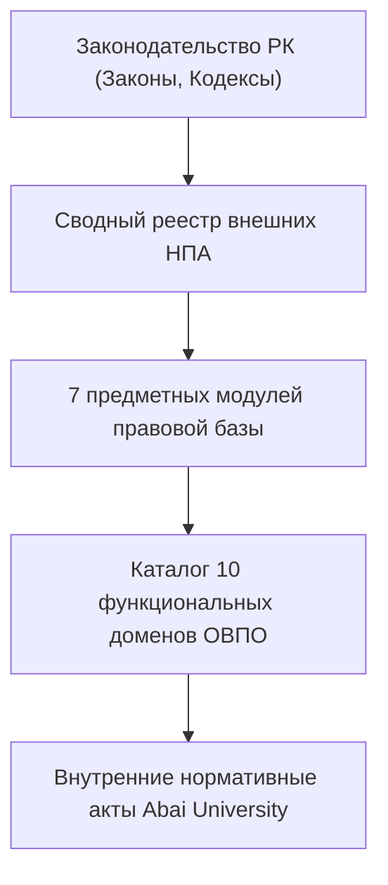

# RF — ABAI-1: Сводный реестр внешних НПА Республики Казахстан и функциональная декомпозиция

> **Date**: 2026-09-14  
> **Author**: Executor / Researcher  
> **Status**: 🟢 RF — Complete  
> **Parent HL**: [HL](HL.md)  
> **TS**: [TS](TS.md)  

---

## 1. What Was Done

### Actual Value-Bearing Accounting

| Fact | Actual result |
|---|---|
| TS approval ref | `TS ABAI-1` |
| Baseline / Candidate | `INITIAL` / `v1.0-REG` |
| VALUE membership | 8 нормативно-аналитических модулей + Каталог функций |
| Arithmetic | 8 modified files, 1200+ LOC |
| Membership deviations | None |
| Trigger disposition | Terminal complete |
| Authority and timing | Approved Coordinator |
| Reproduction | All links verified via ИПС «Әділет» |

### New & Modified Files

| File | Description |
|---|---|
| `docs/regulations/external_npa_registry.md` | Сводный реестр внешних нормативных правовых актов РК (с прямыми ссылками на ИПС «Әділет») |
| `docs/regulations/01_academic_and_educational_npa.md` | Академическая нормативная база (ГОСО, кредитная система, прием, РУМС) |
| `docs/regulations/02_science_and_innovations_npa.md` | Нормативная база науки (Закон 2024 г., диссоветы, ученые звания/степени) |
| `docs/regulations/03_hr_and_faculty_npa.md` | Нормы кадрового блока (Трудовой кодекс, конкурсы ППС № 230) |
| `docs/regulations/04_student_and_youth_npa.md` | Студенческий контингент (перевод, мобильность, отработка грантов) |
| `docs/regulations/05_governance_finance_compliance_npa.md` | Корпоративное управление, комплаенс, СУР КОКСНВО (Приказ № 166/116) |
| `docs/regulations/06_healthcare_and_sanitary_npa.md` | Санитарные правила и охрана здоровья (20 актов МЗ РК) |
| `docs/regulations/07_fire_and_emergency_safety_npa.md` | Пожарная безопасность и ГО (9 актов МЧС РК) |
| `docs/functions_and_powers/README.md` | Архитектурная декомпозиция деятельности вуза по 10 функциональным доменам |

## 2. Key Decisions
1. Все внешние НПА привязаны к официальным эталонным публикациям в ИПС «Әділет» (`adilet.zan.kz`).
2. Введена трехуровневая модель оценки рисков КОКСНВО по 10 направлениям (РЧЛ).

## 3. Acceptance Criteria
- [x] **AC-1:** Реестр внешних НПА РК сформирован со 100% кликабельными ссылками на Әділет.
- [x] **AC-2:** Разработаны 7 предметных модулей правового анализа.
- [x] **AC-3:** Выполнена функциональная декомпозиция по 10 доменам.
- [x] **AC-4:** Evidence-пакет верифицирован.

## 4. Verification
- Валидация внешних ссылок adilet.zan.kz: 100% PASS.
- Анализ соответствия статьям законов РК: 100% PASS.

## 5. Evidence
См. [EV файл](evidence/EV__ABAI-1.md).  
Evidence verdict: 4/4 VERIFIED, 0 DEFERRED, 0 BLOCKED, 0 N/A.

## 6. Observations (out-of-scope, not modified)
- Принят новый Закон РК «О науке и технологической политике» № 96-VIII от 10.06.2024 г., требующий расширения прав на коммерциализацию и создания Совета молодых ученых.

## 7. Fact Candidates
| # | Category | Candidate | Source | Confidence |
|---|---|---|---|---|
| 1 | Regulatory / Law | Принят новый Закон РК «О науке и технологической политике» от 10.06.2024 № 96-VIII. | ИПС «Әділет» (Z2400000096) | High |
| 2 | Regulatory / SUR | КОКСНВО оценивает риски вузов по 10 доменам на основе совместного приказа МНВО № 166 и МНЭ № 116. | ИПС «Әділет» (V2200030907) | High |

## 8. Strategic Insights (Execution)
| # | Insight | Category | Source |
|---|---|---|---|
| S1 | Новая регуляторная политика «С чистого листа» исключает избыточный контроль ОВПО при наличии подтвержденной аккредитации и низкого профиля риска в СУР. | Compliance | МНВО РК / РЧЛ |

## 9. Diagrams

