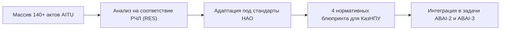

# HL — ABAI_20260914-190500_AITU: Бенчмаркинг фонда ВНД Astana IT University

> **Date**: 2026-09-14  
> **Author**: Coordinator  
> **Title**: Бенчмаркинг локальных актов Astana IT University и трансфер передовых регуляторных моделей  
> **Abbreviation**: AITU-BENCH  
> **Status**: 🟢 Complete  
> **Contract**: 🔒 FROZEN — approved by Coordinator 2026-09-14  
> **Frozen**: §1 · §3 · §4 · §5 · §6 · §7 — locked on owner approval  
> **Free**: §2 · §7.2 · §8 · §9 · §10 · §11 — research updates these directly  
> **Append-only**: §12 Amendment Log — the only channel for changing a frozen section  
> **Baseline**: freeze commits  
> **Project North Star**: `README.md § 1. Миссия проекта` · `.tfw/conventions.md § 1`  

---

## 1. Vision 🔒 FROZEN
Провести сплошной аналитический аудит фонда 140+ внутренних нормативных документов передового исследовательского вуза РК — ТОО «Astana IT University». Выделить лучшие регуляторные инновации в области дуального образования, проектного обучения, коммерциализации и мотивации ППС, адаптировав их для внедрения в НАО «КазНПУ имени Абая» с соблюдением принципов Новой регуляторной политики «С чистого листа».

**Impact:** КазНПУ имени Абая получает готовые нормативные чертежи (Blueprints) для прорывной трансформации педагогического образования, внедрения стартап-дипломов, гибкой нагрузки ученых и проектных грантов.

> *«Мы берем лучший опыт цифрового исследовательского университета страны и адаптируем его под масштаб национального педагогического вуза».*

## 2. Current State (As-Is) 🟢 FREE
- Традиционная бумажная модель отчетности по НИР (сдача формальных отчетов без создания MVP).
- Отсутствие нормативно закрепленного трека защиты дипломных проектов в форме технологического стартапа.
- Линейная система учебной нагрузки ППС без дифференциации для ученых с высокими наукометрическими показателями.

| Параметр | Текущее состояние (As-Is) |
|---|---|
| Защита дипломов | Классическая дипломная работа / проект |
| Отчетность по грантам НИР | Бумажные промежуточные и итоговые отчеты |
| Нагрузка профессоров | Единая норма для всех преподавателей кафедры |

## 3. Target State (To-Be) 🔒 FROZEN
Сформирован аналитический отчет `research/RES__AITU_benchmarking.md` по 10 разделам и разработан архитектурный блюпринт `aitu_innovations_for_abai.md`, содержащий 4 готовых нормативных чертежа: Startup Track, MVP (TRL 1–4) в НИР, Интегральный GPA (с рейтингом активности ROS) и High-Research Teacher.

| Параметр | Целевое состояние (To-Be) |
|---|---|
| Startup Track | Защита стартапа с MVP TRL ≥ 4 перед венчурными фондами |
| Внутренние гранты НИР | Сдача действующего прототипа и апробация в школах |
| High-Research Teacher | Снижение учебной нагрузки до 300–350 часов при статьях Q1-Q2 |

### 3.1 Result Visualization
```text
┌─────────────────────────────────────────────────────────────────────────┐
│          ФОНД 140+ ВНД ASTANA IT UNIVERSITY (ТОО)                       │
│    Академическая политика · Положения о НИР · Рейтинги · Нагрузка       │
└─────────────────────────────────────────────────────────────────────────┘
                                     │
                                     ▼  [Фильтр: РЧЛ + НАО + КазНПУ]
┌─────────────────────────────────────────────────────────────────────────┐
│          4 АРХИТЕКТУРНЫХ БЛЮПРИНТА (docs/internal_acts/blueprints/)      │
│  1. Startup Track  2. MVP (TRL 1-4)  3. Интегральный GPA  4. High-Res  │
└─────────────────────────────────────────────────────────────────────────┘
```

### 3.2 Value Flow


## 4. Phases 🔒 FROZEN

| Фаза | Задачи и результаты | Приоритет |
|---|---|:---:|
| Phase 1: Аудит фонда AITU | Систематизация 140 актов по 10 направлениям | 🔴 |
| Phase 2: Анализ различий | Сопоставление требований ТОО и НАО со 100% госучастием | 🟡 |
| Phase 3: Разработка Blueprints | Подготовка 4 модельных регламентов для КазНПУ | 🔴 |

### 4.1 Role Assignment 🔒 FROZEN
- **Coordinator:** Постановка гипотез, архитектурная фильтрация практик.
- **Researcher:** Сплошной аудит массива документов AITU, подготовка RES.
- **Executor:** Разработка модельного документа `aitu_innovations_for_abai.md`.
- **Reviewer:** Проверка совместимости с законодательством РК (Map → Verify → Judge → Decide).

## 5. Definition of Done (DoD) 🔒 FROZEN
- ✅ 1. Подготовлен отчет аудита 140+ актов в `research/RES__AITU_benchmarking.md`.
- ✅ 2. Разработан архитектурный блюпринт `docs/internal_acts/blueprints/aitu_innovations_for_abai.md` с 4 регламентами.
- ✅ 3. Внесены факты FACT-009, FACT-010, FACT-011 в `KNOWLEDGE.md`.
- ✅ 4. Оформлен `evidence/EV__AITU.md` со 100% подтверждением AC.
- ✅ 5. Оформлен `review/REVIEW.md` с вердиктом `✅ APPROVE`.

## 6. Definition of Failure (DoF) 🔒 FROZEN
- ❌ 1. Прямой перенос положений ТОО без учета требований Закона о госимуществе к НАО.
- ❌ 2. Отсутствие конкретных пороговых значений (TRL, процентили Scopus, коэффициенты ROS).
- ❌ 3. Наличие плейсхолдеров в модельных регламентах.

**On failure:** Переработка модельных регламентов, юридическая фильтрация, эскалация Координатору.

## 7. Principles 🔒 FROZEN
1. **Принцип адаптивной фильтрации** — перенимать управленческую суть, адаптируя форму под стандарты НАО.
2. **Принцип измеримости инноваций** — каждая инновация должна иметь четкие числовые критерии приемки.
3. **Принцип меритократии** — снижение педагогической нагрузки предоставляется строго в обмен на подтвержденную публикационную продуктивность.

### 7.1 Quality Contract 🔒 FROZEN
Все 4 регламента блюпринта должны быть функционально готовы для бесшовного включения в нормативные акты Университета.

### 7.2 Knowledge Citations 🟢 FREE
| # | Source | Item | How it applies |
|---|---|---|---|
| 1 | `KNOWLEDGE.md` | `FACT-001` | Проверка отсутствия дублирования в функциональных матрицах |

## 8. Dependencies 🟢 FREE
| Dependency | Status |
|---|:---:|
| Архив локальных актов Astana IT University | ✅ |
| Нормативная база ABAI-1 | ✅ |

## 9. Risks 🟢 FREE
| Risk | Probability | Impact | Mitigation |
|---|:---:|:---:|---|
| Неприменимость корпоративных положений ТОО для НАО | High | High | Исключение положений о Наблюдательном совете и адаптация к компетенции Совета директоров |

## 10. RESEARCH Case 🟢 FREE

### Blind Spots
- Нормативное регулирование стартап-дипломов со стороны аккредитационных агентств.

### Hypotheses
| # | Hypothesis | Status |
|---|---|:---:|
| H1 | Внедрение шкалы TRL 1–4 повышает шансы на грантовое финансирование коммерциализации Фонда науки | confirmed |

### Proposed RESEARCH Focus
1. Исследование приложений к Академической политике AITU.
2. Анализ методологии расчета интегрального GPA и рейтинга ROS.

## 11. Strategic Insights (Planning) 🟢 FREE
| # | Insight | Category | Source |
|---|---|---|---|
| S1 | Сочетание академического балла и научно-исследовательской активности (ROS) создает мощный стимул для вовлечения студентов в науку с первого курса. | Academic / Science | Опыт AITU |

## 12. Amendment Log 🟢 APPEND-ONLY
**No amendments.**

---

*HL — ABAI_20260914-190500_AITU: Бенчмаркинг фонда ВНД Astana IT University | 2026-09-14*
