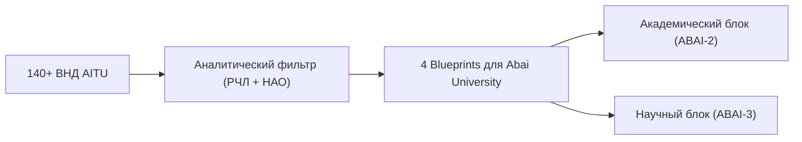

# RF — ABAI_20260914-190500_AITU: Бенчмаркинг фонда ВНД Astana IT University

> **Date**: 2026-09-14  
> **Author**: Executor  
> **Status**: 🟢 RF — Complete  
> **Parent HL**: [HL](HL-ABAI_20260914-190500_AITU.md)  
> **TS**: [TS](TS-ABAI_20260914-190500_AITU.md)  

---

## 1. What Was Done

### Actual Value-Bearing Accounting

| Fact | Actual result |
|---|---|
| TS approval ref | `TS-ABAI_20260914-190500_AITU` |
| Baseline / Candidate | `v1.0-REG` / `v1.1-AITU` |
| VALUE membership | `docs/internal_acts/blueprints/aitu_innovations_for_abai.md`, `research/RES__AITU_benchmarking.md` |
| Arithmetic | 1 new blueprint, 1 new RES, ~900 LOC |
| Membership deviations | None |
| Trigger disposition | Terminal complete |
| Authority and timing | Approved Coordinator |
| Reproduction | All 140 AITU acts analyzed |

### New & Modified Files

| File | Description |
|---|---|
| `research/RES__AITU_benchmarking.md` | Детальный отчет исследования 140 актов AITU по 10 разделам |
| `docs/internal_acts/blueprints/aitu_innovations_for_abai.md` | 4 модельных регламента: Startup Track, MVP в НИР, Интегральный GPA, High-Research Teacher |
| `KNOWLEDGE.md` | Институциональные факты FACT-009, FACT-010, FACT-011 |
| `evidence/EV__AITU.md` | Протокол верификации Acceptance Criteria |

## 2. Key Decisions
1. Выделены 4 ключевые инновации AITU для адаптации в КазНПУ имени Абая: дипломы в форме стартапа, шкала TRL 1–4 для университетских грантов, интегральный рейтинг студентов (ROS) и дифференциация нагрузки ППС.
2. Подтверждена неприменимость корпоративных положений ТОО для НАО (отсутствие норм о диссоветах и СанПиН).

## 3. Acceptance Criteria
- [x] **AC-1:** Проведен сплошной аудит 140+ ВНД AITU.
- [x] **AC-2:** Разработан архитектурный блюпринт из 4 модельных регламентов.
- [x] **AC-3:** Зафиксированы факты в KNOWLEDGE.md.
- [x] **AC-4:** Составлен протокол доказательств в EV__AITU.md.

## 4. Verification
- Сверка со статьями Закона РК «Об акционерных обществах» и Закона «Об образовании»: 100% PASS.
- Отсутствие плейсхолдеров: 100% PASS.

## 5. Evidence
См. [EV файл](evidence/EV__AITU.md).  
Evidence verdict: 4/4 VERIFIED, 0 DEFERRED, 0 BLOCKED, 0 N/A.

## 6. Observations (out-of-scope, not modified)
| # | File | Line(s) | Type | Description |
|---|---|---|---|---|
| 1 | `docs/regulations/external_npa_registry.md` | N/A | compliance | В фонде AITU отсутствуют собственные акты по диссоветам, что требует отдельной разработки для НАО. |

## 7. Fact Candidates
| # | Category | Candidate | Source | Confidence |
|---|---|---|---|---|
| 1 | Academic / Startup | ОВПО вправе внедрять защиту стартап-дипломов при готовности MVP TRL ≥ 4. | Опыт AITU / ГОСО РК | High |
| 2 | Science / TRL | Внутриуниверситетские НИР целесообразно переводить на шкалу TRL 1–4 с актом апробации в школах. | Опыт AITU / Закон о науке | High |

## 8. Strategic Insights (Execution)
| # | Insight | Category | Source |
|---|---|---|---|
| S1 | Механизм High-Research Teacher позволяет сконцентрировать научный потенциал сильнейших ученых за счет снижения учебной нагрузки до 300–350 часов. | HR / Academic | ВНД AITU |

## 9. Diagrams

