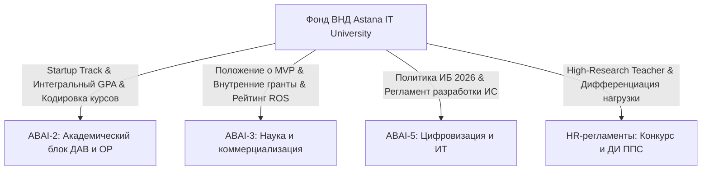

# RES — Исследование и бенчмаркинг ВНД Astana IT University (AITU)

> **Task ID**: `ABAI_20260914-190500_AITU`  
> **HL Link**: [`../HL-ABAI_20260914-190500_AITU.md`](../HL-ABAI_20260914-190500_AITU.md)  
> **Дата**: 2026-09-14  
> **Роль**: Researcher  
> **Источник данных**: Google Drive репозиторий ВНД AITU (`https://drive.google.com/drive/folders/1JnCVM1ktriUrk3ZdfoEcc-7YXIaUeFGl`)

---

## 1. Резюме исследования

Проведен автоматизированный сбор, структурная категоризация и нормативный скрининг массива внутренних нормативных документов (ВНД) **Astana IT University (AITU)**. 

### Количественные параметры фонда:
* **Общее количество проанализированных разделов:** 10 корневых папок + 7 специализированных подпапок.
* **Общий объем фонда:** **140+ действующих внутренних нормативных актов** (в формате PDF).
* **Степень актуализации:** Редакции 2020–2025/2026 гг. с регулярным обновлением (до 4–5 редакций ключевых положений).
* **Многоязычность:** Наличие Академической политики на казахском, русском и английском языках, а также выделенного англоязычного реестра (*Register of Regulatory Documents*) для международных аудитов (ESG / ASIIN / ABET).

---

## 2. Структурный каталог фонда ВНД Astana IT University

```text
ВНД AITU/
├── 1. Политика, программы, планы, стратегии (Антикоррупция, Кадровая политика, Кодекс этики, Корпоративное управление, Риски, Интернационализация, Политика ИБ 2026)
├── 2. Положения о коллегиальном органе и ректоре (Правление, Ректорат, Ректор, Ученый совет, УМС, Дисциплинарный совет, СМУ, Академические комитеты, Бюджетная комиссия, Комитет по обеспечению качества, Технологический совет, Набсовет)
├── 3. Рекомендации, инструкции, правила, указания (Конкурс ППС ред. 4, Научная и электронная библиотеки, СРС, «Лучший преподаватель», ПВТР, Качество онлайн-курсов, Правила приема ВО/ПВО и MBA/EMBA, Госзакупки ТОО, Оценивание дипломов и диссертаций)
├── 4. Положения и правила процессного типа
│   ├── 4.1. Учебный процесс (Гранты и скидки, УМД, Кодировка дисциплин, МВА/ЕМВА, Распределение выпускников, Издание УМЛ, Педнагрузка ред. 5)
│   ├── 4.2. Научно-исследовательская работа (Положение о НИР, Олимпиада AITU iCode, ГФ проектов, Внутренние научные гранты, Положение о MVP, НИРС, Рейтинг исследовательских компетенций ROS)
│   ├── 4.3. Социально-воспитательная работа (План воспитательной работы, Волонтерство, Аренда жилья студентам/работникам, Студенческое самоуправление ред. 5, Кодекс чести)
│   ├── 4.4. Управление персоналом (KPI работников, Командировки, High-research teacher & Research teacher, Оплата и стимулирование труда)
│   └── 4.5. Международное сотрудничество (Поддержка иностранных студентов, Академическая мобильность ред. 4)
├── 5. Процедуры (Планирование УП, Международные документированные процедуры ISO)
├── 6. Внутренние нормативные документы (Сетевая академия CISCO, Документооборот, Санэпидрежим, Коворкинг, Платные допуслуги, НИИ лаборатории, Пожарная безопасность, Архив, Инструкция по платежам)
├── 7. Академическая политика (25 приложений: ДОТ, Академическая честность, Силлабусы, Интегральный GPA, Стартап вместо диплома, Антиплагиат, Документы собственного образца)
└── 10. Register of Regulatory Documents (Англоязычный международный комплект)
```

---

## 3. Анализ на соответствие Новой регуляторной политике РК («С чистого листа»)

| Требование регулятора (РЧЛ / КОКСНВО / НПА РК) | Реализация в ВНД AITU | Оценка соответствия |
| :--- | :--- | :---: |
| **Приказ № 166/116 (СУР и 10 направлений риска)** | «Политика управления рисками», «Положение о Комитете по обеспечению качества» | ✅ Полное соответствие |
| **Закон «О науке и технологической политике» 2024 г.** | «Положение о СМУ», «Внутренние научные гранты», «Положение о MVP» | ✅ Передовой уровень |
| **Приказ МОН РК № 230 (Открытый конкурс ППС)** | «Правила конкурсного замещения должностей ППС и иностранных специалистов (ред. 4)» | ✅ Полное соответствие |
| **Приказ МОН РК № 39 (Распределение и отработка)** | «Правила распределения выпускников ТОО Astana IT University» | ✅ Полное соответствие |
| **Приказ МНВО РК № 2 (ГОСО) и № 595 (Типовые правила)** | Академическая политика (3 языка) + 25 специализированных приложений | ✅ Полное соответствие |
| **СанПиН МЗ РК № ҚР ДСМ-76** | «Регламент обеспечения санитарно-эпидемиологического режима» (2 редакции) | ✅ Полное соответствие |
| **Пожарная безопасность МЧС РК № 55** | «Инструкция по Правилам пожарной безопасности» | ✅ Полное соответствие |

---

## 4. ТОП-10 Уникальных функций и регламентов AITU для внедрения в Abai University

Среди 140 актов выделены ключевые институциональные инновации AITU, которые целесообразно адаптировать в структуру НАО «КазНПУ имени Абая»:

### 1. Положение о Minimal Valuable Product (MVP) в НИР
* **Суть:** Формализует перевод научных исследований кафедр и лабораторий в практический продукт (MVP) с четкими критериями готовности (TRL 1-4).
* **Где внедрить в КазНПУ:** В задачу **ABAI-3 (Научный блок)** для стимулирования прикладных педагогических и цифровых разработок.

### 2. Дипломная работа в виде Стартап-проекта (Startup Track)
* **Суть:** Официальное приложение № 22 к Академической политике, позволяющее выпускникам защищать бизнес-стартап вместо теоретической дипломной работы.
* **Где внедрить в КазНПУ:** В задачу **ABAI-2 (Академический блок)** — адаптация для EdTech-стартапов студентов КазНПУ.

### 3. Дифференциация треков ППС (High-Research Teacher & Research Teacher)
* **Суть:** Конкурсный отбор и разделение преподавателей на исследовательский и преподавательский треки с разной нормой педнагрузки и специализированными KPI.
* **Где внедрить в КазНПУ:** В HR-блок и Положение о ППС (задача ABAI-2 / ДИ ППС).

### 4. Система оценивания исследовательских компетенций студентов (ROS)
* **Суть:** Индекс исследовательской активности обучающихся (публикации, хакатоны, гранты) с привязкой к скидкам на обучение и приоритету при отборе в магистратуру.
* **Где внедрить в КазНПУ:** В Домен 02 (Наука) и Домен 03 (Студенты).

### 5. Интегральный GPA (Integral GPA)
* **Суть:** Комплексный расчет успеваемости с учетом академического GPA, научной активности и общественной работы при распределении стипендий и комнат в общежитиях.
* **Где внедрить в КазНПУ:** В Положение об Офисе регистратора (ABAI-2).

### 6. Технологический совет университета
* **Суть:** Коллегиальный орган с участием индустриальных ИТ-партнеров для верификации образовательных программ и цифровых инициатив.
* **Где внедрить в КазНПУ:** В Положение о Научно-методическом совете КазНПУ (НМС) и Домен 08 (Цифровизация).

### 7. Политика информационной безопасности 2026 (Information Security Policy)
* **Суть:** Детальный стандарт разграничения доступа, защиты персональных данных и реагирования на инциденты в условиях современных киберугроз.
* **Где внедрить в КазНПУ:** В задачу **ABAI-5 (Цифровизация и ИТ)**.

### 8. Регламент кодировки дисциплин университета
* **Суть:** Прозрачный общеуниверситетский классификатор шифров учебных дисциплин для исключения дублирования курсов на разных кафедрах.
* **Где внедрить в КазНПУ:** В Академическую политику и функционал Офиса регистратора (устранение разрыва `DEBT-001`).

### 9. Положение о создании и оценке качества онлайн-курсов
* **Суть:** Четкие метрики сертификации цифрового контента преподавателей перед публикацией в LMS.
* **Где внедрить в КазНПУ:** В регламенты Центра цифрового образования КазНПУ.

### 10. Сетевая корпоративная академия (на примере CISCO)
* **Суть:** Интеграция международных вендорных сертификаций в основную учебную нагрузку студентов.
* **Где внедрить в КазНПУ:** Партнерские академии (Google, Microsoft, Huawei, Apple) в институтах КазНПУ.

---

## 5. Дорожная карта интеграции находок AITU в Task Board КазНПУ им. Абая



## 6. Вывод и дальнейшие действия
Исследование подтверждает высокую зрелость цифровой и процессной модели AITU. Выделенные 10 регламентов дают конкретный прикладной материал для обогащения задач **ABAI-2**, **ABAI-3** и **ABAI-5**, гарантируя КазНПУ имени Абая опережающий статус среди педагогических вузов Казахстана.
