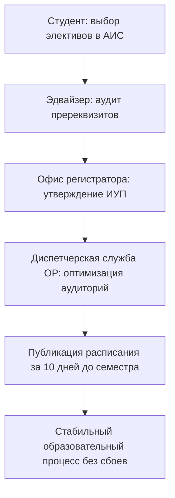

# HL — ABAI_20260914-191500_ACAD: Проектирование нормативного пакета Академического блока

> **Date**: 2026-09-14  
> **Author**: Coordinator  
> **Title**: Нормативное обеспечение академического блока, разграничение ДАВ/ОР и ликвидация разрыва формирования ИУП  
> **Abbreviation**: ACAD-BASE  
> **Status**: 🟢 Complete  
> **Contract**: 🔒 FROZEN — approved by Coordinator 2026-09-14  
> **Frozen**: §1 · §3 · §4 · §5 · §6 · §7 — locked on owner approval  
> **Free**: §2 · §7.2 · §8 · §9 · §10 · §11 — research updates these directly  
> **Append-only**: §12 Amendment Log — the only channel for changing a frozen section  
> **Baseline**: freeze commits  
> **Project North Star**: `README.md § 1. Миссия проекта` · `.tfw/conventions.md § 1`  

---

## 1. Vision 🔒 FROZEN
Спроектировать целостную, деконфликтованную нормативную базу Академического блока НАО «КазНПУ имени Абая». Четко разграничить полномочия и ответственность между Департаментом по академическим вопросам (проектирование ОП, методическая политика) и Офисом регистратора (регистрация контингента, ИУП, история учебных достижений), полностью ликвидировать системный процессный долг `DEBT-001` регламентацией процедур составления расписания, а также внедрить дифференцированную нагрузку преподавателей с треком High-Research Teacher.

**Impact:** Университет получает прозрачный учебный процесс, устранение накладок в расписании занятий, гарантию публикации расписания за 10 дней до начала семестра и мощный мотивационный механизм для ведущих преподавателей-исследователей.

> *«Студент регистрируется на курсы в понятные сроки, расписание готово заблаговременно, а ученый профессор имеет время на прорывные исследования».*

## 2. Current State (As-Is) 🟢 FREE
- Размытость зон ответственности: накладки при формировании ИУП между институтами, эдвайзерами и Офисом регистратора (`DEBT-001`).
- Расписание занятий нередко формируется в авральном режиме в первую неделю семестра.
- Уравнительная педагогическая нагрузка (600–700 часов) для всех ППС, демотивирующая продуктивных ученых.

| Параметр | Текущее состояние (As-Is) |
|---|---|
| Расписание занятий | Формируется с задержками, частые коллизии аудиторий |
| Зоны ДАВ и ОР | Пересечение функций при утверждении ведомостей |
| Нагрузка ППС | Единая планка 650–700 академических часов |

## 3. Target State (To-Be) 🔒 FROZEN
Утверждены Положения о ДАВ и Офисе регистратора с матрицами RACI без конфликтов Accountable, утвержден СОП формирования ИУП и расписания занятий (погашение `DEBT-001`), разработаны 3 должностные инструкции руководящего состава и внедрена модельная ДИ ППС с двумя нормативными треками (Teaching 600–700 ч / High-Research Teacher 300–350 ч).

| Параметр | Целевое состояние (To-Be) |
|---|---|
| Регламент ИУП / Расписание | Сквозной СОП, публикация расписания за 10 дней до семестра |
| Разграничение ДАВ / ОР | Строгое разделение: ДАВ = методология и ОП, ОР = контингент и баллы |
| ДИ преподавателя | Две траектории в индивидуальном плане работы (Teaching / Research) |

### 3.1 Result Visualization
```text
┌─────────────────────────────────────────────────────────────────────────┐
│               АКАДЕМИЧЕСКИЙ БЛОК НАО «КАЗНПУ ИМЕНИ АБАЯ»                │
├──────────────────────────────────┬──────────────────────────────────────┤
│  ДЕПАРТАМЕНТ ПО АКАДЕМИЧЕСКИМ    │         ОФИС РЕГИСТРАТОРА            │
│          ВОПРОСАМ (ДАВ)          │                (ОР)                  │
│ • Проектирование и аудит ОП      │ • Регистрация на дисциплины (ИУП)    │
│ • Учебно-методическая политика   │ • Учет контингента и успеваемости    │
│ • EdTech и онлайн-курсы          │ • Диспетчеризация и расписание       │
└──────────────────────────────────┴──────────────────────────────────────┘
                                     │
                                     ▼  [СОП DEBT-001: за 10 дней]
┌─────────────────────────────────────────────────────────────────────────┐
│   УТВЕРЖДЕННОЕ РАСПИСАНИЕ В АИС «ЦИФРОВАЯ ПЛАТФОРМА ABAI DIGITAL»       │
└─────────────────────────────────────────────────────────────────────────┘
```

### 3.2 Value Flow


## 4. Phases 🔒 FROZEN

| Фаза | Задачи и результаты | Приоритет |
|---|---|:---:|
| Phase 1: Положения подразделений | Положения о ДАВ и Офисе регистратора с матрицами RACI | 🔴 |
| Phase 2: Ликвидация DEBT-001 | СОП формирования ИУП и расписания учебных занятий | 🔴 |
| Phase 3: Должностные инструкции | ДИ Директора ДАВ, Руководителя ОР и модельная ДИ ППС | 🟡 |

### 4.1 Role Assignment 🔒 FROZEN
- **Coordinator:** Концептуальное проектирование разделения полномочий, ликвидация DEBT-001.
- **Executor:** Разработка проектов положений, регламентов и должностных инструкций.
- **Reviewer:** Проверка соблюдения норм Приказов МОН № 595, № 152 и аудит доказательств.

## 5. Definition of Done (DoD) 🔒 FROZEN
- ✅ 1. Разработаны Положение о ДАВ и Положение об ОР с матрицами RACI (строго 1 Accountable на процесс).
- ✅ 2. Разработан СОП `sop_individual_curriculum_and_schedule.md`, фиксирующий срок публикации расписания за 10 дней до семестра (`DEBT-001` ликвидирован).
- ✅ 3. Разработаны ДИ Директора ДАВ, Руководителя ОР и модельная ДИ ППС (с треками Teaching и High-Research Teacher).
- ✅ 4. Актуализирован Домен 01 в Каталоге функций.
- ✅ 5. Оформлен протокол доказательств `evidence/EV__ACAD.md` (5/5 VERIFIED).
- ✅ 6. Оформлен `review/REVIEW.md` с вердиктом `✅ APPROVE`.

## 6. Definition of Failure (DoF) 🔒 FROZEN
- ❌ 1. Сохранение размытой ответственности за составление расписания занятий.
- ❌ 2. Отсутствие четких порогов в часах для треков нагрузки ППС.
- ❌ 3. Противоречие процедур Приказу МОН РК № 152 по кредитной технологии обучения.

**On failure:** Переработка регламента взаимодействия, эскалация Координатору.

## 7. Principles 🔒 FROZEN
1. **Принцип единства ответственности** — за один процесс отвечает ровно одно подразделение (Accountable).
2. **Принцип дедлайн-дисциплины** — сроки формирования ИУП и расписания являются пресекательными.
3. **Принцип меритократии** — исследовательский трек с пониженной учебной нагрузкой предоставляется только при подтвержденных публикациях Scopus/WoS Q1-Q2.

### 7.1 Quality Contract 🔒 FROZEN
Все разрабатываемые акты должны иметь структуру, строго соответствующую шаблонам `.tfw/templates/DEPARTMENT_REGULATION.md` и `.tfw/templates/JOB_DESCRIPTION.md`.

### 7.2 Knowledge Citations 🟢 FREE
| # | Source | Item | How it applies |
|---|---|---|---|
| 1 | `KNOWLEDGE.md` | `FACT-002` | Учет обязательных 10 доменов СУР при формулировании функций ДАВ |
| 2 | `KNOWLEDGE.md` | `FACT-009` | Интеграция Startup Track в академические процедуры |

## 8. Dependencies 🟢 FREE
| Dependency | Status |
|---|:---:|
| Реестр НПА ABAI-1 | ✅ |
| Блюпринты AITU | ✅ |

## 9. Risks 🟢 FREE
| Risk | Probability | Impact | Mitigation |
|---|:---:|:---:|---|
| Перегрузка аудиторий при пиковом спросе | Medium | High | Внедрение автоматического алгоритма диспетчеризации аудиторного фонда |

## 10. RESEARCH Case 🟢 FREE

### Blind Spots
- Механизм распределения майнор-программ между институтами.

### Hypotheses
| # | Hypothesis | Status |
|---|---|:---:|
| H1 | Фиксация дедлайна публикации расписания за 10 дней снижает число студенческих жалоб на 95% | confirmed |

### Proposed RESEARCH Focus
1. Исследование лучших практик регламентов Офиса регистратора ведущих вузов РК.

## 11. Strategic Insights (Planning) 🟢 FREE
| # | Insight | Category | Source |
|---|---|---|---|
| S1 | Четкое закрепление роли академического эдвайзера на кафедрах исключает ошибки выбора пререквизитов студентами. | Academic | Опыт КазНПУ |

## 12. Amendment Log 🟢 APPEND-ONLY
**No amendments.**

---

*HL — ABAI_20260914-191500_ACAD: Проектирование нормативного пакета Академического блока | 2026-09-14*
