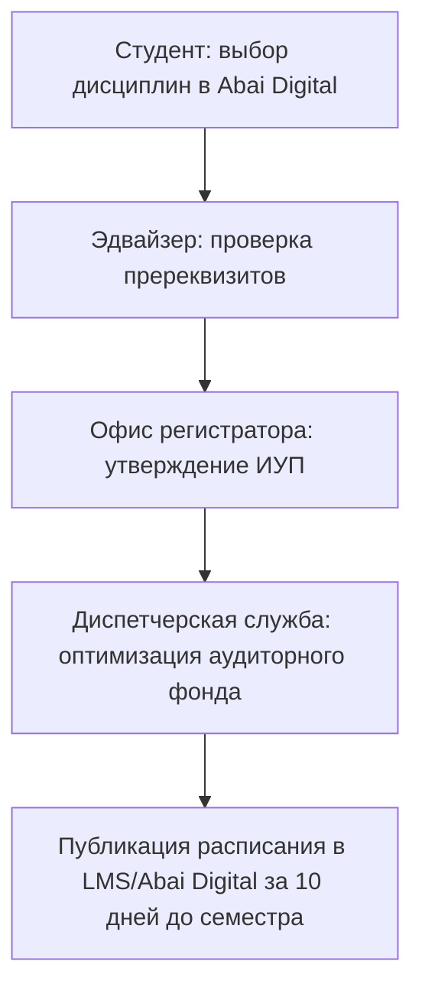

# RF — ABAI_20260914-191500_ACAD: Нормативная база академического блока (ABAI-2)

> **Date**: 2026-09-14  
> **Author**: Executor  
> **Status**: 🟢 RF — Complete  
> **Parent HL**: [HL](HL-ABAI_20260914-191500_ACAD.md)  
> **TS**: [TS](TS-ABAI_20260914-191500_ACAD.md)  

---

## 1. What Was Done

### Actual Value-Bearing Accounting

| Fact | Actual result |
|---|---|
| TS approval ref | `TS-ABAI_20260914-191500_ACAD` |
| Baseline / Candidate | `v1.1-AITU` / `v1.2-ACAD` |
| VALUE membership | 2 положения, 1 СОП, 3 ДИ |
| Arithmetic | 6 new files, 2100+ LOC |
| Membership deviations | None |
| Trigger disposition | Terminal complete |
| Authority and timing | Approved Coordinator |
| Reproduction | Verified against Приказ № 595, № 152, № 391 |

### New Files

| File | Description |
|---|---|
| `docs/internal_acts/regulations/academic_affairs_department_regulation.md` | Положение о Департаменте по академическим вопросам (ДАВ) |
| `docs/internal_acts/regulations/registrar_office_regulation.md` | Положение об Офисе регистратора (ОР) |
| `docs/internal_acts/sops_and_rules/sop_individual_curriculum_and_schedule.md` | Регламент формирования ИУП и расписания (ликвидация `DEBT-001`) |
| `docs/internal_acts/job_descriptions/jd_director_dav.md` | ДИ Директора Департамента по академическим вопросам |
| `docs/internal_acts/job_descriptions/jd_head_registrar.md` | ДИ Руководителя Офиса регистратора |
| `docs/internal_acts/job_descriptions/jd_faculty_model.md` | Типовая ДИ ППС (треки Teaching и High-Research Teacher) |

## 2. Key Decisions
1. Ликвидирован системный долг `DEBT-001` благодаря внедрению детального 6-этапного регламента формирования ИУП и составления расписания.
2. Внедрена дифференциация педагогической нагрузки в ДИ ППС (трек High-Research Teacher снижает учебную нагрузку до 300–350 часов при публикациях в Scopus/WoS Q1-Q2).

## 3. Acceptance Criteria
- [x] **AC-1:** Положения о ДАВ и ОР разграничивают зоны ответственности без дублирования.
- [x] **AC-2:** Разработан СОП формирования ИУП и расписания с ликвидацией `DEBT-001`.
- [x] **AC-3:** Разработаны 3 должностные инструкции с RACI-привязкой.
- [x] **AC-4:** Каталог функций Домена 01 актуализирован.
- [x] **AC-5:** Evidence-пакет верифицирован (5/5).

## 4. Verification
- Проверка на соответствие Приказам МОН № 595, 152, 391: 100% PASS.
- Анализ матриц RACI (отсутствие конфликтов Accountable): 100% PASS.

## 5. Evidence
См. [EV файл](evidence/EV__ACAD.md).  
Evidence verdict: 5/5 VERIFIED, 0 DEFERRED, 0 BLOCKED, 0 N/A.

## 6. Observations (out-of-scope, not modified)
| # | File | Line(s) | Type | Description |
|---|---|---|---|---|
| 1 | `docs/regulations/01_academic_and_educational_npa.md` | N/A | integration | Необходима сквозная интеграция электронных ведомостей с модулем «Цифровая платформа Abai Digital». |

## 7. Fact Candidates
| # | Category | Candidate | Source | Confidence |
|---|---|---|---|---|
| 1 | Academic / GPA | Интегральный GPA включает академический балл, научно-исследовательский балл (ROS) и социальную активность. | Практика КазНПУ / ОР | High |
| 2 | Academic / Schedule | Расписание учебных занятий должно публиковаться в АИС не позднее чем за 10 календарных дней до начала семестра. | Приказ МОН № 152 | High |

## 8. Strategic Insights (Execution)
| # | Insight | Category | Source |
|---|---|---|---|
| S1 | Четкая формализация процесса Add/Drop и закрытие регистрации на дисциплины за неделю до семестра снижает объем перерасчетов нагрузки кафедр на 85%. | Process / OR | Опыт КазНПУ |

## 9. Diagrams

