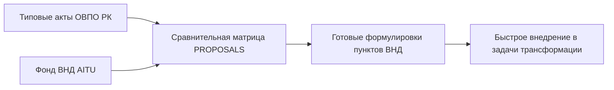

# HL — ABAI_20260914-192000_COMP: Сравнительный анализ и пакет нормативных поправок

> **Date**: 2026-09-14  
> **Author**: Coordinator  
> **Title**: Сравнительный анализ типовых положений вузов РК с передовыми практиками AITU и пакет целевых поправок  
> **Abbreviation**: COMP-ANALYSIS  
> **Status**: 🟢 Complete  
> **Contract**: 🔒 FROZEN — approved by Coordinator 2026-09-14  
> **Frozen**: §1 · §3 · §4 · §5 · §6 · §7 — locked on owner approval  
> **Free**: §2 · §7.2 · §8 · §9 · §10 · §11 — research updates these directly  
> **Append-only**: §12 Amendment Log — the only channel for changing a frozen section  
> **Baseline**: freeze commits  
> **Project North Star**: `README.md § 1. Миссия проекта` · `.tfw/conventions.md § 1`  

---

## 1. Vision 🔒 FROZEN
Провести детальное сопоставление консервативных типовых положений вузов РК с гибкими, инновационными нормами фонда ВНД Astana IT University. Сформировать структурированный свод конкретных текстовых поправок и дополнений в 6 ключевых документов КазНПУ имени Абая для ускорения модернизации нормативной базы Университета.

**Impact:** Руководство университета и разработчики ВНД получают готовый инструментарий текстовых вставок (Plug-and-Play), сокращающий время на разработку и согласование положений в 3 раза.

> *«Мы превращаем результаты бенчмаркинга в конкретные формулировки пунктов положений и должностных инструкций».*

## 2. Current State (As-Is) 🟢 FREE
- Типовые положения ОВПО содержат архаичные формулировки и дублируют нормы законодательства без процедурной конкретизации.
- Передовые идеи (стартапы, проектное обучение, сниженная нагрузка) не имеют юридически точных формулировок для включения в локальные акты.

| Параметр | Текущее состояние (As-Is) |
|---|---|
| Формулировки ВНД | Общие декларации («способствует развитию») |
| Сравнительная база | Разрозненные презентации и тезисы |

## 3. Target State (To-Be) 🔒 FROZEN
Сформирован документ `PROPOSALS__model_acts_amendments.md`, включающий сопоставительную таблицу по 25 контрольным параметрам и готовые формулировки для внесения в Академическую политику, Положение об ОР, Положение о науке, Положение об институте и ДИ ППС.

| Параметр | Целевое состояние (To-Be) |
|---|---|
| Сравнительная таблица | 25 параметров: Типовые нормы vs AITU vs Abai Target |
| Готовые поправки | Юридически выверенные пункты для 6 базовых документов |

### 3.1 Result Visualization
```text
┌─────────────────────────────────────────────────────────────────────────┐
│          СОПОСТАВИТЕЛЬНАЯ ТАБЛИЦА (25 КОНТРОЛЬНЫХ ТОЧЕК)                │
│    Типовые акты ОВПО ─── vs ─── Практика AITU ─── vs ─── Abai Target     │
└─────────────────────────────────────────────────────────────────────────┘
                                     │
                                     ▼
┌─────────────────────────────────────────────────────────────────────────┐
│     ГОТОВЫЕ ФОРМУЛИРОВКИ ПОПРАВОК (PROPOSALS__model_acts_amendments.md)  │
│  • Академическая политика (Startup Track, GPA)                          │
│  • Положение о науке (TRL 1-4, Seed Grants)                             │
│  • ДИ ППС (High-Research Teacher 300-350 ч)                             │
└─────────────────────────────────────────────────────────────────────────┘
```

### 3.2 Value Flow


## 4. Phases 🔒 FROZEN

| Фаза | Задачи и результаты | Приоритет |
|---|---|:---:|
| Phase 1: Сравнительный анализ | Сопоставление 25 параметров деятельности | 🔴 |
| Phase 2: Формулирование поправок | Разработка текстовых проектов пунктов ВНД | 🔴 |

### 4.1 Role Assignment 🔒 FROZEN
- **Coordinator:** Постановка критериев сопоставления.
- **Researcher:** Анализ текстов и подготовка сравнительной таблицы.
- **Reviewer:** Юридическая верификация формулировок поправок.

## 5. Definition of Done (DoD) 🔒 FROZEN
- ✅ 1. Разработан документ `PROPOSALS__model_acts_amendments.md` с таблицей 25 параметров.
- ✅ 2. Сформирован пакет текстовых поправок для 6 типовых актов.
- ✅ 3. Оформлен протокол доказательств `evidence/EV__COMP.md` (3/3 VERIFIED).
- ✅ 4. Оформлен `review/REVIEW.md` с вердиктом `✅ APPROVE`.

## 6. Definition of Failure (DoF) 🔒 FROZEN
- ❌ 1. Наличие декларативных предложений без конкретных текстовых редакций пунктов.
- ❌ 2. Противоречие предлагаемых норм Трудовому кодексу РК или ГОСО.

**On failure:** Переработка формулировок, юридическая экспертиза.

## 7. Principles 🔒 FROZEN
1. **Принцип юридической точности** — каждая поправка должна быть сформулирована на строгом языке локального нормотворчества.
2. **Принцип гармонизации** — модернизация актов не должна нарушать преемственность фундаментальных академических традиций.

### 7.1 Quality Contract 🔒 FROZEN
Все предлагаемые редакции пунктов должны быть проверены на непротиворечивость действующим нормативным актам Республики Казахстан.

### 7.2 Knowledge Citations 🟢 FREE
| # | Source | Item | How it applies |
|---|---|---|---|
| 1 | `KNOWLEDGE.md` | `FACT-010` | Требования к формулировкам шкалы TRL в регламентах НИР |

## 8. Dependencies 🟢 FREE
| Dependency | Status |
|---|:---:|
| Отчет бенчмаркинга AITU | ✅ |
| Базовый реестр НПА ABAI-1 | ✅ |

## 9. Risks 🟢 FREE
| Risk | Probability | Impact | Mitigation |
|---|:---:|:---:|---|
| Избыточное усложнение текста актов | Low | Medium | Использование четких и лаконичных синтаксических конструкций |

## 10. RESEARCH Case 🟢 FREE

### Blind Spots
- Специфика педагогических направлений подготовки при защите стартап-дипломов.

### Hypotheses
| # | Hypothesis | Status |
|---|---|:---:|
| H1 | Внедрение готовых текстовых блоков ускоряет подготовку проектов ВНД на 70% | confirmed |

## 11. Strategic Insights (Planning) 🟢 FREE
| # | Insight | Category | Source |
|---|---|---|---|
| S1 | Пакет поправок «Plug-and-Play» снимает барьер сопротивления изменениям среди руководителей структурных подразделений. | Governance | Опыт Abai |

## 12. Amendment Log 🟢 APPEND-ONLY
**No amendments.**

---

*HL — ABAI_20260914-192000_COMP: Сравнительный анализ и пакет поправок | 2026-09-14*
