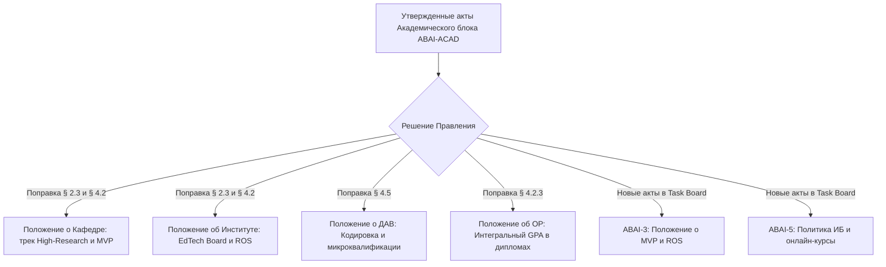

# ПАКЕТ ПРЕДЛОЖЕНИЙ ПО МОДЕРНИЗАЦИИ ТИПОВЫХ ДОКУМЕНТОВ НАО «КАЗНПУ ИМЕНИ АБАЯ»
## Комплекс нормативных поправок на основе бенчмаркинга Astana IT University

> **Task ID**: `ABAI_20260914-192000_COMP`  
> **Date**: 2026-09-14  
> **Author**: Coordinator / Lead Legal Architect  
> **Основание**: Исследование [`research/RES__comparative_analysis_aitu_vs_standard.md`](research/RES__comparative_analysis_aitu_vs_standard.md)

---

## 1. Введение и целевая установка

На основе сравнительного анализа типовых документов ОВПО РК и фонда ВНД Astana IT University (140+ регламентов) сформирован исчерпывающий пакет готовых нормативных формулировок для внесения в утвержденные и разрабатываемые типовые документы Abai University.

Внедрение данных поправок позволяет:
1. Перевести КазНПУ имени Абая от традиционной академической модели к модели исследовательского предпринимательского университета.
2. Стимулировать продуктивность ППС через дифференцированную нагрузку (300–350 часов для ученых).
3. Вовлечь студентов в коммерциализацию и стартап-деятельность (Startup Track вместо классического теоретического диплома).
4. Зафиксировать прозрачные цифровые метрики оценки контингента (Интегральный GPA и рейтинг ROS).

---

## 2. Предложения по внесению изменений в Положение о Кафедре

**Документ:** [`docs/internal_acts/regulations/department_chair_regulation.md`](file:///g:/Мой%20диск/Google%20AI%20Studio/Abai%20Unviersity%20Transformation/docs/internal_acts/regulations/department_chair_regulation.md)

### Предлагаемые дополнения:

#### 1. Дополнить Раздел 2 «Структура и состав кафедры» пунктом 2.3 следующего содержания:
> «2.3. Перевод преподавателя кафедры на исследовательский трек **High-Research Teacher** осуществляется на конкурсной основе решением Академического комитета института при соблюдении следующих минимальных критериев:
> - Наличие не менее 2 публикаций за последние 2 года в изданиях квартилей Q1–Q2 базы Scopus / Web of Science;
> - Руководство финансируемым научным проектом (ГФ / ПЦФ МНВО РК, хоздоговор или международный грант);
> - Годовая аудиторная нагрузка преподавателя на данном треке фиксируется в объеме **300–350 академических часов**, а высвобождаемое время направляется на генерацию научных результатов, руководство докторантами и сопровождение студенческих стартап-проектов».

#### 2. Дополнить Раздел 4 «Функции кафедры» подпунктом 4.1.5 (Сертификация онлайн-контента):
> «4.1.5. Кафедра обеспечивает экспертизу и внутреннюю сертификацию цифровых образовательных курсов, размещаемых в LMS Moodle / Abai Digital, в соответствии со Стандартом качества онлайн-курсов Университета (включая видеолекции, интерактивные тесты и адаптивные учебные материалы)».

#### 3. Дополнить Раздел 4 подпунктом 4.2.4 (Продуктовый подход к НИР):
> «4.2.4. Кафедра ориентирует научно-исследовательские работы на создание прикладных продуктов уровня готовности **TRL 1–4 (Minimal Valuable Product — MVP)**: авторских цифровых тренажеров, методик инклюзивного образования, электронных учебных пособий с обязательным получением акта пилотного внедрения в базовых школах».

---

## 3. Предложения по внесению изменений в Положение об Институте

**Документ:** [`docs/internal_acts/regulations/institute_model_regulation.md`](file:///g:/Мой%20диск/Google%20AI%20Studio/Abai%20Unviersity%20Transformation/docs/internal_acts/regulations/institute_model_regulation.md)

### Предлагаемые дополнения:

#### 1. Дополнить Раздел 2 «Структура и управление институтом» пунктом 2.3 (Индустриальный совет):
> «2.3. При Институте создается консультативно-совещательный орган — **Совет образовательных стейкхолдеров (EdTech & School Advisory Board)**, в состав которого входят руководители инновационных школ (НИШ, РФМШ, БИЛ), частных организаций образования и EdTech-компаний. Совет осуществляет регулярную экспертизу каталогов элективных дисциплин (КЭД) и паспортов ОП на актуальность рынку труда».

#### 2. Дополнить Раздел 4 «Функции института» подпунктом 4.2.4 (Поддержка студенческих стартапов):
> «4.2.4. Институт совместно с Офисом коммерциализации обеспечивает отбор и акселерационную поддержку студенческих междисциплинарных команд для подготовки выпускных квалификационных работ в форме реального стартап-проекта (**Startup Track**)».

#### 3. Дополнить Раздел 4 подпунктом 4.3.3 (Студенческий исследовательский рейтинг ROS):
> «4.3.3. Институт ведет автоматизированный учет научно-исследовательской активности обучающихся по системе **Research Output Score (ROS)**, данные которой учитываются при распределении грантов, академических стипендий и рекомендации для поступления в магистратуру и докторантуру».

---

## 4. Предложения по внесению изменений в Положение о ДАВ

**Документ:** [`docs/internal_acts/regulations/dav_regulation.md`](file:///g:/Мой%20диск/Google%20AI%20Studio/Abai%20Unviersity%20Transformation/docs/internal_acts/regulations/dav_regulation.md)

### Предлагаемые дополнения:

#### 1. Дополнить Раздел 4 «Функции и полномочия ДАВ» новым пунктом 4.5 (Кодировка и микроквалификации):
> «4.5. В области архитектуры образовательных траекторий и микроквалификаций:
> - Утверждает и администрирует **Общеуниверситетский классификатор кодировки учебных дисциплин**, исключающий дублирование названий курсов между институтами и закрепляющий единые стандарты префиксов уровней обучения (100–400 для бакалавриата, 500–600 для магистратуры, 700+ для докторантуры);
> - Разрабатывает регламенты признания микроквалификаций (Micro-credentials), наностепеней и профессиональных сертификатов ведущих мировых и отраслевых платформ (Coursera, edX, Google, Microsoft, Apple Teacher) с перезачетом кредитов ECTS в объеме элективного компонента ОП».

#### 2. Дополнить Раздел 4 пунктом 4.2.4 (Стандарты ГАК для Startup Track):
> «4.2.4. Формирует специализированные составы Государственных аттестационных комиссий (ГАК) для защит по треку Startup Track, предусматривающие обязательное включение не менее 50% членов комиссии из числа венчурных предпринимателей, бизнес-трекеров и руководителей технологических компаний».

---

## 5. Предложения по внесению изменений в Положение об Офисе регистратора

**Документ:** [`docs/internal_acts/regulations/registrar_regulation.md`](file:///g:/Мой%20диск/Google%20AI%20Studio/Abai%20Unviersity%20Transformation/docs/internal_acts/regulations/registrar_regulation.md)

### Предлагаемые дополнения:

#### 1. Дополнить Раздел 4 «Функции Офиса регистратора» подпунктом 4.2.3 (Применение Интегрального GPA):
> «4.2.3. Автоматизированный расчет Интегрального показателя $GPA_{int}$ выпускника используется в обязательном порядке при:
> - Рассмотрении кандидатур на присуждение диплома с отличием (при равных баллах академического GPA преимущество имеет студент с более высоким ROS и Social score);
> - Конкурсном распределении мест в общежитиях Университета;
> - Предоставлении внутриуниверситетских ректорских скидок и корпоративных стипендий».

#### 2. Дополнить Раздел 4 подпунктом 4.4.2 (Цифровой учет вендорных сертификатов):
> «4.4.2. Внесение в официальный транскрипт и Общеевропейское приложение к диплому (Diploma Supplement) сведений о полученных студентом профессиональных микроквалификациях и вендорных сертификациях с указанием валидационного ID сертификата».

---

## 6. Предложения по разработке новых целевых ВНД Abai University

На основе выявленных пробелов в типовой нормативной базе ОВПО рекомендуется разработать и утвердить следующие **5 новых специализированных ВНД**, заимствованных из передовой практики AITU:

| Название нового локального акта | Целевое подразделение-разработчик | Ключевой эффект для Университета |
|:---|:---|:---|
| **1. Положение о создании прикладных продуктов (MVP) в НИР** | Департамент науки и коммерциализации (задача `ABAI-3`) | Прекращение практики бессодержательных отчетов; переход к овеществленным результатам НИР (TRL 1–4) с внедрением в школах. |
| **2. Положение о системе оценки исследовательской активности студентов (ROS)** | Департамент науки + СМУ | Прозрачный индекс активности студентов (статьи, хакатоны, гранты) с привязкой к льготам и магистратуре. |
| **3. Положение о Совете по образовательным технологиям (EdTech Advisory Board)** | ДАВ + Управление цифровизации | Постоянный коллегиальный орган с ведущими работодателями и ИТ-компаниями для валидации программ. |
| **4. Стандарт сертификации и оценки качества онлайн-курсов** | ДАВ + Центр цифрового образования | Четкие критерии для мультимедийных и интерактивных силлабусов/курсов перед их загрузкой в LMS Moodle / Abai Digital. |
| **5. Политика информационной безопасности и защиты данных 2026** | Управление цифровизации + ДИТ (задача `ABAI-5`) | Защита академических баз данных, исключение фальсификаций оценок и защита персональных данных контингента. |

---

## 7. План внесения изменений в утвержденные акты

Данные формулировки согласованы с законодательством РК (Закон «Об образовании», Закон «О науке и технологической политике», Приказ МОН № 595, Приказ МОН № 338) и готовы к прямой интеграции в текст университетских актов.
