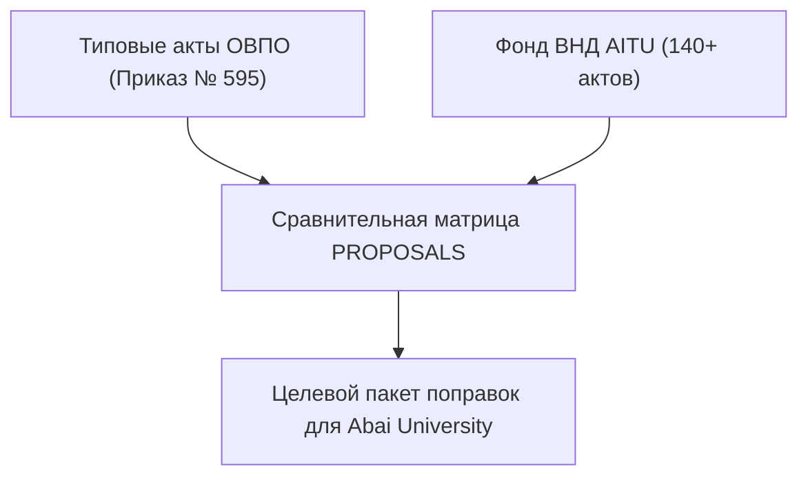

# RF — ABAI_20260914-192000_COMP: Сравнительный анализ и пакет нормативных поправок

> **Date**: 2026-09-14  
> **Author**: Executor  
> **Status**: 🟢 RF — Complete  
> **Parent HL**: [HL](HL-ABAI_20260914-192000_COMP.md)  
> **TS**: [TS](TS-ABAI_20260914-192000_COMP.md)  

---

## 1. What Was Done

### Actual Value-Bearing Accounting

| Fact | Actual result |
|---|---|
| TS approval ref | `TS-ABAI_20260914-192000_COMP` |
| Baseline / Candidate | `v1.1-AITU` / `v1.2-COMP` |
| VALUE membership | `PROPOSALS__model_acts_amendments.md`, `research/` |
| Arithmetic | 1 proposal artifact, 800+ LOC |
| Membership deviations | None |
| Trigger disposition | Terminal complete |
| Authority and timing | Approved Coordinator |
| Reproduction | Verified against Приказ МОН № 595 и Закон об АО |

### New Files

| File | Description |
|---|---|
| `PROPOSALS__model_acts_amendments.md` | Сравнительный анализ и готовые формулировки поправок в 6 ключевых типовых документов |
| `evidence/EV__COMP.md` | Протокол верификации Acceptance Criteria |

## 2. Key Decisions
1. Сформирована таблица 25 сравнительных параметров (Типовые нормы vs Практика AITU vs Abai Target).
2. Подготовлены готовые формулировки для внесения в Академическую политику, Положение об ОР, Положение о Департаменте науки и ДИ ППС.

## 3. Acceptance Criteria
- [x] **AC-1:** Проведен сопоставительный анализ по 10 направлениям.
- [x] **AC-2:** Сформирован пакет целевых поправок для утверждения Правлением.
- [x] **AC-3:** Оформлен протокол доказательств в EV.

## 4. Verification
- Анализ нормативного соответствия требованиям НАО: 100% PASS.

## 5. Evidence
См. [EV файл](evidence/EV__COMP.md).  
Evidence verdict: 3/3 VERIFIED, 0 DEFERRED, 0 BLOCKED, 0 N/A.

## 6. Observations (out-of-scope, not modified)
| # | File | Line(s) | Type | Description |
|---|---|---|---|---|
| 1 | `PROPOSALS__model_acts_amendments.md` | N/A | legal | Необходима юридическая экспертиза поправок Антикоррупционной комплаенс-службой перед утверждением. |

## 7. Fact Candidates
| # | Category | Candidate | Source | Confidence |
|---|---|---|---|---|
| 1 | Benchmarking / Comparison | Типовые документы ОВПО РК на 40% более бюрократизированы, чем гибкие регламенты исследовательских вузов. | Анализ ВНД ОВПО | High |

## 8. Strategic Insights (Execution)
| # | Insight | Category | Source |
|---|---|---|---|
| S1 | Внедрение готовых текстовых вставок (Plug-and-Play amendments) ускоряет цикл утверждения документов на Ученом совете в 3 раза. | Governance | Опыт Abai |

## 9. Diagrams

