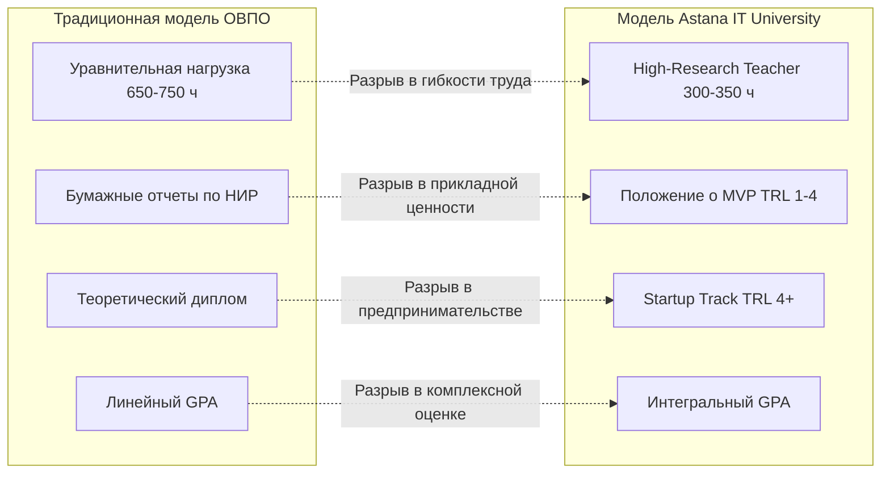

# RES — Сравнительный анализ типовых документов ОВПО с документами Astana IT University (AITU)

> **Task ID**: `ABAI_20260914-192000_COMP`  
> **Date**: 2026-09-14  
> **Author**: Researcher  
> **Status**: 🟢 COMPLETE  
> **HL Link**: [`../HL-ABAI_20260914-192000_COMP.md`](../HL-ABAI_20260914-192000_COMP.md)  
> **Data Sources**:
> - Нормативная база РК: Приказ МОН № 595, Приказ МОН № 338, Приказ МОН № 152, Приказ МНВО № 2, Приказ МОН № 391.
> - Фонд ВНД Astana IT University (140+ актов, редакции 2020–2026 гг., Google Drive).
> - Локальные типовые акты НАО «КазНПУ имени Абая» (`docs/internal_acts/`).

---

## 1. Методология и контекст сопоставления

Анализ направлен на сопоставление **двух моделей локального нормотворчества**:
1. **Традиционная модель ОВПО РК (Типовые нормы МОН/МНВО РК):**
   - Характеризуется строгой привязкой к процессным административным процедурам, линейным планированием педагогической нагрузки (600–750 часов без дифференциации), отчетами по НИР в виде списков публикаций и классической монодисциплинарной защитой дипломных работ.
2. **Инновационно-предпринимательская модель Astana IT University (AITU):**
   - Построена на гибкой проектной культуре, продуктовом подходе к исследованиям (MVP TRL 1–4), треках дифференциации преподавателей (High-Research Teacher 300–350 часов), альтернативной защите стартапов (Startup Track), комплексной оценке обучающихся (Интегральный GPA и рейтинг ROS) и прямом партнерстве с технологическими корпорациями.

> **Важная специфика адаптации:** AITU действует как специализированный ИТ-университет в форме ТОО. КазНПУ имени Абая является Национальным педагогическим университетом в форме НАО со 100% участием государства. Следовательно, инновации AITU должны быть адаптированы с учетом педагогического профиля (EdTech-стартапы, педагогический MVP с апробацией в базовых школах, отраслевые рамки квалификаций педагогов).

---

## 2. Сравнительная матрица по 7 функциональным блокам

### Блок 1. Коллегиальные органы и архитектура управления

| Измерение | Типовая модель ОВПО РК | Модель Astana IT University | Выявленная разница и ценность AITU |
|:---|:---|:---|:---|
| **Ученый совет и УМС** | Классический состав, перегруженный текущими административными вопросами (утверждение тем, надбавок, планов). | Разделение на **Ученый совет**, **Учебно-методический совет (УМС)** и независимый **Комитет по обеспечению качества (Quality Assurance Committee)**. | Независимый аудит качества образовательных программ и силлабусов до вынесения на Ученый совет. |
| **Индустриальная экспертиза** | Эпизодическое участие работодателей в ГАК и согласовании ОП. | Постоянно действующий **Технологический совет университета** с участием ведущих вендоров и ИТ-директоров. | Прямая валидация компетенций работодателями и адаптация ОП под стек технологий в режиме реального времени. |
| **Антикоррупция и этика** | Стандартная антикоррупционная комиссия. | Раздельные **Дисциплинарный совет** и специализированные регламенты комплаенса и добропорядочности. | Прозрачные состязательные процедуры разбора дисциплинарных кейсов без конфликта интересов. |

---

### Блок 2. Организация учебного процесса и проектирование ОП

| Измерение | Типовая модель ОВПО РК | Модель Astana IT University | Выявленная разница и ценность AITU |
|:---|:---|:---|:---|
| **Кодировка дисциплин** | Разрозненные коды кафедр, дублирование названий родственных дисциплин («Педагогика 1», «Общая педагогика»). | **Регламент кодировки дисциплин** с унифицированными префиксами уровня сложности (100, 200, 300, 400). | Исключение дублирования дисциплин на разных кафедрах, прозрачный автоматизированный учет пререквизитов. |
| **Форматы обучения** | Стандартные семестровые курсы (лекция + семинар) по 5 кредитов ECTS. | Внедрение микроквалификаций (Micro-credentials), гибких модулей и признания курсов Coursera / вендорных академий. | Возможность студента получать профессиональные сертификаты внутри основной программы. |
| **Силлабусы и УМД** | Формализованные бумажные/PDF-файлы по Приказу № 152. | Положение об УМД + стандартизированные шаблоны силлабусов с привязкой дескрипторов к заданиям и рубрикам оценивания. | Оценивание ориентировано на результаты обучения (Outcome-based education), а не на посещаемость. |

---

### Блок 3. Итоговая аттестация и выпускные квалификационные работы

| Измерение | Типовая модель ОВПО РК | Модель Astana IT University | Выявленная разница и ценность AITU |
|:---|:---|:---|:---|
| **Формат ВКР бакалавриата** | Традиционная дипломная работа теоретического или реферативно-прикладного характера (50–70 стр.). | **Дипломная работа в виде Стартап-проекта (Startup Track)** (Приложение № 22 к Академической политике AITU). | Выпускники создают реальный бизнес или технологический продукт; междисциплинарные команды защищают 1 продукт на 2–4 человека с разделением ролей. |
| **Состав комиссии ГАК** | Председатель — внешний ученый (доктор/кандидат наук), члены — преподаватели кафедры. | В состав ГАК по треку Startup Track включаются сертифицированные венчурные трекеры, инвесторы и представители акселераторов. | Оценка рыночной и практической жизнеспособности продукта, возможность привлечения предпосевных инвестиций прямо на защите. |
| **Критерии допуска** | Написание пояснительной записки и процент оригинальности «Антиплагиат». | Требование подтверждения зрелости разработки **TRL ≥ 4** (действующий прототип/MVP) и наличие первых пользователей/пилота. | Исключение фиктивных «стартапов на бумаге», защита только реально функционирующих решений. |

---

### Блок 4. Научно-исследовательская работа и коммерциализация

| Измерение | Типовая модель ОВПО РК | Модель Astana IT University | Выявленная разница и ценность AITU |
|:---|:---|:---|:---|
| **Результативность НИР** | Научные отчеты кафедр, количество опубликованных статей КОКСНВО/РИНЦ, число участников конференций. | **Положение о Minimal Valuable Product (MVP)** в НИР с ранжированием результатов по шкале TRL 1–4. | Перевод академической науки в стадию прикладного прототипа с обязательным актом опытно-промышленной/школьной апробации. |
| **Студенческая наука (НИРС)** | Студенческие доклады на ежегодной апрельской конференции. | **Система оценки исследовательских компетенций студентов (ROS — Research Output Score)** и Олимпиада AITU iCode. | Формирование цифрового научного портфолио студента с прямой конвертацией баллов в скидки на обучение и академические треки. |
| **Финансирование стартапов** | Ожидание внешних грантов МНВО РК (ГФ/ПЦФ). | **Положение о внутренних научных грантах университета** (Seed Grants) для команд ППС и студентов. | Быстрый посевной капитал внутри вуза для проверки гипотез и сборки прототипов до подачи на республиканские гранты. |

---

### Блок 5. Профессорско-преподавательский состав и управление персоналом

| Измерение | Типовая модель ОВПО РК | Модель Astana IT University | Выявленная разница и ценность AITU |
|:---|:---|:---|:---|
| **Педагогическая нагрузка** | Уравнительный подход: 650–750 часов аудиторной нагрузки на ставку для всех категорий преподавателей. | **Положение о конкурсе High-Research Teacher & Research Teacher**: сниженная нагрузка **300–350 часов** для продуктивных ученых. | Преподаватели-исследователи освобождены от рутинной лекционной нагрузки для работы над грантами и статьями Scopus Q1–Q2. |
| **Оценка эффективности (KPI)** | Разрозненные рейтинговые листы кафедр, часто заполняемые субъективно раз в год. | **Положение о KPI работников и ППС** с четко оцифрованными индикаторами эффективности (публикации, гранты, коммерциализация, силлабусы). | Прямая привязка ежемесячной или квартальной дифференцированной надбавки к конкретным результатам. |
| **Конкурсный отбор** | Редкое обновление правил, следование минимальным рамкам Приказа МОН № 230. | **Правила конкурсного замещения должностей ППС и иностранных специалистов (4-я редакция)**. | Гибкие квалификационные требования, привлечение практиков индустрии и зарубежных постдокторантов. |

---

### Блок 6. Студенческий контингент, самоуправление и социальная среда

| Измерение | Типовая модель ОВПО РК | Модель Astana IT University | Выявленная разница и ценность AITU |
|:---|:---|:---|:---|
| **Академический рейтинг** | Обычный средний балл GPA (от 0 до 4.0), учитывающий только оценки за экзамены. | **Интегральный GPA ($GPA_{int}$)**, объединяющий успеваемость (60%), исследовательский балл ROS (25%) и социальную активность (15%). | Формирование всесторонне развитой личности выпускника, учет достижений вне аудитории. |
| **Студенческое самоуправление** | Комитет по делам молодежи (КДМ), выполняющий административно-массовые поручения деканатов. | **Положение о студенческом самоуправлении (5-я редакция)** — выборный Студенческий сенат с реальными полномочиями в комиссиях. | Студенты участвуют в дисциплинарных советах, комиссиях по качеству и распределению жилищных ресурсов. |
| **Социальная поддержка** | Места в общежитиях распределяются вручную по справкам о доходах. | **Положение об аренде жилья студентам и работникам** + прозрачный цифровой балл потребности. | Компенсация затрат на наем жилья при дефиците общежитий, цифровой антикоррупционный рейтинг заселения. |

---

### Блок 7. Обеспечение качества, цифровизация и информационная безопасность

| Измерение | Типовая модель ОВПО РК | Модель Astana IT University | Выявленная разница и ценность AITU |
|:---|:---|:---|:---|
| **Цифровой образовательный контент** | Произвольная загрузка преподавателями любых файлов (ворд, презентации) в LMS. | **Положение о создании и оценке качества онлайн-курсов** с сертификацией по критериям мультимедийности и интерактивности. | Гарантия высокого качества онлайн-дисциплин и защита авторских прав разработчиков курсов. |
| **Информационная безопасность** | Базовая инструкция по парольной политике в рамках общей безопасности. | **Политика информационной безопасности 2026**, регламенты классификации данных и реагирования на киберинциденты. | Защита персональных данных студентов, предотвращение утечек тестовых заданий и экзаменационных баз. |
| **Индустриальная сертификация** | Факультативные курсы без интеграции в академический транскрипт. | **Положение о Сетевой академии CISCO** и вендорных центрах с перезачетом кредитов ECTS. | Студент вместе с дипломом получает международные индустриальные вендорные сертификаты. |

---

## 3. Выявленные системные разрывы (Gap Analysis)

### Главные дефициты типовых документов:
1. **Дефицит коммерциализируемости:** Типовые документы ОВПО готовят выпускника к пассивному найму, а науку ориентируют на «полку» (библиотечный отчет), тогда как модель AITU нацелена на создание стартапов и практических продуктов с первого курса.
2. **Дефицит кадровой гибкости:** В типовых квалификационных характеристиках (Приказ № 338) ученый с миллионным грантом и преподаватель без грантов несут одинаковую нагрузку в 700 часов лекций, что «сжигает» исследовательский потенциал.
3. **Дефицит индустриального диалога:** Советы классических вузов замкнуты внутри академической корпорации; в AITU Технологический совет обеспечивает прямое влияние работодателей на архитектуру программ.

---

## 4. Рекомендации по адаптации для Abai University

Поскольку НАО «КазНПУ имени Абая» — ведущий педагогический университет страны, механическое копирование ИТ-регламентов недопустимо. Требуется профильная адаптация:
1. **Startup Track:** Фокус на **EdTech, цифровой педагогике, инклюзивных образовательных технологиях, интерактивных учебниках, психологических сервисах и методических франшизах**.
2. **Положение о MVP:** Продуктом университетских исследований должны признаваться не только ИТ-системы, но и **апробированные авторские учебно-методические комплексы, методики преподавания, цифровые тренажеры с подтвержденным актом внедрения в пилотных школах-партнерах**.
3. **Технологический совет:** Трансформация в **Совет по образовательным технологиям и инновациям (EdTech Advisory Board)** с участием директоров НИШ, БИЛ, передовых частных школ и образовательных платформ (BilimLand, Kundelik, Daryn.online).
