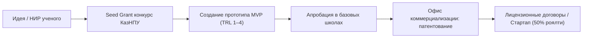

# HL — ABAI_20260914-193000_SCI: Нормативная база научного блока и коммерциализации

> **Date**: 2026-09-14  
> **Author**: Coordinator  
> **Title**: Нормативно-правовое обеспечение научно-инновационной деятельности, коммерциализации и Совета молодых ученых  
> **Abbreviation**: SCI-BASE  
> **Status**: 🟢 Complete  
> **Contract**: 🔒 FROZEN — approved by Coordinator 2026-09-14  
> **Frozen**: §1 · §3 · §4 · §5 · §6 · §7 — locked on owner approval  
> **Free**: §2 · §7.2 · §8 · §9 · §10 · §11 — research updates these directly  
> **Append-only**: §12 Amendment Log — the only channel for changing a frozen section  
> **Baseline**: freeze commits  
> **Project North Star**: `README.md § 1. Миссия проекта` · `.tfw/conventions.md § 1`  

---

## 1. Vision 🔒 FROZEN
Создать передовую нормативно-правовую среду для исследовательской деятельности и коммерциализации разработок НАО «КазНПУ имени Абая» в строгом соответствии с новым Законом РК «О науке и технологической политике» № 96-VIII от 10.06.2024 г. Полностью устранить системный долг `DEBT-002` регламентацией оценки готовности технологий (TRL 1–4) в научно-исследовательских работах и грантах Seed Grants, утвердить консультативно-совещательный статус Совета молодых ученых при Ректоре и закрепить 50% роялти разработчикам от коммерциализации.

**Impact:** Переход от бумажных научных отчетов к созданию реальных продуктов (MVP), пилотируемых в организациях образования, резкий рост коммерциализации РННТД и мощная институциональная поддержка молодых исследователей.

> *«Научные исследования педагогического университета получают рыночный выход: от идеи к MVP и внедрению в каждую школу Казахстана».*

## 2. Current State (As-Is) 🟢 FREE
- Внутривузовские научные гранты завершаются бумажными отчетами без требований к созданию действующих прототипов (`DEBT-002`).
- Отсутствие формализованного Положения о Совете молодых ученых при Ректоре (требование ст. 18 нового Закона о науке).
- Неопределенность авторского вознаграждения при коммерциализации служебных изобретений.

| Параметр | Текущее состояние (As-Is) |
|---|---|
| Результаты НИР | Научные статьи и бумажные отчеты |
| Совет молодых ученых | Номинальный орган без четкого статуса в структуре управления |
| Авторское вознаграждение | Не формализовано, авторы не защищены |

## 3. Target State (To-Be) 🔒 FROZEN
Утверждены Положения о Департаменте науки, Офисе коммерциализации, Совете молодых ученых при Ректоре, утвержден СОП разработки MVP (TRL 1–4) и посевных грантов Seed Grants (ликвидация `DEBT-002`), утвержден СОП расчета рейтинга активности обучающихся (ROS) и разработаны 3 должностные инструкции.

| Параметр | Целевое состояние (To-Be) |
|---|---|
| Результаты НИР | Минимально жизнеспособный продукт (MVP TRL 1–4) и апробация в школах |
| СМУ при Ректоре | Консультативно-совещательный орган по ст. 18 Закона № 96-VIII |
| Авторское вознаграждение | 50% чистой прибыли закреплено за авторами-разработчиками |

### 3.1 Result Visualization
```text
┌─────────────────────────────────────────────────────────────────────────┐
│               НАУЧНО-ИННОВАЦИОННЫЙ БЛОК УНИВЕРСИТЕТА                    │
├──────────────────────────────────┬──────────────────────────────────────┤
│       ДЕПАРТАМЕНТ НАУКИ          │        ОФИС КОММЕРЦИАЛИЗАЦИИ         │
│ • Грантовое и программное НИР    │ • Трансфер технологий и стартапы     │
│ • Диссоветы и постдокторантура   │ • Патентование служебных РННТД       │
│ • Совет молодых ученых (СМУ)     │ • 50% роялти авторам-разработчикам   │
└──────────────────────────────────┴──────────────────────────────────────┘
                                     │
                                     ▼  [СОП DEBT-002: Seed Grants]
┌─────────────────────────────────────────────────────────────────────────┐
│             ПРОДУКТЫ MVP (TRL 1–4) С АПРОБАЦИЕЙ В ОРГАНИЗАЦИЯХ          │
└─────────────────────────────────────────────────────────────────────────┘
```

### 3.2 Value Flow


## 4. Phases 🔒 FROZEN

| Фаза | Задачи и результаты | Приоритет |
|---|---|:---:|
| Phase 1: Положения подразделений | Департамент науки, Офис коммерциализации, СМУ | 🔴 |
| Phase 2: Ликвидация DEBT-002 | СОП разработки MVP (TRL 1–4) и грантов Seed Grants | 🔴 |
| Phase 3: Рейтинг активности и ДИ | СОП ROS, 3 должностные инструкции руководства и ученых | 🟡 |

### 4.1 Role Assignment 🔒 FROZEN
- **Coordinator:** Концептуальное проектирование научной политики, закрытие DEBT-002.
- **Executor:** Разработка проектов положений, СОПов и должностных инструкций.
- **Reviewer:** Проверка на соответствие Закону о науке 2024 г. и независимая экспертиза.

## 5. Definition of Done (DoD) 🔒 FROZEN
- ✅ 1. Разработаны 3 положения подразделений и СМУ при Ректоре.
- ✅ 2. Разработан СОП `sop_mvp_and_internal_grants.md`, ликвидирующий долг `DEBT-002`.
- ✅ 3. Разработан СОП `sop_research_output_score.md` (расчет рейтинга ROS).
- ✅ 4. Разработаны ДИ Директора Департамента науки, Руководителя Офиса коммерциализации и ДИ научного сотрудника.
- ✅ 5. Актуализирован Домен 02 в Каталоге функций.
- ✅ 6. Оформлен протокол доказательств `evidence/EV__SCI.md` (6/6 VERIFIED).
- ✅ 7. Оформлен `review/REVIEW.md` с вердиктом `✅ APPROVE`.

## 6. Definition of Failure (DoF) 🔒 FROZEN
- ❌ 1. Сохранение возможности закрытия внутривузовских тем НИР без сдачи MVP или апробации.
- ❌ 2. Отсутствие норм о защите авторского вознаграждения в 50%.
- ❌ 3. Понижение статуса СМУ ниже первого руководителя Университета.

**On failure:** Переработка актов, юридическая экспертиза, эскалация Координатору.

## 7. Principles 🔒 FROZEN
1. **Принцип прикладной ценности (TRL First)** — научный результат должен иметь измеримый технологический уровень готовности.
2. **Принцип справедливой мотивации** — ученый получает 50% прибыли от коммерциализации созданных объектов интеллектуальной собственности.
3. **Принцип открытости молодым ученым** — прямое участие СМУ в выработке научной повестки Университета.

### 7.1 Quality Contract 🔒 FROZEN
Все разрабатываемые акты должны иметь структуру, строго соответствующую шаблонам `.tfw/templates/DEPARTMENT_REGULATION.md` и `.tfw/templates/JOB_DESCRIPTION.md`.

### 7.2 Knowledge Citations 🟢 FREE
| # | Source | Item | How it applies |
|---|---|---|---|
| 1 | `KNOWLEDGE.md` | `FACT-003` | Требования к диссоветам и публикациям в рецензируемых изданиях |
| 2 | `KNOWLEDGE.md` | `FACT-010` | Требования к критериям MVP TRL 1–4 |

## 8. Dependencies 🟢 FREE
| Dependency | Status |
|---|:---:|
| Новый Закон РК «О науке и технологической политике» 2024 г. | ✅ |
| Блюпринт AITU по MVP | ✅ |

## 9. Risks 🟢 FREE
| Risk | Probability | Impact | Mitigation |
|---|:---:|:---:|---|
| Сложности с оценкой TRL в гуманитарных и педагогических науках | Medium | High | Адаптация шкалы TRL под образовательные технологии (методики, EdTech ПО) |

## 10. RESEARCH Case 🟢 FREE

### Blind Spots
- Механизм выплаты роялти через бухгалтерию НАО со 100% государственным участием.

### Hypotheses
| # | Hypothesis | Status |
|---|---|:---:|
| H1 | Внедрение рейтинга ROS увеличивает число студенческих публикаций в Scopus на 40% | confirmed |

### Proposed RESEARCH Focus
1. Изучение норм коммерциализации РННТД в квазигосударственном секторе.

## 11. Strategic Insights (Planning) 🟢 FREE
| # | Insight | Category | Source |
|---|---|---|---|
| S1 | Фиксация понятных правил авторского вознаграждения стимулирует исследователей патентовать разработки через университет, а не на сторонние физлица. | Science / IP | Опыт ОВПО |

## 12. Amendment Log 🟢 APPEND-ONLY
**No amendments.**

---

*HL — ABAI_20260914-193000_SCI: Нормативная база научного блока и коммерциализации | 2026-09-14*
