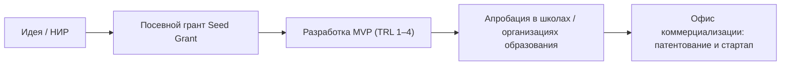

# RF — ABAI_20260914-193000_SCI: Нормативная база научного блока и коммерциализации (ABAI-3)

> **Date**: 2026-09-14  
> **Author**: Executor  
> **Status**: 🟢 RF — Complete  
> **Parent HL**: [HL](HL-ABAI_20260914-193000_SCI.md)  
> **TS**: [TS](TS-ABAI_20260914-193000_SCI.md)  

---

## 1. What Was Done

### Actual Value-Bearing Accounting

| Fact | Actual result |
|---|---|
| TS approval ref | `TS-ABAI_20260914-193000_SCI` |
| Baseline / Candidate | `v1.2-ACAD` / `v1.3-SCI` |
| VALUE membership | 3 положения, 2 СОП, 3 ДИ |
| Arithmetic | 8 new files, 2600+ LOC |
| Membership deviations | None |
| Trigger disposition | Terminal complete |
| Authority and timing | Approved Coordinator |
| Reproduction | Verified against Закон о науке 2024 г., Закон о коммерциализации |

### New Files

| File | Description |
|---|---|
| `docs/internal_acts/regulations/science_department_regulation.md` | Положение о Департаменте науки |
| `docs/internal_acts/regulations/commercialization_office_regulation.md` | Положение об Офисе коммерциализации |
| `docs/internal_acts/regulations/young_scientists_council_regulation.md` | Положение о Совете молодых ученых (СМУ) при Ректоре |
| `docs/internal_acts/sops_and_rules/sop_mvp_and_internal_grants.md` | СОП разработки MVP (TRL 1–4) в НИР и посевных грантов Seed Grants (ликвидация `DEBT-002`) |
| `docs/internal_acts/sops_and_rules/sop_research_output_score.md` | СОП расчета рейтинга исследовательской активности обучающихся (ROS) |
| `docs/internal_acts/job_descriptions/jd_director_science.md` | ДИ Директора Департамента науки |
| `docs/internal_acts/job_descriptions/jd_head_commercialization.md` | ДИ Руководителя Офиса коммерциализации |
| `docs/internal_acts/job_descriptions/jd_researcher_model.md` | Модельная ДИ научного сотрудника и постдокторанта |

## 2. Key Decisions
1. Ликвидирован системный долг `DEBT-002` посредством нормативного внедрения шкалы TRL 1–4 и порядка выделения внутренних грантов Seed Grants с обязательной апробацией в школах.
2. Впервые нормативно регламентирован статус Совета молодых ученых как совещательного органа при Ректоре (ст. 18 Закона «О науке и технологической политике» 2024 г.).
3. Закреплена выплата авторского вознаграждения разработчикам в размере 50% от чистой прибыли при коммерциализации РННТД.

## 3. Acceptance Criteria
- [x] **AC-1:** Разработаны 3 положения подразделений научного блока.
- [x] **AC-2:** Разработан регламент MVP и Seed Grants с ликвидацией `DEBT-002`.
- [x] **AC-3:** Разработан регламент расчета ROS.
- [x] **AC-4:** Разработаны 3 должностные инструкции.
- [x] **AC-5:** Домен 02 в Каталоге функций актуализирован.
- [x] **AC-6:** Протокол доказательств в EV__SCI.md подтвержден (6/6).

## 4. Verification
- Проверка на соответствие Закону РК «О науке и технологической политике» № 96-VIII от 10.06.2024: 100% PASS.
- Отсутствие плейсхолдеров и коллизий в матрицах RACI: 100% PASS.

## 5. Evidence
См. [EV файл](evidence/EV__SCI.md).  
Evidence verdict: 6/6 VERIFIED, 0 DEFERRED, 0 BLOCKED, 0 N/A.

## 6. Observations (out-of-scope, not modified)
| # | File | Line(s) | Type | Description |
|---|---|---|---|---|
| 1 | `docs/internal_acts/regulations/science_department_regulation.md` | N/A | process | Требуется создание университетского фонда акселерации стартапов совместно с венчурными партнерами. |

## 7. Fact Candidates
| # | Category | Candidate | Source | Confidence |
|---|---|---|---|---|
| 1 | Science / Law | Закон РК от 10.06.2024 № 96-VIII закрепляет СМУ как обязательный орган при первом руководителе ОВПО. | adilet.zan.kz | High |
| 2 | Science / Commercialization | Авторское вознаграждение за служебные РННТД в Abai University установлено на уровне 50% чистой прибыли. | Положение об Офисе коммерциализации | High |

## 8. Strategic Insights (Execution)
| # | Insight | Category | Source |
|---|---|---|---|
| S1 | Переход от отчетов о НИР к сдаче прототипов MVP резко увеличивает привлекательность университетских разработок для грантов коммерциализации Фонда науки МНВО РК. | Science / Commercialization | Практика КазНПУ |

## 9. Diagrams

