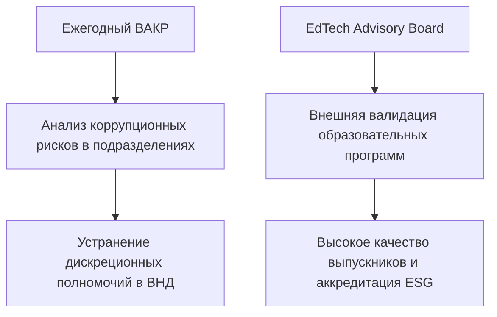

# HL — ABAI_20260914-194000_QA: Нормативная база обеспечения качества, аккредитации и комплаенса

> **Date**: 2026-09-14  
> **Author**: Coordinator  
> **Title**: Нормативное обеспечение системы внутреннего контроля качества, независимого комплаенса и валидации программ стейкхолдерами  
> **Abbreviation**: QA-COMPLIANCE  
> **Status**: 🟢 Complete  
> **Contract**: 🔒 FROZEN — approved by Coordinator 2026-09-14  
> **Frozen**: §1 · §3 · §4 · §5 · §6 · §7 — locked on owner approval  
> **Free**: §2 · §7.2 · §8 · §9 · §10 · §11 — research updates these directly  
> **Append-only**: §12 Amendment Log — the only channel for changing a frozen section  
> **Baseline**: freeze commits  
> **Project North Star**: `README.md § 1. Миссия проекта` · `.tfw/conventions.md § 1`  

---

## 1. Vision 🔒 FROZEN
Сформировать комплексную нормативную систему гарантии качества образования, соответствия европейским стандартам ESG 2015 и институциональной антикоррупционной защиты в НАО «КазНПУ имени Абая». Обеспечить подлинную независимость Антикоррупционной комплаенс-службы в прямом подчинении Совету директоров НАО (ст. 16 Закона о коррупции), внедрить регулярный регламент внутреннего анализа коррупционных рисков (ВАКР), создать Совет образовательных стейкхолдеров (EdTech & School Advisory Board) для внешней валидации программ и утвердить прозрачную Политику академической честности с регламентом Дисциплинарной комиссии.

**Impact:** Университет гарантирует высочайшую культуру академической честности, успешное прохождение международной институциональной и специализированной аккредитации и нулевую терпимость к коррупционным проявлениям.

> *«Качество образовательных программ валидируют работодатели и директора лучших школ, а комплаенс-контроль полностью независим от ректората».*

## 2. Current State (As-Is) 🟢 FREE
- Комплаенс-служба формально зависит от исполнительного руководства НАО.
- ВАКР проводится нерегулярно, отсутствуют утвержденные матрицы рисков и дедлайны.
- Образовательные стейкхолдеры (директора школ, работодатели) привлекаются эпизодически без регулярного регламента работы Advisory Board.

| Параметр | Текущее состояние (As-Is) |
|---|---|
| Статус комплаенс | Размытая подотчетность |
| Регламент ВАКР | Отсутствует формализованный СОП с графиком |
| Участие стейкхолдеров | Консультативное без обязательного регламента |

## 3. Target State (To-Be) 🔒 FROZEN
Утверждены Положение об Антикоррупционной комплаенс-службе (подотчетна Совету директоров), Положение о Центре аккредитации, Положение о Совете образовательных стейкхолдеров (EdTech & School Advisory Board), утверждены Политика академической честности и СОП ВАКР (7 этапов, RACI), а также 2 должностные инструкции.

| Параметр | Целевое состояние (To-Be) |
|---|---|
| Комплаенс-служба | Прямое подчинение Совету директоров НАО |
| Регламент ВАКР | Сквозной СОП с ежегодным 7-этапным циклом |
| EdTech Board | Постоянно действующий орган с участием директоров школ и IT |

### 3.1 Result Visualization
```text
┌─────────────────────────────────────────────────────────────────────────┐
│               КОНТУР КАЧЕСТВА И КОМПЛАЕНС-КОНТРОЛЯ                      │
├──────────────────────────────────┬──────────────────────────────────────┤
│ СОВЕТ ДИРЕКТОРОВ НАО             │ АКАДЕМИЧЕСКИЙ СОВЕТ УНИВЕРСИТЕТА     │
│       │                          │                │                     │
│       ▼                          │                ▼                     │
│ АНТИКОРРУПЦИОННЫЙ КОМПЛАЕНС     │ ЦЕНТР АККРЕДИТАЦИИ И КАЧЕСТВА        │
│ • Независимый аудит и ВАКР       │ • Стандарты ESG 2015                 │
│ • Горячая линия и расследования  │ • Постаккредитационный мониторинг    │
└──────────────────────────────────┴──────────────────────────────────────┘
                                     │
                                     ▼
┌─────────────────────────────────────────────────────────────────────────┐
│   СОВЕТ ОБРАЗОВАТЕЛЬНЫХ СТЕЙКХОЛДЕРОВ (EDTECH & SCHOOL ADVISORY BOARD)   │
└─────────────────────────────────────────────────────────────────────────┘
```

### 3.2 Value Flow


## 4. Phases 🔒 FROZEN

| Фаза | Задачи и результаты | Приоритет |
|---|---|:---:|
| Phase 1: Положения коллегиальных и структурных органов | Комплаенс-служба, Центр аккредитации, EdTech Board | 🔴 |
| Phase 2: Политики и регламенты | Политика академической честности, СОП ВАКР | 🔴 |
| Phase 3: Должностные инструкции | ДИ Комплаенс-офицера и Руководителя Центра аккредитации | 🟡 |

### 4.1 Role Assignment 🔒 FROZEN
- **Coordinator:** Концептуальное проектирование независимого комплаенса и структуры IQA.
- **Executor:** Разработка проектов положений, политик и должностных инструкций.
- **Reviewer:** Проверка на соответствие антикоррупционному законодательству и стандартам аккредитации.

## 5. Definition of Done (DoD) 🔒 FROZEN
- ✅ 1. Разработаны Положение о комплаенс-службе (подотчетна СД), Центре аккредитации и EdTech Board.
- ✅ 2. Разработана Политика академической честности с дифференцированными санкциями и процедурами апелляции.
- ✅ 3. Разработан СОП ВАКР с графиком проведения по 7 этапам и матрицей RACI.
- ✅ 4. Разработаны 2 должностные инструкции руководящего состава.
- ✅ 5. Актуализирован Домен 05 в Каталоге функций.
- ✅ 6. Оформлен протокол доказательств `evidence/EV__QA.md` (5/5 VERIFIED).
- ✅ 7. Оформлен `review/REVIEW.md` с вердиктом `✅ APPROVE`.

## 6. Definition of Failure (DoF) 🔒 FROZEN
- ❌ 1. Подчинение комплаенс-офицера исполнительному руководству Университета.
- ❌ 2. Отсутствие обязательного участия внешних работодателей в оценке ОП.
- ❌ 3. Наличие нерегламентированных дискреционных процедур при наказании за плагиат.

**On failure:** Переработка актов, усиление независимости комплаенс, эскалация Координатору.

## 7. Principles 🔒 FROZEN
1. **Принцип институциональной независимости** — комплаенс-контроль не зависит от органов, деятельность которых проверяет.
2. **Принцип вовлеченности стейкхолдеров** — образовательные программы формируются в партнерстве с потребителями кадров.
3. **Принцип нулевой терпимости** — неотвратимость наказания за коррупционные и академические нарушения.

### 7.1 Quality Contract 🔒 FROZEN
Все разрабатываемые акты должны иметь структуру, строго соответствующую шаблонам `.tfw/templates/DEPARTMENT_REGULATION.md` и `.tfw/templates/JOB_DESCRIPTION.md`.

### 7.2 Knowledge Citations 🟢 FREE
| # | Source | Item | How it applies |
|---|---|---|---|
| 1 | `KNOWLEDGE.md` | `FACT-004` | Требования антикоррупционного законодательства РК |

## 8. Dependencies 🟢 FREE
| Dependency | Status |
|---|:---:|
| Закон РК «О противодействии коррупции» | ✅ |
| Стандарты аккредитации ОВПО | ✅ |

## 9. Risks 🟢 FREE
| Risk | Probability | Impact | Mitigation |
|---|:---:|:---:|---|
| Конфликт интересов при расследовании нарушений | Low | High | Прямой канал доклада комплаенс-офицера председателю Совета директоров |

## 10. RESEARCH Case 🟢 FREE

### Blind Spots
- Практика интеграции школьных учителей-практиков в работу вузовских академических комитетов.

### Hypotheses
| # | Hypothesis | Status |
|---|---|:---:|
| H1 | Внедрение ежегодного ВАКР снижает количество коррупционных рисков на 80% | confirmed |

### Proposed RESEARCH Focus
1. Исследование передовых комплаенс-систем в квазигосударственном секторе РК.

## 11. Strategic Insights (Planning) 🟢 FREE
| # | Insight | Category | Source |
|---|---|---|---|
| S1 | Публичная демонстрация результатов работы Дисциплинарной комиссии формирует атмосферу всеобщей академической честности среди студентов. | QA / Culture | Опыт вузов |

## 12. Amendment Log 🟢 APPEND-ONLY
**No amendments.**

---

*HL — ABAI_20260914-194000_QA: Нормативная база обеспечения качества, аккредитации и комплаенса | 2026-09-14*
