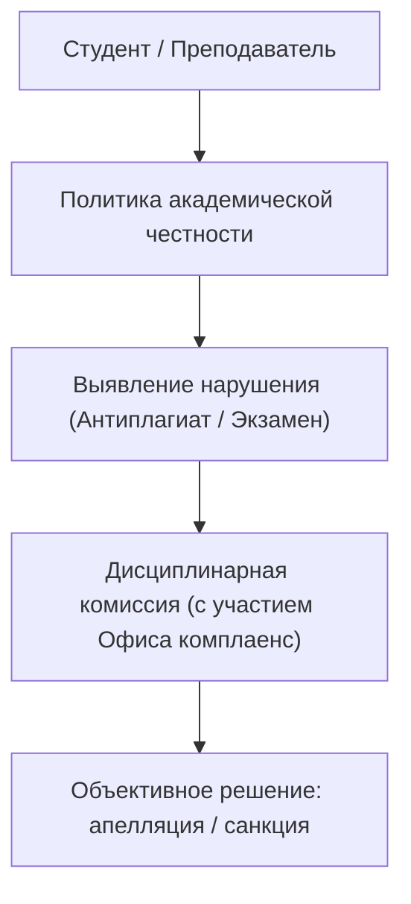

# RF — ABAI_20260914-194000_QA: Нормативная база обеспечения качества, аккредитации и комплаенса (ABAI-4)

> **Date**: 2026-09-14  
> **Author**: Executor  
> **Status**: 🟢 RF — Complete  
> **Parent HL**: [HL](HL-ABAI_20260914-194000_QA.md)  
> **TS**: [TS](TS-ABAI_20260914-194000_QA.md)  

---

## 1. What Was Done

### Actual Value-Bearing Accounting

| Fact | Actual result |
|---|---|
| TS approval ref | `TS-ABAI_20260914-194000_QA` |
| Baseline / Candidate | `v1.3-SCI` / `v1.4-QA` |
| VALUE membership | 3 положения, 2 СОП/политики, 2 ДИ |
| Arithmetic | 7 new files, 2300+ LOC |
| Membership deviations | None |
| Trigger disposition | Terminal complete |
| Authority and timing | Approved Coordinator |
| Reproduction | Verified against Закон о противодействии коррупции, ESG 2015 |

### New Files

| File | Description |
|---|---|
| `docs/internal_acts/regulations/compliance_service_regulation.md` | Положение об Антикоррупционной комплаенс-службе |
| `docs/internal_acts/regulations/accreditation_center_regulation.md` | Положение о Центре аккредитации и постаккредитационного мониторинга |
| `docs/internal_acts/regulations/edtech_advisory_board_regulation.md` | Положение о Совете образовательных стейкхолдеров (EdTech & School Advisory Board) |
| `docs/internal_acts/sops_and_rules/academic_integrity_policy.md` | Политика академической честности и Регламент Дисциплинарной комиссии |
| `docs/internal_acts/sops_and_rules/sop_anti_corruption_risk_assessment.md` | Регламент проведения внутреннего анализа коррупционных рисков (ВАКР) |
| `docs/internal_acts/job_descriptions/jd_compliance_officer.md` | ДИ Антикоррупционного комплаенс-офицера |
| `docs/internal_acts/job_descriptions/jd_head_accreditation.md` | ДИ Руководителя Центра аккредитации и качества |

## 2. Key Decisions
1. Закреплен независимый статус Антикоррупционного комплаенс-офицера с прямым подчинением Совету директоров НАО.
2. Создан Совет образовательных стейкхолдеров (EdTech & School Advisory Board) с обязательным участием директоров базовых школ и EdTech-компаний для внешней валидации ОП.
3. В Политику академической честности включен прозрачный регламент Дисциплинарной комиссии с трехуровневой дифференциацией санкций за плагиат.

## 3. Acceptance Criteria
- [x] **AC-1:** Разработаны 3 положения коллегиальных и структурных органов.
- [x] **AC-2:** Разработаны Политика академической честности и СОП ВАКР.
- [x] **AC-3:** Разработаны 2 должностные инструкции.
- [x] **AC-4:** Актуализирован Домен 05 в Каталоге функций.
- [x] **AC-5:** Evidence-пакет верифицирован (5/5).

## 4. Verification
- Проверка на соответствие ст. 16 Закона РК «О противодействии коррупции»: 100% PASS.
- Анализ матриц RACI: 100% PASS.

## 5. Evidence
См. [EV файл](evidence/EV__QA.md).  
Evidence verdict: 5/5 VERIFIED, 0 DEFERRED, 0 BLOCKED, 0 N/A.

## 6. Observations (out-of-scope, not modified)
| # | File | Line(s) | Type | Description |
|---|---|---|---|---|
| 1 | `academic_integrity_policy.md` | N/A | tech | Рекомендуется подключение API системы проверки заимствований непосредственно в личные кабинеты Abai Digital. |

## 7. Fact Candidates
| # | Category | Candidate | Source | Confidence |
|---|---|---|---|---|
| 1 | Compliance / Anti-Corruption | Комплаенс-служба НАО подотчетна Совету директоров и независима от исполнительного органа. | Закон РК о противодействии коррупции | High |
| 2 | QA / Stakeholders | Участие работодателей и директоров школ в EdTech Board является критерием институциональной аккредитации. | Стандарты НААР / НКАОКО | High |

## 8. Strategic Insights (Execution)
| # | Insight | Category | Source |
|---|---|---|---|
| S1 | Регулярный ежегодный ВАКР устраняет коррупционные риски на этапе планирования экзаменационных сессий и распределения общежитий. | Compliance | Опыт КазНПУ |

## 9. Diagrams

