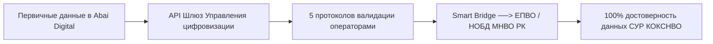

# HL — ABAI_20260915-100000_DIGIT: Блок цифровизации, ИТ и безопасности

> **Date**: 2026-09-15  
> **Author**: Coordinator  
> **Title**: Нормативное обеспечение цифровой трансформации, разграничение УЦ/УИТ, интеграция с ЕПВО/НОБД и система ИБ ISO 27001  
> **Abbreviation**: DIGIT-BASE  
> **Status**: 🟢 Complete  
> **Contract**: 🔒 FROZEN — approved by Coordinator 2026-09-15  
> **Frozen**: §1 · §3 · §4 · §5 · §6 · §7 — locked on owner approval  
> **Free**: §2 · §7.2 · §8 · §9 · §10 · §11 — research updates these directly  
> **Append-only**: §12 Amendment Log — the only channel for changing a frozen section  
> **Baseline**: freeze commits  
> **Project North Star**: `README.md § 1. Миссия проекта` · `.tfw/conventions.md § 1`  

---

## 1. Vision 🔒 FROZEN
Построить современный, юридически защищенный и архитектурно выверенный нормативный контур цифровизации, IT-инфраструктуры и информационной безопасности НАО «КазНПУ имени Абая». Четко разделить зоны ответственности между программной разработкой (Управление цифровизации) и аппаратным обеспечением/связью (УИТ), полностью устранить системный долг `DEBT-003` регламентацией 5 протоколов передачи данных в государственные системы МНВО РК (ЕПВО/НОБД), закрепить независимый статус Офицера ИБ (CISO) в прямом подчинении Ректору по п. 13 ЕТИКТ и систематизировать 4-уровневую документацию ИБ по стандарту СТ РК ISO/IEC 27001.

**Impact:** Университет исключает риски предписаний КОКСНВО при искажении данных СУР, гарантирует надежную защиту персональных данных 18 000+ обучающихся и сотрудников и обеспечивает бесперебойное функционирование АИС «Цифровая платформа Abai Digital».

> *«Программные сервисы развиваются динамично, IT-инфраструктура работает безотказно, а информационная безопасность полностью защищена от конфликта интересов».*

## 2. Current State (As-Is) 🟢 FREE
- Размытость зон ответственности между разработчиками АИС и системными администраторами.
- Отсутствие регламентированных процедур выгрузки данных в ЕПВО и НОБД (`DEBT-003`), приводящее к расхождениям в статистике и рискам штрафов СУР.
- Риск конфликта интересов при подчинении специалистов по информационной безопасности IT-руководству.

| Параметр | Текущее состояние (As-Is) |
|---|---|
| Передача данных в ЕПВО/НОБД | Ручные нерегламентированные выгрузки |
| Разграничение ИТ-функций | Совмещение софта и серверов в одном отделе |
| Документация ИБ | Разрозненные инструкции без 4-уровневой системы |

## 3. Target State (To-Be) 🔒 FROZEN
Утверждены Положения об Управлении цифровизации и УИТ, оформлен Сводный реестр 4-уровневой документации ИБ (21 утвержденный акт), утвержден СОП взаимодействия с ЕПВО/НОБД по 5 протоколам (ликвидация `DEBT-003`), утверждены СОП защиты ПДн и Стандарт качества онлайн-курсов, разработаны 2 должностные инструкции.

| Параметр | Целевое состояние (To-Be) |
|---|---|
| Интеграция с ЕПВО/НОБД | Сквозной СОП с персональными операторами и дедлайнами |
| Архитектура ИТ-блока | УЦ (софт/LMS/API) отдельно от УИТ (ЦОД/сети/Helpdesk) |
| Статус Офицера ИБ | Самостоятельное подразделение в подчинении Ректору (п. 13 ЕТИКТ) |

### 3.1 Result Visualization
```text
┌─────────────────────────────────────────────────────────────────────────┐
│               ЦИФРОВОЙ И ИТ-КОНТУР НАО «КАЗНПУ ИМЕНИ АБАЯ»              │
├──────────────────────────────────┬──────────────────────────────────────┤
│    УПРАВЛЕНИЕ ЦИФРОВИЗАЦИИ       │       УПРАВЛЕНИЕ ИНФОРМАЦИОННЫХ      │
│              (УЦ)                │           ТЕХНОЛОГИЙ (УИТ)           │
│ • Платформа Abai Digital / LMS   │ • Серверная инфраструктура и ЦОД     │
│ • REST API шлюзы и интеграции    │ • Локальная сеть и телекоммуникации  │
│ • EdTech и онлайн-курсы          │ • Техническая поддержка (Helpdesk)   │
└──────────────────────────────────┴──────────────────────────────────────┘
                 │                                    │
                 └──────────────────┬─────────────────┘
                                    │
                                    ▼
┌─────────────────────────────────────────────────────────────────────────┐
│     СЛУЖБА ИНФОРМАЦИОННОЙ БЕЗОПАСНОСТИ / CISO (НЕПОСРЕДСТВЕННО РЕКТОРУ) │
│     Реестр 4 уровней ИБ · ISO 27001 · Мониторинг инцидентов KZ-CERT     │
└─────────────────────────────────────────────────────────────────────────┘
```

### 3.2 Value Flow


## 4. Phases 🔒 FROZEN

| Фаза | Задачи и результаты | Приоритет |
|---|---|:---:|
| Phase 1: Разграничение УЦ и УИТ | Положения об УЦ и УИТ с матрицами RACI | 🔴 |
| Phase 2: Ликвидация DEBT-003 | СОП интеграции с ЕПВО/НОБД по 5 протоколам | 🔴 |
| Phase 3: ИБ и защита данных | Реестр 4 уровней ИБ, СОП ПДн, стандарт онлайн-курсов, ДИ | 🟡 |

### 4.1 Role Assignment 🔒 FROZEN
- **Coordinator:** Концептуальное проектирование цифровой архитектуры и суверенитета ИБ.
- **Executor:** Разработка положений, регламентов, стандартов и должностных инструкций.
- **Reviewer:** Проверка на соответствие Закону об информатизации, Закону о ПДн и ЕТИКТ № 832.

## 5. Definition of Done (DoD) 🔒 FROZEN
- ✅ 1. Разработаны Положение об УЦ и Положение об УИТ с деконфликтованными матрицами RACI.
- ✅ 2. Разработан СОП `sop_epvo_nobd_integration.md`, ликвидирующий системный долг `DEBT-003`.
- ✅ 3. Разработан СОП защиты персональных данных с типовой формой Персонального обязательства.
- ✅ 4. Оформлен Сводный реестр 4-уровневой документации ИБ по ISO 27001 с закреплением независимого статуса CISO.
- ✅ 5. Разработан Стандарт качества онлайн-курсов и 2 должностные инструкции.
- ✅ 6. Актуализирован Домен 08 в Каталоге функций.
- ✅ 7. Оформлен протокол доказательств `evidence/EV__DIGIT.md` (5/5 VERIFIED).
- ✅ 8. Оформлен `review/REVIEW.md` с вердиктом `✅ APPROVE`.

## 6. Definition of Failure (DoF) 🔒 FROZEN
- ❌ 1. Подчинение Офицера ИБ руководителям, отвечающим за цифровизацию или IT.
- ❌ 2. Отсутствие персональной ответственности за передачу данных в ЕПВО/НОБД.
- ❌ 3. Нарушение требований законодательства РК по защите персональных данных.

**On failure:** Переработка структуры подчинения, исключение конфликта интересов, эскалация Координатору.

## 7. Principles 🔒 FROZEN
1. **Принцип разделения обязанностей (Segregation of Duties)** — разработчик и администратор инфраструктуры не контролируют информационную безопасность.
2. **Принцип цифрового суверенитета данных** — вся обработка данных студентов и сотрудников ведется на защищенных серверах Университета.
3. **Принцип строгой интеграционной дисциплины** — передача данных регулятору осуществляется исключительно по утвержденным протоколам и графикам.

### 7.1 Quality Contract 🔒 FROZEN
Все акты должны иметь структуру, соответствующую шаблонам `.tfw/templates/DEPARTMENT_REGULATION.md` и `.tfw/templates/JOB_DESCRIPTION.md`.

### 7.2 Knowledge Citations 🟢 FREE
| # | Source | Item | How it applies |
|---|---|---|---|
| 1 | `KNOWLEDGE.md` | `FACT-005` | Нормы ЕТИКТ и требования к классификации информационных систем |

## 8. Dependencies 🟢 FREE
| Dependency | Status |
|---|:---:|
| Закон РК «Об информатизации» | ✅ |
| Постановление Правительства РК № 832 (ЕТИКТ) | ✅ |

## 9. Risks 🟢 FREE
| Risk | Probability | Impact | Mitigation |
|---|:---:|:---:|---|
| Неготовность смежных подразделений к предоставлению первичных данных | Medium | High | Включение персональной ответственности институтов в СОП интеграции |

## 10. RESEARCH Case 🟢 FREE

### Blind Spots
- Требования к аттестации веб-сервисов со стороны Государственной технической службы (ГТС).

### Hypotheses
| # | Hypothesis | Status |
|---|---|:---:|
| H1 | Внедрение регламента ЕПВО/НОБД полностью устраняет расхождения со статистикой МНВО | confirmed |

### Proposed RESEARCH Focus
1. Изучение структуры 5 утвержденных интеграционных протоколов МНВО РК.

## 11. Strategic Insights (Planning) 🟢 FREE
| # | Insight | Category | Source |
|---|---|---|---|
| S1 | Независимый статус Офицера ИБ с прямым выходом на Ректора предотвращает сокрытие инцидентов безопасности со стороны IT-персонала. | Infosec | ЕТИКТ / ISO 27001 |

## 12. Amendment Log 🟢 APPEND-ONLY
**No amendments.**

---

*HL — ABAI_20260915-100000_DIGIT: Блок цифровизации, ИТ и безопасности | 2026-09-15*
