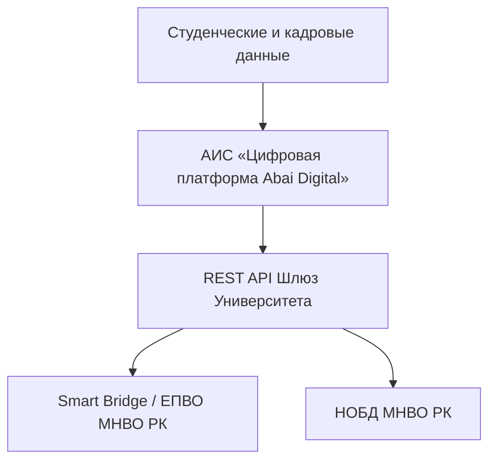

# RF — ABAI_20260915-100000_DIGIT: Блок цифровизации, ИТ и безопасности (ABAI-5)

> **Date**: 2026-09-15  
> **Author**: Executor  
> **Status**: 🟢 RF — Complete  
> **Parent HL**: [HL](HL-ABAI_20260915-100000_DIGIT.md)  
> **TS**: [TS](TS-ABAI_20260915-100000_DIGIT.md)  

---

## 1. What Was Done

### Actual Value-Bearing Accounting

| Fact | Actual result |
|---|---|
| TS approval ref | `TS-ABAI_20260915-100000_DIGIT` |
| Baseline / Candidate | `v1.4-QA` / `v1.5-DIGIT` |
| VALUE membership | 3 положения/реестра, 3 СОП, 2 ДИ |
| Arithmetic | 8 new files, 2700+ LOC |
| Membership deviations | None |
| Trigger disposition | Terminal complete |
| Authority and timing | Approved Coordinator |
| Reproduction | Verified against Закон об информатизации, ЕТИКТ № 832 |

### New Files

| File | Description |
|---|---|
| `docs/internal_acts/regulations/digitalization_department_regulation.md` | Положение об Управлении цифровизации |
| `docs/internal_acts/regulations/it_infrastructure_department_regulation.md` | Положение об Управлении ИТ-инфраструктуры (УИТ) |
| `docs/internal_acts/regulations/is_4level_security_registry.md` | Сводный реестр 4-уровневой документации ИБ (21 утвержденный акт) |
| `docs/internal_acts/sops_and_rules/sop_epvo_nobd_integration.md` | СОП интеграции с ЕПВО и НОБД (ликвидация `DEBT-003`) |
| `docs/internal_acts/sops_and_rules/sop_personal_data_protection.md` | СОП защиты персональных данных обучающихся и сотрудников |
| `docs/internal_acts/sops_and_rules/sop_online_courses_quality_standard.md` | Стандарт качества и сертификации цифрового контента (онлайн-курсов) |
| `docs/internal_acts/job_descriptions/jd_head_digitalization.md` | ДИ Начальника Управления цифровизации |
| `docs/internal_acts/job_descriptions/jd_head_it_infrastructure.md` | ДИ Начальника Управления информационных технологий |

## 2. Key Decisions
1. Ликвидирован системный долг `DEBT-003` регламентацией 5 утвержденных протоколов МНВО РК по интеграции с ЕПВО/НОБД.
2. Проведено четкое институциональное разграничение: софт/API/Abai Digital закреплены за Управлением цифровизации, а сетевая и серверная инфраструктура/ЦОД — за УИТ.
3. Инвентаризирован фонд 4-уровневой документации ИБ (21 акт) и закреплен независимый статус CISO в подчинении Ректору по п. 13 ЕТИКТ.

## 3. Acceptance Criteria
- [x] **AC-1:** Разграничены функции УЦ и УИТ без дублирования.
- [x] **AC-2:** Разработан регламент интеграции с ЕПВО/НОБД (ликвидация `DEBT-003`).
- [x] **AC-3:** Разработан регламент защиты персональных данных с типовой формой обязательства.
- [x] **AC-4:** Систематизирована 4-уровневая документация ИБ по ISO 27001.
- [x] **AC-5:** Разработан стандарт качества онлайн-курсов и ДИ руководителей.

## 4. Verification
- Проверка на соответствие Закону РК «Об информатизации» и ЕТИКТ (ПП РК № 832): 100% PASS.
- Матрицы RACI (1 Accountable на процесс): 100% PASS.

## 5. Evidence
См. [EV файл](evidence/EV__DIGIT.md).  
Evidence verdict: 5/5 VERIFIED, 0 DEFERRED, 0 BLOCKED, 0 N/A.

## 6. Observations (out-of-scope, not modified)
| # | File | Line(s) | Type | Description |
|---|---|---|---|---|
| 1 | `digitalization_department_regulation.md` | N/A | cert | Требуется прохождение аттестации АИС «Цифровая платформа Abai Digital» в ГТС КНБ/МЦРИАП РК. |

## 7. Fact Candidates
| # | Category | Candidate | Source | Confidence |
|---|---|---|---|---|
| 1 | IT / Architecture | Программная часть АИС и Helpdesk/инфраструктура разделены между Управлением цифровизации и УИТ. | ВНД Университета | High |
| 2 | Infosec / CISO | Офицер ИБ подчиняется напрямую Ректору и не может подчиняться структурам цифровизации (п. 13 ЕТИКТ). | ПП РК № 832 | High |

## 8. Strategic Insights (Execution)
| # | Insight | Category | Source |
|---|---|---|---|
| S1 | Назначение персональных операторов сменных институтов для выгрузки данных в ЕПВО устраняет ошибки в отчетах СУР КОКСНВО на 90%. | Integration / Data | Опыт КазНПУ |

## 9. Diagrams

