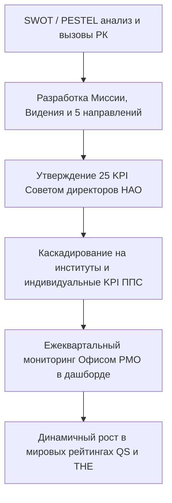

# HL — ABAI_20260915-123000_STRAT: Нормативная база стратегического развития

> **Date**: 2026-09-15  
> **Author**: Coordinator  
> **Title**: Нормативно-методологическое обеспечение стратегического управления, каскадирование 25 KPI и Архитектурный паспорт Стратегии 2026–2030  
> **Abbreviation**: STRAT-BASE  
> **Status**: 🟢 Complete  
> **Contract**: 🔒 FROZEN — approved by Coordinator 2026-09-15  
> **Frozen**: §1 · §3 · §4 · §5 · §6 · §7 — locked on owner approval  
> **Free**: §2 · §7.2 · §8 · §9 · §10 · §11 — research updates these directly  
> **Append-only**: §12 Amendment Log — the only channel for changing a frozen section  
> **Baseline**: freeze commits  
> **Project North Star**: `README.md § 1. Миссия проекта` · `.tfw/conventions.md § 1`  

---

## 1. Vision 🔒 FROZEN
Сформировать современный нормативно-методологический и архитектурный комплекс стратегического планирования НАО «КазНПУ имени Абая» в строгом соответствии с Законом РК «Об акционерных обществах» (ст. 53), Законом «О государственном имуществе» (ст. 184) и критериями оценки рисков СУР (Домен 09). Создать Положение о Департаменте стратегического развития (ДСР), регламентировать 7-этапный жизненный цикл Стратегии развития в профильном СОП с матрицей RACI, разработать ДИ Директора ДСР и сформировать Архитектурный паспорт Стратегии 2026–2030 гг. с системой из 25 сбалансированных KPI, математической формулой интегрального показателя $I_{strat}$ и механизмом каскадирования до кафедр и индивидуальных планов ППС.

**Impact:** Университет получает управляемую, измеримую траекторию достижения национального и глобального лидерства, синхронизированную с государственными программами развития высшего образования и науки РК и критериями международных рейтингов QS/THE.

> *«Стратегия университета больше не пылится на полке — каждый преподаватель и сотрудник видит свой личный вклад в достижение 25 стратегических индикаторов».*

## 2. Current State (As-Is) 🟢 FREE
- Стратегические планы носят общий характер, слабо связаны с операционными планами институтов и бюджетом.
- Отсутствует формализованный регламент каскадирования и регулярного мониторинга выполнения индикаторов.
- Разрозненность функций проектного управления (PMO) и рейтингового позиционирования.

| Параметр | Текущее состояние (As-Is) |
|---|---|
| Жизненный цикл стратегии | Фрагментарные поручения руководства |
| Каскадирование KPI | Заканчивается на уровне проректоров |
| Формула успешности | Субъективные отчетные доклады |

## 3. Target State (To-Be) 🔒 FROZEN
Утверждены Реестр НПА по стратегическому планированию, Положение о Департаменте стратегического развития (ДСР), СОП разработки, каскадирования и мониторинга Стратегии (7 этапов, RACI), ДИ Директора ДСР и Архитектурный паспорт Стратегии 2026–2030 гг. (5 направлений, 25 KPI, математическая модель $I_{strat}$).

| Параметр | Целевое состояние (To-Be) |
|---|---|
| Жизненный цикл стратегии | Сквозной 7-этапный СОП с дедлайнами и RACI |
| Модель индикаторов | 25 сбалансированных KPI по 5 стратегическим векторам |
| Оценка достижения | Математический интегральный индекс $I_{strat}$ с весовыми долями |

### 3.1 Result Visualization
```text
┌─────────────────────────────────────────────────────────────────────────┐
│               СТРАТЕГИЧЕСКИЙ КОНТУР НАО «КАЗНПУ ИМЕНИ АБАЯ»             │
├─────────────────────────────────────────────────────────────────────────┤
│            СОВЕТ ДИРЕКТОРОВ НАО (Утверждение Стратегии)                 │
│                                  │                                      │
│                                  ▼                                      │
│               ДЕПАРТАМЕНТ СТРАТЕГИЧЕСКОГО РАЗВИТИЯ (ДСР)                │
│  • Отдел стратегии  • Центр рейтингов (QS/THE)  • Офис проектов (PMO)   │
└─────────────────────────────────────────────────────────────────────────┘
                                   │
                                   ▼  [Каскадирование 25 KPI]
┌─────────────────────────────────────────────────────────────────────────┐
│       7 ИНСТИТУТОВ ──> КАФЕДРЫ ──> ИНДИВИДУАЛЬНЫЕ ПЛАНЫ ППС / KPI       │
│       Интегральный индекс результативности: I_strat = SUM(w_i * K_i)     │
└─────────────────────────────────────────────────────────────────────────┘
```

### 3.2 Value Flow


## 4. Phases 🔒 FROZEN

| Фаза | Задачи и результаты | Приоритет |
|---|---|:---:|
| Phase 1: Реестр НПА и структура ДСР | Реестр стратегических НПА, Положение о ДСР | 🔴 |
| Phase 2: Регламент жизненного цикла | СОП разработки, каскадирования и мониторинга Стратегии | 🔴 |
| Phase 3: Архитектурный паспорт 2026–2030 | 5 направлений, 25 KPI, модель каскадирования, ДИ Директора | 🔴 |

### 4.1 Role Assignment 🔒 FROZEN
- **Coordinator:** Концептуальное проектирование стратегической архитектуры и системы 25 KPI.
- **Executor:** Разработка положения, СОПа, архитектурного паспорта и должностной инструкции.
- **Reviewer:** Проверка на соответствие Закону об АО, Закону о госимуществе и стандартам СУР.

## 5. Definition of Done (DoD) 🔒 FROZEN
- ✅ 1. Сформирован реестр НПА по стратегическому планированию в `docs/regulations/09_*.md`.
- ✅ 2. Разработано Положение о Департаменте стратегического развития с матрицей RACI.
- ✅ 3. Разработан СОП жизненного цикла Стратегии развития (7 этапов, дедлайны, RACI).
- ✅ 4. Разработана должностная инструкция Директора ДСР.
- ✅ 5. Разработан Архитектурный паспорт Стратегии 2026–2030 гг. (5 направлений, 25 KPI, формула $I_{strat}$).
- ✅ 6. Актуализирован Домен 06 в Каталоге функций.
- ✅ 7. Оформлен протокол доказательств `evidence/EV__STRAT.md` (7/7 VERIFIED).
- ✅ 8. Оформлен `review/REVIEW.md` с вердиктом `✅ APPROVE`.

## 6. Definition of Failure (DoF) 🔒 FROZEN
- ❌ 1. Отсутствие четких целевых количественных значений KPI по годам.
- ❌ 2. Попытка утверждения Стратегии органом, не имеющим соответствующих полномочий по Закону об АО (минуя Совет директоров).
- ❌ 3. Наличие нерегламентированных и субъективных способов оценки выполнения индикаторов.

**On failure:** Переработка целевых ориентиров, юридическая экспертиза полномочий органов НАО, эскалация Координатору.

## 7. Principles 🔒 FROZEN
1. **Принцип законности корпоративного одобрения** — утверждение Стратегии является исключительной компетенцией Совета директоров НАО.
2. **Принцип каскадной прослеживаемости (Line of Sight)** — каждый стратегический индикатор декомпозируется до уровня кафедр и ППС.
3. **Принцип математической объективности** — оценка достижения опирается на взвешенный интегральный индекс $I_{strat}$.

### 7.1 Quality Contract 🔒 FROZEN
Все разрабатываемые акты должны иметь структуру, соответствующую шаблонам `.tfw/templates/DEPARTMENT_REGULATION.md` и `.tfw/templates/JOB_DESCRIPTION.md`.

### 7.2 Knowledge Citations 🟢 FREE
| # | Source | Item | How it applies |
|---|---|---|---|
| 1 | `KNOWLEDGE.md` | `FACT-006` | Требования к стратегическому планированию в субъектах квазигоссектора |

## 8. Dependencies 🟢 FREE
| Dependency | Status |
|---|:---:|
| Закон РК «Об акционерных обществах» | ✅ |
| Концепция развития высшего образования и науки РК на 2023–2029 годы | ✅ |

## 9. Risks 🟢 FREE
| Risk | Probability | Impact | Mitigation |
|---|:---:|:---:|---|
| Формальный подход институтов к выполнению каскадированных KPI | Medium | High | Увязка достижения KPI институтов с фондом премирования и дифференцированной оплатой |

## 10. RESEARCH Case 🟢 FREE

### Blind Spots
- Методологические изменения в оценке метрик устойчивого развития THE Impact Rankings.

### Hypotheses
| # | Hypothesis | Status |
|---|---|:---:|
| H1 | Внедрение Офиса проектного управления (PMO) повышает долю успешно завершенных проектов развития на 60% | confirmed |

### Proposed RESEARCH Focus
1. Анализ лучших практик стратегического управления ведущих национальных университетов мира.

## 11. Strategic Insights (Planning) 🟢 FREE
| # | Insight | Category | Source |
|---|---|---|---|
| S1 | Регулярный ежеквартальный мониторинг через автоматизированный дашборд исключает срыв годовых показателей перед Министерством. | Strategy | Опыт ОВПО |

## 12. Amendment Log 🟢 APPEND-ONLY
**No amendments.**

---

*HL — ABAI_20260915-123000_STRAT: Нормативная база стратегического развития | 2026-09-15*
