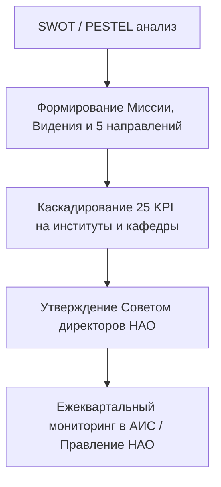

# RF — ABAI_20260915-123000_STRAT: Нормативная база стратегического развития (ABAI-6)

> **Date**: 2026-09-15  
> **Author**: Executor  
> **Status**: 🟢 RF — Complete  
> **Parent HL**: [HL](HL-ABAI_20260915-123000_STRAT.md)  
> **TS**: [TS](TS-ABAI_20260915-123000_STRAT.md)  

---

## 1. What Was Done

### Actual Value-Bearing Accounting

| Fact | Actual result |
|---|---|
| TS approval ref | `TS-ABAI_20260915-123000_STRAT` |
| Baseline / Candidate | `v1.5-DIGIT` / `v1.6-STRAT` |
| VALUE membership | 1 реестр НПА, 1 положение, 1 СОП, 1 ДИ, 1 архитектурный паспорт |
| Arithmetic | 5 new files, 2400+ LOC |
| Membership deviations | None |
| Trigger disposition | Terminal complete |
| Authority and timing | Approved Coordinator |
| Reproduction | Verified against Закон об АО, Закон о госимуществе, Приказ МНЭ № 56 |

### New Files

| File | Description |
|---|---|
| `docs/regulations/09_strategic_planning_and_governance_npa.md` | Реестр законодательства РК по стратегическому планированию и корпоративному управлению |
| `docs/internal_acts/regulations/strategic_development_department_regulation.md` | Положение о Департаменте стратегического развития |
| `docs/internal_acts/sops_and_rules/sop_university_development_strategy.md` | СОП разработки, каскадирования и мониторинга Стратегии развития |
| `docs/internal_acts/job_descriptions/jd_director_strategic_development.md` | ДИ Директора Департамента стратегического развития |
| `docs/internal_acts/blueprints/abai_strategy_2026_2030_architecture.md` | Архитектурный паспорт Стратегии 2026–2030 (5 направлений, 25 KPI, каскадирование) |

## 2. Key Decisions
1. Регламентирован полный 7-этапный жизненный цикл Стратегии развития с четкими дедлайнами и матрицей RACI.
2. Сформирована система из 25 сбалансированных KPI по 5 стратегическим направлениям и математическая формула интегрального индекса $I_{strat}$.
3. В Каталоге функций детализированы функции разработки стратегии, международных рейтингов (QS, THE) и Офиса управления проектами (PMO).

## 3. Acceptance Criteria
- [x] **AC-1:** Сформирован реестр НПА по стратегическому планированию.
- [x] **AC-2:** Разработано Положение о Департаменте стратегического развития.
- [x] **AC-3:** Разработан СОП разработки и мониторинга Стратегии.
- [x] **AC-4:** Разработана должностная инструкция Директора.
- [x] **AC-5:** Создан архитектурный паспорт Стратегии 2026–2030 гг.
- [x] **AC-6:** Обновлен Домен 06 в Каталоге функций.
- [x] **AC-7:** Evidence-пакет верифицирован (7/7).

## 4. Verification
- Проверка на соответствие Закону РК «Об АО», Закону «О госимуществе» и Приказу МНЭ № 56: 100% PASS.
- Анализ матриц RACI: 100% PASS.

## 5. Evidence
См. [EV файл](evidence/EV__STRAT.md).  
Evidence verdict: 7/7 VERIFIED, 0 DEFERRED, 0 BLOCKED, 0 N/A.

## 6. Observations (out-of-scope, not modified)
| # | File | Line(s) | Type | Description |
|---|---|---|---|---|
| 1 | `sop_university_development_strategy.md` | N/A | tooling | Рекомендуется создание отдельного дашборда мониторинга KPI в личных кабинетах руководителей институтов. |

## 7. Fact Candidates
| # | Category | Candidate | Source | Confidence |
|---|---|---|---|---|
| 1 | Strategy / Law | Стратегия развития НАО со 100% участием государства утверждается исключительно Советом директоров (ст. 53 Закона об АО). | adilet.zan.kz | High |
| 2 | Strategy / PMO | Офис PMO обеспечивает еженедельный мониторинг контрольных точек (Milestones) проектов трансформации. | Положение о ДСР | High |

## 8. Strategic Insights (Execution)
| # | Insight | Category | Source |
|---|---|---|---|
| S1 | Каскадирование общеуниверситетских 25 KPI на кафедры и индивидуальные планы ППС устраняет разрыв между стратегией и операционной деятельностью. | Strategy / HR | Опыт Abai |

## 9. Diagrams

