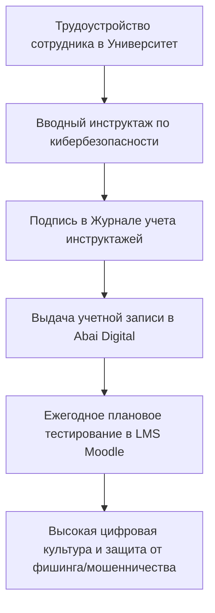

# HL — ABAI_20260915-133000_CYBER_TK: Новеллы Трудового кодекса РК по кибербезопасности

> **Date**: 2026-09-15  
> **Author**: Coordinator  
> **Title**: Имплементация законодательных требований кибербезопасности и кибергигиены персонала в трудовые отношения и охрану труда  
> **Abbreviation**: CYBER-LABOUR  
> **Status**: 🟢 Complete  
> **Contract**: 🔒 FROZEN — approved by Coordinator 2026-09-15  
> **Frozen**: §1 · §3 · §4 · §5 · §6 · §7 — locked on owner approval  
> **Free**: §2 · §7.2 · §8 · §9 · §10 · §11 — research updates these directly  
> **Append-only**: §12 Amendment Log — the only channel for changing a frozen section  
> **Baseline**: freeze commits  
> **Project North Star**: `README.md § 1. Миссия проекта` · `.tfw/conventions.md § 1`  

---

## 1. Vision 🔒 FROZEN
Имплементировать комплексные новеллы Трудового кодекса Республики Казахстан в сфере информационной безопасности, защиты данных и противодействия мошенничеству в систему регулирования трудовых отношений НАО «КазНПУ имени Абая». Законодательно приравнять соблюдение правил кибербезопасности на рабочем месте к обязательным требованиям безопасности и охраны труда (БиОТ — ст. 181, 182 ТК РК), регламентировать взаимную ответственность сторон (обязательное регулярное обучение персонала работодателем по ст. 23 ТК РК и персональная дисциплинарная/материальная ответственность работника по ст. 22, 52, 120, 123 ТК РК), внедрить типовую форму Журнала учета инструктажей и закрепить обязанности по кибергигиене в модельных должностных инструкциях преподавателей и ученых.

**Impact:** Университет получает надежную юридическую и процедурную защиту от утечек персональных данных, социальной инженерии, фишинга и компрометации систем, основанную на строгой трудовой дисциплине и обязательном обучении каждого сотрудника.

> *«Кибербезопасность на рабочем месте стала таким же безусловным элементом охраны труда, как пожарная безопасность и техника безопасности».*

## 2. Current State (As-Is) 🟢 FREE
- Кибербезопасность воспринимается персоналом как исключительно задача IT-отдела, а не персональная обязанность каждого работника.
- Отсутствие обязательного вводного инструктажа по кибербезопасности при трудоустройстве и журнала учета инструктажей.
- Должностные инструкции преподавателей и ученых не содержат конкретных обязательств по защите паролей, ЭЦП и данных обучающихся.

| Параметр | Текущее состояние (As-Is) |
|---|---|
| Инструктажи по ИБ | Нерегулярные информационные рассылки |
| Обязанности в ДИ | Общие фразы без ссылки на статьи ТК РК |
| Ответственность | Сложности с привлечением к дисциплинарной ответственности за утечки |

## 3. Target State (To-Be) 🔒 FROZEN
Разработан и утвержден Регламент обязательного обучения, инструктажа по кибербезопасности и соблюдения требований ИБ работниками (СОП), утверждена типовая форма Журнала учета инструктажей, актуализированы реестры НПА, в ДИ преподавателей и ученых включены пункты по кибергигиене и защите данных, в Домен 10 Каталога функций включена функция `FUNC-HR-CYBER-005`.

| Параметр | Целевое состояние (To-Be) |
|---|---|
| Обязательное обучение | Вводный инструктаж при приеме, ежегодный тест в LMS, фишинг-симуляции |
| Статус кибербезопасности | Официально интегрирован в систему охраны труда (БиОТ) по ст. 181, 182 ТК РК |
| Должностные инструкции | Закреплен запрет передачи паролей/ЭЦП и увольнение по ст. 52 ТК за нарушения |

### 3.1 Result Visualization
```text
┌─────────────────────────────────────────────────────────────────────────┐
│     ТРУДОВЫЕ ОТНОШЕНИЯ И КИБЕРБЕЗОПАСНОСТЬ (ТРУДОВОЙ КОДЕКС РК)         │
├──────────────────────────────────┬──────────────────────────────────────┤
│      ОБЯЗАННОСТИ РАБОТОДАТЕЛЯ    │         ОБЯЗАННОСТИ РАБОТНИКА        │
│          (ст. 23 ТК РК)          │             (ст. 22 ТК РК)           │
│ • Защищенное рабочее место и ПО  │ • Соблюдение правил кибергигиены     │
│ • Обязательный вводный инструктаж│ • Запрет передачи логинов, паролей,  │
│ • Ежегодное обучение и тесты LMS │   ключей ЭЦП третьим лицам           │
│ • Ведение Журнала инструктажей   │ • Доклад об инцидентах за 15 минут   │
└──────────────────────────────────┴──────────────────────────────────────┘
                                     │
                                     ▼
┌─────────────────────────────────────────────────────────────────────────┐
│  СОП КИБЕРБЕЗОПАСНОСТИ ПЕРСОНАЛА · ЖУРНАЛ УЧЕТА · ДИ ППС И УЧЕНЫХ       │
└─────────────────────────────────────────────────────────────────────────┘
```

### 3.2 Value Flow


## 4. Phases 🔒 FROZEN

| Фаза | Задачи и результаты | Приоритет |
|---|---|:---:|
| Phase 1: Анализ законодательства | Актуализация реестров внешних и кадровых НПА по ТК РК | 🔴 |
| Phase 2: Разработка СОП | Регламент обучения, инструктажей по кибербезопасности, форма журнала | 🔴 |
| Phase 3: Модельные ДИ и каталог | Включение обязанностей по ИБ в ДИ ППС, ученых и Каталог Домена 10 | 🔴 |

### 4.1 Role Assignment 🔒 FROZEN
- **Coordinator:** Концептуальная интеграция трудового права и требований кибербезопасности.
- **Executor:** Разработка СОП, актуализация модельных должностных инструкций и реестров.
- **Reviewer:** Проверка на соответствие Трудовому кодексу РК и стандартам ИБ (ISO 27001).

## 5. Definition of Done (DoD) 🔒 FROZEN
- ✅ 1. Новеллы ТК РК внесены в `external_npa_registry.md` и `03_hr_and_faculty_npa.md`.
- ✅ 2. Разработан СОП `sop_employee_cybersecurity_and_labor_safety.md` с формой Журнала учета инструктажей и матрицей RACI.
- ✅ 3. В модельные ДИ ППС (`jd_faculty_model.md`) и ученых (`jd_researcher_model.md`) включены требования по кибергигиене.
- ✅ 4. В Домен 10 добавлена функция `FUNC-HR-CYBER-005`.
- ✅ 5. Оформлен протокол доказательств `evidence/EV__CYBER_TK.md` (5/5 VERIFIED).
- ✅ 6. Оформлен `review/REVIEW.md` с вердиктом `✅ APPROVE`.
- ✅ 7. Перекомпилирован мастер-том `Abai_University_Master_Transformation_Folio.pdf` (3.50 МБ).

## 6. Definition of Failure (DoF) 🔒 FROZEN
- ❌ 1. Отсутствие юридической привязки процедур обучения к нормам охраны труда (БиОТ) ТК РК.
- ❌ 2. Отсутствие типовой формы фиксации прохождения инструктажа работниками.
- ❌ 3. Наличие плейсхолдеров или неконкретных требований по защите учетных данных.

**On failure:** Доработка регламента, юридическая экспертиза кадровой службы, эскалация Координатору.

## 7. Principles 🔒 FROZEN
1. **Принцип приравнивания к охране труда** — знание кибергигиены обязательно для допуска к трудовым обязанностям так же, как правила техники безопасности.
2. **Принцип разделенной ответственности** — работодатель гарантирует обучение и защиту, работник отвечает за бдительность и конфиденциальность.
3. **Принцип пресекательного реагирования** — о любом подозрительном событии или фишинге работник обязан доложить в течение 15 минут.

### 7.1 Quality Contract 🔒 FROZEN
Все разрабатываемые акты должны иметь структуру, соответствующую шаблонам `.tfw/templates/` и нормам трудового законодательства РК.

### 7.2 Knowledge Citations 🟢 FREE
| # | Source | Item | How it applies |
|---|---|---|---|
| 1 | `KNOWLEDGE.md` | `FACT-007` | Требования к кадровому делопроизводству и трудовым договорам |
| 2 | `KNOWLEDGE.md` | `FACT-005` | Требования ЕТИКТ по защите учетных записей пользователей |

## 8. Dependencies 🟢 FREE
| Dependency | Status |
|---|:---:|
| Трудовой кодекс Республики Казахстан | ✅ |
| ЕТИКТ (Постановление Правительства РК № 832) | ✅ |

## 9. Risks 🟢 FREE
| Risk | Probability | Impact | Mitigation |
|---|:---:|:---:|---|
| Небрежное отношение сотрудников к паролям и ключам ЭЦП | High | High | Закрепление персональной материальной ответственности и проведение регулярных учебных фишинг-симуляций |

## 10. RESEARCH Case 🟢 FREE

### Blind Spots
- Судебная практика РК по расторжению трудовых договоров по ст. 52 ТК РК за нарушения правил кибербезопасности.

### Hypotheses
| # | Hypothesis | Status |
|---|---|:---:|
| H1 | Внедрение журнала инструктажей защищает Университет от претензий трудовой инспекции при наложении взысканий за утечки | confirmed |

### Proposed RESEARCH Focus
1. Исследование новелл законодательства РК по защите от телефонного и сетевого мошенничества.

## 11. Strategic Insights (Planning) 🟢 FREE
| # | Insight | Category | Source |
|---|---|---|---|
| S1 | Включение вопросов кибергигиены в кадровый контур переводит защиту данных из чисто технической плоскости в плоскость персональной служебной ответственности. | HR / Security | Опыт РК |

## 12. Amendment Log 🟢 APPEND-ONLY
**No amendments.**

---

*HL — ABAI_20260915-133000_CYBER_TK: Новеллы Трудового кодекса РК по кибербезопасности | 2026-09-15*
