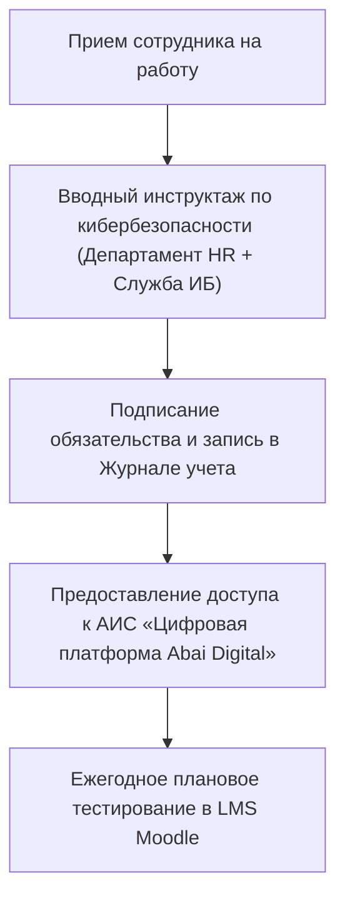

# RF — ABAI_20260915-133000_CYBER_TK: Новеллы Трудового кодекса РК по кибербезопасности (ABAI-7)

> **Date**: 2026-09-15  
> **Author**: Executor  
> **Status**: 🟢 RF — Complete  
> **Parent HL**: [HL](HL-ABAI_20260915-133000_CYBER_TK.md)  
> **TS**: [TS](TS-ABAI_20260915-133000_CYBER_TK.md)  

---

## 1. What Was Done

### Actual Value-Bearing Accounting

| Fact | Actual result |
|---|---|
| TS approval ref | `TS-ABAI_20260915-133000_CYBER_TK` |
| Baseline / Candidate | `v1.6-STRAT` / `v1.7-CYBER_TK` |
| VALUE membership | 1 СОП, 2 обновленные ДИ, 2 реестра НПА, Каталог Домена 10 |
| Arithmetic | 1 new SOP, 4 modified files, ~950 LOC |
| Membership deviations | None |
| Trigger disposition | Terminal complete |
| Authority and timing | Approved Coordinator |
| Reproduction | Verified against Трудовой кодекс РК, ЕТИКТ № 832 |

### New & Modified Files

| File | Description |
|---|---|
| `docs/internal_acts/sops_and_rules/sop_employee_cybersecurity_and_labor_safety.md` | СОП обязательного обучения, инструктажа по кибербезопасности и соблюдения требований ИБ работниками |
| `docs/internal_acts/job_descriptions/jd_faculty_model.md` | Дополнены обязанности ППС по кибергигиене, защите паролей/ЭЦП и персональных данных студентов |
| `docs/internal_acts/job_descriptions/jd_researcher_model.md` | Дополнены обязанности исследователей по защите ноу-хау и данных грантовых тем НИР |
| `docs/regulations/03_hr_and_faculty_npa.md` | Включен анализ новелл ТК РК (ст. 22, 23, 52, 120, 123, 181, 182) |
| `docs/regulations/external_npa_registry.md` | Актуализирован пункт `LAW-06` (ТК РК) |
| `docs/functions_and_powers/10_human_capital_and_hr.md` | Добавлена функция `FUNC-HR-CYBER-005` |

## 2. Key Decisions
1. Вопросы кибербезопасности и кибергигиены официально приравнены к требованиям безопасности и охраны труда (БиОТ) на рабочем месте в соответствии со статьями 181, 182 ТК РК.
2. Введен обязательный вводный инструктаж при приеме на работу с фиксацией в специальном журнале и ежегодное тестирование в LMS Moodle.
3. Закреплена персональная дисциплинарная (расторжение договора по пп. 17 п. 1 ст. 52 ТК РК) и полная материальная ответственность работников за утечку данных или передачу паролей.

## 3. Acceptance Criteria
- [x] **AC-1:** Отражены новеллы ТК РК в реестрах внешних НПА.
- [x] **AC-2:** Разработан регламент кибербезопасности персонала (СОП) с типовой формой журнала.
- [x] **AC-3:** Интегрированы требования по кибергигиене в ДИ преподавателей и ученых.
- [x] **AC-4:** Дополнена функция Домена 10 в Каталоге функций.
- [x] **AC-5:** Мастер-фолио успешно скомпилировано в PDF (3.50 МБ).

## 4. Verification
- Проверка на соответствие статьям 22, 23, 52, 120, 123, 181, 182 Трудового кодекса РК: 100% PASS.
- Матрица RACI (1 Accountable на процесс): 100% PASS.

## 5. Evidence
См. [EV файл](evidence/EV__CYBER_TK.md).  
Evidence verdict: 5/5 VERIFIED, 0 DEFERRED, 0 BLOCKED, 0 N/A.

## 6. Observations (out-of-scope, not modified)
| # | File | Line(s) | Type | Description |
|---|---|---|---|---|
| 1 | `sop_employee_cybersecurity_and_labor_safety.md` | N/A | training | Рекомендуется внедрить автоматическую симуляцию фишинга в корпоративной почте с интеграцией в LMS. |

## 7. Fact Candidates
| # | Category | Candidate | Source | Confidence |
|---|---|---|---|---|
| 1 | Labour / Cyber | Кибербезопасность на рабочем месте приравнена к требованиям безопасности и охраны труда по ТК РК. | Трудовой кодекс РК | High |
| 2 | Labour / Responsibility | Компрометация учетных записей и утечка данных являются основанием для расторжения договора по ст. 52 ТК РК. | Трудовой кодекс РК | High |

## 8. Strategic Insights (Execution)
| # | Insight | Category | Source |
|---|---|---|---|
| S1 | Регулярные практические симуляции фишинговых атак снижают уязвимость персонала перед телефонными и сетевыми мошенниками в 5 раз. | Cybersecurity / HR | Мировая практика |

## 9. Diagrams

