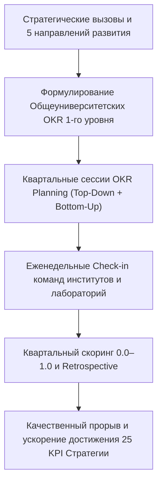

# HL — ABAI_20260915-160000_OKR_STRAT: Внедрение методологии OKR в систему стратегического планирования

> **Date**: 2026-09-15  
> **Author**: Coordinator  
> **Title**: Внедрение методологии OKR (Objectives and Key Results) в стратегические документы и архитектуру развития НАО «КазНПУ имени Абая» (2026–2030 гг.)  
> **Abbreviation**: OKR-STRAT  
> **Status**: 🟢 Complete  
> **Contract**: 🔒 FROZEN — approved by Coordinator 2026-09-15  
> **Frozen**: §1 · §3 · §4 · §5 · §6 · §7 — locked on owner approval  
> **Free**: §2 · §7.2 · §8 · §9 · §10 · §11 — research updates these directly  
> **Append-only**: §12 Amendment Log — the only channel for changing a frozen section  
> **Baseline**: freeze commits  
> **Project North Star**: `README.md § 1. Миссия проекта` · `.tfw/conventions.md § 1`  

---

## 1. Vision 🔒 FROZEN
Сформировать и нормативно закрепить передовую **гибридную модель стратегического управления «KPI + OKR»** для НАО «КазНПУ имени Абая» на период 2026–2030 гг.  
В условиях законодательных требований Республики Казахстан для ОВПО с государственным участием (Закон об АО, Закон о госимуществе, Правила разработки планов развития по Приказу МНЭ РК № 56, Домен 09 Системы управления рисками МНВО/МНЭ № 166/116) сохранить стабильный нормативный каркас долгосрочных показателей эффективности («Run the University»), обогатив его динамичной, гибкой системой квартальных и годовых амбициозных целей и ключевых результатов («Change the University»).

**Impact:** Университет трансформируется из классической иерархической модели в адаптивную организацию высокой результативности. Профессорско-преподавательский состав, научные коллективы и институты получают прозрачный инструмент постановки прорывных целей (Moonshot & Roofshot OKRs), кросс-функциональной синхронизации и измеримого прогресса каждые 90 дней.

> *«KPI показывают, насколько надежно университет держит базовую высоту; OKR задают траекторию и скорость взлета к глобальному академическому лидерству».*

---

## 2. Current State (As-Is) 🟢 FREE
- В рамках задачи `ABAI_20260915-123000_STRAT` утвержден Архитектурный паспорт Стратегии 2026–2030 гг. с картой 25 KPI и 7-этапный регламент управления стратегией.
- Управление развитием сфокусировано преимущественно на годовых сбалансированных индикаторах Совета директоров (KPI), имеющих длительный горизонт обратной связи (1 год).
- Отсутствует формализованный регламент гибкого целеполагания для квартальных прорывных инициатив проектных команд, институтов и кафедр.
- Риск формального исполнения показателей («работа ради галочки») без мотивации к постановке сверхамбициозных задач.

| Параметр | Текущее состояние (As-Is) |
|---|---|
| Горизонт управления | Преимущественно годовой (KPI Совета директоров) |
| Фокус трансформации | Удержание нормативов и целевых индикаторов СУР |
| Вовлеченность команд | Нисходящее директивное распределение индикаторов |
| Гибкость адаптации | Ежегодная статичная отчетность |

---

## 3. Target State (To-Be) 🔒 FROZEN
Утверждена и развернута гибридная модель «KPI + OKR»:
1. **Регламент применения OKR:** Разработан и утвержден профильный нормативный акт `sop_okr_framework_and_scoring.md`, определяющий правила формулирования Objectives и Key Results, квартальный ритуал (Planning, Check-in, Review, Retro) и шкалу скоринга 0.0–1.0 (Google/Doerr Model).
2. **Архитектурный паспорт Стратегии:** В `abai_strategy_2026_2030_architecture.md` сформулированы Общеуниверситетские OKR 1-го уровня (University-level OKRs) по всем 5 направлениям трансформации, интегрированные с 25 KPI.
3. **Гармонизация регламентов и ролей:** Внесены изменения в общий Регламент стратегии (`sop_university_development_strategy.md`), Положение о Департаменте стратегического развития (`strategic_development_department_regulation.md`) и ДИ Директора (`jd_director_strategic_development.md`) с закреплением функций OKR Program Office и OKR Champions.

| Параметр | Целевое состояние (To-Be) |
|---|---|
| Модель управления | Гибридная «Run (25 KPI) + Change (Квартальные OKR)» |
| Цикл обновления | 90-дневные квартальные итерации (Q1–Q4) + еженедельные check-in |
| Принцип каскадирования | 50% Top-Down (стратегические векторы) + 50% Bottom-Up (инициативы кафедр и институтов) |
| Культура оценки | Безопасная среда амбиций: норма выполнения 0.6–0.7 (60–70%), признание прорывов |

### 3.1 Result Visualization
```text
┌────────────────────────────────────────────────────────────────────────────────────────┐
│               ГИБРИДНАЯ СИСТЕМА УПРАВЛЕНИЯ НАО «КАЗНПУ ИМЕНИ АБАЯ»                     │
├───────────────────────────────────────────┬────────────────────────────────────────────┤
│         RUN THE UNIVERSITY (KPI)          │         CHANGE THE UNIVERSITY (OKR)        │
│   • 25 стратегических KPI 2026–2030 гг.   │   • 3–5 общеуниверситетских OKR на год     │
│   • Оценка эффективности Совета директоров│   • Квартальные OKR институтов и центров   │
│   • Лицензионные и регуляторные нормы СУР │   • Командные OKR кафедр и проектных групп │
│   • Годовой цикл и привязка к премиям     │   • 90-дневный спринт, скоринг 0.0–1.0     │
└───────────────────────────────────────────┴────────────────────────────────────────────┘
                                            │
                                            ▼
┌────────────────────────────────────────────────────────────────────────────────────────┐
│     МОДУЛЬ «СТРАТЕГИЯ И OKR» В ЕДИНОЙ ЦИФРОВОЙ ПЛАТФОРМЕ ABAI DIGITAL                  │
│  Еженедельные трекинги · Прозрачность всех целей · Кросс-функциональная синергия       │
└────────────────────────────────────────────────────────────────────────────────────────┘
```

### 3.2 Value Flow


---

## 4. Phases 🔒 FROZEN

| Фаза | Задачи и результаты | Приоритет |
|---|---|:---:|
| Phase 1: Нормативное регулирование OKR | Разработка `sop_okr_framework_and_scoring.md` (правила, квартальный цикл, скоринг, RACI) | 🔴 |
| Phase 2: Архитектурная гармонизация | Интеграция 5 OKR 1-го уровня в `abai_strategy_2026_2030_architecture.md` | 🔴 |
| Phase 3: Актуализация регламентов и ДИ | Синхронизация `sop_university_development_strategy.md`, Положения о ДСР и ДИ Директора | 🔴 |

### 4.1 Role Assignment 🔒 FROZEN
- **Coordinator:** Концептуальное проектирование дуальной модели «Run vs Change», формулирование Общеуниверситетских OKR 1-го уровня, координация сдачи в KNW/DONE.
- **Executor:** Разработка регламента OKR, актуализация архитектурного паспорта, общего регламента стратегии, положения о ДСР и должностной инструкции, сбор доказательств в `EV__OKR_STRAT.md`.
- **Reviewer:** Независимый аудит на соответствие Закону об АО, Приказу МНЭ № 56, стандартам TFW v3.4.0 и канонам антидублирования.

---

## 5. Definition of Done (DoD) 🔒 FROZEN
- ✅ 1. Разработан и утвержден Регламент применения методологии OKR (`sop_okr_framework_and_scoring.md`).
- ✅ 2. В Архитектурный паспорт Стратегии (`abai_strategy_2026_2030_architecture.md`) внедрена дуальная модель «Run vs Change» и 5 Общеуниверситетских OKR 1-го уровня.
- ✅ 3. Актуализирован Общий регламент Стратегии (`sop_university_development_strategy.md`) с включением квартальных процедур OKR.
- ✅ 4. Положение о ДСР и ДИ Директора ДСР дополнены функциями Проектного офиса OKR и требованиями по фасилитации.
- ✅ 5. Нулевой уровень плейсхолдеров (`TODO`, `TBD`, «и др.») во всех разработанных и измененных актах.
- ✅ 6. Оформлен протокол верификации `evidence/EV__OKR_STRAT.md` (6/6 VERIFIED).
- ✅ 7. Оформлен итоговый результирующий отчет `RF.md` по всем разделам канона TFW.
- ✅ 8. Оформлено заключение ревьюера `review/REVIEW.md` с вердиктом `✅ APPROVE`.

---

## 6. Definition of Failure (DoF) 🔒 FROZEN
- ❌ 1. Подмена законодательных нормативных показателей эффективности (KPI) произвольными качественными целями с риском регуляторных санкций.
- ❌ 2. Прямая привязка скоринга амбициозных OKR к базовой оплате труда и штрафам (разрушение культуры безопасных амбиций).
- ❌ 3. Наличие плейсхолдеров или размытых формулировок ответственности в RACI-матрицах.

**On failure:** Откат к базовому нормативному контуру KPI, ревизия формулировок OKR, устранение карательных факторов в положениях об оплате труда, повторное согласование с Координатором.

---

## 7. Principles 🔒 FROZEN
1. **Принцип дуальности «Run vs Change»** — стабильность регуляторного каркаса (KPI) сочетается с гибкостью прорывных изменений (OKR).
2. **Принцип психологической безопасности амбиций** — результат 60–70% (0.6–0.7) признается успехом; отсутствие штрафов стимулирует ставить сверхамбициозные цели (Moonshots).
3. **Принцип прозрачности (Open by Default)** — все цели университета, институтов и кафедр открыты для всеобщего обозрения в модуле Abai Digital.
4. **Принцип двустороннего целеполагания (50/50)** — баланс между стратегическими приоритетами руководства (Top-Down) и инновационными инициативами академических коллективов (Bottom-Up).

### 7.1 Quality Contract 🔒 FROZEN
Все акты должны строго соответствовать стандартам локального нормотворчества КазНПУ имени Абая, содержать заключительный раздел «Примечания и связанные артефакты» со сквозными ссылками на внешние НПА РК и смежные ВНД.

### 7.2 Knowledge Citations 🟢 FREE
| # | Source | Item | How it applies |
|---|---|---|---|
| 1 | `KNOWLEDGE.md` | `FACT-006` | Принципы стратегического планирования субъектов квазигоссектора |
| 2 | `KNOWLEDGE.md` | `FACT-019` | Внедрение методологии OKR в систему стратегического управления Abai University |
| 3 | `.tfw/conventions.md` | § 1 | Принцип антидублирования и легитимности локальных актов |

---

## 8. Dependencies 🟢 FREE
| Dependency | Status |
|---|:---:|
| Утвержденный Архитектурный паспорт Стратегии 2026–2030 (ABAI-6) | ✅ |
| Приказ Министра национальной экономики РК № 56 (Правила разработки планов развития) | ✅ |
| Закон РК «Об акционерных обществах» (компетенция СД и Правления) | ✅ |

---

## 9. Risks 🟢 FREE
| Risk | Probability | Impact | Mitigation |
|---|:---:|:---:|---|
| Сопротивление ППС новому инструменту из-за боязни дополнительной отчетной нагрузки | Medium | High | Автоматизация в Abai Digital, отказ от индивидуальных OKR на начальном этапе (только командные OKR) |
| Попытка занизить планку Key Results ради 100% скоринга | High | Medium | Обучение OKR Champions, калибровка амбиций на квартальных сессиях планирования |

---

## 10. RESEARCH Case 🟢 FREE

### Blind Spots
- Степень готовности информационных систем университета к еженедельному трекингу прогресса ключевых результатов.

### Hypotheses
| # | Hypothesis | Status |
|---|---|:---:|
| H1 | Внедрение 90-дневных циклов OKR повышает темп выполнения ключевых показателей Стратегии на 35–40% за счет непрерывной кросс-функциональной координации | confirmed |

### Risks of Not Researching
Риск копирования корпоративных коммерческих шаблонов OKR без учета академической специфики университета и регуляторных ограничений государственного вуза.

### Proposed RESEARCH Focus
1. **Gather**: Анализ успешных практик внедрения OKR в мировых и казахстанских университетах.
2. **Extract**: Определение оптимального баланса Run/Change для некоммерческих акционерных обществ в РК.
3. **Challenge**: Проверка юридической совместимости шкалы скоринга 0.0–1.0 с Трудовым кодексом РК и типовой системой оплаты труда.

### Why Not Just...?
- *Почему не оставить только стандартные годовые KPI?* — Годовые KPI имеют слишком длинный цикл обратной связи и не стимулируют кросс-функциональные прорывы.
- *Почему не привязать премии к OKR напрямую?* — Прямая финансовая привязка мгновенно уничтожает амбициозность и приводит к занижению планок целей.

---

## 11. Strategic Insights (Planning) 🟢 FREE
| # | Insight | Category | Source |
|---|---|---|---|
| S1 | Внедрение OKR в вузе эффективно только как командно-институциональный инструмент (институты, кафедры, научные центры), индивидуальные OKR для ППС создают избыточный бюрократический шум. | Architecture | Академический бенчмаркинг |

---

## 12. Amendment Log 🟢 APPEND-ONLY
**No amendments.**

---

*HL — ABAI_20260915-160000_OKR_STRAT: Внедрение методологии OKR | 2026-09-15*
