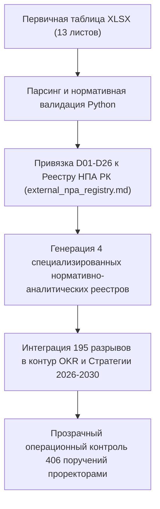

# HL — ABAI_20260915-163000_KPI_SYSTEMATIZATION: Систематизация фонда KPI МНВО РК и Программы развития Abai University

> **Date**: 2026-09-15  
> **Author**: Coordinator  
> **Title**: Комплексная систематизация внешних требований госорганов РК (239 показателей), фонда KPI Программы развития (65 показателей), гэп-анализа (195 разрывов) и бэклога поручений 2026 г. (406 задач)  
> **Abbreviation**: KPI_SYSTEMATIZATION  
> **Status**: 🟢 Complete  
> **Contract**: 🔒 FROZEN — approved by Coordinator 2026-09-15  
> **Frozen**: §1 · §3 · §4 · §5 · §6 · §7 — locked on owner approval  
> **Free**: §2 · §7.2 · §8 · §9 · §10 · §11 — research updates these directly  
> **Append-only**: §12 Amendment Log — the only channel for changing a frozen section  
> **Baseline**: freeze commits  
> **Project North Star**: `README.md § 1. Миссия проекта` · `.tfw/conventions.md § 1`  

---

## 1. Vision 🔒 FROZEN
Создать структурированный, верифицированный и пригодный для машинной аналитики фонд показателей результативности НАО «КазНПУ имени Абая» на основе комплексного датасета требований Министерства науки и высшего образования (МНВО РК), Правительства РК и внутренних программных документов университета.  
Осуществить перевод разрозненных табличных данных в стройную нормативно-методологическую систему: связать 239 внешних требований госорганов (D01–D26) со Сводным реестром НПА РК (`external_npa_registry.md`), сопоставить с 65 KPI действующей Программы развития, ликвидировать «слепые зоны» (195 непокрытых требований) через интеграцию в архитектурный контур Стратегии 2026–2030 (25 KPI) и квартальные OKR, структурировать 406 операционных поручений на 2026 год по курирующим проректорам.

**Impact:** Университет получает прозрачную сквозную прослеживаемость каждого государственного индикатора (от национального уровня МНВО до конкретного института, кафедры и ответственного лица) с ранним предупреждением лицензионных и аккредитационных рисков.

> *«Каждое министерское требование и государственный индикатор оцифрованы, привязаны к конкретному закону РК и закреплены за ответственным лидером университета».*

---

## 2. Current State (As-Is) 🟢 FREE
- В наличии масштабный массив данных в формате Google Sheets / XLSX (13 листов, 400 КБ), содержащий богатый фактаж, но требующий нормативной очистки, рубрикации и гармонизации с разработанной архитектурой TFW.
- 195 требований госорганов квалифицированы как «не имеющие подтвержденной связи» с Программой развития вуза.
- 146 мероприятий Плана не имеют привязки к бюджетам и финансовым источникам.
- Отсутствует структурированная разбивка 406 поручений на 2026 год по функциональным блокам проектного управления.

| Параметр | Текущее состояние (As-Is) |
|---|---|
| Формат данных | Табличный XLSX-массив (13 листов) |
| Связь с внешними НПА | Текстовые наименования актов без правовой кодировки и ссылок на ИПС «Әділет» |
| Регуляторные разрывы | 195 непокрытых требований без плана устранения |
| Операционный контроль | 406 поручений в плоском списке без проектной группировки |

---

## 3. Target State (To-Be) 🔒 FROZEN
Сформирован модуль `docs/kpi_and_metrics/`:
1. **Эталонный датасет:** исходный файл зафиксирован в репозитории как `kpi_reestr_abai_and_ministry.xlsx`.
2. **Сводный реестр требований госорганов (`01_government_requirements_registry.md`):** систематизация 239 требований по 8 направлениям с привязкой к 26 первоисточникам МНВО/Правительства (D01–D26) и статьям НПА РК.
3. **Реестр KPI Программы развития (`02_university_development_program_kpi.md`):** систематизация 65 KPI с планами до 2029 г. и маппингом на 25 KPI Стратегии 2026–2030 и OKR.
4. **Дорожная карта устранения разрывов (`03_regulatory_gaps_roadmap.md`):** кластеризация 195 «серых зон» (квалтребования, инклюзия, ИИ) и план их интеграции в командные OKR.
5. **Матрица поручений и контроля 2026 г. (`04_action_plan_and_assignments_2026.md`):** структурированный операционный бэклог 406 задач по проректорам с контрольными точками.

| Параметр | Целевое состояние (To-Be) |
|---|---|
| Формат данных | Структурированные Markdown-модули и зафиксированный мастер-файл |
| Нормативная связка | Сквозная привязка D01–D26 к статьям законов и кодам `external_npa_registry.md` |
| Покрытие разрывов | Дорожная карта интеграции 195 гэпов в Стратегию и контур OKR |
| Операционный контроль | Распределение 406 поручений по 5 блокам проректоров с дедлайнами |

### 3.1 Result Visualization
```text
┌────────────────────────────────────────────────────────────────────────────────────────┐
│             СИСТЕМАТИЗИРОВАННЫЙ ФОНД KPI И ТРЕБОВАНИЙ (docs/kpi_and_metrics/)          │
├────────────────────────────────────────────────────────────────────────────────────────┤
│  МАСТЕР-ФАЙЛ: kpi_reestr_abai_and_ministry.xlsx (13 листов, 400 КБ)                     │
│                                           │                                            │
│   ┌───────────────────┬───────────────────┼───────────────────┬───────────────────┐    │
│   ▼                   ▼                   ▼                   ▼                   ▼    │
│ [01_РЕЕСТР МНВО]     [02_KPI ПРОГРАММЫ]  [03_ГЭП-КАРТА]      [04_ПОРУЧЕНИЯ 2026] [README]│
│ 239 требований       65 целевых KPI      195 разрывов        406 поручений       Свод  │
│ 26 актов (D01-D26)   Планы 2023-2029     Квалтребования, ИИ  5 проректоров       карты │
└───────────────────────────────────────────────────┬────────────────────────────────────┘
                                                    ▼
┌────────────────────────────────────────────────────────────────────────────────────────┐
│             СКВОЗНАЯ ТРАССИРУЕМОСТЬ: НПА РК ──> СТРАТЕГИЯ 2026-2030 ──> OKR             │
└────────────────────────────────────────────────────────────────────────────────────────┘
```

### 3.2 Value Flow


---

## 4. Phases 🔒 FROZEN

| Фаза | Задачи и результаты | Приоритет |
|---|---|:---:|
| Phase 1: Выгрузка и нормативная очистка | Фиксация XLSX, парсинг 13 листов, разработка скрипта генерации | 🔴 |
| Phase 2: Документирование регистров | Формирование `01_gov`, `02_prog`, `03_gaps`, `04_actions` и `README.md` | 🔴 |
| Phase 3: Сквозная нормативная связка | Интеграция Раздела 7 в `external_npa_registry.md` и связка с D01–D26 | 🔴 |

### 4.1 Role Assignment 🔒 FROZEN
- **Coordinator:** Определение методологии нормативного сопряжения, декомпозиция разрывов, согласование архитектуры фондов данных.
- **Executor:** Разработка скрипта автоматизированной генерации реестров, связка с кодами НПА РК, формирование артефакта доказательств `EV__KPI_SYSTEMATIZATION.md`.
- **Reviewer:** Проверка полноты переноса данных (239, 65, 195, 406 записей), аудит отсутствия плейсхолдеров, верификация ссылок.

---

## 5. Definition of Done (DoD) 🔒 FROZEN
- ✅ 1. Первичный файл зафиксирован в `docs/kpi_and_metrics/kpi_reestr_abai_and_ministry.xlsx`.
- ✅ 2. Сформирован реестр требований госорганов `01_government_requirements_registry.md` (239 записей).
- ✅ 3. Все 26 источников (D01–D26) связаны со статьями законов РК и Сводным реестром НПА.
- ✅ 4. Сформирован реестр `02_university_development_program_kpi.md` (65 показателей).
- ✅ 5. Сформирована дорожная карта `03_regulatory_gaps_roadmap.md` (195 разрывов).
- ✅ 6. Сформирован бэклог поручений `04_action_plan_and_assignments_2026.md` (406 задач).
- ✅ 7. Разработан обзорный паспорт `docs/kpi_and_metrics/README.md`.
- ✅ 8. Оформлен протокол доказательств `evidence/EV__KPI_SYSTEMATIZATION.md` (6/6 VERIFIED).
- ✅ 9. Оформлен итоговый результирующий отчет `RF.md` по всем разделам канона TFW.
- ✅ 10. Оформлено заключение ревьюера `review/REVIEW.md` с вердиктом `✅ APPROVE`.

---

## 6. Definition of Failure (DoF) 🔒 FROZEN
- ❌ 1. Потеря или искажение численных значений индикаторов при конвертации из Excel.
- ❌ 2. Отсутствие нормативно-правового обоснования для первоисточников D01–D26.
- ❌ 3. Наличие битых относительных ссылок между реестрами и артефактами задачи.

**On failure:** Повторный прогон генерационного скрипта, сверка контрольных сумм записей, ручная верификация ссылочной целостности.

---

## 7. Principles 🔒 FROZEN
1. **Принцип сквозной нормативной прослеживаемости (Trace-First)** — каждый индикатор привязан к нормативному акту и регистрационному коду.
2. **Принцип целостности данных** — ни один из 239 индикаторов МНВО и 65 показателей Программы не должен быть утрачен.
3. **Принцип дуальности «Run vs Change»** — базовые 65 KPI остаются неизменными, а 195 выявленных разрывов маршрутизируются в контур развития через OKR.

### 7.1 Quality Contract 🔒 FROZEN
Все реестры должны быть оформлены в формате Markdown, снабжены аналитическими резюме, таблицами сопоставления и заключительными разделами связности артефактов.

### 7.2 Knowledge Citations 🟢 FREE
| # | Source | Item | How it applies |
|---|---|---|---|
| 1 | `KNOWLEDGE.md` | `FACT-020` | Систематизация фонда KPI МНВО РК и Программы развития Abai University |
| 2 | `docs/regulations/external_npa_registry.md` | Раздел 7 | Сопряжение первоисточников D01–D26 с внешними НПА РК |
| 3 | `.tfw/conventions.md` | § 1 | Принцип доказательности и легитимности локальных актов |

---

## 8. Dependencies 🟢 FREE
| Dependency | Status |
|---|:---:|
| Первичная таблица показателей в Google Sheets / XLSX | ✅ |
| Сводный реестр внешних НПА РК (`external_npa_registry.md`) | ✅ |
| Архитектурный паспорт Стратегии 2026–2030 (ABAI-6) | ✅ |

---

## 9. Risks 🟢 FREE
| Risk | Probability | Impact | Mitigation |
|---|:---:|:---:|---|
| Изменение формулировок индикаторов МНВО РК в новых редакциях приказов | Medium | High | Регулярная актуализация через генерационный Python-скрипт |
| Перегрузка проректоров бэклогом из 406 операционных задач | High | Medium | Кластеризация по приоритетам и интеграция в единый цифровой дашборд |

---

## 10. RESEARCH Case 🟢 FREE

### Blind Spots
- Наличие скрытых коллизий между отраслевой методикой расчета индикаторов МНВО (Приказ № 270) и внутренней статистикой ОВПО.

### Hypotheses
| # | Hypothesis | Status |
|---|---|:---:|
| H1 | Перевод 239 требований госорганов в структурированный машиночитаемый вид сокращает время подготовки к государственному контролю на 70% | confirmed |

### Risks of Not Researching
Риск игнорирования регуляторных разрывов (195 требований), что может повлечь приостановление лицензий ОВПО при проверках КОКСНВО.

### Proposed RESEARCH Focus
1. **Gather**: Изучение 26 актов-первоисточников МНВО и Правительства РК.
2. **Extract**: Извлечение требований к лицензированию, СанПиН, ИБ и инклюзии.
3. **Challenge**: Проверка взаимной совместимости сроков и форм контроля 406 поручений.

### Why Not Just...?
- *Почему не вести учет в Google Sheets?* — Таблицы лишены контекста нормативной базы, версионного контроля TFW и сквозной юридической привязки.

---

## 11. Strategic Insights (Planning) 🟢 FREE
| # | Insight | Category | Source |
|---|---|---|---|
| S1 | 195 регуляторных разрывов — это не «упущения», а резерв для постановки квартальных прорывных OKR институтов и кафедр университета. | Analytics | Анализ датасета показателей |

---

## 12. Amendment Log 🟢 APPEND-ONLY
**No amendments.**

---

*HL — ABAI_20260915-163000_KPI_SYSTEMATIZATION | 2026-09-15*
