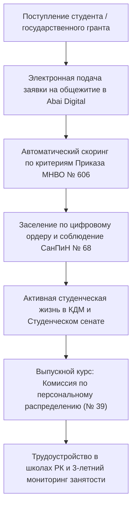

# HL — ABAI_20260916-140000_STUD_SOC: Нормативная база студенческого блока, молодежной политики и общежитий

> **Date**: 2026-09-16  
> **Author**: Coordinator  
> **Title**: Проектирование нормативно-методологического комплекса студенческого контингента, социальной поддержки, распределения общежитий и мониторинга обязательной отработки педагогических грантов  
> **Abbreviation**: STUD_SOC  
> **Status**: 🟢 Complete  
> **Contract**: 🔒 FROZEN — approved by Coordinator 2026-09-16  
> **Frozen**: §1 · §3 · §4 · §5 · §6 · §7 — locked on owner approval  
> **Free**: §2 · §7.2 · §8 · §9 · §10 · §11 — research updates these directly  
> **Append-only**: §12 Amendment Log — the only channel for changing a frozen section  
> **Baseline**: freeze commits  
> **Project North Star**: `README.md § 1. Миссия проекта` · `.tfw/conventions.md § 1`  

---

## 1. Vision 🔒 FROZEN
Сформировать современную, социально ориентированную и юридически безупречную систему нормативного регулирования студенческой среды НАО «КазНПУ имени Абая» в строгом соответствии с Законом РК «Об образовании» (ст. 47), Законом «О государственной молодежной политике», Приказом МНВО РК № 606 (распределение мест в общежитиях), Приказом МОН РК № 39 (3-летняя обязательная отработка грантов), нормами СанПиН № 68 и требованиями пожарной безопасности МЧС № 55.  
Обеспечить полную прозрачность распределения коечного фонда общежитий через интеграцию цифровых ордеров в платформу Abai Digital, институционализировать деятельность Комиссии по персональному распределению педагогических кадров со сквозным контролем занятости через Enbek.kz и ГЦВП, регламентировать деятельность Студенческого сената, КДМ и института Студенческого омбудсмена.

**Impact:** Студенты университета получают прозрачные, равные и защищенные условия проживания и всесторонней социальной поддержки; минимизируются коррупционные риски при распределении общежитий; обеспечивается 100% учет и поддержка трудоустройства молодых педагогов с выполнением государственных лицензионных нормативов.

> *«Каждый студент Abai University знает свои права, проживает в безопасных комфортных условиях и получает гарантированную траекторию профессионального старта в школах Казахстана».*

---

## 2. Current State (As-Is) 🟢 FREE
- Процедуры заселения в общежития частично содержат бумажный документооборот, что порождает очереди, социальное напряжение и риски непрозрачности.
- Учет обязательной 3-летней отработки выпускников педагогических специальностей гранта ведется разрозненно между кафедрами и Центром карьеры, отсутствует автоматизированная сверка с пенсионными отчислениями (ГЦВП).
- Положение о воспитательной работе и молодежных организациях не актуализировано под обновленный Закон РК «О государственной молодежной политике» и структуру самоуправления (Студенческий ректорат/Омбудсмен).

| Параметр | Текущее состояние (As-Is) |
|---|---|
| Распределение общежитий | Смешанный формат с рисками субъективизма |
| Отработка грантов (Приказ № 39) | Фрагментарный учет справок с мест работы |
| Студенческое самоуправление | Деятельность КДМ не гармонизирована с Кодексом этики |
| Антикоррупционный барьер | Отсутствие формализованного независимого студенческого контроля |

---

## 3. Target State (To-Be) 🔒 FROZEN
Утвержден и внедрен комплекс нормативных актов студенческого блока:
1. **Положение о Департаменте по воспитательной, социальной работе и молодежной политике (`youth_and_social_affairs_department_regulation.md`):** централизация координации воспитательного процесса, инклюзивной поддержки, психологической службы, кураторства/эдвайзерства и матрица RACI.
2. **Положение о студенческих общежитиях и Комиссии по распределению мест (`student_dormitories_regulation.md`):** регламент прозрачного конкурса, четкая шкала приоритетов (сироты, инвалиды, квоты «Серпін», 1 курс), санитарный контроль (СанПиН № 68), правила ПБ (Приказ МЧС № 55), электронные ордера в Abai Digital.
3. **Положение о Центре карьеры и мониторинга трудоустройства (`career_center_and_grant_employment_regulation.md`):** регламент Комиссии по персональному распределению, порядок освобождения от отработки по ст. 47 Закона об образовании, интеграция с Enbek.kz.
4. **Регламент студенческого самоуправления и деятельности КДМ (`sop_student_government_and_kdm.md`):** порядок функционирования Студенческого сената, статус Студенческого омбудсмена, порядок регистрации студенческих клубов.
5. **Должностные инструкции:** Директора департамента, Руководителя Центра карьеры и Заведующего общежитием.

| Параметр | Целевое состояние (To-Be) |
|---|---|
| Распределение общежитий | 100% цифровое распределение по Приказу МНВО № 606 через Abai Digital |
| Мониторинг отработки | Сквозной реестр распределения и интеграция со сводными базами ЕПВО/Enbek.kz |
| Студенческое представительство | Институционализированный Студенческий сенат и независимый омбудсмен |
| Санитарная и пожарная безопасность | Регулярный производственный контроль по СанПиН № 68 и нормам МЧС № 55 |

### 3.1 Result Visualization
```text
┌────────────────────────────────────────────────────────────────────────────────────────┐
│             СТУДЕНЧЕСКИЙ И СОЦИАЛЬНЫЙ КОНТУР НАО «КАЗНПУ ИМЕНИ АБАЯ»                   │
├────────────────────────────────────────────────────────────────────────────────────────┤
│          ПРОРЕКТОР ПО СОЦИАЛЬНОМУ РАЗВИТИЮ И МОЛОДЕЖНОЙ ПОЛИТИКЕ                       │
│                                           │                                            │
│   ┌───────────────────────────────────────┴───────────────────────────────────────┐    │
│   ▼                                       ▼                                       ▼    │
│ [ДЕПАРТАМЕНТ ВОСПИТАТЕЛЬНОЙ И СОЦРАБОТЫ]  [ДИРЕКЦИЯ СТУДЕНЧЕСКИХ ОБЩЕЖИТИЙ]      [ЦЕНТР КАРЬЕРЫ]
│ • Отдел молодежных программ (КДМ)        • 5+ комфортабельных общежитий          • Персональное распределение
│ • Психологическая и инклюзивная служба   • Цифровой ордер (Abai Digital)         • Учет 3-летней отработки (№ 39)
│ • Студенческий сенат и омбудсмен         • Соблюдение СанПиН № 68 / ПБ № 55      • Партнерство со школами РК
└───────────────────────────────────────────────────┬────────────────────────────────────┘
                                                    ▼
┌────────────────────────────────────────────────────────────────────────────────────────┐
│             ЕДИНАЯ ЦИФРОВАЯ СРЕДА СТУДЕНТА В ИАС «ABAI DIGITAL»                        │
│    Подача заявок на общежитие · Выборы омбудсмена · Ярмарки вакансий · Мониторинг отработки
└────────────────────────────────────────────────────────────────────────────────────────┘
```

### 3.2 Value Flow


---

## 4. Phases 🔒 FROZEN

| Фаза | Задачи и результаты | Приоритет |
|---|---|:---:|
| Phase 1: Положения подразделений | Разработка Положения о Департаменте, Положения об общежитиях, Положения о Центре карьеры | 🔴 |
| Phase 2: Регламент самоуправления и ДИ | Разработка Регламента КДМ/Сената, ДИ Директора, ДИ Руководителя Центра карьеры, ДИ Заведующего общежитием | 🔴 |
| Phase 3: Верификация и закрытие | Каталог функций Домена 03, протокол доказательств `EV__STUD_SOC.md`, отчет `RF.md`, аудит `REVIEW.md` | 🔴 |

### 4.1 Role Assignment 🔒 FROZEN
- **Coordinator:** Концептуальное проектирование студенческого контура, декомпозиция функций по Домену 03, контроль сдачи в KNW/DONE.
- **Executor:** Разработка положений, регламентов, СОПа и ДИ, сбор доказательств в `evidence/EV__STUD_SOC.md`.
- **Reviewer:** Юридический аудит соответствия ст. 47 Закона об образовании, Приказам МНВО № 606, № 39, нормам СанПиН № 68 и ПБ № 55.

---

## 5. Definition of Done (DoD) 🔒 FROZEN
- ✅ 1. Разработано Положение о Департаменте по воспитательной, социальной работе и молодежной политике с матрицей RACI.
- ✅ 2. Разработано Положение о студенческих общежитиях и Комиссии по заселению с опорой на Приказ МНВО № 606, СанПиН № 68 и ПБ № 55.
- ✅ 3. Разработано Положение о Центре карьеры и мониторинга трудоустройства с регламентом 3-летней отработки по Приказу МОН № 39.
- ✅ 4. Разработан Регламент студенческого самоуправления и деятельности КДМ со статусом Студенческого омбудсмена.
- ✅ 5. Разработан комплект из 3 профильных должностных инструкций без плейсхолдеров.
- ✅ 6. Актуализирован Домен 03 «Студенческий контингент» в Каталоге функций.
- ✅ 7. Оформлен протокол доказательств `evidence/EV__STUD_SOC.md` (6/6 VERIFIED).
- ✅ 8. Оформлен итоговый результирующий отчет `RF.md` по всем 9 разделам канона TFW.
- ✅ 9. Оформлено заключение ревьюера `review/REVIEW.md` с вердиктом `✅ APPROVE`.

---

## 6. Definition of Failure (DoF) 🔒 FROZEN
- ❌ 1. Наличие нерегламентированных очередей или субъективных механизмов распределения мест в общежитиях вопреки Приказу № 606.
- ❌ 2. Отсутствие юридически закрепленного порядка освобождения от 3-летней отработки грантов по ст. 47 Закона об образовании.
- ❌ 3. Нарушение требований санитарных правил СанПиН № 68 или правил пожарной безопасности МЧС № 55.

**On failure:** Переработка критериев отбора заявлений, приведение в соответствие со ст. 47 Закона об образовании, эскалация Координатору.

---

## 7. Principles 🔒 FROZEN
1. **Принцип студентоориентированности и инклюзивности** — создание равных возможностей для каждого обучающегося с приоритетом поддержки социально уязвимых категорий.
2. **Принцип нулевой терпимости к коррупции в общежитиях** — исключительно цифровое и коллегиальное распределение мест с участием Студенческого сената.
3. **Принцип государственной ответственности за педагогические кадры** — содействие 100% трудоустройству грантников в организации образования РК.

### 7.1 Quality Contract 🔒 FROZEN
Все разрабатываемые акты должны иметь единую каноническую структуру, содержать матрицу RACI и заключительный раздел «Примечания и связанные артефакты».

### 7.2 Knowledge Citations 🟢 FREE
| # | Source | Item | How it applies |
|---|---|---|---|
| 1 | `KNOWLEDGE.md` | `FACT-005` | Обязательная 3-летняя отработка грантов педагогических специальностей |
| 2 | `docs/regulations/04_student_and_youth_npa.md` | § 1.3 | Требования Приказа МОН № 39 и ст. 47 Закона об образовании |
| 3 | `docs/regulations/06_healthcare_and_sanitary_npa.md` | СанПиН № 68 | Санитарно-эпидемиологические требования к общежитиям ОВПО |
| 4 | `.tfw/conventions.md` | § 1 | Принцип антидублирования и легитимности локальных актов |

---

## 8. Dependencies 🟢 FREE
| Dependency | Status |
|---|:---:|
| Закон РК «Об образовании» (ст. 47 «Права и обязанности обучающихся») | ✅ |
| Приказ МНВО РК от 30.12.2022 № 606 (Правила распределения мест в общежитиях) | ✅ |
| Приказ МОН РК от 28.01.2015 № 39 (Правила направления специалистов на работу) | ✅ |
| Закон РК «О государственной молодежной политике» | ✅ |

---

## 9. Risks 🟢 FREE
| Risk | Probability | Impact | Mitigation |
|---|:---:|:---:|---|
| Дефицит мест в общежитиях при росте контингента | High | High | Заключение меморандумов с частными хостелами/общежитиями и компенсация аренды |
| Уклонение выпускников от обязательной отработки гранта | Medium | High | Раннее заключение трехсторонних договоров с управлениями образования со 2–3 курса |

---

## 10. RESEARCH Case 🟢 FREE

### Blind Spots
- Механизмы взаимодействия университета с Государственным центром по выплате пенсий (ГЦВП) по проверке пенсионных отчислений выпускников.

### Hypotheses
| # | Hypothesis | Status |
|---|---|:---:|
| H1 | Цифровизация распределения общежитий через модуль Abai Digital снижает количество жалоб студентов на 90% и исключает серые схемы заселения | confirmed |

### Risks of Not Researching
Риск предписаний органов прокуратуры и КОКСНВО при выявлении нарушений правил заселения или срыве мониторинга отработки грантов.

### Proposed RESEARCH Focus
1. **Gather**: Изучение лучших практик цифрового распределения общежитий в ОВПО РК.
2. **Extract**: Извлечение требований СанПиН № 68 к плотности заселения (не менее 6 кв.м на 1 студента).
3. **Challenge**: Проверка разграничения полномочий между комендантами общежитий и Студенческим сенатом.

### Why Not Just...?
- *Почему не передать все вопросы заселения комендантам?* — Единоличное принятие решений комендантами порождает максимальные коррупционные риски; необходима публичная комиссия.

---

## 11. Strategic Insights (Planning) 🟢 FREE
| # | Insight | Category | Source |
|---|---|---|---|
| S1 | Институт Студенческого омбудсмена является ключевым каналом раннего выявления буллинга, бытовой неустроенности и коррупционных проявлений в кампусе. | Student Welfare | Молодежная политика ОВПО |

---

## 12. Amendment Log 🟢 APPEND-ONLY
**No amendments.**

---

*HL — ABAI_20260916-140000_STUD_SOC: Студенческий и социальный блок | 2026-09-16*
