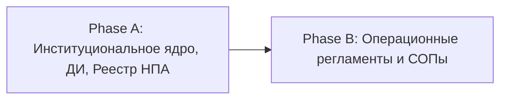

# HL — ABAI_20260919-124000_INTERNATIONAL: Проектирование нормативной базы международного сотрудничества, программ академической мобильности (Приказ МОН РК № 613), привлечения зарубежных специалистов и визово-миграционного режима ОВПО РК

> **Date**: 2026-09-19
> **Author**: Coordinator Agent
> **Title**: Проектирование нормативной базы международного сотрудничества, программ академической мобильности (Приказ МОН РК № 613), привлечения зарубежных специалистов и визово-миграционного режима ОВПО РК
> **Abbreviation**: INTL_MOBILITY
> **Status**: 📝 HL_DRAFT — Awaiting review
> **Contract**: 📝 DRAFT — not yet approved
> **Frozen**: §1 · §3 · §4 · §5 · §6 · §7 — locked on owner approval
> **Free**: §2 · §7.2 · §8 · §9 · §10 · §11 — research updates these directly
> **Append-only**: §12 Amendment Log — the only channel for changing a frozen section
> **Baseline**: freeze commits — recovery form in `conventions.md` §3 rule 15
> **Project North Star**: `README.md § 🎯 Миссия и цели проекта` · `README.md § ⚖️ База внешних НПА Республики Казахстан` · `README.md § 📋 Доска задач`

---

## 1. Vision 🔒 FROZEN

В рамках комплексной институциональной трансформации университет формирует исчерпывающий, юридически выверенный нормативный и операционный контур **интернационализации и международного сотрудничества**, полностью синхронизированный с нормами Закона РК «Об образовании» (ст. 41-1, 47, 65), Закона РК «О миграции населения» № 477-IV, Правил въезда и пребывания иммигрантов (ПП РК № 148), Правил выдачи виз (Совместный приказ МИД/МВД № 11-1-2/555), Правил направления для обучения за рубежом, в том числе по академической мобильности (Приказ МОН РК № 613), ГОСО РК (Приказ МНВО № 2) и СУР КОКСНВО (Домен 07 «Интернационализация»).

**Impact:** Университет получает регламентированную институциональную инфраструктуру: гарантированный перезачет ECTS-кредитов при академической мобильности по утвержденному Learning Agreement, понятный механизм привлечения зарубежных ученых (визитинг-профессоров), стандарты проектирования совместных и двудипломных программ (Double / Joint Degree) и жесткий комплаенс визово-миграционного учета с нулевым риском административных штрафов по ст. 518 КоАП РК (до 500 МРП).

> *«Интернационализация университета превращена в защищенный цифровой конвейер: студенты и ППС беспрепятственно участвуют в глобальной мобильности с гарантированным зачетом кредитов в УИС, зарубежные ученые приглашаются по прозрачным контрактам, а миграционные процедуры полностью автоматизированы и исключают правовые риски для вуза».*

---

## 2. Current State (As-Is) 🟢 FREE

1. **Нормативные разрывы и пробелы в регламентации:**
   - В функциональном профиле [`docs/functions_and_powers/04_internationalization.md`](file:///g:/Мой%20диск/Google%20AI%20Studio/Abai%20Unviersity%20Transformation/docs/functions_and_powers/04_internationalization.md) зафиксированы функции международного блока, однако во внутренней нормативной базе (`docs/internal_acts/`) **нет ни одного действующего акта**;
   - Отсутствует Положение о Департаменте международного сотрудничества и интернационализации (нет RACI-матрицы, распределения зон ответственности с институтами, ДАВ и Офисом регистратора);
   - Отсутствуют ДИ: Директора Департамента, Координатора академической мобильности, Специалиста по визово-миграционному сопровождению;
   - Процедура отбора на академическую мобильность по Приказу МОН РК № 613 не формализована внутривузовским регламентом (отсутствуют прозрачные критерии оценки GPA, уровня владения языком IELTS/TOEFL, открытые протоколы конкурсной комиссии, процедура заключения Learning Agreement и автоматического перезачета кредитов ECTS в транскрипт);
   - Отсутствует регламент привлечения иностранных ученых и преподавателей (визитинг-профессоров: квалификационные требования Scopus/WoS, согласование с МНВО РК, формы договоров ГПХ/трудового, условия проживания и отчетности);
   - Критический риск миграционного комплаенса: отсутствует нормативное закрепление обязанности уведомления органов миграционной службы МВД РК в течение **3 рабочих дней (72 часов)** со дня прибытия иностранца через визово-миграционный портал vmp.gov.kz (ст. 9 Закона о миграции, ПП РК № 148), что влечет прямую угрозу штрафа до 500 МРП по ст. 518 КоАП РК;
   - Отсутствует порядок разработки и согласования совместных и двудипломных образовательных программ (Double Degree / Joint Programs).

2. **Анализ текущих метрик и рисков СУР КОКСНВО (Домен 07):**

| Показатель СУР Домен 07 | Норматив / Целевой индикатор | Текущее состояние (As-Is) | Риск ОВПО |
|---|---|---|---|
| Доля иностранных обучающихся | Не менее 3% контингента | Стихийный рекрутинг без формализованного СОПа | Высокая степень риска по СУР |
| Доля обучающихся по академической мобильности | Не менее 2% контингента | Процедуры не оцифрованы в УИС, задержки перезачета ECTS | Предписания КОКСНВО |
| Наличие двудипломных ОП с зарубежными вузами | Наличие аккредитованных программ | Меморандумы без нормативного регламента реализации | Невыполнение Стратегии вуза |
| Соблюдение миграционного законодательства РК | 100% уведомлений за 72 ч | Ручной контроль без цифрового трекера виз в УИС | Штрафы до 500 МРП (ст. 518 КоАП) |

---

## 3. Target State (To-Be) 🔒 FROZEN

Университет внедряет стандартизированную систему международного сотрудничества, включающую институциональное Положение, комплект должностных инструкций, 4 прикладных СОПа и сквозную оцифровку в УИС (`[V_PRIMARY_EDTECH_PLATFORM]`):
1. **Институциональное ядро:**
   - Утверждено Положение о Департаменте международного сотрудничества и интернационализации (миссия, задачи, функции, права, межинституциональная матрица RACI, роли в УИС `Intl_Manager`, `Visa_Officer`, регламентные сроки SLA, ответственность по ст. 22, 23, 52 ТК РК и ст. 518 КоАП РК);
   - Утверждены 3 должностные инструкции: Директор Департамента, Координатор академической мобильности, Специалист по визово-миграционному сопровождению;
2. **Операционные регламенты (СОПы):**
   - СОП академической мобильности обучающихся и ППС (по Приказу МОН № 613, Learning Agreement, автоматический зачет кредитов ECTS);
   - СОП привлечения зарубежных ученых и визитинг-профессоров (стандарты МНВО, квалификационные фильтры h-index, договорной контур);
   - СОП визово-миграционного учета и сопровождения иностранных обучающихся и преподавателей (72-часовое уведомление в vmp.gov.kz, контроль виз C9/C3, персональная материальная ответственность);
   - Регламент проектирования и реализации совместных и двудипломных ОП (Joint / Double Degree);
3. **Нормативно-аналитический контур:**
   - Сформирован аналитический модуль [`docs/regulations/04_internationalization_npa.md`](file:///g:/Мой%20диск/Google%20AI%20Studio/Abai%20Unviersity%20Transformation/docs/regulations/04_internationalization_npa.md) и актуализирован Сводный реестр внешних НПА со ссылками на ИПС «Әділет».

### 3.1 Result Visualization

| Компонент системы | Состояние As-Is | Состояние To-Be |
|---|---|---|
| **Управление международным блоком** | Разрозненная координация без утвержденного Положения и RACI | Положение о Департаменте с матрицей RACI, правами в УИС и регламентными SLA |
| **Кадровый профиль** | Функции не описаны в ДИ, отсутствие закрепления цифровых обязанностей | 3 утвержденные ДИ с квалификационными требованиями, SLA и дисциплинарной ответственностью |
| **Академическая мобильность** | Риски непризнания кредитов, задержки зачисления в институтах | СОП по Приказу № 613: конкурс, трехсторонний Learning Agreement, перезачет ECTS за 3 дня |
| **Привлечение зарубежных профессоров** | Сложности в подготовке договоров и согласовании с министерством | СОП визитинг-профессоров: четкие критерии, шаблоны контрактов, требования к отчетам |
| **Миграционный учет** | Риск штрафа до 500 МРП (ст. 518 КоАП) при пропуске 3-дневного срока | СОП учета: электронная подача в vmp.gov.kz ≤ 72$ ч, контроль виз C9/C3 с алертами за 30 дней |
| **Двудипломные ОП** | Декларативные меморандумы без юридического механизма перезачета | Регламент Double Degree: гармонизация учебных планов, синхронизация ГОСО РК и вуза-партнера |

### 3.2 Value Flow

```text
[Внешние НПА: Закон об образовании, Закон о миграции № 477-IV, ПП РК № 148, Приказ МОН № 613, СУР Домен 07]
                                      │
                                      ▼
     [TFW Phase A: Институциональное ядро и кадровые инструкции]
     ├── Положение о Департаменте международного сотрудничества (RACI, УИС, SLA)
     ├── ДИ Директора Департамента международного сотрудничества
     ├── ДИ Координатора программ академической мобильности
     ├── ДИ Специалиста по визово-миграционному сопровождению
     └── Регистрация внешних НПА интернационализации (04_internationalization_npa.md)
                                      │
                                      ▼
     [TFW Phase B: Операционные регламенты и стандарты процессов]
     ├── СОП академической мобильности обучающихся и ППС (Приказ № 613, Learning Agreement)
     ├── СОП привлечения зарубежных ученых и визитинг-профессоров
     ├── СОП визово-миграционного сопровождения и учета (72 ч, vmp.gov.kz, визы C9)
     └── Регламент совместных и двудипломных образовательных программ (Double Degree)
                                      │
                                      ▼
[Результат]: Полное соответствие СУР Домен 07, 0% миграционных штрафов, кратный рост мобильности и экспорта образования.
```

---

## 4. Phases 🔒 FROZEN

### 4.1 Role Assignment 🔒 FROZEN

#### Selected LEAD mandate 🔒 PROTECTED

| Selected LEAD principal | Accountable owner | Mandate scope | Role coverage / reach | Reservations / controls | Direct reporting | Autonomous from |
|---|---|---|---|---|---|---|
| `coordinator` | `Project Owner` | ABAI-16 (Phases A, B) | Coordinator, Researcher, Executor, Reviewer | Owner approval at Gate 1 (HL), Gate 2 (TS), Gate 4 (Review) | Direct chat / session | `—` |

#### Working-unit assignment — append-only instantiation

| Principal attribution | Workflow role | Actual unit / native address | Parent unit | Bounded scope | Direct channel | Autonomous from | Dispatch ref |
|---|---|---|---|---|---|---|---|
| `coordinator` | Coordinator | `workspace/ABAI_20260919-124000_INTERNATIONAL` | `owner/root` | Planning, HL, TS, Scope Budget, KNW | Direct chat | `—` | `journal/DISPATCH-001` |
| `researcher` | Researcher | `workspace/ABAI_20260919-124000_INTERNATIONAL/research` | Coordinator unit | Research external NPA (Migration, Mobility) | Direct parent return | `—` | `journal/DISPATCH-002` |
| `executor` | Executor | `workspace/ABAI_20260919-124000_INTERNATIONAL` | Coordinator unit | Draft regulations, JDs, SOPs, EV | Direct parent return | `—` | `journal/DISPATCH-003` |
| `reviewer` | Reviewer | `workspace/ABAI_20260919-124000_INTERNATIONAL/review` | Coordinator unit | Independent audit, verification | Direct parent return | `—` | `journal/DISPATCH-004` |

### Phase Dependencies



| Phase | Depends on | Shared files | Can run in parallel with |
|-------|-----------|--------------|-------------------------|
| A | Independent | — | — |
| B | Phase A | `docs/regulations/README.md`, `README.md` | — |

### Phase A: Институциональное ядро международного блока, кадровые стандарты и Реестр НПА 🔴
- **Requires:** Independent
- **Deliverables:**
  1. `international_cooperation_department_regulation.md` — Положение о Департаменте (RACI, роли в УИС, SLA);
  2. `jd_director_international_cooperation.md` — ДИ Директора Департамента международного сотрудничества;
  3. `jd_coordinator_academic_mobility.md` — ДИ Координатора программ академической мобильности;
  4. `jd_visa_and_migration_support_specialist.md` — ДИ Специалиста по визово-миграционному сопровождению;
  5. `04_internationalization_npa.md` — аналитический модуль НПА по интернационализации и миграции;
  6. `external_npa_registry.md` — актуализация Сводного реестра внешних НПА;
  7. `EV__INTERNATIONAL_PHASE_A.md` — артефакт доказательств Фазы A.

### Phase B: Операционные регламенты, СОПы процессов и стандарты Double Degree 🟡
- **Requires:** Phase A ✅
- **Deliverables:**
  1. `sop_academic_mobility_process.md` — СОП академической мобильности обучающихся и ППС (Приказ МОН № 613);
  2. `sop_visiting_professors_recruitment.md` — СОП привлечения зарубежных ученых и визитинг-профессоров;
  3. `sop_visa_and_migration_compliance.md` — СОП визово-миграционного учета и сопровождения иностранцев;
  4. `regulations_joint_and_double_degree_programs.md` — Регламент совместных и двудипломных ОП;
  5. `EV__INTERNATIONAL_PHASE_B.md` — артефакт доказательств Фазы B;
  6. Итоговый `REVIEW.md` и закрытие задачи в `DONE`.

---

## 5. Definition of Done (DoD) 🔒 FROZEN

- ✅ 1. Разработано и утверждено Положение о Департаменте международного сотрудничества и интернационализации с матрицей RACI, регламентными сроками SLA и интерфейсами в УИС.
- ✅ 2. Разработан комплект из 3 должностных инструкций ключевых сотрудников международного блока с цифровыми обязанностями и персональной ответственностью по ТК РК и КоАП РК.
- ✅ 3. Разработан комплект из 4 операционных регламентов (СОП мобильности № 613, СОП визитинг-профессоров, СОП визово-миграционного сопровождения за 72 ч, Регламент Double Degree).
- ✅ 4. Создан аналитический модуль 04 и пополнен Сводный реестр внешних НПА РК со ссылками на ИПС «Әділет».
- ✅ 5. Все документы параметризованы системными переменными `[V_...]` и имеют раздел «Примечания и связанные артефакты».
- ✅ 6. Оформлены протоколы доказательств (`evidence/EV.md`) со 100% статусом `VERIFIED` по проверяемым критериям.
- ✅ 7. Сформированы отчеты исполнителя (`RF.md`), экспертные заключения (`REVIEW.md`), зафиксированы факты в `KNOWLEDGE.md` и обновлен `README.md`.

---

## 6. Definition of Failure (DoF) 🔒 FROZEN

- ❌ 1. Отсутствие в Положении или ДИ нормы об обязательном 3-дневном (72 часа) сроке уведомления миграционной службы МВД РК по ст. 9 Закона о миграции и ПП РК № 148.
- ❌ 2. Отсутствие в регламенте академической мобильности обязательного трехстороннего соглашения Learning Agreement и автоматического перезачета ECTS-кредитов по Приказу МОН № 613.
- ❌ 3. Наличие конфликтов ответственности в матрице RACI (назначение более одного `Accountable` на процесс).
- ❌ 4. Наличие неразрешенных плейсхолдеров вида `[TODO]`, `[TBD]` или отсутствие системных переменных `[V_...]`.
- ❌ 5. Превышение лимитов Scope Budget ($\gt 8$ новых файлов, $\gt 14$ файлов суммарно, $\gt 1200$ строк на фазу).

**On failure:** Немедленная остановка разработки, откат некорректных правок, проведение повторного нормативного анализа и эскалация Координатору.

---

## 7. Principles 🔒 FROZEN

1. **Нулевая толерантность к миграционным нарушениям (Migration Compliance First)** — безусловный приоритет соблюдения 72-часового дедлайна уведомления миграционной службы через vmp.gov.kz для исключения штрафов до 500 МРП по ст. 518 КоАП РК.
2. **Академическая прозрачность и гарантия признания кредитов ECTS** — Learning Agreement является нерушимым юридическим основанием для перезачета дисциплин в УИС Офисом регистратора без дополнительных экзаменов.
3. **Сквозная цифровизация и безбумажный учет** — 100% заявок на мобильность, учет иностранных обучающихся и мониторинг виз ведутся исключительно в модуле УИС («Интернационализация и мобильность» платформы `[V_PRIMARY_EDTECH_PLATFORM]`).

### 7.1 Quality Contract 🔒 FROZEN
- Все документы оформляются строго по каноническим шаблонам `.tfw/templates/` (Положения, ДИ, СОПы);
- В каждом документе обязателен раздел «Примечания и связанные артефакты» с внешними ссылками;
- Исключены неопределенные формулировки («и другие обязанности», «в установленном порядке» без указания кем и в какой срок).

### 7.2 Knowledge Citations 🟢 FREE

| # | Source | Item | How it applies |
|---|--------|------|----------------|
| 1 | `README.md` | § База внешних НПА Республики Казахстан | Нормативная основа: Закон об образовании, Закон о науке, Приказы МНВО № 595, № 2, Приказ МОН № 613 |
| 2 | `conventions.md` | § 1 Методологические принципы | Принцип антидублирования, формат системных переменных `[V_...]` и Evidence Layer |
| 3 | `KNOWLEDGE.md` | FACT-023 | Универсальная параметризованная модель ОВПО РК и 22 модуля профиля УИС |
| 4 | `KNOWLEDGE.md` | FACT-025, FACT-027 | Сквозная интеграция SLA и дисциплинарной ответственности по ст. 22, 23, 52 ТК РК |
| 5 | `docs/functions_and_powers/04_internationalization.md` | Разделы 1–4 | Декомпозиция функций международного сотрудничества, мобильности и визового режима |

---

## 8. Dependencies 🟢 FREE

| Dependency | Status |
|------------|--------|
| Базовый реестр внешних НПА РК (`external_npa_registry.md`) | ✅ Готов (126 НПА) |
| Функциональный профиль домена интернационализации (`04_internationalization.md`) | ✅ Готов |
| Эталонный архитектурный профиль УИС (`01_university_is_reference_blueprint.md`) | ✅ Готов (Модуль «Интернационализация») |
| Нормативная база Офиса регистратора (перезачет ECTS) | ✅ Готова (ABAI-2 / ABAI-13) |

---

## 9. Risks 🟢 FREE

| Risk | Probability | Impact | Mitigation |
|------|-------------|--------|------------|
| Нарушение 3-дневного срока уведомления органов миграционной службы МВД РК | Medium | High | Внедрение автоматических алертов в УИС за 72 часа до дедлайна, персональная ответственность специалиста по ст. 518 КоАП РК |
| Отказ институтов перезачитывать кредиты обучающихся после академической мобильности | Low | High | Императивная норма в СОПе: подписанный Learning Agreement имеет безусловную силу для Офиса регистратора |
| Срыв контрактов с визитинг-профессорами из-за задержек виз C3 | Medium | Medium | Регламентация визовой поддержки за 60 календарных дней до планируемого приезда |

---

## 10. RESEARCH Case 🟢 FREE

### Blind Spots
- Специфика налогообложения доходов зарубежных специалистов-нерезидентов в зависимости от наличия Конвенции об избежании двойного налогообложения с конкретной страной (ст. 644–655 НК РК).

### Hypotheses

| # | Hypothesis | Status |
|---|----------|--------|
| H1 | Внедрение стандартного Learning Agreement сократит срок перевода оценок зарубежного вуза в транскрипт с 30 до 3 рабочих дней | open |
| H2 | Цифровой реестр учета иностранцев в УИС сведет к нулю риск административных правонарушений по ст. 518 КоАП РК | open |

### Risks of Not Researching
- Риск наложения штрафов на университет налоговыми и миграционными органами при некорректном оформлении договоров с иностранными учеными.

### Proposed RESEARCH Focus
1. **Gather**: Правила оформления виз C9 и C3 по Совместному приказу МИД/МВД № 11-1-2/555.
2. **Extract**: Требования к процедуре конкурсного отбора на мобильность по Приказу МОН № 613.
3. **Challenge**: Как исключить затягивание визирования договоров о двудипломных программах.

### Why Not Just...?
- Why not использовать общее Положение о ДАВ для международной деятельности? — Международная деятельность регулируется специфическим миграционным и международным правом, требующим выделенного подразделения и персональных ролей.
- Why not оформлять визитинг-профессоров по стандартным ДИ ППС? — Зарубежные преподаватели имеют особый налоговый статус нерезидентов, визовый режим C3 и освобождены от ряда рутинных требований локального педпроцесса.

---

## 11. Strategic Insights (Planning) 🟢 FREE

| # | Insight | Category | Source |
|---|---------|----------|--------|
| S1 | Интернационализация является прямым драйвером рейтингов QS World University Rankings (индикаторы International Students и International Faculty) | Strategic Alignment | Стратегия развития 2026–2030, KPI-14 |
| S2 | СУР КОКСНВО относит сбои по академической мобильности и иностранному контингенту к критическим лицензионным маркерам риска (Домен 07) | Regulatory Risk | Приказ МНВО № 166 / МНЭ № 116 |

---

## 12. Amendment Log 🟢 APPEND-ONLY

| # | Date | § | Type | Proposer | Proposed change | Evidence | Cost | Alternatives considered | Verdict |
|---|------|---|------|----------|-----------------|----------|------|------------------------|---------|
| A1 | 2026-09-19 | Все | `SUPERSEDE` | Coordinator | Полное приведение HL к канонической структуре шаблона .tfw/templates/HL.md (12 разделов, DoF, Quality Contract, Role Assignment, Dependencies, Research Case) | Замечание пользователя о несоответствии канонам | 0 tokens | Оставить сокращенный вариант (отклонено из-за нарушения TFW v3.4.0) | `PROPOSED` |

---

*HL — ABAI_20260919-124000_INTERNATIONAL: Проектирование нормативной базы международного сотрудничества | 2026-09-19*
