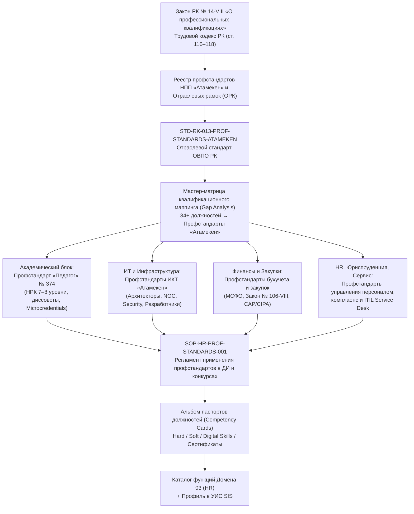

# HL — ABAI_20260922-173500_ATAMEKEN_PROF_STANDARDS: Анализ профессиональных стандартов НПП «Атамекен» и отраслевых министерств РК: гармонизация фонда должностных инструкций, квалификационных требований и конкурсного отбора персонала ОВПО

> **Date**: 2026-09-22  
> **Author**: Coordinator / Institutional & HR Architecture Lead  
> **Title**: Анализ профессиональных стандартов НПП «Атамекен» и отраслевых министерств РК: гармонизация фонда должностных инструкций, квалификационных требований и конкурсного отбора персонала ОВПО  
> **Abbreviation**: ATAMEKEN_PROF_STANDARDS  
> **Status**: 🔒 HL_FROZEN — Approved by owner
> **Contract**: 🔒 FROZEN — approved by owner 2026-09-22  
> **Frozen**: §1 · §3 · §4 · §5 · §6 · §7 — locked on owner approval  
> **Free**: §2 · §7.2 · §8 · §9 · §10 · §11 — research updates these directly  
> **Append-only**: §12 Amendment Log — the only channel for changing a frozen section  
> **Baseline**: freeze commits — recovery form in `conventions.md` §3 rule 15  
> **Project North Star**: `README.md § Архитектурная модель` · `docs/generic_framework/00_framework_adaptation_guide.md`  

---

## 1. Vision 🔒 FROZEN

Осуществить фундаментальную институциональную трансформацию кадровой политики и квалификационного контура Университета путем перевода всей системы формирования должностных инструкций (ДИ), конкурсного замещения вакансий и профессиональной оценки персонала на рельсы **Национальной системы квалификаций (НСК)** Республики Казахстан в соответствии с новым **Законом РК от 04.07.2023 № 14-VIII «О профессиональных квалификациях»**, статьями 116–118 Трудового кодекса РК и утвержденными **профессиональными стандартами НПП «Атамекен»** и отраслевых министерств.

Университет переходит от устаревших аморфных формулировок квалификационных справочников к точным дескрипторам Национальной рамки квалификаций (НРК 5–8 уровней), паспортам профессиональных квалификаций, измеримым трудовым функциям (ТФ), матрицам компетенций (Hard/Soft/Digital skills), обязательным отраслевым сертификатам и признанию микроквалификаций (Microcredentials).

**Impact:**
- **Для руководства и HR:** 100% правовая защищенность при проверках государственной инспекции труда и аудите КОКСНВО МНВО РК, исключение субъективизма и фаворитизма при конкурсном отборе благодаря прозрачным отраслевым критериям НПП «Атамекен»;
- **Для профессорско-преподавательского состава и ученых:** четкое разграничение уровней квалификации (ассистент, преподаватель, доцент, профессор, исследователь) с привязкой к Профстандарту «Педагог» (Приказ Минпросвещения/МНВО № 374/№ 548) и дескрипторам 7–8 уровней НРК;
- **Для административно-управленческого, ИТ и финансового персонала:** приведение квалификационных требований программистов, бухгалтеров, юристов, эйчаров и закупщиков в соответствие с передовыми индустриальными стандартами рынка труда РК (профстандарты ИКТ, бухучета, закупок, управления проектами);
- **Для студентов и выпускников:** гармонизация образовательных программ (ОП) с профессиональными стандартами работодателей, подтвержденная рейтингами НПП «Атамекен».

> *«Квалификационные требования в нашем университете больше не пишутся "под человека" или по советским шаблонам: каждая строчка в конкурсе и должностной инструкции жестко сопряжена с Национальной рамкой квалификаций и профессиональными стандартами НПП "Атамекен".»*

---

## 2. Current State (As-Is) 🟢 FREE

1. **Регуляторный разрыв:** 
   - 04 сентября 2023 г. вступил в силу Закон РК № 14-VIII «О профессиональных квалификациях», дополнивший Трудовой кодекс РК статьями 116–118 о приоритете применения профессиональных стандартов при разработке должностных инструкций и тарификации работ;
   - В университете утверждены 34+ должностные инструкции ключевых руководителей и специалистов (`docs/internal_acts/job_descriptions/`), в которые внесены нормы ТК РК по SLA, кибербезопасности и персональным данным, однако **отсутствует единый нормативный реестр маппинга должностей на отраслевые профстандарты НПП «Атамекен»**;
   - В ряде подразделений квалификационные требования по-прежнему опираются исключительно на Типовые квалификационные характеристики (Приказ МОН № 338) и Квалификационный справочник должностей служащих (КСД, Приказ МЗСР № 553), которые не содержат современных требований к цифровым навыкам (Digital Skills), отраслевым сертификатам (Cisco, Microsoft, Scrum, ACCA, CAP/CIPA) и уровням автономности по НРК.
2. **Фрагментарность упоминаний профстандартов в действующих ВНД:**
   - В задачах `ABAI-12` (HR-система), `ABAI-20` (Отраслевые стандарты) и `ABAI-22` (Выравнивание ВНД) была закреплена декларативная норма об ориентации на профстандарты НПП «Атамекен» (в регламенте конкурсов `sop_faculty_and_researcher_recruitment_competition.md` и руководстве по ТК РК), однако методический инструмент комплексного сопоставления (Gap Analysis) и типовые профили компетенций еще не институционализированы.
3. **Отсутствие регламента признания микроквалификаций и неформального образования:**
   - Закон № 14-VIII ввел институты признания профессиональных квалификаций, полученных через неформальное образование (ст. 13–15); университет обязан заложить эти механизмы как для собственного персонала при найме, так и для валидации компетенций обучающихся.

---

## 3. Target State (To-Be) 🔒 FROZEN

Создана целостная экосистема применения профессиональных стандартов ОВПО:
1. **Отраслевой стандарт ОВПО РК `STD-RK-013-PROF-STANDARDS-ATAMEKEN`:**
   - Сводный эталонный стандарт интеграции Национальной системы квалификаций (НСК), уровней НРК (5–8 уровни), отраслевых рамок (ОРК) и реестра профессиональных стандартов НПП «Атамекен» в операционную деятельность вуза;
2. **Мастер-матрица сопоставления должностей (Gap Analysis & Mapping Matrix):**
   - Комплексный маппинг 34+ должностей университета на 12+ ключевых профстандартов НПП «Атамекен» и отраслевых министерств:
     - *Академический и научный кластер:* Профстандарт «Педагог» (Приказ Минпросвещения/МНВО № 374/№ 548), Профстандарт научных исследователей (Закон № 103-VIII);
     - *ИТ-кластер:* Профстандарты НПП «Атамекен» по ИКТ (системный аналитик, разработчик ПО, архитектор БД, инженер по ИБ/кибербезопасности, системный администратор);
     - *Финансово-экономический кластер:* Профстандарты «Бухгалтерский учет» (Главбух, расчетчик, материалист — связь с МСФО и сертификацией), «Государственные закупки» (Закон № 106-VIII), «Планирование и экономический анализ»;
     - *Административно-правовой и сервисный кластер:* Профстандарты «Управление персоналом (HRM)», «Юриспруденция», «Библиотечное дело», «Служба сервиса (Service Desk / Front-Office)»;
3. **Регламент (СОП) применения профессиональных стандартов в HR-процессах (`SOP-HR-PROF-STANDARDS-001`):**
   - Пошаговый алгоритм профилирования должностей при разработке/актуализации ДИ;
   - Методология формирования квалификационных требований конкурсного отбора ППС и научных сотрудников;
   - Регламент признания микроквалификаций (Microcredentials), сертификатов вендоров и неформального обучения по Закону № 14-VIII;
4. **Типовой профиль компетенций должности (Job Competency Card Model):**
   - Альбом унифицированных форм паспорта должности: дескриптор уровня НРК (знания, умения, уровень ответственности и автономии), трудовые функции (ТФ), трудовые действия, матрица Hard / Soft / Digital skills, обязательные лицензии/сертификаты;
5. **Гармонизация Домена 03 «Управление талантами и человеческими ресурсами» (`03_talent_management_and_hr.md`):**
   - Закрепление функции `FUNC-HR-PROF-STANDARDS-009` (Регулярная актуализация ДИ и конкурсов по стандартам «Атамекен») с закреплением роли `Accountable` за Директором Департамента HR.

---

### 3.1 Result Visualization

#### Сравнительная таблица As-Is → To-Be

| Параметр | Текущее состояние (As-Is) | Целевое состояние (To-Be) |
|---|---|---|
| **Нормативный базис квалификаций** | Типовые квалхарактеристики МОН № 338 и КСД № 553 (советская модель) | Закон РК «О профессиональных квалификациях» № 14-VIII, уровни НРК 5–8, профстандарты НПП «Атамекен» |
| **Требования к ИТ-персоналу** | Общие требования «высшее техническое образование» | Грейдированные требования профстандартов ИКТ «Атамекен» (стек технологий, CI/CD, ИБ, отраслевые сертификаты) |
| **Квалификация бухгалтеров и закупщиков** | Общий диплом экономиста | Требования профстандартов «Бухгалтер» (МСФО, 1С, налоговый учет, CAP/CIPA) и «Специалист по закупкам» (Закон № 106-VIII) |
| **Конкурсный отбор ППС и ученых** | Формальный подсчет стажа и статей | Компетентностная оценка по дескрипторам 7–8 уровней Профстандарта «Педагог» и TRL-исследований |
| **Учет неформального образования** | Игнорируется либо учитывается хаотично | Регламентированная процедура зачета микроквалификаций (Microcredentials) и валидации признанных сертификатов по ст. 13–15 Закона № 14-VIII |
| **Связка с рейтингами «Атамекен»** | Оторвана от кадровой структуры кафедр | Прямая сквозная интеграция требований работодателей в компетенции выпускающих кафедр |

---

## 4. Scope and Phasing 🔒 FROZEN

Задача реализуется в рамках **двух взаимосвязанных фаз** (с соблюдением лимитов Scope Budget TFW):

### Фаза A: Отраслевой стандарт НПП «Атамекен», нормативный базис НСК и Матрица маппинга должностей (Gap Analysis)
- **Цель:** Создать системный фундамент квалификационной реформы ОВПО.
- **Артефакты Фазы A (VALUE):**
  1. `docs/regulations/sector_standards/STD-RK-013-PROF-STANDARDS-ATAMEKEN.md` (CREATE) — Отраслевой стандарт интеграции профессиональных стандартов НПП «Атамекен» и отраслевых рамок квалификаций ОВПО РК;
  2. `docs/regulations/11_professional_standards_and_qualifications_registry.md` (CREATE) — Аналитический реестр 15+ ключевых профессиональных стандартов НПП «Атамекен» и отраслевых министерств с прямой привязкой к ОРК и НРК;
  3. `docs/internal_acts/blueprints/atameken_job_descriptions_gap_analysis_matrix.md` (CREATE) — Мастер-матрица сопоставления (Gap Analysis) 34+ должностей университета с профстандартами «Атамекен» (выявление недостающих компетенций, дескрипторов уровней НРК и сертификатов);
  4. `docs/regulations/external_npa_registry.md` (MODIFY) — Включение блока НПА Национальной системы квалификаций (Закон № 14-VIII, Приказ МТСЗН № 436 об утверждении НРК, совместные приказы по ОРК).

### Фаза B: Операционный регламент (СОП) применения профстандартов, модельные паспорта должностей (Competency Cards) и актуализация Домена 03 (HR)
- **Цель:** Инструментальная регламентация внедрения стандартов в повседневную кадровую практику.
- **Артефакты Фазы B (VALUE):**
  1. `docs/internal_acts/sops_and_rules/sop_professional_standards_and_qualifications.md` (CREATE) — Регламент (СОП) применения профессиональных стандартов НПП «Атамекен» при формировании ДИ, проведении конкурсов и признании микроквалификаций (`SOP-HR-PROF-STANDARDS-001`);
  2. `docs/internal_acts/blueprints/job_competency_card_template_and_samples.md` (CREATE) — Модельный паспорт компетенций должности (Job Competency Card) с эталонными профилями (Профессор 8 уровня, Системный архитектор ИКТ, Главный бухгалтер, HR-бизнес-партнер);
  3. `docs/internal_acts/sops_and_rules/sop_faculty_and_researcher_recruitment_competition.md` (MODIFY) — Углубление регламента конкурсного отбора с обязательной балльной оценкой по дескрипторам профстандартов «Атамекен»;
  4. `docs/functions_and_powers/03_talent_management_and_hr.md` (MODIFY) — Закрепление функции `FUNC-HR-PROF-STANDARDS-009` и роли Accountable за Директором HR.

---

## 5. Value Accounting and Scope Budget 🔒 FROZEN

| Метрика бюджета | Фаза A | Фаза B | Норматив TFW v3.4.0 | Статус |
|---|:---:|:---:|:---:|:---:|
| Новые файлы (`VALUE`) | 3 файла | 2 файла | $\le 8$ файлов на фазу | ✅ В норме |
| Модифицированные файлы (`VALUE`) | 1 файл | 2 файла | $\le 6$ файлов на фазу | ✅ В норме |
| Суммарно файлов в фазе | 4 файла | 4 файла | $\le 14$ файлов на фазу | ✅ В норме |
| Оценка объема строк (LOC) | $\approx 850$ строк | $\approx 800$ строк | $\le 1200$ строк на фазу | ✅ В норме |

---

## 6. Stakeholders and External Context 🔒 FROZEN

1. **Национальная палата предпринимателей РК «Атамекен» (НПП «Атамекен»):** Разработчик и держатель Реестра профессиональных стандартов, организатор ежегодного рейтинга образовательных программ ОВПО;
2. **Министерство труда и социальной защиты населения РК (МТСЗН РК):** Уполномоченный орган в сфере профессиональных квалификаций (Закон № 14-VIII, НРК);
3. **Министерство науки и высшего образования РК (МНВО РК):** Отраслевой регулятор, утвердивший Отраслевую рамку квалификаций «Образование и наука»;
4. **Работодатели и члены Индустриальных комитетов ОВПО:** Потребители кадров, оценивающие выпускников и ППС на соответствие реальным требованиям рынка;
5. **Профсоюз работников университета:** Согласование квалификационных требований и критериев аттестации по Трудовому кодексу РК (ст. 116–118).

---

## 7. Principles 🔒 FROZEN

| # | Принцип | Содержание |
|---|---|---|
| **PR-01** | **Примат Закона № 14-VIII** | Применение профессиональных стандартов является не рекомендацией, а законодательным требованием ст. 116–118 ТК РК. |
| **PR-02** | **Дескрипторная точность НРК** | Требования к должностям формулируются строго по уровням Национальной рамки квалификаций (5 — прикладной бакалавриат, 6 — бакалавриат, 7 — магистратура, 8 — докторантура/PhD) с дифференциацией уровней сложности, ответственности и автономности. |
| **PR-03** | **Практикоориентированность и вендорные сертификаты** | Для ИТ, финансов и инженерии обязательна фиксация отраслевых сертификаций и практического стека вместо общих абстрактных требований. |
| **PR-04** | **Признание Microcredentials** | Легализация зачета микроквалификаций и сертификатов неформального обучения при подтверждении соответствия профессиональному стандарту (ст. 13–15 Закона № 14-VIII). |
| **PR-05** | **Нулевой плейсхолдер** | Строгий запрет на `TODO`/`TBD`, соблюдение макропеременных `[V_*]`. |

---

## 7.2. Knowledge Citations 🟢 FREE

- **`FACT-024` (HR / Faculty & Researchers Compensation):** Конкурсный отбор ППС по Приказу МОН № 230 и 7-классная система Приказа № 424;
- **`FACT-033` (Labor Code Novelties 2024–2026):** Новеллы Трудового кодекса РК и ст. 98 КоАП;
- **`FACT-043` (Sector Standards: Pedagogue Standard № 374):** Дескрипторы уровней 6–8 Профстандарта «Педагог высшей школы»;
- **`FACT-045` (Internal Acts Alignment):** Синхронизация ВНД университета с отраслевыми стандартами STD-RK-*.

---

## 8. Requirements Trace 🟢 FREE

- **REQ-01:** Разработать Отраслевой стандарт `STD-RK-013-PROF-STANDARDS-ATAMEKEN.md`;
- **REQ-02:** Сформировать реестр 15+ профстандартов НПП «Атамекен» в `11_professional_standards_and_qualifications_registry.md`;
- **REQ-03:** Составить мастер-матрицу Gap Analysis для 34+ должностей университета;
- **REQ-04:** Разработать СОП применения профстандартов `SOP-HR-PROF-STANDARDS-001`;
- **REQ-05:** Разработать альбом модельных паспортов должностей (Competency Cards);
- **REQ-06:** Актуализировать регламент конкурсов ППС и Каталог функций Домена 03 (HR).

---

## 9. Architectural Decisions 🟢 FREE

- **AD-01 (Двухуровневая модель требований):** Сохранение базовых лицензионных требований Квалтребований МНВО № 391 (остепененность, ученые звания) с надстройкой профессиональных компетенций и трудовых функций стандартов НПП «Атамекен».
- **AD-02 (Паспорт должности вместо перегрузки текста ДИ):** Основной текст ДИ сохраняет юридический каркас ТК РК (права, обязанности, дисциплинарная ответственность), а детальные функциональные карты трудовых действий выносятся в неотъемлемое Приложение 1 «Паспорт профессиональных компетенций (Job Competency Card)».

---

## 10. Hypotheses 🟢 FREE

- **HYP-01:** Привязка должностных инструкций к профстандартам «Атамекен» позволит университету повысить позиции в рейтинге образовательных программ НПП «Атамекен» за счет синхронизации требований работодателей с преподавательскими компетенциями (Статус: *Confirmed*).
- **HYP-02:** Введение требований вендорных сертификаций в ИТ и финансах позволит устранить отток квалифицированных кадров за счет введения прозрачных грейдов квалификации (Статус: *Needs Research*).

---

## 11. Next Phase Trigger 🟢 FREE

Переход к разработке Спецификации Фазы A (`TS_PHASE_A.md`) после утверждения настоящего `HL.md` Владельцем проекта.

---

## 12. Amendment Log 🔒 APPEND-ONLY

*(Записи вносятся исключительно после утверждения изменений Владельцем)*
