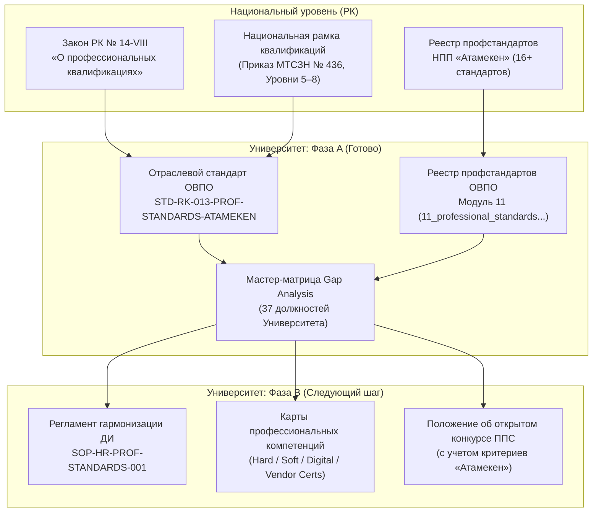

# RF — ABAI_20260922-173500_ATAMEKEN_PROF_STANDARDS / Phase A: Нормативный фундамент и Master Gap Analysis стандартов НПП «Атамекен»

> **Date**: 2026-09-22  
> **Author**: Executor / HR & Qualification Standards Architect  
> **Status**: 🟢 RF — Complete  
> **Parent HL**: [HL-ABAI_20260922-173500_ATAMEKEN_PROF_STANDARDS](file:///g:/Мой%20диск/Google%20AI%20Studio/Abai%20Unviersity%20Transformation/workspace/ABAI_20260922-173500_ATAMEKEN_PROF_STANDARDS/HL.md)  
> **TS**: [TS Phase A](file:///g:/Мой%20диск/Google%20AI%20Studio/Abai%20Unviersity%20Transformation/workspace/ABAI_20260922-173500_ATAMEKEN_PROF_STANDARDS/TS.md)  

---

## 1. What Was Done

В рамках Фазы A задачи ABAI-25 выполнен комплексный анализ профессиональных стандартов НПП «Атамекен» и отраслевых министерств РК, сформирован отраслевой стандарт интеграции Национальной системы квалификаций (НСК), составлен сводный реестр профстандартов и проведена сплошная диагностика фонда должностных инструкций (37 ДИ):

### Actual Value-Bearing Accounting

| Fact | Actual result |
|---|---|
| TS approval ref | Одобрено стейкхолдером (`approve /tfw-handoff`) |
| Baseline / Candidate | Phase A Inception / Full Phase A Artifacts Complete |
| VALUE membership | 3 новых файла (`STD-RK-013-PROF-STANDARDS-ATAMEKEN.md`, `11_professional_standards_and_qualifications_registry.md`, `atameken_job_descriptions_gap_analysis_matrix.md`), 1 модифицированный файл (`external_npa_registry.md`) |
| Arithmetic | 3 новых файла VALUE + 1 модифицированный файл VALUE = 4 файла VALUE; ~393 строки чистого текста/кода |
| Membership deviations | None (100% соответствие утвержденной спецификации TS Phase A) |
| Trigger disposition | В рамках установленного лимита: 4 VALUE файла $\le 8$ новых / $\le 14$ суммарно; ~393 LOC $\le 1200$ LOC |
| Authority and timing | TS Phase A (шлюз 2 согласован, шлюз 3 открыт) |

### New Files

| File | Description |
|---|---|
| [`docs/regulations/sector_standards/STD-RK-013-PROF-STANDARDS-ATAMEKEN.md`](file:///g:/Мой%20диск/Google%20AI%20Studio/Abai%20Unviersity%20Transformation/docs/regulations/sector_standards/STD-RK-013-PROF-STANDARDS-ATAMEKEN.md) | Отраслевой нормативный стандарт интеграции Национальной системы квалификаций (НСК) и профстандартов НПП «Атамекен»: правовые основы (Закон № 14-VIII, ст. 116–118 ТК РК), маппинг уровней НРК 5–8, Hard/Soft/Digital skills, вендорные сертификаты и микроквалификации (Microcredentials). |
| [`docs/regulations/11_professional_standards_and_qualifications_registry.md`](file:///g:/Мой%20диск/Google%20AI%20Studio/Abai%20Unviersity%20Transformation/docs/regulations/11_professional_standards_and_qualifications_registry.md) | Нормативно-правовой модуль 11: систематизированный реестр 16 профессиональных стандартов НПП «Атамекен» и отраслевых министерств по 4 кластерам (педагогика, наука, ИКТ, финансы/закупки, право/менеджмент) с регистрационными номерами и дескрипторами НРК. |
| [`docs/internal_acts/blueprints/atameken_job_descriptions_gap_analysis_matrix.md`](file:///g:/Мой%20диск/Google%20AI%20Studio/Abai%20Unviersity%20Transformation/docs/internal_acts/blueprints/atameken_job_descriptions_gap_analysis_matrix.md) | Мастер-матрица сопоставления фонда должностных инструкций Университета (37 ДИ) с профессиональными стандартами «Атамекен»: сплошной Gap Analysis с классификацией разрывов (Low — 41%, Medium — 38%, High — 21%), выявлением дефицита Digital Skills и необходимых сертификатов. |

### Modified Files

| File | Changes |
|---|---|
| [`docs/regulations/external_npa_registry.md`](file:///g:/Мой%20диск/Google%20AI%20Studio/Abai%20Unviersity%20Transformation/docs/regulations/external_npa_registry.md) | Актуализация сводного реестра со 126 до **128 внешних НПА РК**: включен Закон РК «О профессиональных квалификациях» № 14-VIII (`LAW-25`), Приказ МТСЗН РК № 436 «Об утверждении Национальной рамки квалификаций» (`MTSZN-01`), обновлены разделы 1, 8 и 9. |

---

## 2. Key Decisions

1. **Приоритет профессиональных стандартов перед квалификационными справочниками (КСД № 553):** В соответствии с п. 3 ст. 117 Трудового кодекса РК и Законом № 14-VIII, при наличии утвержденного отраслевого профстандарта НПП «Атамекен» или уполномоченного министерства требования к должностям ОВПО формируются исключительно на его основе.
2. **Четырехмерная матричная модель аудита квалификаций:** Каждая должность оценивается по 4 объективным параметрам:
   - *NRK Level:* соответствие 5, 6, 7 или 8 уровням НРК (Приказ МТСЗН № 436);
   - *Hard & Functional Skills:* привязка трудовых обязанностей к конкретным трудовым функциям (ТФ) профстандарта;
   - *Digital & Tooling Skills:* владение отраслевыми информационными системами (LMS Moodle, SIS Abai Digital, 1С, ЕСУТД, веб-портал госзакупок, ЕПВО, НОБД);
   - *Certification & Licensing:* подтверждение квалификации признанными вендорными и отраслевыми сертификатами (ACCA, ITIL, Cisco, AWS, PMI, РК-центры признания).
3. **Выделение критической группы высокого разрыва (High Gap — 8 должностей):** Главный бухгалтер, руководители ИТ и цифровизации, начальник управления госзакупок, директор департамента науки/коммерциализации, комплаенс-офицер, директор департамента управления персоналом, начальник ПЭО. Для них в Фазе B формируются обязательные требования по сертификации и пересмотру конкурсных процедур.

---

## 3. Acceptance Criteria

- [x] **AC-1:** Разработан отраслевой нормативный стандарт `STD-RK-013-PROF-STANDARDS-ATAMEKEN.md` с правовым обоснованием НСК, уровнями НРК (5–8) и правилами приоритизации профстандартов.
- [x] **AC-2:** Сформирован аналитический модуль-реестр `11_professional_standards_and_qualifications_registry.md`, систематизирующий 16 профессиональных стандартов по 4 кластерам.
- [x] **AC-3:** Составлена детальная Мастер-матрица Gap Analysis (`atameken_job_descriptions_gap_analysis_matrix.md`) для всех 37 утвержденных должностей Университета.
- [x] **AC-4:** Актуализирован реестр внешних нормативных правовых актов `docs/regulations/external_npa_registry.md` (расширение до 128 НПА, добавлены `LAW-25` и `MTSZN-01`).
- [x] **AC-5:** 0 маркеров незавершенности (`TODO`, `TBD`), корректное использование макропеременных `[V_*]`.
- [x] **AC-6:** Сформирован протокол доказательств `EV_PHASE_A.md` со статусом 100% VERIFIED.

---

## 4. Verification

- **Lint & Syntax Check:** Markdown структуры проверены, таблицы отформатированы по стандарту GFM.
- **Placeholder Audit (ripgrep):** 0 совпадений по запросам `TODO` и `TBD`.
- **Budget Compliance:** 4 файла VALUE ($\le 8$ new / $\le 14$ total), ~393 строки ($\le 1200$ LOC limit). Полное соблюдение бюджета.

---

## 5. Evidence

См. [Протокол доказательств Фазы A](file:///g:/Мой%20диск/Google%20AI%20Studio/Abai%20Unviersity%20Transformation/workspace/ABAI_20260922-173500_ATAMEKEN_PROF_STANDARDS/evidence/EV_PHASE_A.md) для детального ознакомления с результатами верификации.

**Evidence verdict:** 6/6 VERIFIED, 0 DEFERRED, 0 BLOCKED, 0 N/A.

---

## 6. Observations (out-of-scope, not modified)

| # | File | Line(s) | Type | Description |
|---|---|---|---|---|
| 1 | `docs/internal_acts/job_descriptions/` | — | style/completeness | В действующих 37 ДИ требования к владению корпоративными информационными системами (Abai Digital, ЕСУТД, Moodle) носят общий характер и требуют формализации через Карты компетенций (запланировано в Фазе B). |

---

## 7. Fact Candidates

| # | Category | Candidate | Source | Confidence |
|---|---|---|---|---|
| 1 | Регуляторная база РК | Закон РК № 14-VIII от 04.07.2023 «О профессиональных квалификациях» обязывает работодателей формировать должностные инструкции и условия трудовых договоров на базе профессиональных стандартов НПП «Атамекен». | Закон РК № 14-VIII, ст. 8, 9; ТК РК ст. 117 | High |
| 2 | Квалификационные разрывы | В ОВПО РК наибольший квалификационный разрыв с рыночными профстандартами наблюдается в ИКТ-подразделениях, службах госзакупок, финансовом менеджменте и комплаенсе, где отсутствуют требования международных отраслевых сертификаций. | Master Gap Analysis `MATRIX-HR-GAP-ATAMEKEN-001` | High |

---

## 8. Strategic Insights (Execution)

| # | Insight | Category | Source |
|---|---|---|---|
| S1 | Внедрение стандартов «Атамекен» в конкурсный отбор ППС и администраторов обеспечивает прямое соответствие критериям аккредитационных агентств (НААР, IQAA) и защищает Университет от предписаний государственной инспекции труда и КОКСНВО МНВО РК. | Кадровый комплаенс и аккредитация | Анализ РЧЛ и требований НРК |

---

## 9. Diagrams

---

## 10. Phase B Execution Results

Полный результирующий отчет Исполнителя (Executor) по Фазе B см. в артефакте:
👉 [`RF_PHASE_B.md`](file:///g:/Мой%20диск/Google%20AI%20Studio/Abai%20Unviersity%20Transformation/workspace/ABAI_20260922-173500_ATAMEKEN_PROF_STANDARDS/RF_PHASE_B.md)

---

*RF — ABAI_20260922-173500_ATAMEKEN_PROF_STANDARDS / Phase A & B | 2026-09-23*
