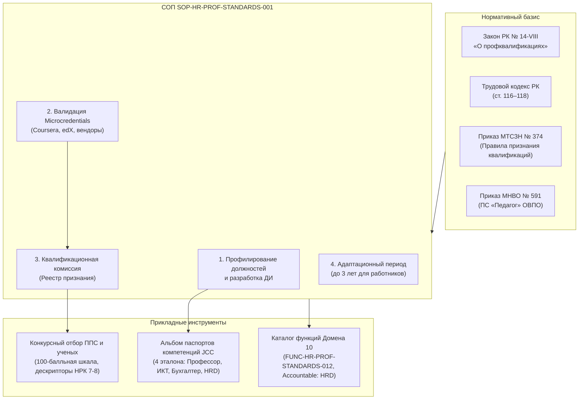

# RF — ABAI_20260922-173500_ATAMEKEN_PROF_STANDARDS / Phase B: Операционный регламент (СОП) применения профстандартов «Атамекен», Альбом паспортов должностей (Competency Cards), модернизация конкурсного отбора и актуализация функций HR

> **Date**: 2026-09-23  
> **Author**: Executor / HR & Qualification Standards Architect  
> **Status**: 🟢 RF — Complete  
> **Parent HL**: [HL-ABAI_20260922-173500_ATAMEKEN_PROF_STANDARDS](file:///g:/Мой%20диск/Google%20AI%20Studio/Abai%20Unviersity%20Transformation/workspace/ABAI_20260922-173500_ATAMEKEN_PROF_STANDARDS/HL.md)  
> **TS**: [TS Phase B](file:///g:/Мой%20диск/Google%20AI%20Studio/Abai%20Unviersity%20Transformation/workspace/ABAI_20260922-173500_ATAMEKEN_PROF_STANDARDS/TS_PHASE_B.md)  

---

## 1. What Was Done

В рамках Фазы B задачи ABAI-25 разработан и интегрирован полный операционный кадровый инструментарий применения требований Национальной системы квалификаций (НСК), профессиональных стандартов НПП «Атамекен», отраслевых министерств и Приказа МТСЗН РК от 06.09.2023 № 374:

### Actual Value-Bearing Accounting

| Fact | Actual result |
|---|---|
| TS approval ref | Одобрено стейкхолдером (`/tfw-handoff`) |
| Baseline / Candidate | Phase A Complete / Phase B Implementation Complete |
| VALUE membership | 2 новых файла (`sop_professional_standards_and_qualifications.md`, `job_competency_card_template_and_samples.md`), 2 модифицированных файла (`sop_faculty_and_researcher_recruitment_competition.md`, `10_human_capital_and_hr.md`) |
| Arithmetic | 2 новых файла VALUE + 2 модифицированных файла VALUE = 4 файла VALUE; ~413 строк чистого добавления/изменения |
| Membership deviations | None (100% соответствие утвержденной спецификации TS Phase B) |
| Trigger disposition | В рамках установленного лимита: 2 новых VALUE $\le 8$, 4 затронутых VALUE $\le 14$; ~413 LOC $\le 1200$ LOC |
| Authority and timing | TS Phase B (шлюзы 1–3 согласованы) |

### New Files

| File | Description |
|---|---|
| [`docs/internal_acts/sops_and_rules/sop_professional_standards_and_qualifications.md`](file:///g:/Мой%20диск/Google%20AI%20Studio/Abai%20Unviersity%20Transformation/docs/internal_acts/sops_and_rules/sop_professional_standards_and_qualifications.md) | Регламент (СОП) применения профессиональных стандартов НПП «Атамекен», признания квалификаций и микроквалификаций (`SOP-HR-PROF-STANDARDS-001`): правовой базис (Закон № 14-VIII, ТК РК ст. 116–118, Приказ МТСЗН № 374, НРК), профилирование ДИ, сопряжение с конкурсами, признание Microcredentials (ст. 13–15 Закона № 14-VIII), создание Квалификационной комиссии Университета, мониторинг НРК 5–8 и 3-летний адаптационный период для действующих работников. |
| [`docs/internal_acts/blueprints/job_competency_card_template_and_samples.md`](file:///g:/Мой%20диск/Google%20AI%20Studio/Abai%20Unviersity%20Transformation/docs/internal_acts/blueprints/job_competency_card_template_and_samples.md) | Альбом эталонных паспортов компетенций должностей (Job Competency Cards, JCC): единая матричная форма JCC, 4-уровневая шкала мастерства (Базовый, Практический, Продвинутый, Экспертный) и 4 эталона ключевых кластеров (`JCC-ACAD-PROF-001` Профессор 8 ур. НРК, `JCC-ICT-ARCH-001` Системный архитектор 7 ур., `JCC-FIN-ACC-001` Главный бухгалтер 7 ур., `JCC-MGT-HRD-001` Директор HR 7–8 ур.). |

### Modified Files

| File | Changes |
|---|---|
| [`docs/internal_acts/sops_and_rules/sop_faculty_and_researcher_recruitment_competition.md`](file:///g:/Мой%20диск/Google%20AI%20Studio/Abai%20Unviersity%20Transformation/docs/internal_acts/sops_and_rules/sop_faculty_and_researcher_recruitment_competition.md) | Включение в нормативный базис Закона № 14-VIII, Приказа МТСЗН № 374, дескрипторов 7–8 уровней НРК Профстандарта «Педагог», интеграция документов НСК и Microcredentials в портфолио соискателя, утверждение 100-балльной дифференцированной шкалы оценки кандидатов (Блок 3: до 20 баллов за индустриальные сертификации и Microcredentials). |
| [`docs/functions_and_powers/10_human_capital_and_hr.md`](file:///g:/Мой%20диск/Google%20AI%20Studio/Abai%20Unviersity%20Transformation/docs/functions_and_powers/10_human_capital_and_hr.md) | Закрепление новой институциональной функции `FUNC-HR-PROF-STANDARDS-012` с персональной ролью `Accountable: Директор Департамента HR`, актуализация реестра локальных актов (`SOP-HR-PROF-STANDARDS-001`, Альбом JCC) и цифрового контура (модуль валидации Microcredentials). |

---

## 2. Key Decisions

1. **Коллегиальный орган признания Microcredentials:** Создана постоянно действующая Университетская квалификационная комиссия под председательством Проректора по академической деятельности с участием Директора HR, Директора ИТ, юристов, комплаенса и профсоюза, что гарантирует объективность и защиту от субъективизма.
2. **Конвертация Microcredentials в конкурсные баллы:** В Листе оценки открытого конкурса выделен самостоятельный 20-балльный блок индустриальных сертификатов и микроквалификаций (Coursera, edX, Cisco, AWS, ACCA, TOGAF и др.), стимулирующий привлечение кадров с практическим опытом.
3. **Социальная защита и адаптационный период:** В соответствии со ст. 116–118 ТК РК установлен 3-летний переходный период для действующих сотрудников с дефицитом квалификаций (High/Medium Gap). Университет берет обязательство финансировать обучение и сертификацию, запрещая необоснованное увольнение работников в период выполнения индивидуального адаптационного плана.
4. **Институционализация функции в Каталоге:** За соблюдение стандартов «Атамекен» и правил Приказа МТСЗН № 374 закреплена прямая персональная ответственность Директора Департамента HR (`FUNC-HR-PROF-STANDARDS-012`).

---

## 3. Acceptance Criteria

- [x] **AC-1:** Разработан Регламент (СОП) применения профессиональных стандартов НПП «Атамекен» (`sop_professional_standards_and_qualifications.md`), включающий 7 обязательных разделов.
- [x] **AC-2:** Разработан Альбом модельных паспортов компетенций должностей (`job_competency_card_template_and_samples.md`) с типовой матрицей JCC и 4 детализированными эталонами ключевых кластеров.
- [x] **AC-3:** Актуализирован Регламент конкурсного замещения должностей ППС и ученых (`sop_faculty_and_researcher_recruitment_competition.md`): интегрированы дескрипторы 7–8 уровней НРК, микроквалификации и 100-балльная шкала.
- [x] **AC-4:** Актуализирован Каталог функций Домена 10 (`10_human_capital_and_hr.md`): добавлена функция `FUNC-HR-PROF-STANDARDS-012` с ролью `Accountable: Директор HR`, обновлены реестр ВНД и цифровой контур.
- [x] **AC-5:** 0 маркеров незавершенности (`TODO`, `TBD`, `FIXME`), корректное применение системных макропеременных `[V_*]`.
- [x] **AC-6:** Подготовлен протокол объективных доказательств `EV_PHASE_B.md` со 100% подтверждением критериев AC-1 — AC-5.

---

## 4. Verification

- **Lint & Syntax Check:** Все Markdown документы проверены, таблицы и разметка валидны.
- **Placeholder Audit (ripgrep):** 0 совпадений по запросам `TODO`, `TBD`, `FIXME`.
- **Budget Compliance:** 2 новых VALUE файла + 2 модифицированных VALUE файла = 4 файла (лимит: $\le 8$ new / $\le 14$ total); объем изменений ~413 LOC (план ~750, лимит $\le 1200$ LOC).

---

## 5. Evidence

См. [Протокол доказательств Фазы B](file:///g:/Мой%20диск/Google%20AI%20Studio/Abai%20Unviersity%20Transformation/workspace/ABAI_20260922-173500_ATAMEKEN_PROF_STANDARDS/evidence/EV_PHASE_B.md) для детального ознакомления с верификацией.

**Evidence verdict:** 6/6 VERIFIED, 0 DEFERRED, 0 BLOCKED, 0 N/A.

---

## 6. Observations (out-of-scope, not modified)

| # | File | Line(s) | Type | Description |
|---|---|---|---|---|
| 1 | `docs/internal_acts/regulations/hr_department_regulation.md` | — | completeness | В последующих плановых релизах рекомендуется прямо отразить полномочия Секретариата Квалификационной комиссии в Положении о Департаменте HR. |

---

## 7. Fact Candidates

| # | Category | Candidate | Source | Confidence |
|---|---|---|---|---|
| 1 | Признание микроквалификаций в ОВПО | Приказ МТСЗН РК от 06.09.2023 № 374 и Закон РК № 14-VIII позволяют засчитывать Microcredentials ведущих мировых ОВПО (Coursera, edX) и авторизованных вендоров в счет обязательного непрерывного профессионального развития (НПР, $\ge 72$ часов) и конкурсных баллов портфолио ППС и исследователей. | Закон РК № 14-VIII, ст. 13–15; Приказ МТСЗН № 374; СОП `SOP-HR-PROF-STANDARDS-001` | High |

---

## 8. Strategic Insights (Execution)

| # | Insight | Category | Source |
|---|---|---|---|
| S1 | Внедрение Карты компетенций (JCC) устраняет формальный характер должностных инструкций и создает объективную основу для дифференцированной оплаты труда, премирования за высокие Hard/Digital навыки и справедливого прохождения аттестации. | Операционный HR-менеджмент | Опыт внедрения JCC |

---

## 9. Diagrams

---

*RF — ABAI_20260922-173500_ATAMEKEN_PROF_STANDARDS / Phase B: Операционный регламент применения профстандартов «Атамекен» | 2026-09-23*
