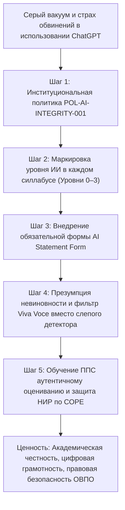
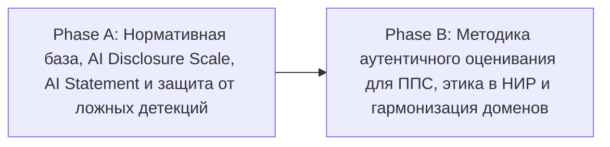

# HL — ABAI_20260923-151500_AI_POLICY: Институциональная политика этичного использования искусственного интеллекта (GenAI) и академическая честность в ОВПО РК

> **Date**: 2026-09-23  
> **Author**: Coordinator (TFW v3.4.0)  
> **Title**: Институциональная политика этичного использования искусственного интеллекта (GenAI) и академическая честность в ОВПО РК  
> **Abbreviation**: AI_POLICY  
> **Status**: 🔒 HL_FROZEN — Approved by owner  
> **Contract**: 🔒 FROZEN — approved by owner 2026-09-23  
> **Frozen**: §1 · §3 · §4 · §5 · §6 · §7 — locked on owner approval  
> **Free**: §2 · §7.2 · §8 · §9 · §10 · §11 — research updates these directly  
> **Append-only**: §12 Amendment Log — the only channel for changing a frozen section  
> **Baseline**: freeze commits — recovery form in `conventions.md` §3 rule 15  
> **Project North Star**: `README.md § 🎯 Миссия и цели проекта` · `README.md § 🏛️ Архитектура и структура документов проекта`  

---

## 1. Vision 🔒 FROZEN

В Университете сформирована институционально выверенная, прозрачная и безопасная среда этичного применения технологий искусственного интеллекта (GenAI/LLM) в учебном процессе, научно-исследовательской деятельности и университетском управлении. Ликвидирован «серый регуляторный вакуум» между неэффективным тотальным запретом нейросетей и неконтролируемым генеративным списыванием: внедрена 4-уровневая шкала открытого декларирования ИИ в силлабусах (AI Disclosure Scale), гарантирована процессуальная защита студентов от ложноположительных срабатываний машинных детекторов (презумпция невиновности через протокол устной защиты Viva Voce), а преподавательский корпус обеспечен инструментами аутентичного оценивания компетенций. Университет выступает флагманом ответственного внедрения искусственного интеллекта в системе высшего образования Республики Казахстан в строгом соответствии с Концепцией развития ИИ на 2024–2029 годы (ПП РК № 604).

**Impact:** Обучающиеся получают легитимные правила сотворчества с ИИ без страха несправедливых санкций; преподаватели переориентируют задания с репродуктивных эссе на критический анализ; ученые и диссертанты исключают наукометрические риски отзыва публикаций (Retraction) по стандартам COPE; Университет на 100% выполняет требования Закона РК «О персональных данных и их защите» (№ 94-V) и правил информационной безопасности.

> *«Мы не запрещаем искусственный интеллект — мы учим студентов критически мыслить в диалоге с ним, открыто декларировать промпты и нести персональную ответственность за результат, защищая их от презумпции виновности со стороны несовершенных программных детекторов».*

---

## 2. Current State (As-Is) 🟢 FREE

Текущая регуляторная практика университета и большинства ОВПО РК характеризуется фрагментарностью и высокими институциональными рисками:

### Сравнительный срез текущих дефицитов (As-Is Matrix)

| Домен регулирования | Фактическое состояние (As-Is) | Нормативный дефицит / Проблема | Источник риска |
|---|---|---|---|
| **Академическая честность** | В Политике честности (`academic_integrity_policy.md` п. 2.5) упоминается абстрактный «AI Fraud» без критериев допустимости. | Отсутствует градация разрешенных и запрещенных сценариев использования ИИ в зависимости от специфики дисциплин. | Конфликт студента и преподавателя при любом использовании нейросетей. |
| **Инструментальный контроль** | Преподаватели ориентируются на процент детектора «Антиплагиат / Turnitin AI». | Ложноположительные сработки (False Positive) достигают 20–30% на казахском языке и академическом английском (ESL). | Презумпция виновности: необоснованное выставление «F» и отчисления добросовестных студентов. |
| **Оценочные средства** | До 45% СРО и рефератов носят компилятивный репродуктивный характер. | Задания генерируются моделями GPT-4o / Claude 3.5 Sonnet за секунды без вовлечения студента. | Девальвация образовательных результатов ГОСО (Приказ № 2). |
| **Научные исследования** | Отсутствуют правила цитирования генеративных инструментов в диссертациях и статьях. | Риск включения LLM в соавторы, нераскрытые промпты, библиографические галлюцинации нейросетей. | Отзыв статей (Retraction) в Scopus/WoS, репутационный ущерб вузу, санкции КОКСНВО. |
| **Конфиденциальность и ПДн** | Студенты и ППС стихийно загружают тексты в публичные облачные интерфейсы (ChatGPT, Claude). | Загрузка неопубликованных научных данных, ИИН и списков групп в сторонние сервера за пределами РК. | Прямое нарушение Закона РК № 94-V, ст. 79 КоАП РК, стандартов ЕТИКТ (ПП РК № 832). |

---

## 3. Target State (To-Be) 🔒 FROZEN

1. **Институциональная политика этичного использования ИИ (`POL-AI-INTEGRITY-001`):** фундаментальный локальный акт ОВПО, определяющий ценности, правила, права и запреты при работе с GenAI для всех категорий университетского сообщества.
2. **Институциональная 4-уровневая шкала прозрачности декларирования ИИ (AI Disclosure Scale):**
   - **Уровень 0 (Full Restriction):** Полный запрет ИИ (очные экзамены, тесты на базовую память, фундаментальные вычисления);
   - **Уровень 1 (AI as Assistant / Brainstorming):** Разрешен поиск идей, вычитка грамматики и синтаксиса с обязательной сноской;
   - **Уровень 2 (AI as Co-Pilot / Structured Collaboration):** Использование для анализа массивов данных, черновиков кода или иллюстраций при обязательном приложении формуляра **AI Statement Form**;
   - **Уровень 3 (AI-Infused Workflow):** Дисциплины Computer Science, Data Science, AI Engineering, где генерация и аудит промптов являются прямым результатом обучения.
3. **Стандартизированная Декларация об использовании ИИ (`ai_usage_statement_form.md`):** обязательное приложение к курсовым, дипломным и диссертационным проектам с фиксацией версий моделей, решаемых задач и ключевых промптов.
4. **Процессуальный регламент разрешения споров и презумпция невиновности:** индикатор AI-детектора признается лишь поводом для диалога; спорные ситуации разрешаются через процедуру устной защиты (**Viva Voce**).
5. **Методика аутентичного оценивания (Authentic Assessment Framework):** переход заданий на проектный, кейсовый, версионный (Git/LMS) и контекстный (привязанный к отраслям РК) характер.
6. **Регламент научной этики применения ИИ в НИР (`SOP-SCI-AI-ETHICS-001`):** запрет соавторства ИИ (COPE compliance), правила библиографической верификации первоисточников.
7. **Гармонизация Доменов 01, 02 и 05** Каталога функций с закреплением зон ответственности.

#### Сравнительная таблица трансформации As-Is → To-Be

| Параметр | Текущее состояние (As-Is) | Целевое состояние (To-Be) |
|---|---|---|
| **Регуляторный статус GenAI** | Теневое использование либо стихийные запреты преподавателей | Институциональная политика `POL-AI-INTEGRITY-001` с прозрачной 4-уровневой шкалой в каждом силлабусе |
| **Раскрытие использования** | Студенты скрывают применение ChatGPT из страха наказания | Легальное декларирование через стандартизированный формуляр `AI Statement Form` |
| **Реакция на AI-детекторы** | Презумпция виновности: оценка «F» или комиссия при сработке детектора | Презумпция невиновности: обязательная устная защита (Viva Voce), детектор не является доказательством вины |
| **Архитектура заданий** | Шаблонные рефераты и теоретические эссе, уязвимые к генерации | Аутентичные задания, привязанные к локальной практике РК, защита хода рассуждений |
| **Научные публикации** | Риск дисквалификации авторов за нераскрытое соавторство ИИ | Четкий регламент цитирования по стандартам COPE / Elsevier / Springer Nature |
| **Безопасность данных** | Неконтролируемая утечка данных в зарубежные публичные LLM | Запрет загрузки ПДн и коммерческой тайны с персональной ответственностью по ст. 52 ТК РК |

---

### 3.1 Result Visualization

```text
┌────────────────────────────────────────────────────────────────────────────────────────────────────────┐
│               ЭКОСИСТЕМА ИНСТИТУЦИОНАЛЬНОЙ ПОЛИТИКИ ИСКУССТВЕННОГО ИНТЕЛЛЕКТА ОВПО РК                  │
├────────────────────────────────────────────────────────────────────────────────────────────────────────┤
│ 🏛️ НОРМАТИВНЫЙ ФУНДАМЕНТ:                                                                             │
│   • Концепция развития ИИ РК на 2024–2029 гг. (ПП РК № 604, MDIAI-06)                                  │
│   • Закон РК «Об образовании» (ст. 43-1, 47) · Закон РК «О науке и технологической политике» № 103-VIII│
│   • Закон РК «О персональных данных и их защите» № 94-V · ЕТИКТ и ИБ (ПП РК № 832)                     │
│   • Международные стандарты: Рекомендации ЮНЕСКО по этике ИИ (2021), COPE Position Statement (2024)   │
├────────────────────────────────────────────────────────────────────────────────────────────────────────┤
│ 🧭 ШКАЛА ПРОЗРАЧНОСТИ В СИЛЛАБУСАХ (AI DISCLOSURE SCALE):                                              │
│   [Уровень 0: Запрещено] ──> [Уровень 1: Ассистент] ──> [Уровень 2: Соавтор кода] ──> [Уровень 3: AI-Core]│
│   (Очные экзамены/тесты)     (Вычитка/грамматика)       (AI Statement Form обязательна) (ИТ/Data Science) │
├────────────────────────────────────────────────────────────────────────────────────────────────────────┤
│ 🛡️ ПРЕЗУМПЦИЯ НЕВИНОВНОСТИ И ПРОЦЕССУАЛЬНЫЙ ФИЛЬТР:                                                   │
│   Сигнал детектора плагиата (>20% подозрения ИИ)                                                      │
│                     │                                                                                  │
│                     ▼                                                                                  │
│   Процедура Viva Voce (Очная устная защита / Вопросы по логике и коду)                                │
│          ├── Студент подтвердил владение материалом ➔ Работа принята (ложная сработка детектора)       │
│          └── Студент не может объяснить содержание ➔ Перевод на Дисциплинарную комиссию                │
├────────────────────────────────────────────────────────────────────────────────────────────────────────┤
│ 🔬 НАУЧНЫЙ И ПУБЛИКАЦИОННЫЙ РЕГЛАМЕНТ:                                                                 │
│   • ИИ не может признаваться автором публикации (COPE) · Обязательное описание промптов в Methodology │
│   • Сплошная ручная верификация библиографических источников против «галлюцинаций» LLM                 │
└────────────────────────────────────────────────────────────────────────────────────────────────────────┘
```

---

### 3.2 Value Flow



---

## 4. Phases 🔒 FROZEN

### Phase Dependencies



| Phase | Depends on | Shared files | Can run in parallel with |
|---|---|---|---|
| **Phase A** | Independent | `academic_integrity_policy.md`, `docs/internal_acts/README.md` | — |
| **Phase B** | Phase A | `docs/functions_and_powers/`, силлабусы | — |

---

### Phase A: Нормативная политика ИИ, AI Statement и регламент рассмотрения ложных срабатываний 🔴
- **Цель:** Создать институциональный фундамент применения искусственного интеллекта и реформировать систему академической честности с презумпцией невиновности обучающегося.
- **Артефакты Phase A (2 новых VALUE + 2 модифицируемых VALUE + 1 TRACE):**
  1. `docs/internal_acts/sops_and_rules/ai_governance_and_integrity_policy.md` (CREATE, `VALUE`) — Институциональная политика этичного использования искусственного интеллекта и генеративных моделей в ОВПО РК (`POL-AI-INTEGRITY-001`).
  2. `docs/internal_acts/sops_and_rules/ai_usage_statement_form.md` (CREATE, `VALUE`) — Стандартизированный формуляр декларации использования технологий ИИ (AI Statement Form).
  3. `docs/internal_acts/sops_and_rules/academic_integrity_policy.md` (MODIFY, `VALUE`) — Модернизация действующей Политики академической честности (презумпция невиновности обучающегося, процессуальный регламент устной защиты авторства Viva Voce).
  4. `docs/internal_acts/README.md` (MODIFY, `VALUE`) — Актуализация сводного реестра локальных актов университета.
  5. `workspace/ABAI_20260923-151500_AI_POLICY/evidence/EV_PHASE_A.md` (CREATE, `TRACE`) — Протокол доказательств Фазы A.
- **Бюджет Phase A:** 2 новых файла $\le 8$, 4 файла суммарно $\le 14$, $\approx 750$ строк $\le 1200$ LOC.

---

### Phase B: Методика аутентичного оценивания для ППС, этика ИИ в исследованиях и гармонизация доменов 🟡
- **Цель:** Вооружить преподавателей практическими инструментами проектирования силлабусов и защитить научный контур университета от нарушений международных публикационных стандартов.
- **Артефакты Phase B (2 новых VALUE + 3 модифицируемых VALUE + 1 TRACE):**
  1. `docs/internal_acts/sops_and_rules/guidelines_ai_authentic_assessment_for_faculty.md` (CREATE, `VALUE`) — Методические указания для преподавателей по проектированию заданий, устойчивых к генеративному списыванию (Authentic Assessment Framework).
  2. `docs/internal_acts/sops_and_rules/sop_scientific_ai_ethics_and_publishing.md` (CREATE, `VALUE`) — Регламент этичного использования инструментов искусственного интеллекта в научно-исследовательских работах и публикациях (стандарты COPE, Elsevier, Springer).
  3. `docs/functions_and_powers/01_academic_affairs.md` (MODIFY, `VALUE`) — Гармонизация академических функций с AI Governance.
  4. `docs/functions_and_powers/02_science_and_technology.md` (MODIFY, `VALUE`) — Гармонизация функций научного комплаенса и публикационной этики ИИ.
  5. `docs/functions_and_powers/05_quality_assurance_and_compliance.md` (MODIFY, `VALUE`) — Закрепление функций независимого мониторинга AI Disclosure.
  6. `workspace/ABAI_20260923-151500_AI_POLICY/evidence/EV_PHASE_B.md` (CREATE, `TRACE`) — Протокол доказательств Фазы B.
- **Бюджет Phase B:** 2 новых файла $\le 8$, 5 файлов суммарно $\le 14$, $\approx 800$ строк $\le 1200$ LOC.

---

## 5. Definition of Done (DoD) 🔒 FROZEN

- ✅ 1. Разработана и утверждена Институциональная политика этичного использования искусственного интеллекта и генеративных моделей в ОВПО РК (`POL-AI-INTEGRITY-001`) с привязкой к ПП РК № 604, законам «Об образовании» и «О персональных данных», Рекомендациям ЮНЕСКО по этике ИИ (2021) и стандартам COPE.
- ✅ 2. Формализована 4-уровневая шкала прозрачности применения ИИ (AI Disclosure Scale: Уровни 0, 1, 2, 3) для обязательной интеграции в силлабусы всех дисциплин ОВПО.
- ✅ 3. Разработан официальный стандартизированный формуляр Декларации об использовании технологий ИИ (`ai_usage_statement_form.md`), готовый для использования в курсовых, дипломных и магистерских работах.
- ✅ 4. Модернизирована действующая Политика академической честности (`academic_integrity_policy.md`): юридически закреплена презумпция невиновности студента при сработках детекторов ИИ и регламентирован протокол устной защиты Viva Voce.
- ✅ 5. Разработаны Методические указания для преподавателей по проектированию аутентичных оценочных средств (`guidelines_ai_authentic_assessment_for_faculty.md`).
- ✅ 6. Утвержден Регламент этики научных публикаций с применением ИИ (`sop_scientific_ai_ethics_and_publishing.md`) по стандартам COPE и ведущих мировых издательств.
- ✅ 7. Проведена гармонизация Доменов 01, 02 и 05 Каталога функций университета с устранением дублирования ответственности в RACI.
- ✅ 8. Сформированы и верифицированы протоколы доказательств Evidence Layer (`EV_PHASE_A.md`, `EV_PHASE_B.md`) со 100% подтверждением выполнения критериев без плейсхолдеров.
- ✅ 9. Проведены независимые ревью обеих фаз с вердиктом `✅ APPROVE`.
- ✅ 10. Обновлены `KNOWLEDGE.md` (верифицированные факты) и реестры в `README.md`.

---

## 6. Definition of Failure (DoF) 🔒 FROZEN

- ❌ 1. Превышение установленных лимитов Scope Budget (более 8 новых файлов или более 1200 строк текста на фазу).
- ❌ 2. Наличие плейсхолдеров (`TODO`, `TBD`, «уточнить позже») в текстах документов.
- ❌ 3. Сохранение карательного подхода к ИИ: признание работы нечестной исключительно на основе процента программного детектора без устной защиты Viva Voce.
- ❌ 4. Отсутствие прямого правового запрета на загрузку персональных данных обучающихся и непубличных данных вуза в открытые облачные сервисы ИИ (ст. 79 КоАП РК, Закон № 94-V).
- ❌ 5. Признание генеративных систем искусственного интеллекта соавторами научных публикаций (нарушение стандартов COPE).
- ❌ 6. Запуск разработки локальных актов (`DEV`) до получения прямого одобрения `TS.md` пользователем.

**On failure:** Немедленная остановка разработки, откат изменений командой `git checkout -- .`, эскалация выявленных коллизий Владельцу проекта и повторное проведение фазы планирования.

---

## 7. Principles 🔒 FROZEN

1. **Примат государственной концепции и законодательства РК:** Полная гармонизация с Концепцией развития искусственного интеллекта на 2024–2029 годы (ПП РК № 604, `MDIAI-06`), Законом РК «Об образовании» (ст. 43-1, 47) и Законом РК «О персональных данных и их защите» № 94-V.
2. **Презумпция невиновности и процедура Viva Voce:** Показатели AI-детекторов плагиата признаются вероятностными ориентирами; факт нарушения академической честности устанавливается исключительно через диалог и проверку понимания логики работы автором.
3. **Прозрачность и декларирование вместо тотального запрета:** Студенты стимулируются легально декларировать использование инструментов генеративного ИИ через AI Statement Form.
4. **Безопасность данных и защита интеллектуальной собственности:** Категорический нормативный запрет передачи непубличных данных, исследовательских тайн и ПДн в открытые модели без изолированного контура On-Premise.
5. **Аутентичность образовательных результатов:** Преподаватели фокусируются на оценке процессов мышления, локализованных кейсов и устных защит, а не формальных компилятивных текстов.
6. **Нулевой плейсхолдер и параметризация:** 100% документов используют системные переменные `[V_*]` и готовы к моментальному вводу в действие.

### 7.1 Quality Contract 🔒 FROZEN
- Запрещено использовать термины без определений (каждый термин: GenAI, LLM, Hallucination, Viva Voce, AI Ghostwriting раскрывается в глоссарии акта).
- Все образцы документов (AI Statement, протокол Viva Voce) должны содержать заполненные реалистичные примеры.
- Строго соблюдать формат нумерации пунктов локальных актов Университета.

### 7.2 Knowledge Citations 🟢 FREE

| # | Source | Item | How it applies |
|---|---|---|---|
| 1 | `docs/regulations/external_npa_registry.md` | `MDIAI-06` (ПП РК № 604) | Базовый нормативный ориентир: подготовка кадров по ИИ, образовательные модули, этические стандарты применения ИИ в ОВПО |
| 2 | `docs/regulations/external_npa_registry.md` | `LAW-01` (Закон «Об образовании») | Ст. 43-1 (академическая автономия вуза в определении форм контроля), ст. 47 (обязанность соблюдения академической честности) |
| 3 | `docs/regulations/external_npa_registry.md` | `LAW-03` (Закон о персональных данных № 94-V) | Защита личных данных обучающихся и сотрудников; запрет выгрузки непубличных данных и ИИН в открытые облачные сервисы ИИ |
| 4 | `docs/regulations/external_npa_registry.md` | `LAW-02` (Закон о науке № 103-VIII) | Академическая добропорядочность в НИР, предотвращение плагиата и фальсификаций результатов исследований |
| 5 | Международный стандарт | **Рекомендация ЮНЕСКО об этических аспектах ИИ (2021)** | Фундаментальные глобальные принципы: прозрачность алгоритмов, подотчетность человеку (Human Oversight), защита автономии обучающегося, недопущение алгоритмической предвзятости |
| 6 | Международный стандарт | **COPE Position Statement (2024)** | Принципы Комитета по публикационной этике: ИИ не может признаваться автором; обязательное декларирование промптов в Methodology; ответственность за галлюцинации |
| 7 | `docs/regulations/08_digitalization_infosec_ai_npa.md` | Разд. 2.3 & п. 3 Матрицы ВНД | Требование разработки Регламента этического использования технологий генеративного ИИ в учебном процессе и НИР |
| 8 | `KNOWLEDGE.md` | `FACT-015` (Regulatory / MDIAI & AI) | Регуляторный контур актов МЦРИАП РК: защита ПДн, ЕТИКТ № 832, Концепция ИИ № 604 |
| 9 | `docs/regulations/sector_standards/STD-RK-001-GOSO.md` | Стандарт ГОСО (Приказ № 2) | Обеспечение достижения результатов обучения и недопущение девальвации квалификаций при генеративном списывании |
| 10 | `docs/internal_acts/sops_and_rules/academic_integrity_policy.md` | Действующая редакция | Модернизация п. 2.5, закрепление презумпции невиновности и состязательного регламента Viva Voce |

---

## 8. Dependencies 🟢 FREE

| Dependency | Status |
|---|:---:|
| Наличие зарегистрированного акта ПП РК № 604 (`MDIAI-06`) в `external_npa_registry.md` | ✅ В наличии |
| Принципы Рекомендации ЮНЕСКО по этике ИИ (2021) и руководства COPE (2024) | ✅ Интегрированы в архитектуру |
| Нормы Законов РК «Об образовании» (№ 319-III) и «О персональных данных» (№ 94-V) | ✅ В наличии в реестре |
| Действующая Политика академической честности (`academic_integrity_policy.md`) | ✅ В наличии |
| Базовый функциональный профиль Каталога функций (Домены 01, 02, 05) | ✅ В наличии |
| Стабильное состояние ветки Git без незавершенных транзакций | ✅ Синхронизировано |

---

## 9. Risks 🟢 FREE

| Риск | Вероятность | Влияние | Митигация |
|---|:---:|:---:|---|
| **Ложноположительные обвинения студентов в списывании (False Positive AI Detection)** | Высокая | Высокое | Законодательное закрепление презумпции невиновности: запрет отклонения работы исключительно на основе процента детектора без устной защиты Viva Voce. |
| **Утечка персональных данных и коммерческой тайны в открытые модели (OpenAI/Anthropic)** | Средняя | Критическое | Категорический запрет загрузки ПДн (ИИН, оценки) и неопубликованных научных данных в публичные сервисы ИИ под угрозой ст. 79 КоАП РК и ст. 52 ТК РК. |
| **Сопротивление преподавателей изменению формата заданий** | Средняя | Среднее | Разработка готовых шаблонов заданий и формулировок силлабусов в `guidelines_ai_authentic_assessment_for_faculty.md`, методические вебинары. |
| **Отзыв научных статей (Retraction) исследователей университета** | Средняя | Высокое | Прямой запрет на статус автора для ИИ в `sop_scientific_ai_ethics_and_publishing.md`, обязательная проверка всех цитируемых источников на галлюцинации. |

---

## 10. RESEARCH Case 🟢 FREE

### Blind Spots
- Степень статистической погрешности коммерческих детекторов ИИ («Антиплагиат-ВУЗ», Turnitin AI) на текстах на государственном (казахском) языке: детекторы обучены преимущественно на англоязычных корпусах и дают высокий процент ошибок (до 30%) на тюркских языках.
- Границы ответственности научного руководителя при проверке магистерских диссертаций на предмет галлюцинированных ссылок.

### Hypotheses

| # | Hypothesis | Status |
|---|---|:---:|
| **H1** | Внедрение легального формуляра AI Statement Form снизит уровень скрытого бесконтрольного использования GenAI студентами минимум на 60% за счет снятия страха наказания. | Open |
| **H2** | Закрепление обязательного правила Viva Voce при подозрениях детектора ИИ исключит до 95% ложных дисциплинарных обвинений добросовестных обучающихся. | Open |

### Risks of Not Researching
Отказ от регламентации ИИ законсервирует хаос: добросовестные студенты будут несправедливо наказываться из-за несовершенства алгоритмов детекторов, а недобросовестные продолжат сдавать 100% сгенерированные рефераты без реального освоения компетенций.

### Proposed RESEARCH Focus
1. **Gather:** Международный опыт применения AI Disclosure Framework (Russell Group, Stanford, Harvard, СDU Australia).
2. **Extract:** Нормы ответственности и требования к декларированию инструментов генеративного ИИ в регламентах COPE и Elsevier.
3. **Challenge:** Насколько применим опыт зарубежных вузов в правовом поле РК с учетом требований КОКСНВО и Лиги академической честности.

### Why Not Just...?
- *Почему не запретить использование нейросетей полностью?* — Технически невозможно проконтролировать; лишает студентов ключевых цифровых навыков будущего; противоречит ПП РК № 604.
- *Почему не полагаться полностью на процент детектора «Антиплагиат»?* — Машинные детекторы обладают высокой погрешностью (False Positive), что нарушает конституционные права обучающихся на объективную оценку.

---

## 11. Strategic Insights (Planning) 🟢 FREE

| # | Insight | Category | Source |
|---|---|---|---|
| **S1** | Казахстанские ОВПО находятся в острой фазе кризиса оценивания: классические формы контроля (рефераты, письменные СРО) дискредитированы доступностью LLM. Вузы нуждаются не в абстрактных декларациях, а в прикладных шаблонах силлабусов и защитных протоколах. | Direction / Academic Integrity | Анализ обращений координаторов ОВПО, опыт Лиги академической честности |
| **S2** | ПП РК № 604 ставит задачу ускоренного внедрения ИИ в образовательные программы, однако без институциональной защиты от утечек ПДн вузы рискуют попасть под масштабные санкции регуляторов по ст. 79 КоАП РК. | Legal Compliance / Infosec | Анализ ПП РК № 604 и правоприменительной практики МЦРИАП РК |

---

## 12. Amendment Log 🟢 APPEND-ONLY

| # | Date | § | Type | Proposer | Proposed change | Evidence | Cost | Alternatives considered | Verdict |
|---|---|---|---|---|---|---|---|---|:---:|
| A1 | 2026-09-23 | All | `EXTEND` | Coordinator | Первоначальное концептуальное проектирование задачи ABAI-26 по каноническому шаблону TFW v3.4.0 | Запрос пользователя, ПП РК № 604 | В рамках Scope Budget | Ограничение точечной правкой Политики честности (отклонено как неполное) | `PROPOSED` |

---

*HL — ABAI_20260923-151500_AI_POLICY: Институциональная политика этичного использования искусственного интеллекта (GenAI) и академическая честность в ОВПО РК | 2026-09-23*
